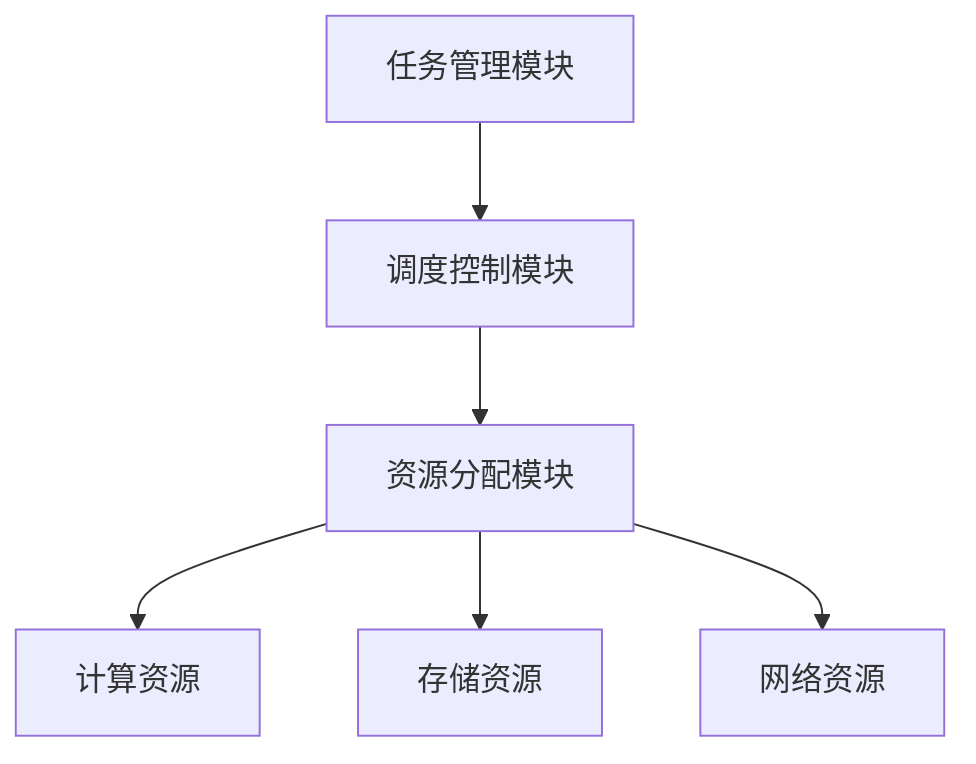
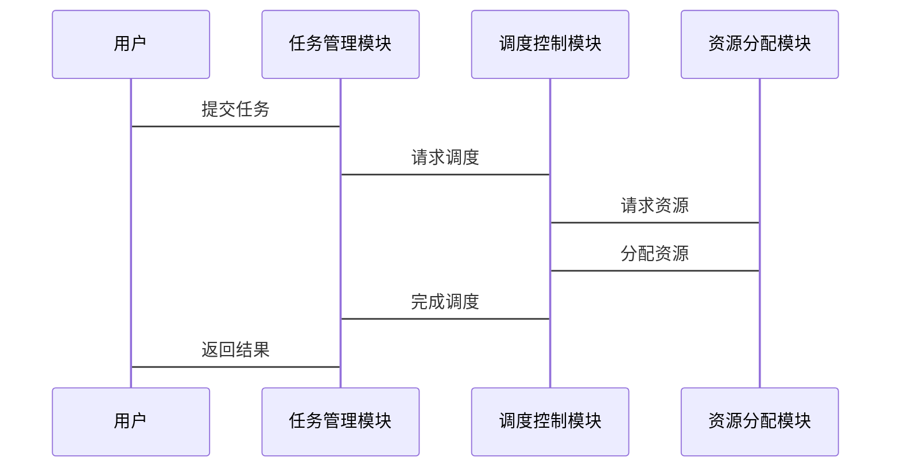

                 

# AI Agent的多任务并行处理能力

> 关键词：AI Agent、多任务处理、并行计算、任务调度、资源分配、负载均衡

> 摘要：AI Agent作为一种智能体，具备多任务并行处理的能力。本文深入分析了AI Agent的多任务并行处理的原理、算法实现、系统架构设计以及项目实战。从任务调度算法、并行计算、资源分配、负载均衡等核心问题入手，结合实际案例，详细阐述了AI Agent在多任务并行处理中的应用。通过本文的学习，读者可以全面理解AI Agent的多任务并行处理能力，并能够将其应用于实际项目中。

---

## 第一部分: AI Agent的多任务并行处理能力概述

### 第1章: AI Agent的基本概念与多任务处理背景

#### 1.1 AI Agent的定义与特点

##### 1.1.1 AI Agent的定义
AI Agent（人工智能代理）是指能够感知环境、自主决策并执行任务的智能实体。AI Agent可以是软件程序、机器人或其他智能系统，具备以下特点：
- **自主性**：能够自主决策，无需外部干预。
- **反应性**：能够实时感知环境并做出反应。
- **目标导向**：具备明确的目标，并为实现目标而行动。
- **学习能力**：能够通过经验改进自身性能。

##### 1.1.2 AI Agent的核心特点
AI Agent的核心特点包括：
- **智能性**：能够理解和处理复杂的信息。
- **适应性**：能够根据环境变化调整行为。
- **协作性**：能够与其他AI Agent或人类进行协作。
- **高效性**：能够在较短时间内完成复杂任务。

##### 1.1.3 多任务处理的必要性
在实际应用中，AI Agent通常需要同时处理多个任务。例如，在智能客服系统中，一个AI Agent可能需要同时处理多个客户的咨询请求。多任务处理能够提高系统的效率和响应速度，同时降低资源消耗。

#### 1.2 多任务并行处理的背景与意义

##### 1.2.1 当前AI Agent的发展趋势
随着人工智能技术的快速发展，AI Agent的应用场景越来越广泛。从智能家居到自动驾驶，从智能客服到机器人协作，AI Agent在各个领域都展现出强大的潜力。多任务并行处理能力是AI Agent的核心能力之一。

##### 1.2.2 多任务并行处理的挑战与机遇
多任务并行处理的挑战包括：
- **资源竞争**：多个任务同时运行可能导致资源竞争，影响性能。
- **任务调度**：如何高效地调度任务是关键问题。
- **任务依赖**：某些任务之间存在依赖关系，需要顺序处理。

多任务并行处理的机遇包括：
- **提高效率**：通过并行处理，能够显著提高系统的处理速度。
- **降低成本**：通过资源的高效利用，能够降低系统的运行成本。
- **增强用户体验**：快速响应用户需求，提升用户体验。

##### 1.2.3 企业级应用中的需求分析
在企业级应用中，AI Agent通常需要处理大量的并发请求。例如，在电商系统中，AI Agent可能需要同时处理多个订单请求、库存管理、客户咨询等任务。多任务并行处理能力是企业级应用中AI Agent的核心能力。

---

### 第2章: 多任务并行处理的基本原理

#### 2.1 多任务处理的概念与分类

##### 2.1.1 串行任务与并行任务的对比
- **串行任务**：一个任务完成后，再执行下一个任务。这种方式适用于任务之间存在强依赖关系的情况。
- **并行任务**：多个任务同时执行，适用于任务之间相互独立的情况。

##### 2.1.2 同步与异步任务的区分
- **同步任务**：任务之间需要等待前一个任务完成才能执行下一个任务。
- **异步任务**：任务之间不需要等待，可以同时执行多个任务。

##### 2.1.3 并行计算与分布式计算的区别
- **并行计算**：在同一计算资源上同时执行多个任务。
- **分布式计算**：在多个计算资源上分别执行任务，通常用于处理大规模数据。

#### 2.2 任务分解与调度算法

##### 2.2.1 任务分解的基本原则
任务分解的原则包括：
- **独立性**：分解后的任务应尽可能独立，减少任务之间的依赖。
- **均衡性**：分解后的任务应尽可能均衡，避免资源浪费。
- **可扩展性**：分解后的任务应具备良好的可扩展性，能够适应系统的动态变化。

##### 2.2.2 常见的调度算法介绍
- **先来先服务（FCFS）**：按照任务到达的顺序进行调度。
- **短作业优先（SJF）**：优先调度处理时间较短的任务。
- **时间片轮转（RR）**：将时间分成小片，每个任务轮流使用时间片。

##### 2.2.3 调度算法的优缺点对比
| 调度算法 | 优点 | 缺点 |
|----------|------|------|
| FCFS     | 简单公平 | 周转时间较长 |
| SJF      | 周转时间短 | 实现复杂 |
| RR       | 均衡等待时间 | 处理时间长的任务可能得不到足够的时间 |

#### 2.3 资源分配与负载均衡

##### 2.3.1 资源分配的基本策略
资源分配的基本策略包括：
- **静态分配**：预先分配资源，不进行动态调整。
- **动态分配**：根据任务需求动态分配资源。
- **轮转分配**：周期性地调整资源分配。

##### 2.3.2 负载均衡算法的实现
负载均衡算法包括：
- **随机分配**：随机分配任务到可用资源上。
- **轮转分配**：依次分配任务到不同的资源上。
- **基于负载的分配**：根据资源的当前负载情况动态分配任务。

##### 2.3.3 资源分配的动态调整
动态调整资源分配能够提高系统的效率。例如，在任务处理过程中，可以根据任务的处理情况动态增加或减少资源。

---

### 第3章: 并行计算与资源分配

#### 3.1 并行计算的基本原理

##### 3.1.1 并行计算的实现方式
并行计算的实现方式包括：
- **多线程**：在同一核上同时执行多个线程。
- **多进程**：在多个核上同时执行多个进程。
- **分布式计算**：在多个节点上同时执行任务。

##### 3.1.2 并行计算的性能优化
并行计算的性能优化包括：
- **任务粒度**：任务粒度越小，并行效率越高。
- **负载均衡**：合理分配任务，避免资源浪费。
- **同步机制**：合理设计同步机制，减少等待时间。

##### 3.1.3 并行计算的资源消耗分析
并行计算的资源消耗分析包括：
- **计算资源**：CPU、GPU等计算资源的使用情况。
- **存储资源**：内存、存储设备的使用情况。
- **网络资源**：网络带宽的使用情况。

#### 3.2 资源分配与负载均衡

##### 3.2.1 资源分配的基本策略
资源分配的基本策略包括：
- **静态分配**：预先分配资源，不进行动态调整。
- **动态分配**：根据任务需求动态分配资源。
- **轮转分配**：周期性地调整资源分配。

##### 3.2.2 负载均衡算法的实现
负载均衡算法的实现包括：
- **随机分配**：随机分配任务到可用资源上。
- **轮转分配**：依次分配任务到不同的资源上。
- **基于负载的分配**：根据资源的当前负载情况动态分配任务。

##### 3.2.3 资源分配的动态调整
动态调整资源分配能够提高系统的效率。例如，在任务处理过程中，可以根据任务的处理情况动态增加或减少资源。

---

## 第四部分: 项目实战与总结

### 第6章: 多任务并行处理的系统架构设计

#### 6.1 系统功能模块划分

##### 6.1.1 任务管理模块
任务管理模块负责任务的创建、调度和终止。

##### 6.1.2 调度控制模块
调度控制模块负责任务的调度算法实现。

##### 6.1.3 资源分配模块
资源分配模块负责资源的分配和负载均衡。

#### 6.2 系统架构设计

##### 6.2.1 系统功能设计
系统功能设计包括：
- **任务调度**：实现任务的调度算法。
- **资源管理**：实现资源的分配和管理。
- **负载均衡**：实现负载均衡算法。

##### 6.2.2 系统架构图
以下是系统架构设计的Mermaid图：

##### 6.2.3 系统交互流程图
以下是系统交互流程的Mermaid图：

---

## 总结

AI Agent的多任务并行处理能力是人工智能领域的重要研究方向。本文从AI Agent的基本概念出发，详细分析了多任务并行处理的原理、算法实现、系统架构设计以及项目实战。通过本文的学习，读者可以全面理解AI Agent的多任务并行处理能力，并能够将其应用于实际项目中。

作者：AI天才研究院/AI Genius Institute & 禅与计算机程序设计艺术 /Zen And The Art of Computer Programming

