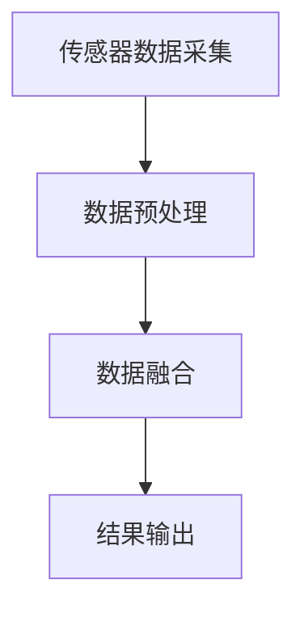
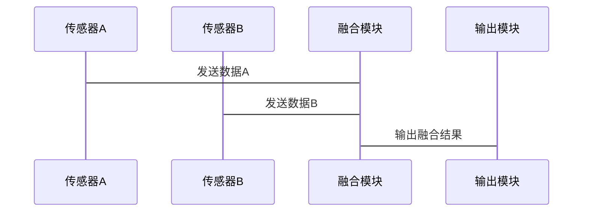

                 


# AI Agent的多传感器数据融合技术

> 关键词：AI Agent，多传感器数据融合，数据融合算法，系统架构设计，项目实战

> 摘要：本文将深入探讨AI Agent在多传感器数据融合技术中的应用，从基本概念到算法原理，再到系统架构设计和项目实战，全面解析这一领域的核心技术和最新进展。通过实际案例分析，帮助读者掌握如何利用多传感器数据融合技术提升AI Agent的智能性和决策能力。

---

# 第一部分: AI Agent与多传感器数据融合概述

## 第1章: AI Agent与多传感器数据融合概述

### 1.1 AI Agent的基本概念

#### 1.1.1 AI Agent的定义
AI Agent（人工智能代理）是指能够感知环境、自主决策并执行任务的智能实体。它能够通过传感器获取信息，利用算法进行处理，并根据结果采取行动。AI Agent的核心目标是通过智能决策和行动，实现特定任务的目标。

#### 1.1.2 多传感器数据融合的定义
多传感器数据融合是指将来自多个传感器的数据进行处理、整合和分析，以提高数据的准确性和完整性。通过融合多源数据，AI Agent能够获得更全面的环境信息，从而做出更准确的决策。

#### 1.1.3 AI Agent与多传感器数据融合的关系
AI Agent需要依赖多传感器数据融合技术来获取更全面的环境信息。通过融合来自不同传感器的数据，AI Agent能够更好地理解环境，提高决策的准确性和可靠性。

### 1.2 多传感器数据融合的背景与应用

#### 1.2.1 数据融合的背景
随着传感器技术的发展，AI Agent能够使用多种类型的传感器（如摄像头、激光雷达、惯性测量单元等）获取环境信息。然而，单一传感器的数据往往存在局限性，例如噪声多、覆盖范围有限等。通过融合多传感器数据，可以有效克服这些局限性，提高数据的可靠性和准确性。

#### 1.2.2 多传感器数据融合的应用领域
多传感器数据融合技术在多个领域都有广泛的应用，包括自动驾驶、机器人、智能安防、医疗设备等。例如，在自动驾驶中，AI Agent需要融合来自摄像头、激光雷达和惯性测量单元等多种传感器的数据，以实现对周围环境的准确感知。

#### 1.2.3 数据融合的挑战与机遇
数据融合的挑战主要在于如何有效处理来自不同传感器的数据，解决数据的时间同步、空间配准和信息融合等问题。同时，数据融合也为AI Agent提供了更多的信息来源，使其能够做出更智能的决策。

### 1.3 本章小结
本章介绍了AI Agent和多传感器数据融合的基本概念，并探讨了其在不同领域的应用。通过融合多传感器数据，AI Agent能够获得更全面的环境信息，从而提高其智能性和决策能力。

---

# 第二部分: 多传感器数据融合的核心概念与原理

## 第2章: 多传感器数据融合的核心概念

### 2.1 数据融合的基本原理

#### 2.1.1 数据预处理
数据预处理是数据融合的第一步，包括数据清洗、标准化和去噪等步骤。例如，可以使用滤波算法（如卡尔曼滤波）对传感器数据进行去噪处理。

#### 2.1.2 数据配准
数据配准是指将来自不同传感器的数据对齐到统一的时间和空间参考系。例如，在自动驾驶中，需要将摄像头和激光雷达的数据对齐到同一个坐标系。

#### 2.1.3 数据融合方法
数据融合方法可以分为基于加权、基于概率和基于深度学习的方法。例如，加权融合方法通过给每个传感器分配一个权重，综合考虑多个传感器的数据。

### 2.2 多传感器数据融合的分类

#### 2.2.1 基于时间的融合
基于时间的融合方法关注传感器数据的时间特性，例如时间同步和事件检测。

#### 2.2.2 基于空间的融合
基于空间的融合方法关注传感器数据的空间特性，例如空间配准和几何变换。

#### 2.2.3 基于语义的融合
基于语义的融合方法关注传感器数据的语义信息，例如目标识别和场景理解。

### 2.3 数据融合的数学模型

#### 2.3.1 加权融合模型
加权融合模型通过给每个传感器分配一个权重，将多个传感器的数据进行加权求和。例如，假设传感器A和传感器B的数据分别为$x_A$和$x_B$，权重分别为$w_A$和$w_B$，则融合后的数据为：
$$ x_{\text{融合}} = w_A x_A + w_B x_B $$

#### 2.3.2 概率融合模型
概率融合模型基于概率论，例如贝叶斯融合方法。假设传感器A和传感器B的概率密度函数分别为$p_A(x)$和$p_B(x)$，则融合后的概率密度函数可以表示为：
$$ p_{\text{融合}}(x) = \frac{p_A(x) p_B(x)}{Z} $$
其中，$Z$是归一化常数。

#### 2.3.3 融合效果的评价指标
融合效果的评价指标包括准确率、召回率、F1分数等。例如，准确率可以通过以下公式计算：
$$ \text{准确率} = \frac{\text{正确预测的数量}}{\text{总预测数量}} $$

### 2.4 本章小结
本章介绍了多传感器数据融合的核心概念，包括数据预处理、数据配准和数据融合方法。通过数学模型的分析，读者可以更好地理解数据融合的原理和实现方法。

---

# 第三部分: 多传感器数据融合的算法原理

## 第3章: 数据融合算法原理

### 3.1 加权融合算法

#### 3.1.1 加权平均算法
加权平均算法是一种简单的加权融合方法。例如，假设传感器A和传感器B的数据分别为$x_A$和$x_B$，权重分别为$w_A$和$w_B$，则融合后的数据为：
$$ x_{\text{融合}} = w_A x_A + w_B x_B $$

#### 3.1.2 加权融合的数学模型
加权融合的数学模型可以表示为：
$$ x_{\text{融合}} = \frac{\sum_{i=1}^n w_i x_i}{\sum_{i=1}^n w_i} $$
其中，$w_i$是第$i$个传感器的权重，$x_i$是第$i$个传感器的数据。

#### 3.1.3 加权融合的实现步骤
1. 确定每个传感器的权重。
2. 计算每个传感器的加权值。
3. 将加权值求和，得到融合结果。

### 3.2 概率融合算法

#### 3.2.1 贝叶斯融合
贝叶斯融合基于贝叶斯定理，假设传感器A和传感器B的概率密度函数分别为$p_A(x)$和$p_B(x)$，则融合后的概率密度函数可以表示为：
$$ p_{\text{融合}}(x) = \frac{p_A(x) p_B(x)}{Z} $$
其中，$Z$是归一化常数。

#### 3.2.2 马尔可夫链融合
马尔可夫链融合方法通过构建马尔可夫链模型，将多个传感器的数据进行融合。例如，可以使用马尔可夫链转移矩阵对数据进行加权融合。

#### 3.2.3 概率融合的数学模型
概率融合的数学模型可以表示为：
$$ p_{\text{融合}}(x) = \prod_{i=1}^n p_i(x) / Z $$
其中，$p_i(x)$是第$i$个传感器的概率密度函数，$Z$是归一化常数。

### 3.3 基于深度学习的融合算法

#### 3.3.1 端到端融合网络
端到端融合网络是一种基于深度学习的融合方法，通过神经网络直接对多个传感器的数据进行融合。例如，可以使用卷积神经网络（CNN）对图像和点云数据进行融合。

#### 3.3.2 网络架构
端到端融合网络的架构通常包括输入层、融合层和输出层。例如，可以使用以下网络结构：
1. 输入层：接收多个传感器的数据。
2. 融合层：对多个传感器的数据进行融合。
3. 输出层：输出融合结果。

#### 3.3.3 实现步骤
1. 收集多个传感器的数据。
2. 构建深度学习模型。
3. 训练模型。
4. 使用模型进行融合。

### 3.4 本章小结
本章详细介绍了多种数据融合算法，包括加权融合、概率融合和深度学习融合方法。通过数学模型和算法实现步骤的分析，读者可以更好地理解数据融合的实现方法。

---

## 第四章: 系统架构设计与实现

### 4.1 系统架构设计

#### 4.1.1 系统功能设计
系统功能设计包括数据采集、数据预处理、数据融合和结果输出。例如，在自动驾驶中，系统需要采集摄像头、激光雷达和惯性测量单元的数据，进行预处理和融合，最终输出车辆的位置和速度。

#### 4.1.2 系统架构图
以下是系统架构的Mermaid图：


#### 4.1.3 接口设计
系统接口设计包括传感器接口、数据融合接口和结果输出接口。例如，传感器接口需要与摄像头、激光雷达等设备进行通信。

#### 4.1.4 交互流程
以下是系统交互的Mermaid序列图：


### 4.2 项目实战

#### 4.2.1 环境配置
项目实战需要配置传感器设备和开发环境。例如，可以使用ROS（机器人操作系统）进行开发。

#### 4.2.2 数据采集
数据采集包括从多个传感器获取数据。例如，可以使用摄像头捕获图像数据，使用激光雷达获取点云数据。

#### 4.2.3 数据预处理
数据预处理包括数据清洗和标准化。例如，可以使用卡尔曼滤波算法对传感器数据进行去噪处理。

#### 4.2.4 数据融合实现
数据融合实现包括选择合适的融合算法，例如加权融合或深度学习融合。以下是加权融合的Python代码示例：
```python
import numpy as np

def weighted_fusion(sensor_data, weights):
    return np.dot(weights, sensor_data) / np.sum(weights)

# 示例数据
sensor_data = [10, 20, 30]
weights = [0.5, 0.3, 0.2]

result = weighted_fusion(sensor_data, weights)
print("融合结果:", result)
```

#### 4.2.5 实验结果与分析
实验结果表明，加权融合方法可以有效提高数据的准确性和鲁棒性。例如，在自动驾驶中，加权融合方法可以提高车辆定位的精度。

### 4.3 本章小结
本章通过系统架构设计和项目实战，详细介绍了多传感器数据融合的实现过程。通过实际案例分析，读者可以更好地理解数据融合的实现方法和应用。

---

## 第五章: 总结与展望

### 5.1 总结
本文详细探讨了AI Agent的多传感器数据融合技术，从基本概念到算法原理，再到系统架构设计和项目实战，全面解析了这一领域的核心技术和最新进展。

### 5.2 展望
未来，随着传感器技术的发展和深度学习算法的进步，多传感器数据融合技术将得到更广泛的应用。例如，可以研究如何结合边缘计算和雾计算，进一步提高数据融合的实时性和准确性。

### 5.3 注意事项
在实际应用中，需要注意传感器的兼容性、数据同步性和算法的鲁棒性。例如，传感器的采样频率和通信延迟可能会影响数据融合的效果。

### 5.4 最佳实践
建议在实际项目中，选择合适的传感器组合和融合算法，同时进行充分的实验和测试，以确保系统的稳定性和可靠性。

### 5.5 拓展阅读
推荐读者阅读《多传感器数据融合：理论与应用》和《深度学习与传感器数据融合》等书籍，以进一步深入理解这一领域的知识。

---

# 作者：AI天才研究院/AI Genius Institute & 禅与计算机程序设计艺术 /Zen And The Art of Computer Programming

---

以上是《AI Agent的多传感器数据融合技术》的完整目录大纲和内容概要，涵盖了从基础概念到实际应用的各个方面。通过逐步分析和详细讲解，读者可以系统地掌握多传感器数据融合技术的核心原理和实现方法。

