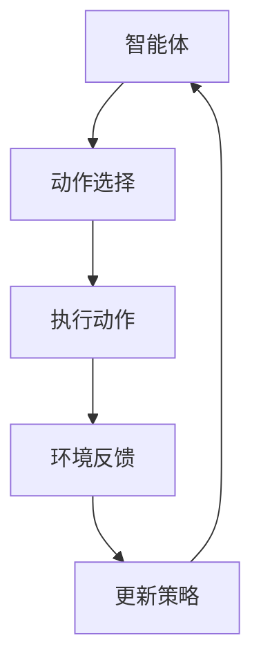
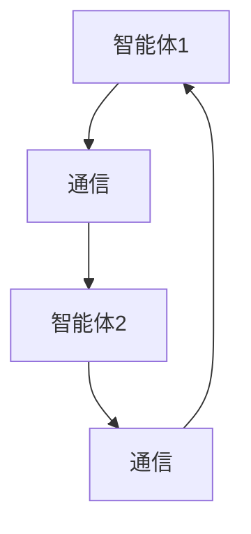
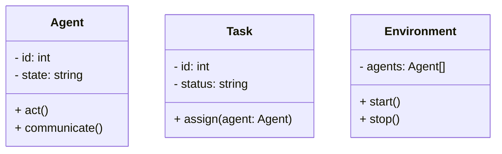
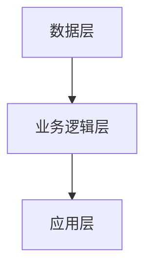

                 


# AI Agent的多智能体协作系统设计

> 关键词：AI Agent, 多智能体协作, 系统设计, 一致性协议, 任务分配, 分布式系统

> 摘要：本篇文章详细探讨了AI Agent在多智能体协作系统中的设计与实现，从理论基础到算法原理，从系统架构到项目实战，全面解析多智能体协作的核心概念与技术细节，旨在为读者提供一个系统化的设计指南。

---

# 第一部分: AI Agent的多智能体协作系统背景与基础

## 第1章: 多智能体协作系统概述

### 1.1 多智能体协作的基本概念
#### 1.1.1 多智能体系统的定义
多智能体系统（Multi-Agent System, 简称MAS）是由多个智能体（Agent）组成的分布式系统，这些智能体通过协作完成共同的目标。

#### 1.1.2 多智能体协作的定义与特点
- **定义**：多智能体协作是指多个智能体通过信息共享、任务分配和协同行动，共同完成复杂任务的过程。
- **特点**：
  - 分布式：智能体分布在不同的位置，独立决策。
  - 协作性：智能体之间通过通信和协调完成任务。
  - 动态性：环境和任务需求可能动态变化。

#### 1.1.3 多智能体协作与单智能体的区别
| 特性           | 单智能体         | 多智能体         |
|----------------|------------------|------------------|
| 系统结构       | 集中式结构       | 分布式结构       |
| 决策方式       | 单点决策         | 分布式决策       |
| 任务处理       | 单任务处理       | 多任务处理       |
| 系统复杂度     | 较低             | 较高             |

### 1.2 AI Agent的定义与分类
#### 1.2.1 AI Agent的基本定义
AI Agent是一种能够感知环境、自主决策并执行任务的智能实体。

#### 1.2.2 基于AI的Agent分类
| 类型           | 描述               |
|----------------|--------------------|
| 简单反射式Agent| 基于当前状态做出反应式决策。 |
| 基于模型的反射式Agent | 使用内部模型来预测环境变化并做出决策。 |
| 目标驱动式Agent | 通过目标驱动行为，主动完成任务。 |
| 学习式Agent    | 通过学习优化决策策略。 |

#### 1.2.3 多智能体系统中的Agent角色
- **执行者（Actor）**：负责具体任务的执行。
- **协调者（Coordinator）**：负责任务分配和资源协调。
- **监督者（Supervisor）**：监控系统运行状态，处理异常情况。

### 1.3 多智能体协作系统的应用场景
#### 1.3.1 分布式任务分配
在分布式系统中，多智能体协作可以实现任务的动态分配和负载均衡。

#### 1.3.2 协作式问题求解
通过多智能体协作，可以将复杂问题分解为多个子问题，分别由不同的智能体解决。

#### 1.3.3 智能体网络与分布式系统
多智能体协作系统可以构建智能体网络，实现分布式计算和数据共享。

### 1.4 本章小结
- 多智能体协作的核心概念包括分布式系统、协作机制和智能体角色。
- AI Agent的分类和角色为多智能体系统的构建提供了理论基础。

---

# 第2章: 多智能体协作系统的理论基础

## 2.1 博弈论与协作机制
### 2.1.1 博弈论基础
博弈论是研究多智能体协作的重要理论基础。

#### 2.1.2 协作机制的分类
| 机制类型       | 描述               |
|----------------|--------------------|
| 竞争机制       | 智能体之间竞争资源   |
| 合作机制       | 智能体之间协同完成任务 |
| 混合机制       | 结合竞争与合作的机制 |

#### 2.1.3 协作中的纳什均衡
纳什均衡是博弈论中的一个关键概念，表示在策略组合下，每个智能体都无法通过单方面改变策略而获益。

### 2.2 分布式系统与一致性协议
#### 2.2.1 分布式系统的基本概念
分布式系统是由多个计算节点通过网络通信协作完成任务的系统。

#### 2.2.2 一致性协议的原理
一致性协议是确保分布式系统中数据一致性的重要机制。

#### 2.2.3 分布式系统中的同步机制
同步机制用于解决分布式系统中的时间一致性问题。

### 2.3 多智能体协作中的通信协议
#### 2.3.1 通信协议的基本定义
通信协议是智能体之间进行信息交换的规则。

#### 2.3.2 基于消息传递的协作机制
通过消息传递实现智能体之间的通信与协作。

#### 2.3.3 通信协议的设计原则
- 简洁性：协议应尽量简洁。
- 可靠性：确保消息能够准确传递。
- 及时性：保证消息传递的实时性。

### 2.4 本章小结
- 博弈论为多智能体协作提供了理论基础。
- 分布式系统与一致性协议是实现协作的关键技术。

---

# 第3章: 多智能体协作系统的算法原理

## 3.1 基于AI的多智能体协作算法
### 3.1.1 基于强化学习的协作算法
通过强化学习实现智能体之间的协作。

#### 强化学习流程图


### 3.1.2 基于图神经网络的协作机制
通过图神经网络实现智能体之间的信息交互与协作。

#### 图神经网络示意图


### 3.1.3 基于分布式计算的协作方法
通过分布式计算实现多智能体协作。

## 3.2 一致性协议的数学模型
### 3.2.1 分布式一致性问题的数学描述
$$ \text{一致性问题：} \forall i, j, V_i = V_j $$

### 3.2.2 基于Paxos算法的数学推导
Paxos算法用于保证分布式系统中数据一致性。

### 3.2.3 基于Raft算法的数学分析
Raft算法是一种更易理解的共识算法。

## 3.3 协作任务分配的算法实现
### 3.3.1 任务分配的数学模型
$$ \text{任务分配问题：} \min_{x} \sum_{i=1}^{n} c_i x_i $$

### 3.3.2 基于贪心算法的任务分配
贪心算法是一种简单有效的任务分配方法。

### 3.3.3 基于动态规划的任务分配
动态规划算法用于优化任务分配。

## 3.4 本章小结
- 多智能体协作算法的核心思想是通过强化学习、图神经网络和分布式计算实现协作。
- 一致性协议的数学模型为分布式系统提供了理论基础。

---

# 第4章: 多智能体协作系统的系统架构设计

## 4.1 系统功能设计
### 4.1.1 领域模型设计
通过领域模型描述系统功能。

#### 领域模型类图


### 4.1.2 功能模块划分
系统功能模块包括任务管理、通信管理、状态管理。

## 4.2 系统架构设计
### 4.2.1 分层架构设计
系统采用分层架构，包括数据层、业务逻辑层和应用层。

#### 分层架构图


### 4.2.2 通信机制设计
智能体之间的通信机制设计。

### 4.2.3 同步机制设计
确保系统中各智能体状态同步。

## 4.3 系统接口设计
### 4.3.1 接口定义
系统接口包括智能体接口、任务接口和环境接口。

### 4.3.2 接口交互流程
通过接口实现智能体之间的协作。

## 4.4 本章小结
- 系统架构设计为多智能体协作提供了实现基础。
- 分层架构和通信机制是系统设计的关键。

---

# 第5章: 多智能体协作系统的项目实战

## 5.1 环境搭建
### 5.1.1 开发环境安装
安装必要的开发工具和库。

### 5.1.2 依赖管理
使用包管理工具管理项目依赖。

## 5.2 核心代码实现
### 5.2.1 智能体类实现
实现AI Agent的核心功能。

#### 智能体类代码
```python
class Agent:
    def __init__(self, id):
        self.id = id
        self.state = "idle"
    
    def act(self):
        # 具体实现
        pass
    
    def communicate(self, message):
        # 具体实现
        pass
```

### 5.2.2 任务分配算法实现
实现任务分配算法。

#### 任务分配算法代码
```python
def assign_task(tasks, agents):
    # 具体实现
    pass
```

## 5.3 实际案例分析
### 5.3.1 案例背景
介绍案例背景和目标。

### 5.3.2 实施过程
详细描述案例实施过程。

### 5.3.3 案例结果
展示案例实施结果。

## 5.4 本章小结
- 项目实战为读者提供了实际的代码实现经验。
- 案例分析帮助读者更好地理解理论知识。

---

# 第6章: 多智能体协作系统的最佳实践

## 6.1 注意事项
### 6.1.1 同步问题
避免同步问题导致的系统崩溃。

### 6.1.2 通信问题
确保智能体之间的通信可靠。

## 6.2 最佳实践 tips
### 6.2.1 系统设计
系统设计时要充分考虑可扩展性和可维护性。

### 6.2.2 代码实现
代码实现时要遵循良好的编程习惯。

## 6.3 拓展阅读
### 6.3.1 推荐书籍
推荐几本相关书籍。

### 6.3.2 推荐论文
推荐几篇经典论文。

## 6.4 本章小结
- 注意事项帮助读者避免常见错误。
- 最佳实践为读者提供了宝贵的开发经验。

---

# 作者：AI天才研究院/AI Genius Institute & 禅与计算机程序设计艺术 /Zen And The Art of Computer Programming

---

以上是《AI Agent的多智能体协作系统设计》的完整目录大纲，涵盖了从理论到实践的各个方面，适合技术从业者和研究人员阅读。

