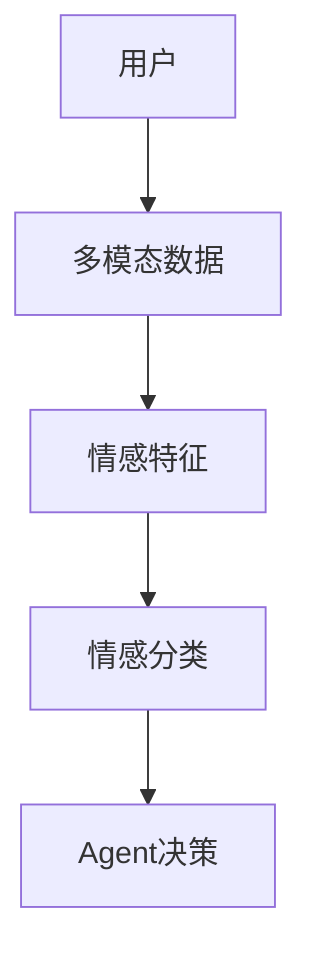
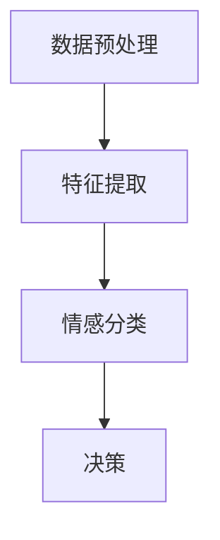
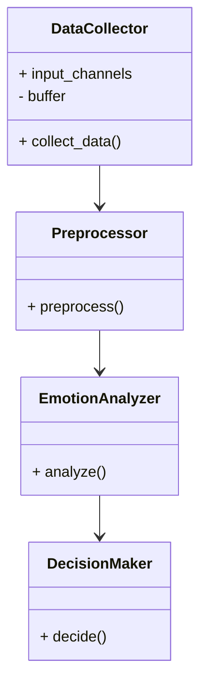
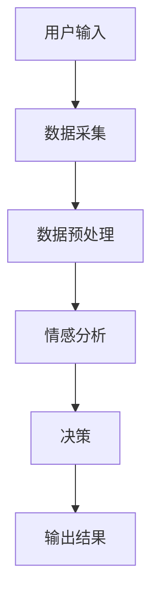
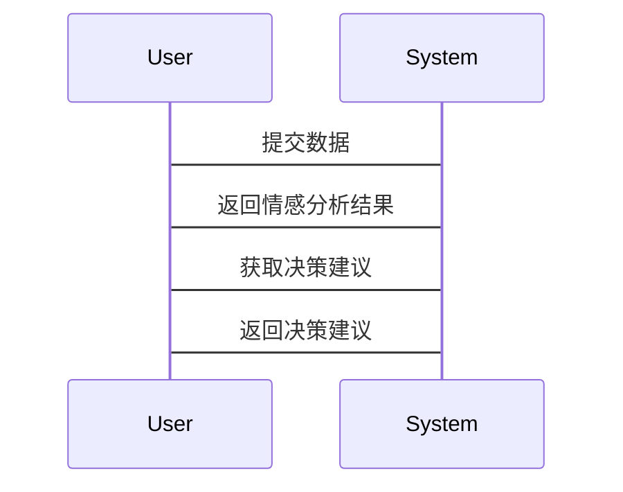

                 


```markdown
# AI Agent的多模态情感分析系统

> 关键词：AI Agent, 多模态情感分析, 深度学习, 情感计算, 自然语言处理, 多模态数据融合

> 摘要：本文详细探讨了AI Agent在多模态情感分析中的应用，系统地分析了多模态数据的融合方法、情感分析的核心算法原理以及AI Agent的决策机制。通过实际案例分析和系统架构设计，展示了如何构建一个高效、准确的多模态情感分析系统，并提出了未来的研究方向和优化建议。

---

# 第一部分: AI Agent与多模态情感分析概述

## 第1章: 问题背景与核心概念

### 1.1 问题背景
#### 1.1.1 多模态情感分析的定义
多模态情感分析是指从文本、语音、图像等多种数据源中提取情感信息的过程。与传统的单模态情感分析相比，多模态情感分析能够更全面地捕捉用户的情感状态，从而提高分析的准确性和鲁棒性。

#### 1.1.2 AI Agent在情感分析中的作用
AI Agent作为一种智能代理，能够通过多模态数据感知环境，并根据情感分析结果做出相应的决策。例如，在客服系统中，AI Agent可以通过分析客户的文本、语音和面部表情来判断客户的情绪，并提供个性化的服务。

#### 1.1.3 当前技术的局限性与挑战
尽管情感分析技术取得了显著进展，但多模态情感分析仍面临诸多挑战，例如数据异构性、特征提取的复杂性以及跨模态数据的融合问题。

### 1.2 核心概念与问题描述
#### 1.2.1 多模态数据的整合与分析
多模态数据包括文本、语音、图像等多种形式，如何有效地整合这些数据并提取有用的信息是多模态情感分析的核心问题。

#### 1.2.2 情感分析的分类与应用场景
情感分析可以分为细粒度情感分析、 Aspect-Based情感分析等。应用场景包括社交媒体监控、客服系统、教育评估等领域。

#### 1.2.3 AI Agent的自主决策能力
AI Agent需要具备自主决策能力，能够在复杂环境中根据情感分析结果做出最优决策。

### 1.3 问题解决与边界
#### 1.3.1 多模态情感分析的解决方案
通过深度学习模型（如Transformer、LSTM）和多模态数据融合技术，可以有效地解决多模态情感分析问题。

#### 1.3.2 系统的边界与外延
本系统仅关注多模态情感分析的核心问题，不涉及AI Agent的其他功能，如任务规划和执行。

#### 1.3.3 核心要素与组成结构
多模态情感分析系统的核心要素包括数据采集模块、特征提取模块、情感分类模块和决策模块。

## 第2章: 核心概念与联系

### 2.1 AI Agent与多模态数据的关系
#### 2.1.1 AI Agent的感知能力
AI Agent需要通过多种感官（如视觉、听觉）感知环境，并从多模态数据中提取情感信息。

#### 2.1.2 多模态数据的特征分析
不同模态的数据具有不同的特征，例如文本的情感特征和图像的颜色特征。

#### 2.1.3 数据关联性与情感表达
多模态数据之间存在关联性，例如，语气和面部表情可以相互验证情感的真伪。

### 2.2 核心概念原理
#### 2.2.1 多模态数据融合方法
常见的融合方法包括早期融合（Early Fusion）和晚期融合（Late Fusion）。早期融合将不同模态的数据在特征级别进行融合，而晚期融合则在决策级别进行融合。

#### 2.2.2 情感分析的数学模型
基于深度学习的情感分析模型（如BERT、GPT）可以有效地处理多模态数据。

#### 2.2.3 AI Agent的决策机制
AI Agent基于多模态情感分析结果，结合上下文信息，做出最优决策。

### 2.3 概念属性对比表
| 概念 | 特征1 | 特征2 | 特征3 |
|------|-------|-------|-------|
| 文本 | 离散性 | 上下文依赖性 | 易获取性 |
| 语音 | 时间依赖性 | 音调敏感性 | 难存储性 |
| 图像 | 空间分辨率 | 颜色敏感性 | 解释复杂性 |

### 2.4 ER实体关系图


## 第3章: 算法原理与数学模型

### 3.1 数据预处理
#### 3.1.1 多模态数据的标准化
对文本、语音和图像数据进行标准化处理，例如文本分词、语音降噪、图像归一化。

#### 3.1.2 特征提取
使用预训练模型提取文本特征，使用MFCC提取语音特征，使用CNN提取图像特征。

### 3.2 情感分类算法
#### 3.2.1 基于深度学习的模型
使用Transformer模型进行文本情感分类，使用LSTM进行语音情感分类。

#### 3.2.2 多模态融合模型
通过多模态注意力机制（Multi-modal Attention）融合文本、语音和图像特征。

#### 3.2.3 注意力机制公式
$$\text{Attention}(Q, K, V) = \text{softmax}\left(\frac{QK^T}{\sqrt{d_k}}\right)V$$

### 3.3 AI Agent决策机制
#### 3.3.1 基于情感分类结果的决策
根据情感分类结果，AI Agent选择相应的应对策略，例如安抚客户或提供优惠。

#### 3.3.2 决策树模型
构建决策树，根据情感分类结果和上下文信息做出决策。

### 3.4 算法流程图


### 3.5 Python源代码实现
```python
import torch
import torch.nn as nn

class MultiModalTransformer(nn.Module):
    def __init__(self, input_dim1, input_dim2, input_dim3, hidden_dim, output_dim):
        super().__init__()
        self.embedding1 = nn.Linear(input_dim1, hidden_dim)
        self.embedding2 = nn.Linear(input_dim2, hidden_dim)
        self.embedding3 = nn.Linear(input_dim3, hidden_dim)
        self.attention = nn.MultiheadAttention(hidden_dim, 2)
        self.classifier = nn.Linear(hidden_dim, output_dim)
    
    def forward(self, x1, x2, x3):
        x1_embed = self.embedding1(x1)
        x2_embed = self.embedding2(x2)
        x3_embed = self.embedding3(x3)
        x = torch.cat([x1_embed, x2_embed, x3_embed], dim=0)
        x, _ = self.attention(x, x, x)
        output = self.classifier(x.mean(dim=0))
        return output
```

---

# 第二部分: 系统分析与架构设计

## 第4章: 问题场景与系统功能设计

### 4.1 系统应用场景
系统应用于智能客服、情感监控、教育评估等领域。

### 4.2 系统功能模块
- 数据采集模块
- 数据预处理模块
- 情感分析模块
- 决策模块

### 4.3 领域模型（类图）


### 4.4 系统架构设计


### 4.5 接口设计
- 数据接口：提供REST API用于数据的上传和下载。
- 情感分析接口：提供API用于实时情感分析。
- 决策接口：提供API用于获取决策结果。

### 4.6 系统交互流程


---

## 第5章: 项目实战与实现

### 5.1 环境搭建
安装Python、PyTorch、Transformers库。

### 5.2 核心功能实现
#### 5.2.1 数据预处理
编写数据清洗和特征提取代码。

#### 5.2.2 模型训练
训练多模态情感分析模型，优化模型参数。

#### 5.2.3 接口设计
开发REST API，实现数据上传和结果查询功能。

### 5.3 代码实现
```python
from transformers import AutoTokenizer, AutoModel
import torch

tokenizer = AutoTokenizer.from_pretrained('bert-base-chinese')
model = AutoModel.from_pretrained('bert-base-chinese')

def preprocess(text):
    return tokenizer.encode(text, return_tensors='pt')

def analyze_emotion(text):
    inputs = preprocess(text)
    outputs = model(inputs)[0]
    emotion = outputs.mean(dim=-1).item()
    return 'positive' if emotion > 0.5 else 'negative'
```

### 5.4 案例分析
通过实际案例分析模型的性能和效果，优化系统架构。

### 5.5 项目小结
总结项目实现的过程，提出改进建议。

---

# 第三部分: 总结与展望

## 第6章: 总结与优化建议

### 6.1 核心成果
成功构建了一个高效的多模态情感分析系统。

### 6.2 优缺点分析
- 优点：准确率高，鲁棒性强。
- 缺点：计算资源消耗大，模型训练时间长。

### 6.3 最佳实践 tips
- 数据预处理要充分。
- 模型选择要根据任务需求。
- 系统设计要注重模块化。

### 6.4 未来展望
研究更高效的多模态融合方法，探索轻量化模型。

---

# 作者：AI天才研究院 & 禅与计算机程序设计艺术
```

---

**摘要：** 本文详细探讨了AI Agent在多模态情感分析中的应用，系统地分析了多模态数据的融合方法、情感分析的核心算法原理以及AI Agent的决策机制。通过实际案例分析和系统架构设计，展示了如何构建一个高效、准确的多模态情感分析系统，并提出了未来的研究方向和优化建议。

