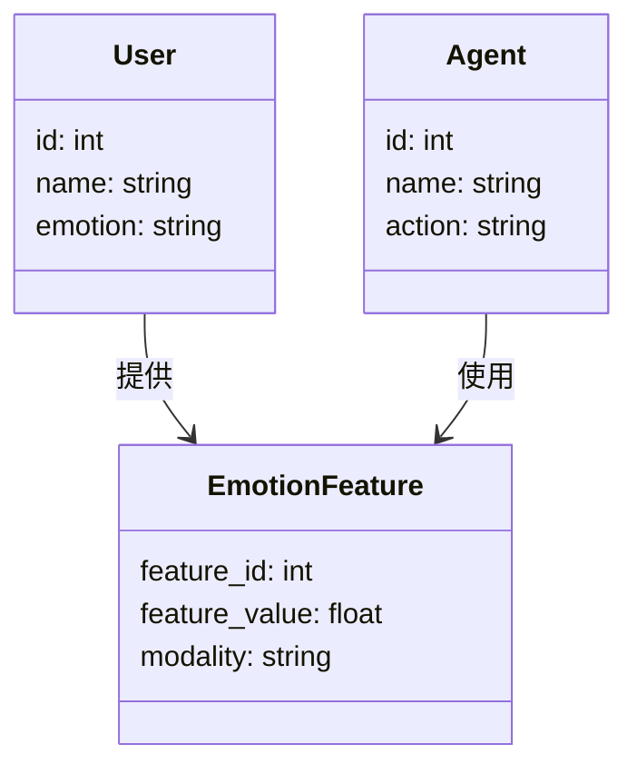

                 


# AI Agent的多模态情感识别技术

> 关键词：多模态数据，情感识别，AI Agent，深度学习，情感计算，多模态融合

> 摘要：本文深入探讨了AI Agent的多模态情感识别技术，从技术背景、核心概念、算法原理到系统设计和项目实战，全面解析了多模态情感识别的实现方法及其在AI Agent中的应用。通过分析多模态数据的特征提取、融合方法和情感计算的数学模型，本文为读者提供了从理论到实践的完整技术指南。

---

# 第1章: 多模态情感识别技术概述

## 1.1 多模态情感识别的定义与背景

### 1.1.1 多模态数据的定义
多模态数据指的是来自不同感知渠道（如文本、语音、图像、视频等）的数据，具有多样性和互补性。与单模态数据相比，多模态数据能够提供更全面的信息，从而更准确地反映真实情感。

### 1.1.2 情感识别技术的背景与意义
情感识别是人工智能领域的核心技术，旨在通过分析多模态数据来识别和理解人类情感。随着AI Agent在智能客服、人机交互、教育等领域的广泛应用，情感识别技术的重要性日益凸显。

### 1.1.3 多模态情感识别的核心概念
- **多模态数据融合**：将来自不同模态的数据进行融合，以提高情感识别的准确性和鲁棒性。
- **情感计算**：通过分析多模态数据，计算出情感特征并进行分类。
- **跨模态特征提取**：从不同模态数据中提取特征，并进行跨模态匹配和融合。

---

## 1.2 多模态情感识别的应用场景

### 1.2.1 智能客服中的应用
在智能客服中，多模态情感识别技术可以实时分析用户的情感状态，帮助AI Agent更好地理解用户需求，提供更个性化的服务。

### 1.2.2 娱乐与人机交互中的应用
在娱乐领域，多模态情感识别技术可以用于游戏、虚拟助手等场景，提升用户体验。例如，通过分析用户的语音和表情，实时调整游戏难度或交互方式。

### 1.2.3 教育与心理健康领域的应用
在教育领域，多模态情感识别技术可以帮助教师更好地理解学生的情感状态，提供个性化的教学策略。在心理健康领域，它可以用于抑郁、焦虑等情绪的早期识别和干预。

---

## 1.3 AI Agent与多模态情感识别的结合

### 1.3.1 AI Agent的定义与特点
AI Agent是一种智能实体，能够感知环境、自主决策并执行任务。其特点是智能性、自主性、反应性和社会性。

### 1.3.2 多模态情感识别在AI Agent中的作用
通过多模态情感识别技术，AI Agent可以更准确地理解用户的情感需求，从而提供更贴心的服务。

### 1.3.3 AI Agent与多模态情感识别的协同工作模式
AI Agent通过多模态情感识别技术，实时感知用户的情感状态，并根据情感信息调整自身的行为策略，以实现更高效的任务执行和更优质的用户体验。

---

## 1.4 本章小结

---

# 第2章: 多模态情感识别的核心技术

## 2.1 多模态数据的特征提取

### 2.1.1 文本数据的情感分析
文本情感分析是通过自然语言处理技术，分析文本中的情感倾向。常用的方法包括基于词袋模型、词嵌入和深度学习模型（如LSTM、BERT）。

### 2.1.2 音频数据的情感识别
音频情感识别主要通过分析语音的音调、语速、音量等特征，结合语音内容进行情感分类。

### 2.1.3 图像/视频数据的情感分析
图像情感分析通过分析面部表情、肢体语言等视觉特征，结合图像内容进行情感分类。视频数据则结合了图像和音频信息，进一步提高了情感识别的准确性。

---

## 2.2 多模态数据的融合方法

### 2.2.1 基于特征级的融合方法
特征级融合是将不同模态的特征向量进行融合，常用的方法包括向量拼接、加权融合和注意力机制。

### 2.2.2 基于决策级的融合方法
决策级融合是将不同模态的情感分类结果进行融合，常用的方法包括投票法、加权投票法和贝叶斯融合。

### 2.2.3 基于模型级的融合方法
模型级融合是将不同模态的特征分别输入到独立的模型中进行训练，然后将模型的输出结果进行融合。

---

## 2.3 多模态数据融合的挑战与解决方案

### 2.3.1 数据异构性问题
数据异构性指的是不同模态的数据具有不同的特征维度和分布特性，这会增加数据融合的难度。

### 2.3.2 数据冗余与噪声问题
多模态数据中可能存在冗余信息或噪声，这会影响情感识别的准确性和稳定性。

### 2.3.3 融合模型的可解释性问题
多模态融合模型的复杂性可能导致其可解释性较差，这在实际应用中可能带来一定的局限性。

---

## 2.4 本章小结

---

# 第3章: 多模态情感识别的算法原理

## 3.1 基于深度学习的多模态融合模型

### 3.1.1 多任务学习框架
多任务学习框架是一种通过同时学习多个相关任务来提高模型性能的方法。在多模态情感识别中，可以同时学习文本、语音和图像的情感特征。

### 3.1.2 跨模态注意力机制
跨模态注意力机制是一种通过注意力机制来捕捉不同模态数据之间的关联性，从而提高情感识别的准确性的方法。

### 3.1.3 多模态生成对抗网络
多模态生成对抗网络是一种通过生成对抗网络来学习多模态数据特征的模型，可以用于情感特征的生成和重建。

---

## 3.2 情感识别的核心算法

### 3.2.1 文本情感分析的深度学习模型
常用的文本情感分析模型包括LSTM、GRU、BERT等。这些模型可以通过预训练和微调来适应特定的情感分类任务。

### 3.2.2 音频情感识别的特征提取方法
常用的音频情感识别特征包括Mel频谱、MFCC、谱质、倒谱等。这些特征可以通过时域和频域分析提取。

### 3.2.3 图像情感识别的卷积神经网络
常用的图像情感识别模型包括AlexNet、VGGNet、ResNet等。这些模型可以通过卷积层和池化层提取图像的深层特征。

---

## 3.3 算法实现的数学模型与公式

### 3.3.1 情感分类的损失函数
$$ L = -\frac{1}{N}\sum_{i=1}^{N} y_i \log p_i + (1 - y_i) \log (1 - p_i) $$

其中，$y_i$ 是标签，$p_i$ 是模型预测的概率。

### 3.3.2 跨模态注意力机制的公式
$$ \alpha_i = \frac{\exp(\text{score}(x_i, y_i))}{\sum_{j=1}^{n} \exp(\text{score}(x_j, y_j))} $$

其中，$\alpha_i$ 是注意力权重，$\text{score}(x_i, y_i)$ 是模态间相关性的得分。

---

## 3.4 本章小结

---

# 第4章: 系统分析与架构设计

## 4.1 问题场景介绍

## 4.2 系统功能设计

### 4.2.1 领域模型设计


### 4.2.2 系统架构设计


### 4.2.3 系统接口设计

### 4.2.4 系统交互流程

---

## 4.3 本章小结

---

# 第5章: 项目实战

## 5.1 环境安装

## 5.2 系统核心实现源代码

### 5.2.1 数据预处理
```python
import numpy as np
import pandas as pd
from sklearn.model_selection import train_test_split

# 加载数据
data = pd.read_csv('multi_modal_data.csv')

# 划分训练集和测试集
train_data, test_data = train_test_split(data, test_size=0.2, random_state=42)
```

### 5.2.2 模型训练
```python
import torch
import torch.nn as nn
import torch.optim as optim

# 定义模型
class MultiModalClassifier(nn.Module):
    def __init__(self, input_size, hidden_size, output_size):
        super(MultiModalClassifier, self).__init__()
        self.fc1 = nn.Linear(input_size, hidden_size)
        self.fc2 = nn.Linear(hidden_size, output_size)
        self.relu = nn.ReLU()
        self.softmax = nn.Softmax(dim=1)

    def forward(self, x):
        out = self.fc1(x)
        out = self.relu(out)
        out = self.fc2(out)
        out = self.softmax(out)
        return out

# 初始化模型和优化器
model = MultiModalClassifier(input_size=100, hidden_size=50, output_size=3)
criterion = nn.CrossEntropyLoss()
optimizer = optim.Adam(model.parameters(), lr=0.001)
```

### 5.2.3 模型评估
```python
# 训练模型
for epoch in range(num_epochs):
    for inputs, labels in dataloaders['train']:
        optimizer.zero_grad()
        outputs = model(inputs)
        loss = criterion(outputs, labels)
        loss.backward()
        optimizer.step()

# 验证模型
with torch.no_grad():
    correct = 0
    total = 0
    for inputs, labels in dataloaders['val']:
        outputs = model(inputs)
        _, predicted = torch.max(outputs.data, 1)
        total += labels.size(0)
        correct += (predicted == labels).sum().item()

    accuracy = correct / total
    print(f'Epoch [{epoch+1}/{num_epochs}], Accuracy: {accuracy}')
```

---

## 5.3 项目总结与经验分享

---

# 第6章: 最佳实践、小结与展望

## 6.1 最佳实践 tips
- 数据预处理是关键，尤其是多模态数据的融合。
- 模型选择要根据具体任务和数据特点进行调整。
- 融合模型的可解释性是实际应用中的重要考量。

## 6.2 本章小结
总结全文，回顾多模态情感识别技术的核心内容和实现方法。

## 6.3 展望
随着AI技术的不断发展，多模态情感识别技术将更加智能化和精准化，未来有望在更多领域得到广泛应用。

---

# 作者

作者：AI天才研究院/AI Genius Institute & 禅与计算机程序设计艺术 /Zen And The Art of Computer Programming

