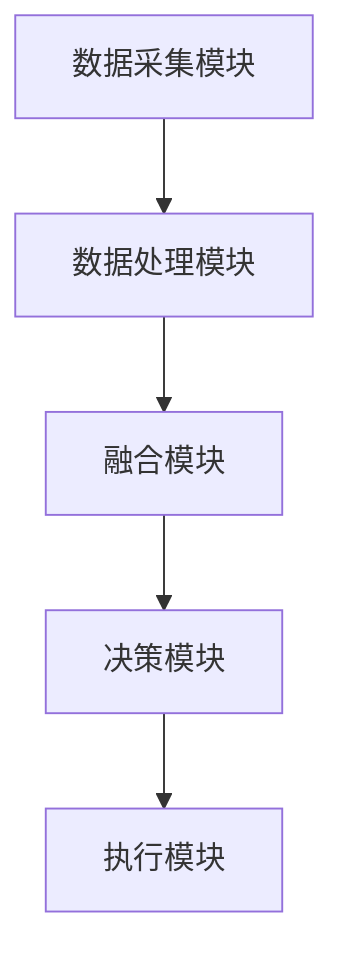

                 


# AI Agent的多模态融合技术

> 关键词：AI Agent，多模态融合，深度学习，注意力机制，系统架构设计

> 摘要：本文深入探讨了AI Agent的多模态融合技术，从概念、算法、系统架构到项目实战，全面解析了多模态融合在AI Agent中的应用与实现。通过详细的理论分析和实际案例，本文为读者提供了从基础到高级的技术指导。

---

# 第一部分: AI Agent的多模态融合技术基础

## 第1章: 多模态融合技术概述

### 1.1 多模态融合的核心概念

#### 1.1.1 多模态数据的定义与特点
多模态数据指的是来自不同感官或来源的数据形式，例如视觉（图像、视频）、听觉（语音、音乐）、触觉（力反馈）、嗅觉（气味数据）和文本（自然语言文本）。多模态数据的特点包括：

- **异构性**：不同模态的数据具有不同的特征和表示方式。
- **互补性**：不同模态的数据可以相互补充，提供更全面的信息。
- **复杂性**：多模态数据的处理需要综合考虑多种数据类型和它们之间的关系。

#### 1.1.2 多模态融合的背景与意义
随着人工智能技术的发展，单一模态的数据处理已经难以满足复杂场景的需求。例如，在智能交互系统中，用户可能同时提供语音、图像和文本信息。如何有效地融合这些信息，提升系统的理解和决策能力，成为当前研究的热点。

多模态融合的意义在于：
- **提升准确性**：通过融合多种数据，可以减少单一模态的局限性，提高系统的准确性。
- **增强鲁棒性**：多模态数据可以互相补充，降低单一模态数据丢失或噪声的影响。
- **扩展应用场景**：多模态融合可以支持更复杂和多样化的应用场景。

#### 1.1.3 多模态融合与AI Agent的关系
AI Agent（智能体）是一个能够感知环境、自主决策并执行任务的实体。多模态融合技术是AI Agent实现复杂任务的核心技术之一。通过融合多种模态的数据，AI Agent能够更全面地感知环境，做出更智能的决策。

---

### 1.2 AI Agent的基本原理

#### 1.2.1 AI Agent的定义与分类
AI Agent是指具有感知、推理、规划和执行能力的智能实体。根据功能和应用场景的不同，AI Agent可以分为以下几类：

- **简单反射型Agent**：基于当前感知做出反应，不涉及复杂推理。
- **基于模型的反射型Agent**：利用内部模型进行推理，做出更复杂的决策。
- **目标驱动型Agent**：具有明确的目标，通过规划实现目标。
- **实用驱动型Agent**：基于效用函数进行决策，追求效用的最大化。

#### 1.2.2 AI Agent的核心功能模块
AI Agent的核心功能模块包括：

- **感知模块**：负责从环境中获取多模态数据。
- **推理模块**：对感知到的数据进行分析和推理。
- **决策模块**：基于推理结果做出决策。
- **执行模块**：将决策转化为具体行动。

#### 1.2.3 多模态融合在AI Agent中的作用
多模态融合技术在AI Agent中的作用主要体现在以下几个方面：

- **提升感知能力**：通过融合多种模态数据，AI Agent能够更全面地感知环境。
- **增强推理能力**：多模态数据的融合可以提供更多的上下文信息，帮助AI Agent做出更准确的推理。
- **优化决策过程**：多模态融合可以提供更全面的信息支持，优化决策过程。

---

### 1.3 多模态融合技术的应用场景

#### 1.3.1 智能交互系统
在智能交互系统中，多模态融合技术可以实现更自然的用户交互。例如，结合语音识别、面部表情识别和手势识别，可以实现更精准的用户意图理解。

#### 1.3.2 智能推荐系统
在智能推荐系统中，多模态融合技术可以结合用户的视觉偏好、听觉偏好和文本偏好，提供更个性化的推荐。

#### 1.3.3 智慧城市与物联网
在智慧城市和物联网中，多模态融合技术可以结合图像、传感器数据和地理位置信息，实现更智能的城市管理和服务。

---

## 第2章: 多模态数据的采集与预处理

### 2.1 多模态数据的采集技术

#### 2.1.1 视觉数据采集
视觉数据采集主要通过摄像头和图像传感器实现。常见的视觉数据包括RGB图像、深度图像和视频流。

#### 2.1.2 听觉数据采集
听觉数据采集主要通过麦克风和声学传感器实现。常见的听觉数据包括语音、音乐和环境噪声。

#### 2.1.3 文本数据采集
文本数据采集主要通过自然语言处理技术实现。常见的文本数据包括用户输入的文本、网页爬取的文本和数据库中的文本。

---

### 2.2 数据预处理方法

#### 2.2.1 数据清洗与标准化
数据清洗是指去除噪声和无用数据，确保数据的干净和一致性。标准化是将不同模态的数据转换到统一的表示空间。

#### 2.2.2 数据增强技术
数据增强技术是指通过变换和扩展数据，增加数据的多样性和鲁棒性。例如，在图像数据中，可以通过旋转、翻转和裁剪等操作进行数据增强。

#### 2.2.3 数据对齐与融合
数据对齐是指将不同模态的数据对齐到同一个时间或空间参考系。数据融合是指将不同模态的数据进行融合，形成更丰富的信息表示。

---

### 2.3 多模态数据的特征提取

#### 2.3.1 视觉特征提取
视觉特征提取可以通过卷积神经网络（CNN）实现。常见的视觉特征包括图像的纹理、形状和颜色特征。

#### 2.3.2 听觉特征提取
听觉特征提取可以通过循环神经网络（RNN）或卷积神经网络（CNN）实现。常见的听觉特征包括语音的音调、音高和节奏特征。

#### 2.3.3 文本特征提取
文本特征提取可以通过词嵌入（如Word2Vec、GloVe）或句子嵌入（如BERT）实现。常见的文本特征包括词向量、句向量和语义向量。

---

## 第3章: 多模态融合的核心算法

### 3.1 多模态注意力机制

#### 3.1.1 注意力机制的基本原理
注意力机制是一种基于权重分配的技术，用于关注输入数据中重要的部分。在多模态融合中，注意力机制可以用于确定不同模态的重要性。

#### 3.1.2 多模态注意力模型的构建
多模态注意力模型的构建可以采用以下步骤：
1. 将不同模态的数据分别进行特征提取，得到特征向量。
2. 计算不同模态之间的相关性，确定每个模态的注意力权重。
3. 根据注意力权重对各模态的特征进行加权融合，得到最终的融合结果。

#### 3.1.3 注意力权重的计算与融合
注意力权重的计算可以通过以下公式实现：
$$
\alpha_i = \frac{e^{score(x_i)}}{\sum_{j} e^{score(x_j)}}
$$
其中，$score(x_i)$表示第i个模态的注意力得分。

---

### 3.2 多模态对抗网络

#### 3.2.1 对抗网络的基本原理
对抗网络是一种通过生成器和判别器的对抗训练实现数据生成的技术。在多模态融合中，对抗网络可以用于生成更具多样性和真实性的数据。

#### 3.2.2 多模态对抗网络的构建
多模态对抗网络的构建可以采用以下步骤：
1. 将不同模态的数据分别输入生成器，生成融合数据。
2. 判别器对生成的数据进行判别，判断其是否真实。
3. 通过交替训练生成器和判别器，优化模型的性能。

#### 3.2.3 对抗训练的优化策略
对抗训练的优化策略包括：
- **渐进式增长**：逐步增加对抗网络的复杂性。
- **对抗损失函数**：设计合适的对抗损失函数，平衡生成器和判别器的损失。
- **正则化技术**：引入正则化技术，防止模型过拟合。

---

### 3.3 多模态融合的数学模型

#### 3.3.1 多模态数据的表示方法
多模态数据的表示方法可以采用以下方式：
- **模态独立表示**：将不同模态的数据分别表示为独立的向量。
- **模态共享表示**：将不同模态的数据共享相同的表示空间。

#### 3.3.2 融合模型的数学公式
融合模型的数学公式可以表示为：
$$
y = f(x_1, x_2, ..., x_n)
$$
其中，$x_i$表示第i个模态的输入数据，$f$表示融合函数。

#### 3.3.3 模型的训练与优化
模型的训练与优化可以采用以下步骤：
1. 将多模态数据输入模型，计算预测结果。
2. 计算预测结果与真实结果之间的误差。
3. 通过反向传播算法，优化模型的参数。

---

## 第4章: AI Agent的系统架构设计

### 4.1 系统功能模块划分

#### 4.1.1 数据采集模块
数据采集模块负责从环境中采集多模态数据，包括视觉、听觉和文本数据。

#### 4.1.2 数据处理模块
数据处理模块负责对采集到的数据进行预处理，包括数据清洗、特征提取和数据对齐。

#### 4.1.3 融合模块
融合模块负责将不同模态的数据进行融合，得到最终的融合结果。

#### 4.1.4 决策模块
决策模块负责根据融合结果，做出决策并输出行动。

---

### 4.2 系统架构图



---

## 第5章: 项目实战

### 5.1 环境安装与配置

#### 5.1.1 安装依赖
需要安装以下依赖：
- Python 3.x
- TensorFlow或PyTorch
- OpenCV
- sounddevice
- matplotlib

#### 5.1.2 配置开发环境
推荐使用Jupyter Notebook进行开发和调试。

---

### 5.2 系统核心实现源代码

#### 5.2.1 数据采集模块

```python
import cv2
import sounddevice as sd

# 视觉数据采集
def capture_image():
    cap = cv2.VideoCapture(0)
    ret, frame = cap.read()
    if ret:
        cv2.imwrite("image.png", frame)
    cap.release()

# 听觉数据采集
def record_audio():
    duration = 5  # 记录时长（秒）
    fs = 44100  # 采样率
    audio = sd.rec(duration * fs, fs, 2)
    sd.wait()
    sd.play(audio, fs)
    sd.stop()
    sd.save("audio.wav", audio, fs)
```

#### 5.2.2 数据处理模块

```python
import numpy as np

# 数据预处理函数
def preprocess_data(modal_data):
    # 标准化处理
    normalized_data = (modal_data - np.mean(modal_data)) / np.std(modal_data)
    return normalized_data
```

#### 5.2.3 融合模块

```python
import tensorflow as tf

# 多模态注意力机制模型
class MultiModalAttention(tf.keras.Model):
    def __init__(self, modal_units, output_units):
        super(MultiModalAttention, self).__init__()
        self.modal_units = modal_units
        self.output_units = output_units
        self.attention = tf.keras.layers.Dense(output_units, activation="softmax")
    
    def call(self, inputs):
        # 输入为多个模态的特征向量
        # inputs的形状为：[batch_size, num_modals, modal_units]
        attention_weights = self.attention(inputs)
        # 加权融合
        output = tf.reduce_sum(inputs * attention_weights, axis=1)
        return output
```

---

### 5.3 实际案例分析与解读

#### 5.3.1 案例背景
假设我们开发一个智能助手AI Agent，能够通过语音、图像和文本三种模态数据进行交互。用户可以通过语音指令、图像输入或文本输入与智能助手互动。

#### 5.3.2 系统功能设计
系统功能设计包括：
- **语音识别**：识别用户的语音指令。
- **图像识别**：识别用户输入的图像内容。
- **文本理解**：理解用户的文本输入。
- **多模态融合**：将语音、图像和文本数据进行融合，生成最终的响应。

---

## 第6章: 最佳实践与总结

### 6.1 小结
本文详细探讨了AI Agent的多模态融合技术，从概念、算法到系统设计，全面解析了多模态融合在AI Agent中的应用与实现。通过实际项目案例，展示了如何将多模态融合技术应用到实际场景中。

### 6.2 注意事项
在实际应用中，需要注意以下几点：
- **数据质量**：确保多模态数据的采集和预处理质量。
- **模型优化**：通过实验不断优化融合模型的性能。
- **系统鲁棒性**：确保系统的稳定性和抗干扰能力。

### 6.3 拓展阅读
推荐以下拓展阅读内容：
- 《Deep Learning》——Ian Goodfellow
- 《Attention is All You Need》—— Vaswewar et al.
- 《Multi-modal Data Fusion》—— Y. Zhang et al.

---

# 作者：AI天才研究院 & 禅与计算机程序设计艺术

