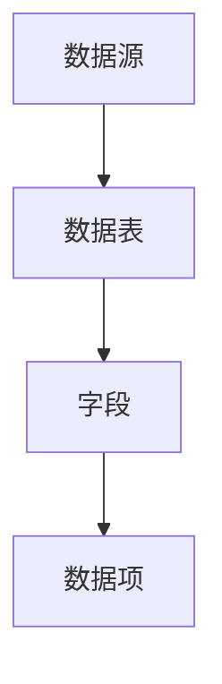
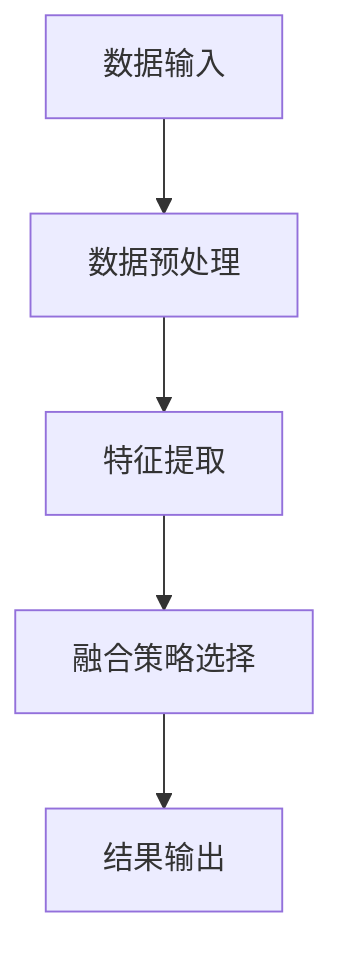

                 


# AI Agent的多源异构数据融合技术

> 关键词：AI Agent, 多源异构数据, 数据融合, 数据清洗, 机器学习算法, 系统架构设计, 项目实战

> 摘要：本文深入探讨了AI Agent在多源异构数据融合技术中的应用，从数据预处理到特征提取，从算法原理到系统架构设计，再到项目实战与最佳实践，全面解析了多源异构数据融合的核心技术与实现方法。通过具体案例分析和代码实现，帮助读者理解如何将多源异构数据高效地融合起来，为AI Agent提供高质量的数据支持。

---

## 第一部分: AI Agent与多源异构数据融合概述

### 第1章: AI Agent与多源异构数据融合概述

#### 1.1 AI Agent的基本概念

- **1.1.1 AI Agent的定义与特点**
  - AI Agent（智能体）是指能够感知环境并采取行动以实现目标的实体。
  - 其特点包括自主性、反应性、目标导向性和社会性。

- **1.1.2 多源异构数据的定义与特征**
  - 多源异构数据指来自不同来源、格式、结构和语义的数据。
  - 其主要特征包括多样性、异构性和关联性。

- **1.1.3 数据融合的基本概念与意义**
  - 数据融合是指将多个数据源中的信息整合起来，形成更完整、更准确的结果。
  - 其意义在于提高数据的可用性和可靠性。

#### 1.2 多源异构数据融合的背景与挑战

- **1.2.1 数据异构性的表现形式**
  - 数据格式异构：如结构化数据（表格）、半结构化数据（JSON）和非结构化数据（文本、图像）。
  - 数据语义异构：不同数据源对同一概念的描述可能不同。

- **1.2.2 数据融合的难点与解决方案**
  - 数据清洗的复杂性：需要处理缺失值、噪声和重复数据。
  - 数据关联的困难性：不同数据源之间可能存在语义不一致的问题。

- **1.2.3 数据融合在AI Agent中的重要性**
  - 提高AI Agent的决策能力。
  - 增强AI Agent的环境感知能力。

#### 1.3 本书的核心内容与目标

- **1.3.1 本书的研究范围**
  - 覆盖多源异构数据融合的理论、方法和实践。

- **1.3.2 本书的主要目标**
  - 帮助读者掌握多源异构数据融合的核心技术。
  - 提供实际项目中的应用案例和解决方案。

---

## 第二部分: 多源异构数据融合的核心概念与联系

### 第2章: 多源异构数据融合的核心概念与联系

#### 2.1 数据融合的基本原理

- **2.1.1 数据预处理的必要性**
  - 数据清洗：去除噪声和冗余数据。
  - 数据标准化：统一数据格式和单位。

- **2.1.2 数据特征提取的关键步骤**
  - 选择性提取：根据任务需求选择关键特征。
  - 综合性提取：结合多个特征形成新的特征。

- **2.1.3 数据融合的策略与方法**
  - 基于规则的融合：如简单的加权平均。
  - 基于模型的融合：如深度学习模型。

#### 2.2 数据融合的关键技术

- **2.2.1 数据清洗与标准化**
  - 使用Python的pandas库进行数据清洗。
  - 示例代码：
    ```python
    import pandas as pd
    df = pd.read_csv('data.csv')
    df.dropna(inplace=True)
    ```

- **2.2.2 数据对齐与关联**
  - 使用SQL进行数据关联。
  - 示例代码：
    ```sql
    SELECT t1.* FROM table1 t1 JOIN table2 t2 ON t1.id = t2.id
    ```

- **2.2.3 数据融合的权重分配**
  - 根据数据源的可靠性分配权重。
  - 示例公式：
    $$ y = w_1x_1 + w_2x_2 $$

#### 2.3 数据融合的数学模型与公式

- **2.3.1 数据融合的线性组合模型**
  $$ y = \sum_{i=1}^{n} w_i x_i $$

- **2.3.2 数据融合的加权平均模型**
  $$ y = \frac{\sum_{i=1}^{n} w_i x_i}{\sum_{i=1}^{n} w_i} $$

#### 2.4 数据融合的ER实体关系图



---

## 第三部分: 多源异构数据融合的算法原理

### 第3章: 多源异构数据融合的算法原理

#### 3.1 数据融合的主流算法

- **3.1.1 基于统计的融合算法**
  - 使用均值、中位数等统计方法进行数据融合。

- **3.1.2 基于规则的融合算法**
  - 根据预定义的规则进行数据融合，如简单的加权平均。

- **3.1.3 基于机器学习的融合算法**
  - 使用深度学习模型（如神经网络）进行数据融合。

#### 3.2 数据融合的算法流程



#### 3.3 数据融合的数学模型与公式

- **3.3.1 加权融合公式**
  $$ y = \sum_{i=1}^{n} w_i x_i $$

- **3.3.2 基于图的融合公式**
  $$ y = \sum_{i=1}^{n} \sum_{j=1}^{m} w_{ij}x_{ij} $$

---

## 第四部分: 系统分析与架构设计

### 第4章: 多源异构数据融合系统的分析与架构设计

#### 4.1 问题场景介绍

- 数据来源多样，格式和语义不一致。
- 数据量大，需要高效的数据处理能力。

#### 4.2 系统功能设计

- **4.2.1 领域模型设计**
  ```mermaid
  classDiagram
      class 数据源 {
          id
          数据内容
      }
      class 数据处理模块 {
          数据清洗
          特征提取
      }
      class 数据融合模块 {
          融合策略选择
          权重分配
      }
      class 输出模块 {
          结果输出
      }
      数据源 --> 数据处理模块
      数据处理模块 --> 数据融合模块
      数据融合模块 --> 输出模块
  ```

- **4.2.2 系统架构设计**
  ```mermaid
  architecture
      frontend --> 数据采集模块
      数据采集模块 --> 数据存储模块
      数据存储模块 --> 数据处理模块
      数据处理模块 --> 数据融合模块
      数据融合模块 --> 输出模块
  ```

- **4.2.3 系统接口设计**
  - 数据采集接口：用于获取多源数据。
  - 数据处理接口：用于数据清洗和特征提取。
  - 数据融合接口：用于数据融合和结果输出。

- **4.2.4 系统交互设计**
  ```mermaid
  sequenceDiagram
      participant 用户
      participant 数据采集模块
      participant 数据处理模块
      participant 数据融合模块
      participant 输出模块
      用户 -> 数据采集模块: 请求数据
      数据采集模块 -> 数据处理模块: 传输数据
      数据处理模块 -> 数据融合模块: 请求融合
      数据融合模块 -> 输出模块: 输出结果
      输出模块 -> 用户: 返回结果
  ```

---

## 第五部分: 项目实战

### 第5章: 多源异构数据融合项目实战

#### 5.1 环境安装与配置

- 安装Python和相关库：
  ```bash
  pip install pandas numpy scikit-learn
  ```

#### 5.2 系统核心实现源代码

- 数据清洗和特征提取的代码：
  ```python
  import pandas as pd
  import numpy as np

  # 数据清洗
  df = pd.read_csv('data.csv')
  df.dropna(inplace=True)

  # 特征提取
  features = df[['age', 'gender', 'income']]
  labels = df['target']
  ```

- 数据融合的代码：
  ```python
  # 加权融合
  weights = [0.5, 0.5]
  features_weighted = features.apply(lambda x: x * weights[0] + (1 - weights[0]) * x, axis=1)
  ```

#### 5.3 项目小结

- 通过项目实战，读者可以掌握多源异构数据融合的具体实现方法。
- 代码示例展示了如何在实际项目中应用这些技术。

---

## 第六部分: 最佳实践与总结

### 第6章: 最佳实践与总结

#### 6.1 最佳实践 tips

- 数据清洗是数据融合的基础，必须仔细处理缺失值和噪声。
- 数据融合的权重分配需要根据数据源的可靠性进行调整。

#### 6.2 小结

- 通过本书的学习，读者可以掌握多源异构数据融合的核心技术。
- 数据融合是AI Agent实现高效决策的关键技术之一。

#### 6.3 注意事项

- 数据融合需要考虑数据源的多样性和异构性。
- 数据隐私和安全问题需要高度重视。

#### 6.4 拓展阅读

- 建议读者阅读《机器学习实战》和《数据挖掘导论》等书籍，深入理解数据融合技术。

---

作者：AI天才研究院/AI Genius Institute & 禅与计算机程序设计艺术 /Zen And The Art of Computer Programming

