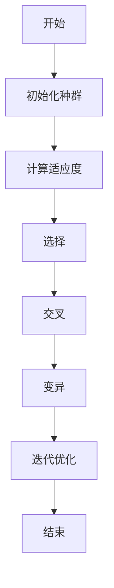

                 


# AI Agent的多目标优化决策系统

> 关键词：AI Agent，多目标优化，决策系统，智能优化，优化算法

> 摘要：本文详细探讨了AI Agent在多目标优化决策系统中的应用，从核心概念、算法原理到系统架构，结合实际案例，全面解析多目标优化在AI Agent中的重要性及其实现方法。文章通过理论与实践相结合的方式，为读者提供了一个系统化、深入的技术视角。

---

# 第一部分: 背景介绍

## 第1章: AI Agent与多目标优化决策系统概述

### 1.1 AI Agent的基本概念

#### 1.1.1 AI Agent的定义与特点
AI Agent（人工智能代理）是指能够感知环境、自主决策并采取行动以实现目标的智能实体。AI Agent可以是软件程序、机器人或其他智能系统，其核心能力包括感知、推理、规划和执行。

**AI Agent的特点：**
1. **自主性**：能够在没有外部干预的情况下独立运作。
2. **反应性**：能够实时感知环境并做出反应。
3. **目标导向**：基于目标驱动行为。
4. **学习能力**：能够通过经验改进性能。

#### 1.1.2 多目标优化的基本概念
多目标优化（Multi-objective Optimization，MOO）是指在多个相互冲突的目标之间找到最优解的过程。与单目标优化不同，多目标优化需要在多个目标之间进行权衡，找到一个最优的Pareto前沿解集。

**多目标优化的特点：**
1. **冲突目标**：多个目标之间可能存在不可调和的冲突。
2. **Pareto最优解**：在Pareto前沿上的解无法在不损害某个目标的情况下进一步优化另一个目标。
3. **权重分配**：需要明确目标之间的权重或优先级。

#### 1.1.3 AI Agent在多目标优化中的作用
AI Agent通过多目标优化技术，能够在复杂环境中找到最优或近似最优的决策方案，从而实现高效、智能的行动。例如，在自动驾驶中，AI Agent需要同时优化安全性、舒适性和能耗等多个目标。

### 1.2 多目标优化决策系统的背景与应用

#### 1.2.1 多目标优化的背景
随着人工智能技术的快速发展，AI Agent的应用场景越来越广泛，例如自动驾驶、机器人控制、推荐系统、金融投资等领域。然而，这些应用场景通常涉及多个目标的优化，例如自动驾驶需要同时优化安全性、舒适性和能耗，这些目标之间可能存在冲突。

#### 1.2.2 多目标优化在AI Agent中的应用
1. **自动驾驶**：优化安全性、舒适性和能耗。
2. **机器人控制**：优化任务效率、路径长度和能耗。
3. **推荐系统**：优化用户满意度、推荐准确性和系统效率。

#### 1.2.3 多目标优化的挑战与机遇
多目标优化的挑战在于如何在多个目标之间找到平衡点，同时需要处理复杂的约束条件。然而，这也是其机遇所在，因为多目标优化能够为AI Agent提供更灵活和强大的决策能力。

### 1.3 本章小结
本章介绍了AI Agent和多目标优化的基本概念，并探讨了多目标优化在AI Agent中的作用及其应用背景。通过本章，读者可以理解多目标优化在AI Agent决策系统中的重要性。

---

# 第二部分: 多目标优化的核心概念与联系

## 第2章: 多目标优化的核心概念

### 2.1 多目标优化的基本原理

#### 2.1.1 目标函数的定义
目标函数是多目标优化的核心，它描述了AI Agent需要优化的目标。例如，在自动驾驶中，目标函数可能包括安全性、舒适性和能耗。

#### 2.1.2 约束条件的处理
多目标优化问题通常涉及多个约束条件，例如时间限制、资源限制等。这些约束条件需要在优化过程中被考虑。

#### 2.1.3 Pareto最优解的概念
Pareto最优解是指在给定约束条件下，无法在不损害某个目标的情况下进一步优化另一个目标的解。Pareto前沿是所有Pareto最优解的集合。

### 2.2 多目标优化与单目标优化的对比

#### 2.2.1 目标函数的对比
单目标优化只有一个目标函数，而多目标优化有多个目标函数。

#### 2.2.2 解空间的对比
单目标优化的解空间是一维的，而多目标优化的解空间是多维的。

#### 2.2.3 优化策略的对比
单目标优化通常使用梯度下降等方法，而多目标优化需要使用专门的算法，例如遗传算法和粒子群优化。

### 2.3 多目标优化的数学模型

#### 2.3.1 多目标优化的数学表达
多目标优化问题可以表示为：
$$
\min_{x} f_1(x), f_2(x), \dots, f_n(x)
$$
$$
\text{subject to } g_1(x) \geq 0, g_2(x) \geq 0, \dots, g_m(x) \geq 0
$$

#### 2.3.2 Pareto前沿的定义
Pareto前沿是指在多目标优化问题中，无法在不损害某个目标的情况下进一步优化另一个目标的解集。

#### 2.3.3 目标权重的分配
目标权重的分配是多目标优化中的一个重要问题，通常需要根据具体应用场景来确定。

### 2.4 本章小结
本章详细讲解了多目标优化的核心概念，包括目标函数、Pareto最优解和数学模型。通过本章，读者可以理解多目标优化的基本原理及其与单目标优化的区别。

---

## 第3章: 多目标优化与AI Agent的联系

### 3.1 AI Agent的决策过程

#### 3.1.1 问题建模
AI Agent需要将实际问题转化为数学模型，例如将自动驾驶的安全性、舒适性和能耗转化为目标函数。

#### 3.1.2 目标函数的构建
根据问题需求，构建多个目标函数，例如：
$$
f_1(x) = \text{安全性}, \quad f_2(x) = \text{舒适性}, \quad f_3(x) = \text{能耗}
$$

#### 3.1.3 决策空间的定义
AI Agent的决策空间是指所有可能的决策方案，例如自动驾驶的车速、加速度等。

### 3.2 多目标优化在AI Agent中的应用

#### 3.2.1 多目标优化在路径规划中的应用
AI Agent需要在路径规划中优化多个目标，例如路径长度、能耗和安全性。

#### 3.2.2 多目标优化在资源分配中的应用
AI Agent需要在资源分配中优化多个目标，例如资源利用率、成本和时间。

#### 3.2.3 多目标优化在博弈论中的应用
AI Agent在博弈论中需要优化多个目标，例如收益、风险和公平性。

### 3.3 本章小结
本章探讨了多目标优化在AI Agent中的应用，包括路径规划、资源分配和博弈论等领域。通过本章，读者可以理解多目标优化在AI Agent中的重要性。

---

# 第三部分: 多目标优化算法原理

## 第4章: 常见的多目标优化算法

### 4.1 遗传算法（GA）

#### 4.1.1 遗传算法的基本原理
遗传算法是一种模拟自然进化过程的优化算法，主要包括选择、交叉和变异三个步骤。

#### 4.1.2 遗传算法在多目标优化中的应用
遗传算法可以用于解决多目标优化问题，例如在自动驾驶中优化安全性、舒适性和能耗。

#### 4.1.3 遗传算法的优缺点
遗传算法的优点是全局搜索能力强，缺点是收敛速度较慢。

#### 4.1.4 遗传算法的数学模型
遗传算法的数学模型可以表示为：
$$
f(x) = (f_1(x), f_2(x), \dots, f_n(x))
$$

#### 4.1.5 遗传算法的代码实现
```python
import random

def fitness(x):
    # 定义目标函数
    return sum(x), max(x)

def mutate(x):
    # 变异操作
    idx = random.randint(0, len(x)-1)
    x[idx] = random.random()
    return x

def crossover(x1, x2):
    # 交叉操作
    idx = random.randint(0, len(x1)-1)
    return x1[:idx] + x2[idx:], x2[:idx] + x1[idx:]

# 初始化种群
population = [[random.random() for _ in range(5)] for _ in range(10)]

# 迭代优化
for _ in range(100):
    # 计算适应度
    fitnesses = [fitness(x) for x in population]
    # 选择
    selected = [x for x, fit in zip(population, fitnesses) if fit[0] < 0.5 and fit[1] < 0.5]
    # 交叉和变异
    new_population = []
    while len(new_population) < len(population):
        x1 = random.choice(selected)
        x2 = random.choice(selected)
        x3, x4 = crossover(x1, x2)
        new_population.append(mutate(x3))
        new_population.append(mutate(x4))
    population = new_population
```

#### 4.1.6 遗传算法的流程图


### 4.2 粒子群优化算法（PSO）

#### 4.2.1 粒子群优化算法的基本原理
粒子群优化算法是一种基于群体智能的优化算法，主要包括位置更新和速度更新两个步骤。

#### 4.2.2 粒子群优化算法在多目标优化中的应用
粒子群优化算法可以用于解决多目标优化问题，例如在机器人控制中优化任务效率、路径长度和能耗。

#### 4.2.3 粒子群优化算法的优缺点
粒子群优化算法的优点是收敛速度快，缺点是容易陷入局部最优。

#### 4.2.4 粒子群优化算法的数学模型
粒子群优化算法的数学模型可以表示为：
$$
v_i = v_i + \text{学习因子} \times (p_i - x_i)
$$
$$
x_i = x_i + v_i
$$

#### 4.2.5 粒子群优化算法的代码实现
```python
import random

def fitness(x):
    # 定义目标函数
    return sum(x), max(x)

def pso_optimizer(n_p

