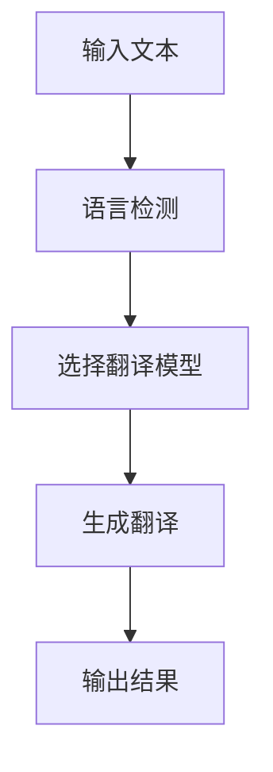
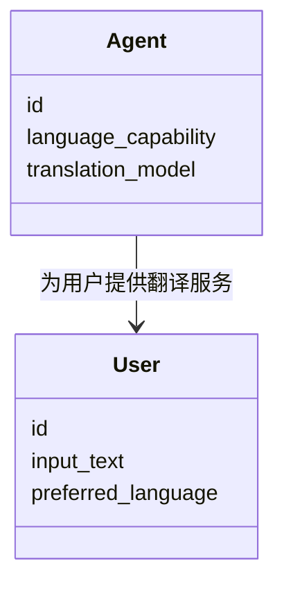
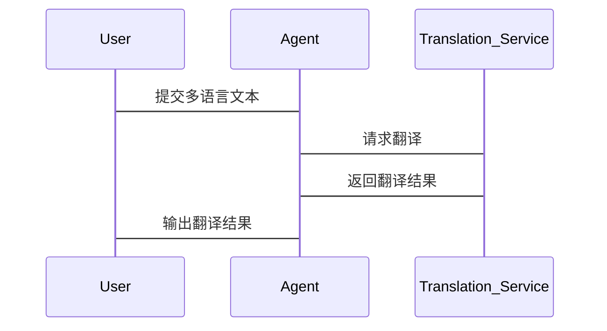

                 


# AI Agent的多语言翻译能力：突破语言障碍

> 关键词：AI Agent, 多语言翻译, 自然语言处理, 机器学习, 语言障碍

> 摘要：本文探讨AI Agent如何通过多语言翻译能力突破语言障碍。从核心概念、算法原理、系统设计到项目实战，全面解析AI Agent实现多语言翻译的关键技术与应用场景。

---

# 正文

---

## 第一部分: AI Agent与多语言翻译能力的背景介绍

### 第1章: AI Agent与多语言翻译能力的背景介绍

#### 1.1 问题背景与描述

##### 1.1.1 语言障碍在人机交互中的问题
语言障碍是人机交互中的主要挑战之一。不同语言的用户无法有效与AI系统交流，限制了AI Agent的应用范围。例如，非英语用户在使用英语设计的系统时会遇到理解困难。

##### 1.1.2 AI Agent在跨语言交流中的重要性
AI Agent需要理解并生成多种语言，以支持全球用户。通过多语言翻译能力，AI Agent能够与不同语言背景的用户有效互动。

##### 1.1.3 当前多语言翻译技术的局限性
现有翻译技术在准确性、实时性和多语言支持方面存在不足，难以满足复杂场景的需求。

#### 1.2 问题解决与边界

##### 1.2.1 AI Agent多语言翻译的核心目标
实现跨语言理解和生成，支持多种语言的实时翻译和交互。

##### 1.2.2 技术实现的边界与外延
限定于文本翻译，不涉及语音或图像翻译。主要支持常见语言，后续可扩展支持更多语言。

##### 1.2.3 核心概念与组成要素
- 输入：多语言文本输入
- 输出：目标语言翻译输出
- 核心技术：NLP模型、机器学习算法

#### 1.3 本章小结
本章介绍了语言障碍对人机交互的影响，阐述了AI Agent多语言翻译的重要性，并明确了实现目标和边界条件。

---

### 第2章: AI Agent与多语言翻译的核心概念

#### 2.1 核心概念原理

##### 2.1.1 AI Agent的基本定义
AI Agent是具备感知、决策和行动能力的智能体，能够与用户进行交互。

##### 2.1.2 多语言翻译能力的实现机制
通过NLP模型和机器学习算法，AI Agent能够理解输入文本并生成目标语言的翻译。

##### 2.1.3 两者结合的逻辑关系
AI Agent通过多语言翻译能力实现跨语言交互，提升用户体验。

#### 2.2 核心概念属性特征对比

| 特性         | AI Agent                     | 多语言翻译能力                  |
|--------------|------------------------------|----------------------------------|
| 输入          | 多语言文本                   | 单一语言文本                   |
| 输出          | 多语言翻译结果               | 目标语言翻译结果               |
| 核心技术      | NLP模型、机器学习算法        | 翻译模型、语言模型             |

#### 2.3 ER实体关系图

```mermaid
er
actor(Agent, User)
agent {
  id
  language_capability
  translation_model
}
user {
  id
  input_text
  preferred_language
}
```

#### 2.4 本章小结
本章通过定义和对比，明确了AI Agent与多语言翻译能力的关系，并通过ER图展示了实体关系。

---

## 第二部分: 多语言翻译的算法原理

### 第3章: 多语言翻译的算法原理

#### 3.1 算法原理概述

##### 3.1.1 翻译模型的输入输出关系
输入：源语言文本；输出：目标语言文本。

##### 3.1.2 神经网络的基本结构
包括编码器-解码器结构，用于处理序列数据。

##### 3.1.3 模型训练的核心流程
- 数据预处理
- 模型训练
- 模型优化

#### 3.2 算法实现流程



#### 3.3 算法实现的数学模型

##### 3.3.1 翻译概率公式
$$P(y|x) = \frac{1}{Z} \exp(\text{score}(x, y))$$

##### 3.3.2 神经网络损失函数
$$\text{Loss} = -\sum_{i=1}^{n} \log P(y_i|x_i)$$

---

## 第三部分: 系统分析与架构设计

### 第4章: 系统分析与架构设计

#### 4.1 系统分析

##### 4.1.1 问题场景介绍
用户输入多语言文本，AI Agent进行翻译并返回目标语言文本。

##### 4.1.2 项目介绍
开发一个多语言翻译系统，支持多种语言的实时翻译。

#### 4.2 系统功能设计

##### 4.2.1 领域模型类图



##### 4.2.2 系统架构图

```mermaid
subgraph Frontend
    User
end
subgraph Backend
    Agent
    Translation_Service
end
User --> Agent: 请求翻译
Agent --> Translation_Service: 调用翻译服务
Translation_Service --> Agent: 返回翻译结果
```

##### 4.2.3 系统接口设计
- 输入接口：接收多语言文本
- 输出接口：返回翻译结果

#### 4.3 系统交互流程



---

## 第四部分: 项目实战

### 第5章: 项目实战

#### 5.1 环境安装

```bash
pip install transformers
pip install torch
pip install numpy
```

#### 5.2 系统核心实现

##### 5.2.1 翻译模型实现

```python
from transformers import AutoTokenizer, AutoModelForTranslation
import torch

class Translator:
    def __init__(self, model_name):
        self.tokenizer = AutoTokenizer.from_pretrained(model_name)
        self.model = AutoModelForTranslation.from_pretrained(model_name)
    
    def translate(self, source_text, target_lang):
        inputs = self.tokenizer(source_text, return_tensors="pt")
        outputs = self.model.generate(**inputs, forced_bos_token_id=self.tokenizer.get unk token, lang_id=target_lang)
        return self.tokenizer.decode(outputs[0], skip_special_tokens=True)
```

##### 5.2.2 语言检测实现

```python
import langdetect

def detect_language(text):
    return langdetect.detect_lang(text)
```

#### 5.3 代码应用解读与分析

##### 5.3.1 翻译模型实现分析
- 使用预训练模型进行翻译，支持多种语言。
- 输入文本经过分词、编码，模型生成目标语言文本。

##### 5.3.2 语言检测实现分析
- 使用语言检测库，自动识别输入文本的语言。

#### 5.4 实际案例分析

##### 5.4.1 案例一
输入：中文“你好”，目标语言：英语。
输出：Hello.

##### 5.4.2 案例二
输入：西班牙语“Hola”, 目标语言：中文。
输出：你好。

#### 5.5 项目小结
本章通过实际代码实现，展示了AI Agent多语言翻译能力的应用，并通过案例分析验证了系统的有效性。

---

## 第五部分: AI Agent多语言翻译能力的最佳实践

### 第6章: 最佳实践

#### 6.1 小结
- AI Agent通过多语言翻译能力实现了跨语言交互。
- 结合NLP技术和机器学习算法，提升了翻译准确性和效率。

#### 6.2 注意事项
- 确保翻译模型支持多种语言。
- 定期更新模型以提升翻译质量。

#### 6.3 拓展阅读
- [书籍]《神经机器翻译》
- [论文]“多语言翻译的挑战与解决方案”

---

## 作者

作者：AI天才研究院/AI Genius Institute & 禅与计算机程序设计艺术 /Zen And The Art of Computer Programming

---

以上为文章的完整目录和内容概要，您可以根据需要进一步扩展各部分的内容。

