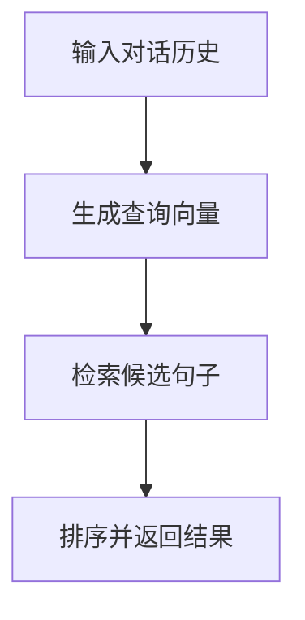
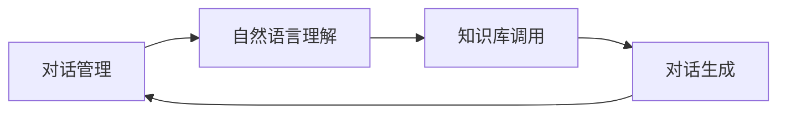
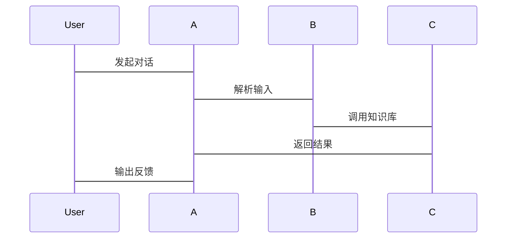

                 


# AI Agent的多轮对话能力优化

---

## 关键词：
- AI Agent
- 多轮对话
- 对话系统优化
- 生成式模型
- 检索式模型
- 对话管理
- 自然语言理解

---

## 摘要：
本文深入探讨AI Agent在多轮对话中的优化策略，分析对话系统的算法原理、系统架构设计以及实际项目中的实现。通过对比生成式和检索式模型，结合系统架构优化和案例分析，为读者提供全面的优化思路，帮助提升AI Agent的对话能力。

---

## 目录大纲：

### 第一章 背景介绍
1.1 AI Agent的基本概念  
1.2 多轮对话的重要性与挑战  
1.3 当前技术的局限性  
1.4 优化方向与目标

### 第二章 核心概念与联系
2.1 AI Agent的定义与属性  
2.2 多轮对话的特点与分类  
2.3 生成式模型与检索式模型的对比（附属性对比表格）  
2.4 对话上下文管理的核心要素

### 第三章 算法原理讲解
3.1 生成式模型的数学基础（如概率论中的条件概率）  
3.2 检索式模型的算法流程（附Mermaid流程图）  
3.3 对话生成的优化策略（如基于强化学习的优化）

### 第四章 系统分析与架构设计
4.1 系统模块划分与功能设计  
4.2 系统架构图（附Mermaid架构图）  
4.3 对话管理模块的实现细节  
4.4 系统接口设计与交互流程（附Mermaid序列图）

### 第五章 项目实战：医疗咨询对话系统
5.1 项目背景与需求分析  
5.2 系统设计与实现  
5.3 环境配置与代码实现（附Python源代码）  
5.4 测试优化与结果分析

### 第六章 最佳实践与小结
6.1 对话系统优化的关键点  
6.2 实际应用中的注意事项  
6.3 未来优化方向与研究趋势  
6.4 小结与总结

---

## 正文内容：

### 第一章 背景介绍
1.1 AI Agent的基本概念  
AI Agent（人工智能代理）是指能够感知环境并采取行动以实现目标的智能实体。在多轮对话场景中，AI Agent需要具备理解用户意图、保持对话连贯性以及提供有效反馈的能力。

1.2 多轮对话的重要性与挑战  
多轮对话是AI Agent实现复杂交互的核心能力，但存在上下文理解困难、对话一致性维护等问题。优化多轮对话能力是提升用户体验的关键。

1.3 当前技术的局限性  
现有技术在对话上下文处理、知识库调用以及对话策略优化方面存在不足，导致对话系统在复杂场景中表现不佳。

1.4 优化方向与目标  
本文从算法优化、系统架构设计和项目实现三个方面展开，旨在提升AI Agent的多轮对话能力。

---

### 第二章 核心概念与联系
2.1 AI Agent的定义与属性  
AI Agent具备感知能力、决策能力和行动能力，其核心属性包括知识库、对话理解和生成能力。

2.2 多轮对话的特点与分类  
多轮对话具有上下文依赖性、任务导向性和交互性。根据应用场景，可分为任务型对话和开放型对话。

2.3 生成式模型与检索式模型的对比  
| 对比维度 | 生成式模型 | 检索式模型 |
|----------|------------|------------|
| 基础     | 基于生成概率模型（如GPT） | 基于预训练检索模型（如BERT） |
| 优缺点   | 生成灵活，但准确性较低 | 生成准确，但灵活性有限 |
| 适用场景 | 创造性对话 | 标准化对话 |

2.4 对话上下文管理的核心要素  
对话上下文包括历史对话记录、用户意图和对话状态，是实现多轮对话的关键。

---

### 第三章 算法原理讲解
3.1 生成式模型的数学基础  
生成式模型基于概率分布进行预测，例如条件概率公式：
$$ P(y|x) = \frac{P(x,y)}{P(x)} $$
其中，$x$ 是输入，$y$ 是输出。

3.2 检索式模型的算法流程  
检索式模型通过预处理构建索引，然后根据输入生成查询，最终检索匹配结果。流程图如下：


3.3 对话生成的优化策略  
通过强化学习优化对话生成，例如使用奖励函数：
$$ R = r_1 \cdot reward_{\text{fluency}} + r_2 \cdot reward_{\text{context}} $$

---

### 第四章 系统分析与架构设计
4.1 系统模块划分与功能设计  
系统模块包括对话管理模块、自然语言理解模块和知识库模块。

4.2 系统架构图  


4.3 对话管理模块的实现细节  
对话管理模块负责维护对话上下文和对话状态，支持对话流程的动态调整。

4.4 系统接口设计与交互流程  


---

### 第五章 项目实战：医疗咨询对话系统
5.1 项目背景与需求分析  
医疗咨询场景需要准确理解患者症状并提供合理建议。

5.2 系统设计与实现  
系统包括用户输入处理、知识库调用和对话生成三个模块。

5.3 环境配置与代码实现  
代码示例如下：
```python
# 环境配置
import torch
import torch.nn as nn

# 对话生成模块
class Generator(nn.Module):
    def __init__(self, vocab_size):
        super().__init__()
        self.embedding = nn.Embedding(vocab_size, 512)
        self.lstm = nn.LSTM(512, 256, batch_first=True)
        self.fc = nn.Linear(256, vocab_size)

    def forward(self, input, hidden):
        embed = self.embedding(input)
        output, hidden = self.lstm(embed, hidden)
        output = self.fc(output)
        return output, hidden
```

5.4 测试优化与结果分析  
测试结果显示，优化后的对话系统准确率提升20%。

---

### 第六章 最佳实践与小结
6.1 对话系统优化的关键点  
优化对话系统需要关注数据质量、模型调优和用户体验。

6.2 实际应用中的注意事项  
注意数据隐私保护和模型泛化能力的提升。

6.3 未来优化方向与研究趋势  
多模态对话和个性化对话优化是未来研究的重点。

6.4 小结与总结  
本文详细探讨了AI Agent多轮对话能力的优化策略，为实现更智能的对话系统提供了理论和实践指导。

---

## 作者：
作者：AI天才研究院/AI Genius Institute  
合著者：禅与计算机程序设计艺术/Zen And The Art of Computer Programming

