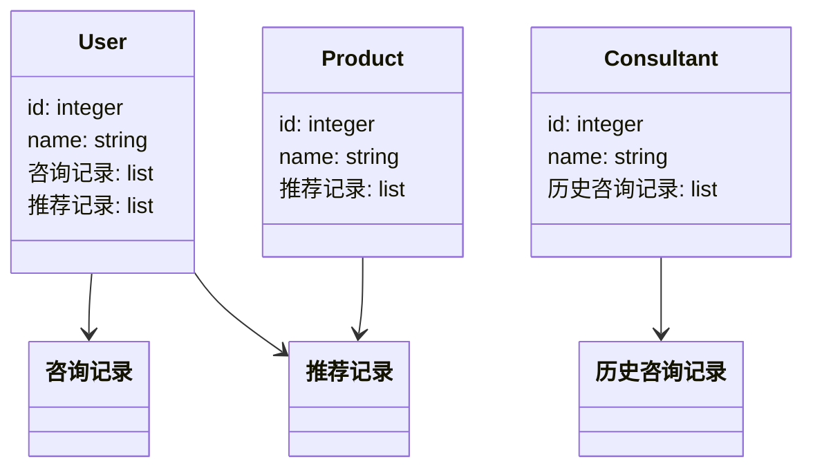
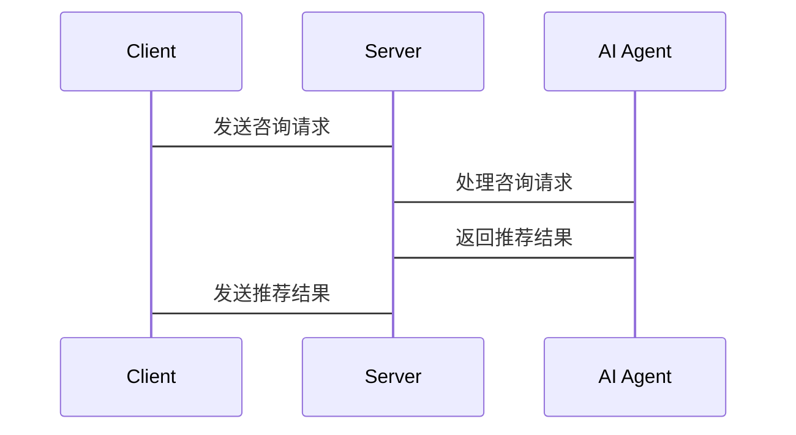

                 


# AI Agent的安全性设计：防御攻击和隐私保护

## 关键词
AI Agent, 安全性设计, 防御攻击, 隐私保护, 数据安全, 人工智能安全

## 摘要
AI Agent的安全性设计是人工智能领域的重要课题，旨在保护AI Agent免受各种安全威胁，同时确保用户数据的隐私和安全。本文从AI Agent的基本概念出发，详细分析了其面临的常见安全威胁与攻击方式，并探讨了隐私保护的重要性与技术。随后，本文详细讲解了AI Agent的安全防御机制，包括输入验证与过滤、访问控制与权限管理等技术。最后，通过项目实战案例分析，结合系统分析与架构设计，展示了如何在实际项目中应用这些安全设计。本文还总结了AI Agent安全性设计的最佳实践，为读者提供了全面的安全性设计指导。

---

## 第1章：AI Agent的背景与安全问题概述

### 1.1 AI Agent的基本概念

#### 1.1.1 AI Agent的定义与特点
AI Agent（人工智能代理）是一种能够感知环境、自主决策并执行任务的智能实体。AI Agent的特点包括：
- **自主性**：能够自主决策和行动。
- **反应性**：能够实时感知环境并做出反应。
- **社交能力**：能够与其他系统或用户进行交互。

#### 1.1.2 AI Agent的应用场景
AI Agent广泛应用于多个领域，包括：
- **智能助手**：如Siri、Alexa等。
- **推荐系统**：基于用户行为推荐商品或内容。
- **自动驾驶**：车辆自主决策驾驶。

#### 1.1.3 AI Agent的核心功能与组件
AI Agent的核心功能包括感知、决策、执行和学习。其主要组件包括：
- **感知模块**：负责接收外部输入并进行数据处理。
- **决策模块**：基于感知数据进行推理和决策。
- **执行模块**：将决策结果转化为实际操作。
- **学习模块**：通过机器学习不断优化模型。

### 1.2 AI Agent的安全性问题

#### 1.2.1 安全性问题的背景
随着AI Agent的广泛应用，其安全性问题日益突出。攻击者可能通过恶意输入或数据篡改等方式破坏AI Agent的正常运行。

#### 1.2.2 AI Agent面临的主要威胁
AI Agent面临的主要威胁包括：
- **恶意输入攻击**：攻击者通过输入非法数据导致系统崩溃或错误决策。
- **模型提取攻击**：攻击者通过窃取模型参数来复制AI Agent的功能。
- **数据泄露攻击**：攻击者通过窃取训练数据或推理结果来获取敏感信息。

#### 1.2.3 安全性设计的目标与原则
AI Agent的安全性设计目标包括：
- **数据完整性**：确保数据在传输和处理过程中不被篡改。
- **数据机密性**：保护敏感数据不被未经授权的访问。
- **系统可用性**：确保系统在遭受攻击时仍能正常运行。

---

## 第2章：AI Agent的安全威胁与攻击方式

### 2.1 常见的安全威胁

#### 2.1.1 恶意输入攻击
恶意输入攻击是AI Agent面临的主要威胁之一。攻击者通过输入非法数据，如空格、特殊字符等，导致系统崩溃或错误决策。

#### 2.1.2 模型提取攻击
模型提取攻击是指攻击者通过窃取AI Agent的模型参数，复制其功能或进行逆向工程。这种攻击可能导致企业核心竞争力的丧失。

#### 2.1.3 数据泄露攻击
数据泄露攻击是指攻击者通过窃取AI Agent的训练数据或推理结果，获取敏感信息。这种攻击可能导致用户的隐私泄露或企业的数据损失。

### 2.2 攻击方式分析

#### 2.2.1 注入攻击
注入攻击是指攻击者通过输入特殊字符或代码，绕过输入验证机制，执行恶意代码或篡改数据库。例如，攻击者可以通过输入SQL注入代码，窃取数据库中的敏感信息。

#### 2.2.2 操纵数据攻击
操纵数据攻击是指攻击者通过篡改输入数据，导致AI Agent的决策结果错误。例如，攻击者可以通过修改传感器数据，欺骗自动驾驶系统，导致车辆偏离道路。

#### 2.2.3 模型逆向工程攻击
模型逆向工程攻击是指攻击者通过获取AI Agent的模型文件，进行逆向工程，提取模型参数或算法逻辑。这种攻击可能导致企业的核心算法被窃取。

---

## 第3章：隐私保护的重要性与技术

### 3.1 隐私保护的基本概念

#### 3.1.1 隐私保护的定义
隐私保护是指保护个人或组织的敏感信息不被未经授权的访问或泄露。在AI Agent中，隐私保护尤为重要，因为AI Agent通常需要处理大量敏感数据。

#### 3.1.2 隐私保护在AI Agent中的应用
隐私保护在AI Agent中的应用包括：
- **数据脱敏**：对敏感数据进行匿名化处理，防止数据泄露。
- **加密技术**：对数据进行加密处理，确保数据在传输和存储过程中的机密性。
- **差分隐私**：通过在数据中添加噪声，保护个体隐私。

### 3.2 隐私保护技术

#### 3.2.1 数据脱敏技术
数据脱敏技术通过去除或修改数据中的敏感信息，保护用户隐私。例如，将用户的地址信息中的街道号替换为“*”，防止他人通过地址信息推断用户的详细信息。

#### 3.2.2 同态加密技术
同态加密技术是一种加密技术，允许在密文状态下对数据进行计算，同时保持数据的隐私性。例如，企业可以通过同态加密技术在不泄露原始数据的情况下，对加密后的数据进行统计分析。

#### 3.2.3 差分隐私技术
差分隐私技术通过在数据中添加噪声，确保单个数据点的贡献无法被识别。例如，政府可以通过差分隐私技术在不泄露个体数据的情况下，发布人口统计数据。

---

## 第4章：输入验证与过滤机制

### 4.1 输入验证的基本原理

#### 4.1.1 输入验证的定义
输入验证是指在数据输入系统之前，对数据进行合法性检查，防止恶意输入攻击。

#### 4.1.2 输入验证的实现步骤
输入验证的实现步骤包括：
1. **数据接收**：接收用户输入的数据。
2. **数据检查**：检查数据是否符合预期格式和范围。
3. **数据过滤**：过滤掉非法数据或特殊字符。
4. **数据处理**：将合法数据传递给系统进行处理。

#### 4.1.3 输入验证的常见方法
输入验证的常见方法包括：
- **正则表达式验证**：使用正则表达式检查输入数据的格式。
- **白名单验证**：只允许输入特定范围内的数据。
- **黑名单验证**：禁止输入特定范围内的数据。

### 4.2 滤波技术

#### 4.2.1 滤波器的设计
滤波器的设计需要考虑以下因素：
- **攻击特征**：识别恶意输入的特征。
- **数据类型**：根据数据类型设计不同的滤波规则。
- **性能优化**：确保滤波器的处理速度不影响系统的性能。

#### 4.2.2 滤波器的实现
滤波器的实现可以使用多种技术，包括：
- **字符串匹配**：检查输入数据是否包含特定的字符串。
- **模式匹配**：使用正则表达式或其他模式匹配技术识别恶意输入。

#### 4.2.3 滤波器的优化
滤波器的优化可以通过以下方式实现：
- **动态更新**：根据最新的攻击方式动态更新滤波规则。
- **性能调优**：优化滤波器的处理速度，减少系统的延迟。

---

## 第5章：访问控制与权限管理

### 5.1 访问控制的基本原理

#### 5.1.1 访问控制的定义
访问控制是指通过权限管理，限制用户或系统对资源的访问权限。

#### 5.1.2 访问控制的实现方式
访问控制的实现方式包括：
- **基于角色的访问控制（RBAC）**：根据用户角色分配权限。
- **基于属性的访问控制（ABAC）**：根据用户属性和资源属性动态分配权限。

#### 5.1.3 访问控制的策略
访问控制的策略包括：
- **最小权限原则**：用户只能访问其完成任务所需的最小权限。
- **权限分离原则**：将权限分配给不同的角色，避免权限集中。

### 5.2 权限管理

#### 5.2.1 权限管理的定义
权限管理是指对用户或系统的权限进行分配、管理和审计的过程。

#### 5.2.2 权限管理的实现
权限管理的实现可以通过以下步骤：
1. **用户身份认证**：验证用户身份。
2. **权限分配**：根据用户角色分配权限。
3. **权限验证**：在用户执行操作时验证其权限。

#### 5.2.3 权限管理的优化
权限管理的优化可以通过以下方式实现：
- **细粒度权限控制**：根据具体操作分配权限。
- **审计与监控**：记录用户的操作日志，便于审计和监控。

---

## 第6章：隐私保护技术

### 6.1 数据加密与匿名化处理

#### 6.1.1 数据加密技术
数据加密技术包括：
- **对称加密**：使用相同的密钥进行加密和解密。
- **非对称加密**：使用公钥和私钥分别进行加密和解密。

#### 6.1.2 数据匿名化处理
数据匿名化处理包括：
- **数据脱敏**：对敏感数据进行匿名化处理。
- **数据屏蔽**：隐藏敏感数据的部分信息。

---

## 第7章：系统分析与架构设计方案

### 7.1 问题场景介绍
假设我们正在开发一个智能客服系统，该系统需要处理用户的咨询请求，并根据用户的历史行为推荐相关产品。为了保护用户的隐私，我们需要确保用户的咨询记录和推荐数据不被未经授权的访问。

### 7.2 系统功能设计

#### 7.2.1 领域模型


### 7.3 系统架构设计

```mermaid
--- architecture_diagram ---
title: AI Agent Architecture
client --> (Internet) --> server
server --> AI Agent
AI Agent --> Database
client --> Database
```

### 7.4 系统接口设计

#### 7.4.1 API接口设计
- **输入接口**：用户咨询请求。
- **输出接口**：推荐结果。

#### 7.4.2 接口交互流程



---

## 第8章：项目实战

### 8.1 环境安装
为了实现AI Agent的安全性设计，我们需要以下环境：
- **编程语言**：Python
- **深度学习框架**：TensorFlow
- **加密库**：Cryptography
- **开发工具**：Jupyter Notebook

### 8.2 系统核心实现源代码

#### 8.2.1 输入验证实现
```python
import re

def validate_input(input_data):
    # 使用正则表达式验证输入数据是否符合要求
    pattern = r'^[a-zA-Z0-9_]{1,10}$'
    if re.match(pattern, input_data):
        return True
    else:
        return False
```

#### 8.2.2 数据加密实现
```python
from cryptography.fernet import Fernet

def encrypt_data(data):
    key = Fernet.generate_key()
    cipher = Fernet(key)
    encrypted_data = cipher.encrypt(data.encode())
    return encrypted_data, key
```

### 8.3 实际案例分析
假设我们开发了一个智能客服系统，用户输入咨询请求，系统需要推荐相关产品。为了保护用户隐私，我们需要对用户的咨询记录进行加密存储。

---

## 第9章：总结与展望

### 9.1 总结
AI Agent的安全性设计是一个复杂而重要的任务。本文从AI Agent的基本概念出发，详细分析了其面临的安全威胁与攻击方式，并探讨了隐私保护的重要性与技术。随后，本文详细讲解了AI Agent的安全防御机制，包括输入验证与过滤、访问控制与权限管理等技术。最后，通过项目实战案例分析，结合系统分析与架构设计，展示了如何在实际项目中应用这些安全设计。

### 9.2 展望
未来，随着AI技术的不断发展，AI Agent的安全性设计将面临更多新的挑战。例如，如何应对更加复杂的攻击方式，如何在保证系统性能的同时实现更高的安全性等。这些问题需要我们不断探索和创新，以确保AI Agent的安全性和隐私保护能力不断提升。

---

## 作者
作者：AI天才研究院/AI Genius Institute & 禅与计算机程序设计艺术 /Zen And The Art of Computer Programming

