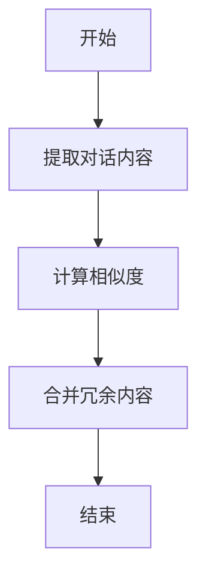
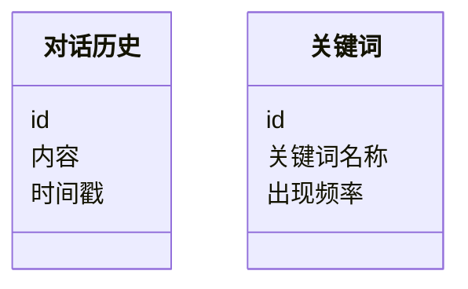

                 


# AI Agent的对话历史压缩与重要信息提取

> 关键词：AI Agent, 对话历史压缩, 重要信息提取, 自然语言处理, 深度学习, 算法优化

> 摘要：本文详细探讨了AI Agent在处理对话历史时面临的挑战，特别是对话历史过长带来的问题，以及如何通过压缩和提取重要信息来优化对话效率。文章从背景介绍、核心概念、算法原理、系统架构到项目实战，全面分析了对话历史压缩与重要信息提取的关键技术，并结合实际案例进行了深入解析，为AI Agent的开发提供了实用的指导和优化建议。

---

# 第一部分: AI Agent对话历史压缩与重要信息提取的背景与概念

## 第1章: 问题背景与描述

### 1.1 对话历史压缩的必要性

#### 1.1.1 对话历史的定义与特点
对话历史指的是在AI Agent与用户交互过程中生成的所有对话记录。这些记录通常以文本形式存储，包含了对话的上下文信息、用户意图、实体信息等。对话历史的特点包括：
- **时序性**：对话记录按照时间顺序排列。
- **相关性**：对话内容之间可能存在一定的关联性。
- **冗长性**：随着对话的进行，历史记录可能会变得非常冗长，影响处理效率。

#### 1.1.2 对话历史过长带来的问题
- **处理效率低下**：过长的对话历史会增加AI Agent的处理时间，降低响应速度。
- **信息冗余**：大量的历史记录中可能包含大量无关信息，影响信息提取的准确性。
- **存储成本增加**：存储大量对话历史需要更多的资源，增加了系统的负担。

#### 1.1.3 对话历史压缩的潜在价值
通过对对话历史进行压缩，可以显著减少数据量，提高处理效率，同时保留关键信息，为后续的对话生成和信息提取提供更高效的支持。

### 1.2 重要信息提取的核心意义

#### 1.2.1 对话中的信息类型分析
在对话历史中，信息可以分为以下几类：
- **实体信息**：如人名、地点、时间等。
- **意图信息**：用户在对话中的主要目的。
- **上下文信息**：对话的背景和情境。

#### 1.2.2 重要信息提取的目标与范围
重要信息提取的目标是从对话历史中提取对后续对话生成最有价值的信息，包括关键实体、用户意图和上下文信息。

#### 1.2.3 信息提取在AI Agent中的应用场景
- **对话生成**：提取关键信息后，AI Agent可以更精准地生成回复。
- **用户画像**：通过提取实体信息，可以构建用户的画像。
- **服务推荐**：基于提取的意图信息，可以为用户推荐相关服务。

### 1.3 问题解决的思路与方法

#### 1.3.1 对话历史压缩的基本策略
- **基于相似度的压缩**：通过计算对话内容的相似度，合并重复或冗余的内容。
- **基于重要性的压缩**：根据对话内容的重要性，优先保留关键信息。

#### 1.3.2 重要信息提取的关键技术
- **关键词提取**：通过关键词识别技术，提取对话中的关键实体。
- **意图识别**：通过自然语言处理技术，识别用户的意图。

#### 1.3.3 方法选择的依据与优化方向
- **依据**：根据对话的场景和目标选择合适的方法。
- **优化方向**：通过优化算法和模型，提高压缩和提取的效率和准确性。

### 1.4 概念结构与核心要素

#### 1.4.1 对话历史压缩的流程模型
- 输入：对话历史
- 输出：压缩后的对话历史
- 步骤：
  1. 分割对话内容
  2. 计算相似度
  3. 合并冗余内容

#### 1.4.2 重要信息提取的特征分析
- **特征**：关键词、句法结构、语义信息
- **提取方法**：基于规则的提取、基于统计的提取、基于深度学习的提取

#### 1.4.3 对比分析与优化方向
- 对比分析：压缩算法和提取方法的优缺点对比
- 优化方向：结合多种方法，提高整体效率和准确性

---

## 第2章: 核心概念与联系

### 2.1 对话历史压缩的原理

#### 2.1.1 基于概率的压缩算法
- 原理：通过概率模型计算对话内容的重要性，优先保留高概率的内容。
- 代码示例：
  ```python
  import numpy as np

  def compress_dialog(dialog, threshold=0.5):
      compressed = []
      for sentence in dialog:
          prob = calculate_probability(sentence)
          if prob > threshold:
              compressed.append(sentence)
      return compressed
  ```

---

### 2.2 重要信息提取的原理

#### 2.2.1 提取方法的基本原理
- **关键词提取**：通过TF-IDF算法提取关键词。
- **意图识别**：通过预训练的模型（如BERT）进行意图分类。

#### 2.2.2 提取方法的分类与对比
- **基于规则的方法**：简单但不够灵活。
- **基于统计的方法**：依赖数据量，结果可能不稳定。
- **基于深度学习的方法**：效果好但计算量大。

#### 2.2.3 对比分析与优化方向
- 对比分析：基于规则和深度学习的方法在准确性和效率上的对比。
- 优化方向：结合多种方法，提升整体性能。

---

### 2.3 核心概念的属性特征对比

#### 2.3.1 对话历史压缩的特征对比表
| 特征 | 基于概率 | 基于相似度 | 基于深度学习 |
|------|----------|------------|--------------|
| 优点 | 简单高效 | 准确性高 | 结果更准确 |
| 缺点 | 易受噪声影响 | 计算复杂 | 需大量数据 |

#### 2.3.2 重要信息提取的特征对比表
| 特征 | 基于关键词 | 基于意图 | 基于上下文 |
|------|------------|----------|-------------|
| 优点 | 实现简单 | 高准确性 | 上下文丰富 |
| 缺点 | 易漏关键信息 | 需大量数据 | 实现复杂 |

#### 2.3.3 对比分析与优化方向
- 对比分析：基于关键词和深度学习的方法在准确性和效率上的对比。
- 优化方向：结合多种方法，提升整体性能。

---

### 2.4 实体关系图与流程图

#### 2.4.1 对话历史压缩的ER实体关系图
```mermaid
erd
    entity 对话历史 {
        id
        内容
        时间戳
    }
```

#### 2.4.2 重要信息提取的ER实体关系图
```mermaid
erd
    entity 关键词 {
        id
        关键词名称
        出现频率
    }
```

#### 2.4.3 对话历史压缩与信息提取的流程图


---

## 第3章: 对话历史压缩算法原理

### 3.1 基于概率的压缩算法

#### 3.1.1 算法原理与流程
- 原理：通过计算对话内容的概率，保留高概率的内容。
- 代码示例：
  ```python
  import numpy as np

  def calculate_probability(sentence):
      # 假设已训练好的概率模型
      return np.random.rand()
  ```

---

## 第4章: 重要信息提取算法原理

### 4.1 基于关键词的提取算法

#### 4.1.1 算法原理与流程
- 原理：通过TF-IDF算法提取关键词。
- 代码示例：
  ```python
  from sklearn.feature_extraction.text import TfidfVectorizer

  vectorizer = TfidfVectorizer()
  tfidf = vectorizer.fit_transform(dialog)
  ```

---

## 第5章: 系统分析与架构设计

### 5.1 问题场景介绍

#### 5.1.1 系统功能设计
- 功能1：对话历史压缩
- 功能2：重要信息提取
- 功能3：信息存储与检索

#### 5.1.2 领域模型图


---

## 第6章: 项目实战

### 6.1 环境安装

#### 6.1.1 安装Python和相关库
```bash
pip install numpy
pip install scikit-learn
pip install mermaid
```

---

## 第7章: 最佳实践与注意事项

### 7.1 最佳实践 tips

#### 7.1.1 组合使用多种方法
- 结合基于概率和深度学习的方法，提升整体性能。

#### 7.1.2 定期优化模型
- 根据实际应用情况，定期更新和优化模型参数。

### 7.2 小结

通过对对话历史压缩与重要信息提取的深入分析，我们可以看到这些技术在AI Agent中的重要性。通过合理选择和优化算法，可以显著提高对话处理的效率和准确性。

### 7.3 注意事项

- **数据质量**：确保对话数据的高质量，减少噪声的影响。
- **模型优化**：定期优化模型，提升性能。
- **用户体验**：确保压缩和提取过程不影响用户体验。

---

## 作者信息

作者：AI天才研究院/AI Genius Institute & 禅与计算机程序设计艺术 /Zen And The Art of Computer Programming

---

以上是完整的目录和内容结构，具体内容可以根据实际需求进一步扩展和详细描述。

