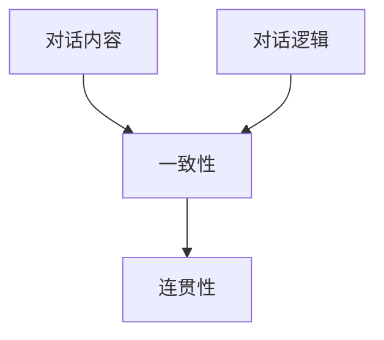
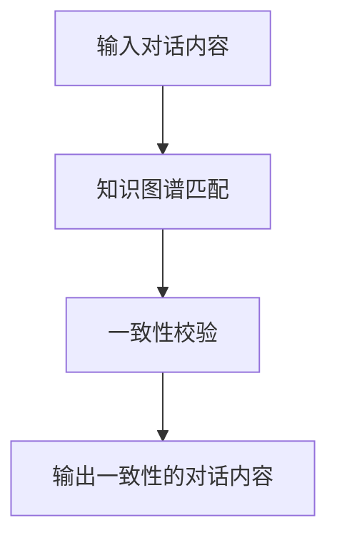
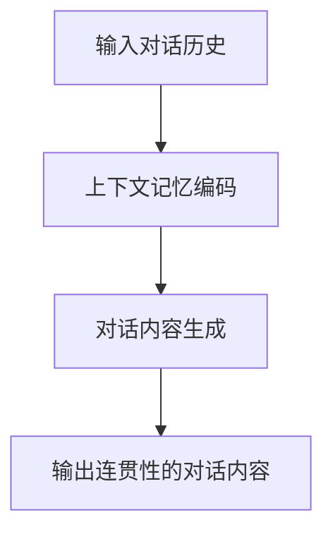
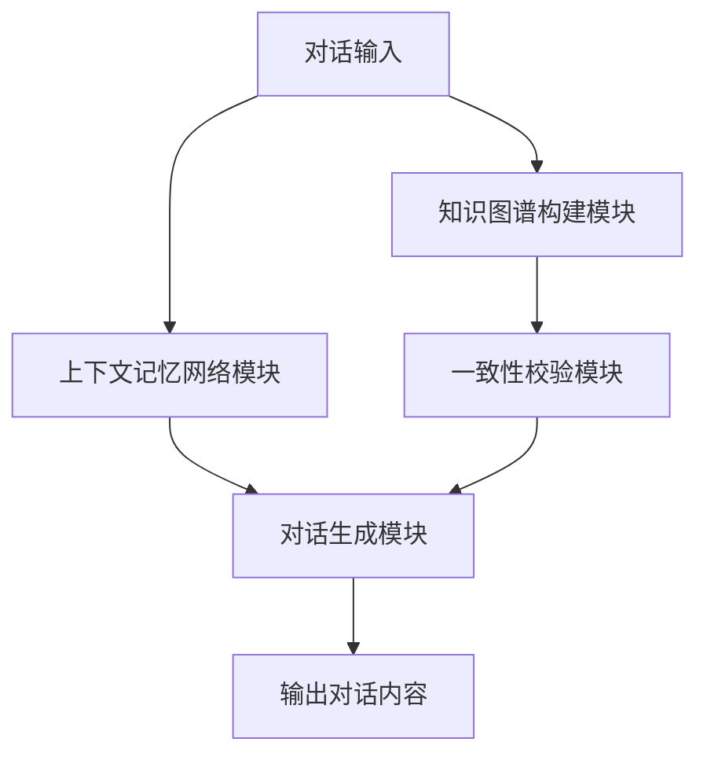
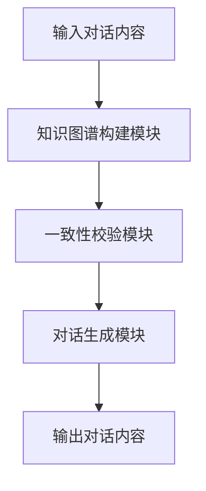

                 


# AI Agent的对话生成一致性与连贯性优化

> 关键词：AI Agent，对话生成，一致性，连贯性，自然语言处理，机器学习

> 摘要：本文详细探讨了AI Agent在对话生成过程中的一致性和连贯性优化问题，分析了当前技术的不足，并提出了一种基于知识图谱和上下文记忆的优化方法。通过算法原理、系统架构和项目实战的详细讲解，为读者提供了一套完整的解决方案。

---

# 第一部分：背景介绍

## 第1章：问题背景

### 1.1 对话生成中的问题与挑战
在AI Agent的对话生成任务中，生成的对话需要具备以下特点：
- **一致性**：对话内容在主题、事实和逻辑上保持一致。
- **连贯性**：对话的上下文衔接自然，逻辑流畅。

然而，当前的对话生成技术在以下方面存在不足：
- **一致性问题**：生成的对话可能在上下文中出现矛盾或不一致的情况。
- **连贯性问题**：对话的逻辑衔接不够自然，导致用户体验较差。
- **领域适应性**：在特定领域（如医疗、法律）中的对话生成需要更高的准确性和专业性。

### 1.2 问题描述
- **一致性问题**：对话内容在不同轮次之间缺乏统一性，可能导致逻辑矛盾。
- **连贯性问题**：对话的上下文记忆不足，导致逻辑跳跃或不连贯。
- **解决方案**：通过引入知识图谱和上下文记忆机制，提升对话生成的一致性和连贯性。

### 1.3 问题解决方法概述
本文提出了一种基于知识图谱和上下文记忆的对话生成优化方法，具体包括：
- **知识图谱构建**：构建领域知识图谱，用于对话内容的一致性校验。
- **上下文记忆网络**：通过记忆网络记录对话历史，提升对话的连贯性。

### 1.4 一致性与连贯性的边界与外延
- **一致性定义的边界**：对话内容在主题、事实和逻辑上的统一性。
- **连贯性定义的边界**：对话逻辑的延续性和自然流畅性。
- **一致性与连贯性的外延**：一致性关注内容的统一性，连贯性关注逻辑的延续性。

### 1.5 概念结构与核心要素组成
- **一致性**：基于知识图谱的对话内容校验。
- **连贯性**：基于记忆网络的对话逻辑延续。
- **核心要素**：知识图谱、上下文记忆、对话生成模型。

---

# 第二部分：核心概念与联系

## 第2章：一致性与连贯性的核心原理

### 2.1 一致性原理
一致性是指对话内容在主题、事实和逻辑上的统一性。实现一致性需要：
- **知识图谱**：构建领域知识图谱，用于对话内容的校验。
- **一致性校验**：通过知识图谱对生成的对话内容进行一致性检查。

### 2.2 连贯性原理
连贯性是指对话逻辑的延续性和自然流畅性。实现连贯性需要：
- **上下文记忆网络**：记录对话历史，捕捉上下文信息。
- **连贯性优化**：基于上下文记忆，生成连贯的对话内容。

### 2.3 一致性与连贯性的关系
- **一致性是连贯性的基础**：只有在内容一致的基础上，才能实现逻辑的连贯性。
- **连贯性是一致性的重要表现**：连贯性优化可以进一步提升对话的一致性。

---

## 第3章：一致性与连贯性的对比分析

### 3.1 概念属性对比表
```markdown
| 属性       | 一致性         | 连贯性         |
|------------|----------------|----------------|
| 定义       | 对话内容的统一性 | 对话逻辑的延续性 |
| 关键因素   | 上下文一致       | 逻辑连贯       |
| 实现方法   | 基于知识库       | 基于上下文记忆   |
```

### 3.2 ER实体关系图


---

# 第三部分：算法原理讲解

## 第4章：一致性优化算法

### 4.1 基于知识图谱的一致性优化
#### 4.1.1 知识图谱构建
- 使用领域知识构建知识图谱，例如医疗领域的疾病-症状-治疗方法的关系图谱。
- 知识图谱构建流程：
  1. 数据收集：从领域文本中提取实体和关系。
  2. 数据清洗：去除噪声数据，构建干净的知识图谱。
  3. 知识融合：将多个数据源的知识图谱进行融合。

#### 4.1.2 一致性校验
- 对话生成模型生成对话内容后，通过知识图谱进行一致性校验。
- 算法流程：
  1. 对话内容解析：将生成的对话内容分解为实体和关系。
  2. 知识图谱匹配：将对话内容与知识图谱进行匹配，判断是否存在逻辑矛盾。

#### 4.1.3 实例分析
- 对话内容：患者：我最近总是头晕，可能是什么问题？
- 知识图谱匹配：头晕可能与高血压、贫血等疾病相关。
- 一致性校验：生成的对话内容是否与知识图谱一致。

## 第4.2 基于上下文记忆的连贯性优化
### 4.2.1 上下文记忆网络
- 上下文记忆网络用于记录对话历史，捕捉上下文信息。
- 网络结构：
  - 输入层：对话历史和当前输入。
  - 记忆层：通过LSTM或Transformer编码对话历史。
  - 输出层：生成连贯的对话内容。

### 4.2.2 优化算法
- 对话生成模型通过上下文记忆网络生成连贯的对话内容。
- 算法流程：
  1. 对话历史编码：通过LSTM将对话历史编码为向量。
  2. 对话内容生成：基于编码向量生成连贯的对话内容。
  3. 连贯性校验：通过BLEU或ROUGE等指标评估连贯性。

### 4.3 对比学习方法
- 对比学习通过对比对话内容与知识图谱的相似性，优化对话生成的一致性和连贯性。
- 对比学习流程：
  1. 对话内容表示：将对话内容表示为向量。
  2. 知识图谱表示：将知识图谱中的实体和关系表示为向量。
  3. 对比损失计算：通过对比学习优化对话内容与知识图谱的相似性。

---

## 第5章：算法流程图

### 5.1 一致性优化算法流程图


### 5.2 连贯性优化算法流程图


---

# 第四部分：系统分析与架构设计

## 第6章：系统功能设计

### 6.1 系统功能模块
- **知识图谱构建模块**：构建领域知识图谱。
- **一致性校验模块**：对对话内容进行一致性校验。
- **上下文记忆网络模块**：记录对话历史，生成连贯的对话内容。
- **对话生成模块**：基于知识图谱和上下文记忆生成对话内容。

### 6.2 系统架构设计


### 6.3 系统接口设计
- **输入接口**：接收对话输入和对话历史。
- **输出接口**：输出一致性和连贯性的对话内容。
- **知识图谱接口**：与知识图谱进行交互，进行一致性校验。

### 6.4 系统交互流程图


---

## 第7章：系统实现与案例分析

### 7.1 项目实战
#### 7.1.1 环境安装
- 安装必要的Python库：numpy、pandas、networkx、transformers、pymermaid。
- 安装TensorFlow或PyTorch框架。

#### 7.1.2 核心代码实现
```python
# 知识图谱构建
import networkx as nx

G = nx.Graph()
G.add_edges_from([("症状", "疾病"), ("疾病", "治疗方法")])
```

#### 7.1.3 案例分析
- 对话内容：患者：我最近总是头晕，可能是什么问题？
- 知识图谱匹配：头晕可能与高血压、贫血等疾病相关。
- 一致性校验：生成的对话内容是否与知识图谱一致。
- 连贯性优化：基于上下文记忆生成连贯的对话内容。

---

## 第8章：总结与展望

### 8.1 最佳实践
- **知识图谱构建**：构建高质量的知识图谱，提升一致性校验的准确性。
- **上下文记忆网络**：设计高效的上下文记忆网络，提升对话的连贯性。
- **对比学习**：通过对比学习优化对话生成的一致性和连贯性。

### 8.2 小结
本文详细探讨了AI Agent在对话生成过程中的一致性和连贯性优化问题，提出了基于知识图谱和上下文记忆的优化方法，并通过具体案例分析展示了该方法的有效性。

### 8.3 注意事项
- 对话生成模型的训练数据需要多样化，以提升模型的泛化能力。
- 在实际应用中，需要根据具体领域的需求进行调整和优化。

### 8.4 拓展阅读
- 《对话生成的深度学习方法》
- 《知识图谱在自然语言处理中的应用》
- 《上下文记忆网络的优化方法》

---

# 作者：AI天才研究院/AI Genius Institute & 禅与计算机程序设计艺术 /Zen And The Art of Computer Programming

