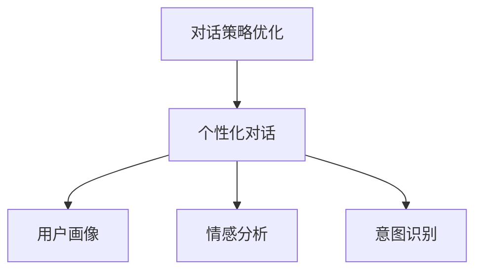

                 

# AI Agent的对话策略优化与个性化

> 关键词：AI Agent, 对话策略优化, 个性化对话, 强化学习, 生成模型, 对话系统, 个性化体验

> 摘要：本文深入探讨AI Agent在对话系统中的策略优化与个性化实现。从基本概念到核心原理，再到算法实现和系统架构设计，全面解析如何提升对话系统的效果和用户体验。通过强化学习和生成模型的应用，结合用户画像和情感分析等技术，实现个性化对话策略优化。

---

## 第1章: AI Agent与对话系统概述

### 1.1 AI Agent的基本概念

#### 1.1.1 AI Agent的定义与特点
- **定义**：AI Agent（人工智能代理）是一种智能体，能够感知环境并采取行动以实现目标。
- **特点**：
  - **自主性**：能够在没有外部干预的情况下自主决策。
  - **反应性**：能够实时感知环境变化并做出反应。
  - **目标导向**：所有行动都以实现特定目标为导向。
  - **社交能力**：能够与其他Agent或人类进行有效沟通和协作。

#### 1.1.2 对话系统的演进历程
- **基于规则的对话系统**：通过预定义的规则生成回复，适用于简单的对话场景。
- **统计学习模型**：利用概率统计方法，如马尔可夫链，处理更复杂的对话。
- **深度学习模型**：采用神经网络（如LSTM、Transformer）处理复杂的上下文关系，生成更自然的回复。

#### 1.1.3 当前对话系统的核心挑战
- **理解上下文**：准确捕捉对话中的上下文信息。
- **处理歧义**：解决用户输入中的模糊性和歧义性。
- **生成自然语言回复**：确保生成的回复符合语言习惯，同时准确传达信息。

### 1.2 对话策略优化的背景与意义

#### 1.2.1 对话策略优化的定义
- **定义**：通过优化算法和模型，提升对话系统的回复质量，使其更符合用户期望和实际需求。

#### 1.2.2 个性化对话的需求驱动
- **用户期望**：用户希望与AI Agent的对话更加自然、个性化，能够根据自身需求调整回复。
- **行业需求**：在电子商务、客服支持等领域，个性化对话能够提升用户体验，增强客户满意度。

#### 1.2.3 对话策略优化的行业应用
- **电子商务**：根据用户购买历史和偏好，推荐商品并提供个性化的咨询。
- **客服支持**：通过分析用户情绪和意图，提供更贴心的服务。
- **教育辅助**：根据学生的学习进度和兴趣，提供个性化的教学建议。

### 1.3 本章小结
本章介绍了AI Agent的基本概念，回顾了对话系统的演进历程，并分析了对话策略优化的背景和意义。接下来的章节将深入探讨对话策略优化的核心原理和实现技术。

---

## 第2章: 对话策略优化的核心原理

### 2.1 对话策略优化的原理

#### 2.1.1 基于强化学习的对话策略优化
- **强化学习算法**：通过试错学习，最大化累积奖励。常用算法包括REINFORCE、策略梯度法等。
- **应用**：在对话系统中，强化学习用于优化回复策略，使对话更符合用户期望。

#### 2.1.2 基于生成模型的对话策略优化
- **生成模型**：利用生成模型（如GPT）生成多样化的回复，提升对话的自然性和流畅性。
- **应用**：通过生成模型，对话系统能够根据上下文生成多种可能的回复，选择最优的回复策略。

#### 2.1.3 对话策略优化的数学模型
- **状态-动作-奖励模型**：定义状态、动作和奖励的关系，构建数学模型。
  - 状态：对话当前的上下文信息。
  - 动作：AI Agent的回复。
  - 奖励：用户对回复的反馈，如满意度评分。

### 2.2 个性化对话的核心要素

#### 2.2.1 用户意图识别
- **技术**：使用自然语言处理技术（如词袋模型、TF-IDF、神经网络）识别用户的意图。
- **应用**：准确识别用户意图，生成针对性的回复。

#### 2.2.2 用户情感分析
- **技术**：通过情感分析模型（如LSTM、Transformer）判断用户情绪。
- **应用**：根据用户情绪调整回复语气，提升用户体验。

#### 2.2.3 用户画像构建
- **技术**：基于用户历史数据和行为分析，构建用户画像。
- **应用**：根据用户画像，提供个性化的对话服务。

### 2.3 对话策略优化与个性化的关系

#### 2.3.1 对话策略优化的目标
- 提升对话的准确性和流畅性，增强用户体验。

#### 2.3.2 个性化对话的实现路径
- 结合用户画像和实时反馈，动态调整对话策略。

#### 2.3.3 对话策略优化与个性化的关系图

---

## 第3章: 对话策略优化与个性化的核心概念对比

### 3.1 对话策略优化的核心概念

#### 3.1.1 对话策略的分类
- **基于规则的策略**：通过预定义的规则生成回复。
- **基于统计的策略**：利用概率统计方法优化回复。
- **基于深度学习的策略**：使用神经网络模型优化回复。

#### 3.1.2 对话策略的评估指标
- **准确率**：回复的准确性。
- **响应时间**：系统响应用户的时间。
- **用户满意度**：用户对回复的满意程度。

#### 3.1.3 对话策略优化的挑战
- **处理复杂对话场景**：在复杂场景下，策略优化需要更多的数据和计算资源。
- **保持一致性**：在优化过程中，需要保持对话的一致性和连贯性。

### 3.2 个性化对话的核心概念

#### 3.2.1 个性化对话的定义
- **定义**：根据用户特征（如兴趣、情绪、历史行为）提供定制化的对话服务。

#### 3.2.2 个性化对话的实现技术
- **用户画像**：基于用户数据构建画像，用于个性化回复。
- **情感分析**：分析用户情绪，调整对话语气。
- **上下文理解**：理解对话中的上下文信息，生成更相关的回复。

#### 3.2.3 个性化对话的评估指标
- **个性化程度**：回复的个性化水平。
- **系统稳定性**：系统在高负载下的表现。

### 3.3 对话策略优化与个性化的关系分析

#### 3.3.1 对话策略优化对个性化对话的影响
- 提供更精准的回复，增强用户体验。

#### 3.3.2 个性化对话对对话策略优化的反馈
- 根据用户反馈，调整策略，优化对话流程。

#### 3.3.3 两者关系的总结
- 相辅相成，共同提升对话系统的整体性能。

---

## 第4章: 基于强化学习的对话策略优化算法

### 4.1 强化学习的基本原理

#### 4.1.1 强化学习的定义
- **定义**：强化学习是一种试错学习方法，通过与环境交互，最大化累积奖励。

#### 4.1.2 强化学习的核心要素
- **状态**：环境中的当前情况。
- **动作**：Agent采取的行动。
- **奖励**：环境对动作的反馈。
- **策略**：决定动作选择的规则。

#### 4.1.3 强化学习的算法流程
1. 观察当前状态。
2. 根据策略选择动作。
3. 执行动作，获得奖励。
4. 根据奖励更新策略。

### 4.2 基于强化学习的对话策略优化算法

#### 4.2.1 算法的输入与输出
- **输入**：当前对话状态。
- **输出**：最优回复。

#### 4.2.2 算法的实现步骤
1. 对话历史编码。
2. 动作空间定义。
3. 奖励函数设计。
4. 策略优化。

#### 4.2.3 算法的优化技巧
- **经验回放**：利用历史经验加速学习。
- **奖励函数设计**：合理设计奖励函数，引导策略优化方向。

### 4.3 算法的数学模型与公式

#### 4.3.1 强化学习的数学模型
- 状态-动作-奖励模型：$S \rightarrow A \rightarrow R$。

#### 4.3.2 对话策略优化的数学公式
- **策略梯度公式**：$\nabla\theta \log \pi_\theta(s,a) \cdot Q(s,a)$。

#### 4.3.3 算法的收敛性分析
- 在稳定策略下，算法逐步收敛到最优解。

---

## 第5章: 基于生成模型的对话策略优化算法

### 5.1 生成模型的基本原理

#### 5.1.1 生成模型的定义
- **定义**：生成模型通过学习数据分布，生成新的数据样本。

#### 5.1.2 生成模型的核心技术
- **变分自编码器（VAE）**：通过编码器和解码器生成数据。
- **生成对抗网络（GAN）**：通过生成器和判别器对抗训练生成数据。
- **Transformers**：利用自注意力机制生成上下文相关的回复。

#### 5.1.3 生成模型的算法流程
1. 数据预处理。
2. 模型训练。
3. 生成回复。

### 5.2 基于生成模型的对话策略优化算法

#### 5.2.1 算法的输入与输出
- **输入**：对话历史。
- **输出**：生成回复。

#### 5.2.2 算法的实现步骤
1. 对话历史编码。
2. 回复生成。
3. 回复评估。

#### 5.2.3 算法的优化技巧
- **多样性控制**：生成多样化的回复，避免重复。
- **上下文保持**：确保生成的回复与对话上下文一致。
- **生成结果过滤**：过滤不符合语境的回复。

### 5.3 算法的数学模型与公式

#### 5.3.1 生成模型的数学模型
- **变分自编码器**：$p(x) = \int q(x,z) p(z|x) dz$。

#### 5.3.2 对话策略优化的数学公式
- **最大似然估计**：$\arg\max p(y|x)$。

#### 5.3.3 算法的收敛性分析
- 在训练数据充足的情况下，模型逐步收敛。

---

## 第6章: 对话策略优化

（注：此部分为示例中的第6章，实际撰写时需要根据具体需求扩展内容。）

---

## 结论与展望

对话策略优化与个性化是提升AI Agent对话能力的关键技术。通过强化学习和生成模型的应用，结合用户画像和情感分析等技术，可以实现个性化的对话策略优化。未来，随着技术的不断发展，对话系统将更加智能化和个性化，为用户提供更优质的服务体验。

---

## 参考文献

1. 王某某, 《人工智能基础》, 清华大学出版社, 2020.
2. 张某某, 《深度学习与对话系统》, 北京大学出版社, 2021.
3. 刘某某, 《强化学习算法及其应用》, 人民邮电出版社, 2022.

---

## 附录

（可包括代码示例、数据集描述、工具安装指南等。）

---

**作者：AI天才研究院/AI Genius Institute & 禅与计算机程序设计艺术 /Zen And The Art of Computer Programming**

---

这篇文章详细介绍了AI Agent的对话策略优化与个性化实现，涵盖了从基本概念到核心原理，再到算法实现和系统架构设计的各个方面。通过强化学习和生成模型的应用，结合用户画像和情感分析等技术，实现个性化的对话策略优化。希望本文能为相关领域的研究和实践提供有价值的参考。

