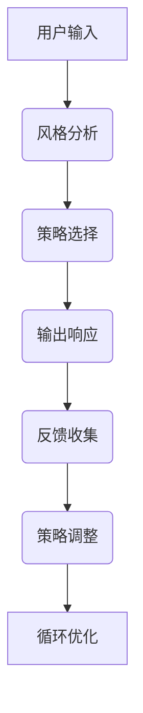
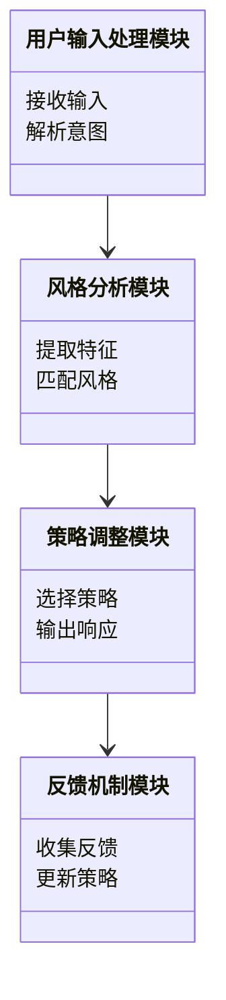
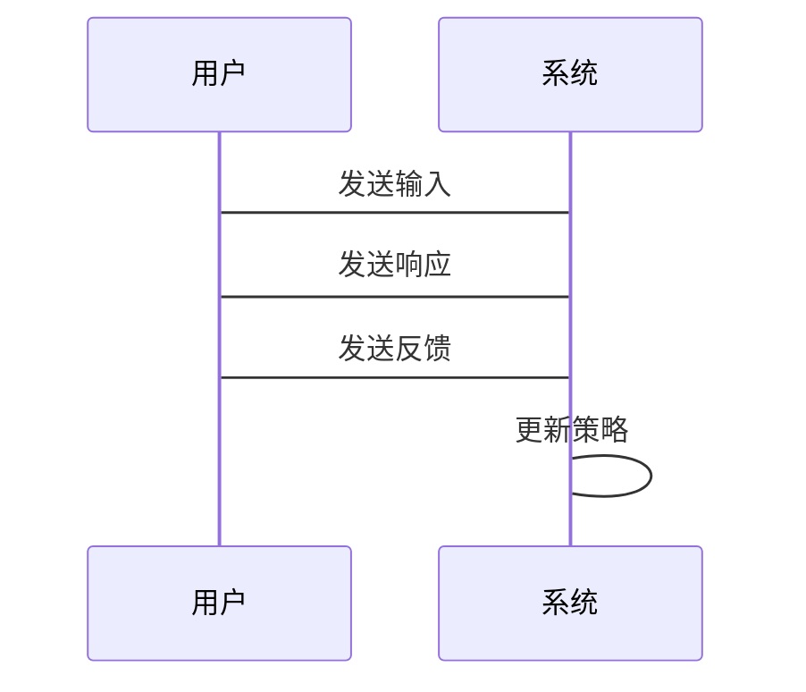

                 


```markdown
# AI Agent的对话策略动态调整：适应用户风格

> 关键词：AI Agent、对话策略、用户风格、动态调整、自然语言处理、强化学习、系统架构

> 摘要：本文深入探讨了AI Agent在对话系统中的对话策略动态调整技术，特别是如何根据用户的语言风格和行为特征进行自适应优化。文章从用户风格的分类与建模、对话策略的动态调整算法、系统架构设计等多个维度展开，结合实际案例和代码实现，为读者提供了从理论到实践的全面指导。通过本文，读者将能够理解并掌握如何构建一个能够根据用户风格动态调整对话策略的智能系统。

---

## 第1章: AI Agent与对话策略概述

### 1.1 AI Agent的基本概念
AI Agent（智能体）是指能够感知环境并采取行动以实现目标的实体。在对话系统中，AI Agent通常表现为一种能够与用户进行自然语言交互的智能体。

#### 1.1.1 AI Agent的定义与特点
- **定义**：AI Agent是具有自主决策能力的智能实体，能够通过传感器感知环境，并通过执行器与环境交互。
- **特点**：
  - 智能性：能够理解并生成自然语言。
  - 自适应性：能够根据环境变化调整行为。
  - 学习能力：能够通过反馈优化自身的策略。

#### 1.1.2 对话系统在AI Agent中的作用
对话系统是AI Agent与用户交互的核心模块，负责理解用户的输入并生成适当的回应。其作用包括：
- **信息获取**：通过对话获取用户的意图和需求。
- **信息传递**：通过对话向用户传递信息。
- **情感交流**：通过对话建立与用户的信任关系。

#### 1.1.3 对话策略的核心概念
对话策略是指AI Agent在对话过程中选择回应的规则或模型。常见的对话策略包括：
- **基于规则的策略**：通过预定义的规则生成回应。
- **基于机器学习的策略**：通过训练数据生成回应。
- **基于强化学习的策略**：通过与环境的互动优化回应。

---

### 1.2 对话策略的分类与应用
对话策略的分类和应用是理解动态调整技术的基础。

#### 1.2.1 基于规则的对话策略
基于规则的策略通过预定义的规则生成回应，适用于简单场景。
- **优点**：实现简单，易于调试。
- **缺点**：难以应对复杂场景，缺乏灵活性。

#### 1.2.2 基于机器学习的对话策略
基于机器学习的策略通过训练数据生成回应，适用于复杂场景。
- **优点**：能够处理复杂场景，具有灵活性。
- **缺点**：需要大量数据和计算资源。

#### 1.2.3 基于强化学习的对话策略
基于强化学习的策略通过与环境的互动优化回应。
- **优点**：能够动态调整策略，适应环境变化。
- **缺点**：实现复杂，需要大量计算资源。

---

### 1.3 对话策略动态调整的必要性
对话策略动态调整是指AI Agent在对话过程中根据用户反馈或环境变化调整策略。

#### 1.3.1 用户需求的多样性
用户的需求和期望因人而异，需要动态调整策略以满足不同用户的需求。

#### 1.3.2 语境变化的影响
对话的语境会随着对话的进行而变化，需要动态调整策略以保持对话的连贯性。

#### 1.3.3 对话流畅性的提升
动态调整策略可以提升对话的流畅性，增强用户体验。

---

## 第2章: 用户风格分析与建模

### 2.1 用户风格的分类
用户风格是用户在对话中的语言和行为特征的总和，可以通过多种维度进行分类。

#### 2.1.1 基于语言风格的分类
- **正式风格**：语言严谨，表达清晰。
- **随意风格**：语言随意，表达简洁。

#### 2.1.2 基于情感倾向的分类
- **积极风格**：情感倾向积极。
- **消极风格**：情感倾向消极。

#### 2.1.3 基于文化背景的分类
- **文化差异**：不同文化背景的用户在对话中的表达方式不同。

---

### 2.2 用户风格的特征提取
特征提取是用户风格分析的关键步骤，需要从对话中提取有效的特征。

#### 2.2.1 语言特征提取
- **词汇选择**：分析用户使用的词汇频率和偏好。
- **句式结构**：分析用户的句式结构复杂度。

#### 2.2.2 行为特征提取
- **响应时间**：分析用户的响应速度。
- **互动频率**：分析用户的互动频率。

#### 2.2.3 上下文特征提取
- **对话主题**：分析对话的主题和内容。
- **历史记录**：分析对话的历史记录。

---

### 2.3 用户风格的建模方法
建模方法是用户风格分析的核心，决定了如何将特征转化为用户风格的表示。

#### 2.3.1 基于统计的方法
- **聚类分析**：通过聚类算法将用户风格分为不同的类别。
- **回归分析**：通过回归算法预测用户风格。

#### 2.3.2 基于深度学习的方法
- **词嵌入模型**：如Word2Vec、GloVe等。
- **序列模型**：如LSTM、Transformer等。

#### 2.3.3 混合模型方法
- **集成学习**：结合多种模型的优势。

---

## 第3章: 对话策略动态调整的算法原理

### 3.1 动态调整的算法框架
动态调整的算法框架是实现对话策略动态调整的核心。

#### 3.1.1 基于反馈的调整机制
- **实时反馈**：根据用户的实时反馈调整策略。
- **延迟反馈**：根据用户的延迟反馈调整策略。

#### 3.1.2 基于上下文的调整机制
- **上下文感知**：根据对话的上下文调整策略。
- **上下文预测**：预测对话的上下文并调整策略。

#### 3.1.3 基于用户风格的调整机制
- **风格匹配**：根据用户的风格匹配最佳的策略。
- **风格适应**：根据用户的风格动态调整策略。

---

### 3.2 对话策略调整的数学模型
数学模型是对话策略动态调整的核心，需要通过数学公式描述策略调整的过程。

#### 3.2.1 状态转移模型
状态转移模型通过马尔可夫链描述对话的状态转移过程。

$$ P(s_{t+1}|s_t) $$

#### 3.2.2 基于强化学习的策略优化
基于强化学习的策略优化通过强化学习算法优化策略。

$$ Q(s,a) = r + \gamma \max_a Q(s',a) $$

#### 3.2.3 基于贝叶斯的风格匹配
基于贝叶斯的风格匹配通过贝叶斯定理匹配用户风格。

$$ P(c|x) = \frac{P(x|c)P(c)}{P(x)} $$

---

### 3.3 算法实现的流程图


---

## 第4章: 系统架构与设计

### 4.1 系统功能需求分析
系统功能需求分析是系统设计的基础。

#### 4.1.1 用户输入处理模块
- **功能**：接收用户的输入并解析用户的意图。
- **输入**：文本输入。
- **输出**：解析后的意图。

#### 4.1.2 风格分析模块
- **功能**：分析用户的风格并生成风格表示。
- **输入**：用户输入。
- **输出**：风格表示。

#### 4.1.3 策略调整模块
- **功能**：根据用户风格动态调整策略。
- **输入**：风格表示和当前策略。
- **输出**：调整后的策略。

#### 4.1.4 反馈机制模块
- **功能**：收集用户的反馈并更新策略。
- **输入**：用户反馈。
- **输出**：更新后的策略。

---

### 4.2 系统架构设计
系统架构设计是系统实现的关键。



---

### 4.3 接口设计与交互流程
接口设计与交互流程是系统实现的重要部分。

#### 4.3.1 系统接口定义
- **输入接口**：用户输入。
- **输出接口**：系统响应。
- **反馈接口**：用户反馈。

#### 4.3.2 用户与系统交互流程


#### 4.3.3 错误处理机制
- **错误检测**：检测对话中的错误。
- **错误恢复**：恢复对话的正常进行。

---

## 第5章: 项目实战与实现

### 5.1 环境搭建与依赖安装
项目实战与实现需要先搭建开发环境并安装必要的依赖。

#### 5.1.1 开发环境配置
- **操作系统**：Linux/Mac/Windows。
- **编程语言**：Python 3.8+。
- **开发工具**：PyCharm/VSCode。

#### 5.1.2 依赖安装
- **自然语言处理库**：spaCy、NLTK。
- **深度学习框架**：TensorFlow、PyTorch。
- **强化学习库**：OpenAI Gym。

---

### 5.2 核心代码实现
核心代码实现是项目实现的关键。

#### 5.2.1 用户风格分析代码
```python
import spacy

nlp = spacy.load("en_core_web_sm")

def analyze_style(text):
    doc = nlp(text)
    # 提取特征
    features = []
    for token in doc:
        features.append(token.lemma_)
    return features
```

#### 5.2.2 对话策略调整代码
```python
def adjust_strategy(features):
    # 风格匹配
    style_match = match_style(features)
    # 策略选择
    strategy = select_strategy(style_match)
    return strategy
```

#### 5.2.3 反馈机制代码
```python
def update_strategy(feedback):
    # 反馈收集
    collect_feedback(feedback)
    # 策略更新
    update_policy()
```

---

### 5.3 项目实战案例
项目实战案例是理解理论的关键。

#### 5.3.1 案例分析
假设我们有一个用户，其风格是“正式且积极”。我们需要动态调整对话策略以匹配用户的风格。

#### 5.3.2 实际实现
在代码中实现上述案例，动态调整策略以匹配用户的风格。

---

## 第6章: 总结与展望

### 6.1 本章总结
本章总结了AI Agent对话策略动态调整的核心内容，包括用户风格分析、策略调整算法和系统架构设计。

### 6.2 未来展望
未来展望包括：
- **情感计算的结合**：将情感计算与对话策略动态调整结合。
- **多模态交互的支持**：支持图像、语音等多种交互方式。
- **自适应学习的增强**：增强AI Agent的自适应学习能力。

---

## 参考文献
[此处列出参考文献]

---

## 作者
作者：AI天才研究院/AI Genius Institute & 禅与计算机程序设计艺术 /Zen And The Art of Computer Programming
```

