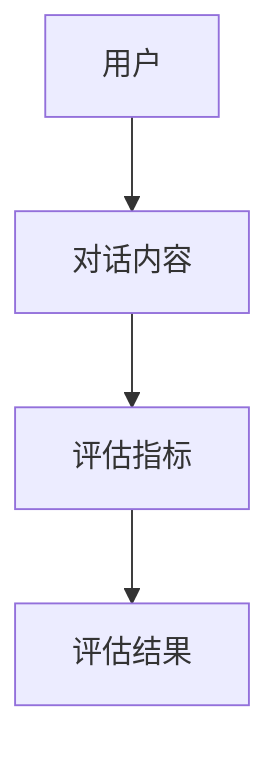
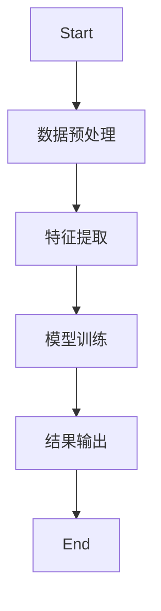
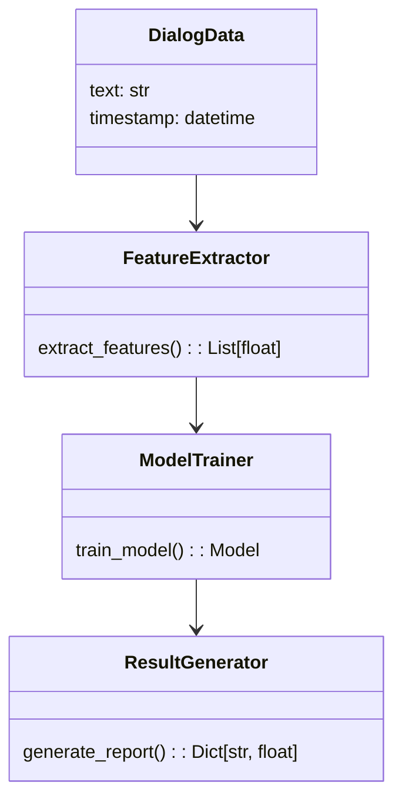
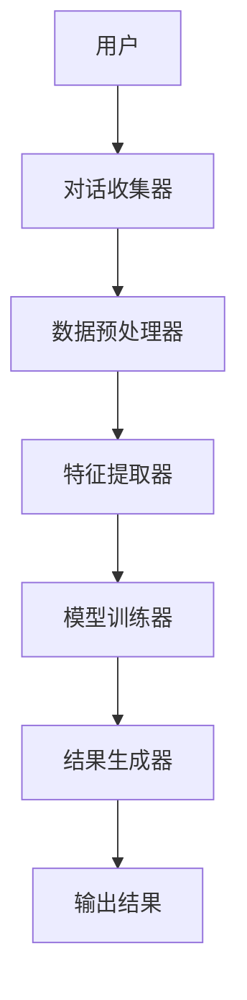
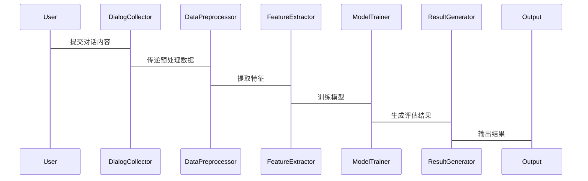

                 


# AI Agent的对话质量评估体系设计

## 关键词：AI Agent，对话质量评估，评估体系设计，算法原理，系统架构，项目实战

## 摘要：  
本文旨在设计一个全面的AI Agent对话质量评估体系，涵盖背景分析、核心概念、算法原理、系统架构、项目实战及最佳实践。通过多维度的分析，结合实际案例和代码实现，为AI Agent的对话质量评估提供系统的解决方案。

---

# 第1章: AI Agent对话质量评估体系的背景与问题描述

## 1.1 问题背景与挑战

### 1.1.1 AI Agent在人机交互中的重要性  
随着人工智能技术的快速发展，AI Agent（智能体）在人机交互中的应用越来越广泛。AI Agent通过自然语言处理技术，能够理解和生成人类语言，从而实现与用户的高效互动。然而，对话质量的评估是确保AI Agent性能的关键，直接影响用户体验和系统性能。

### 1.1.2 对话质量评估的核心问题  
对话质量评估的核心问题是如何量化和优化AI Agent的对话表现。这包括但不限于对话的相关性、流畅性、逻辑性、情感一致性以及信息准确性。这些问题需要从多个维度进行综合评估。

### 1.1.3 当前对话质量评估的主要挑战  
当前对话质量评估的主要挑战包括：  
1. **数据多样性**：对话数据来源广泛，涵盖不同领域、语言和情感，导致评估体系的通用性要求高。  
2. **指标多样性**：需要结合主观和客观指标，主观指标依赖人工评估，而客观指标依赖算法实现。  
3. **动态性**：对话过程是动态的，需要实时评估和调整。

## 1.2 问题描述与目标

### 1.2.1 对话质量评估的定义  
对话质量评估是对AI Agent生成的对话内容进行分析，量化其质量和效果的过程。目标是通过评估结果优化AI Agent的性能，提升用户体验。

### 1.2.2 评估体系的目标与范围  
本评估体系的目标是设计一个多维度、可扩展的对话质量评估框架，涵盖以下范围：  
1. 对话内容的相关性分析。  
2. 对话流畅性与逻辑性评估。  
3. 情感一致性与语境理解能力。  
4. 对话信息的准确性和完整性。

### 1.2.3 体系设计的边界与外延  
本体系的边界包括对话内容本身，不涉及非对话性输出（如图片、视频等）。其外延则扩展至对话数据的收集、处理和分析过程。

## 1.3 核心概念与组成

### 1.3.1 对话质量评估的组成要素  
对话质量评估体系由以下要素组成：  
1. **对话内容**：包括用户输入和AI Agent的输出。  
2. **评估指标**：包括相关性、流畅性、逻辑性等指标。  
3. **评估方法**：包括基于规则的方法和基于模型的方法。  
4. **评估结果**：包括评分、反馈和优化建议。

### 1.3.2 各要素之间的关系  
对话内容是评估的基础，评估指标是评估的核心维度，评估方法是实现评估的手段，评估结果是优化AI Agent的依据。各要素相互关联，共同构成完整的评估体系。

### 1.3.3 体系结构的核心要素分析  
对话质量评估体系的核心要素包括：  
1. 数据预处理：清洗和标注对话数据。  
2. 特征提取：从对话内容中提取相关特征。  
3. 模型训练：基于特征训练评估模型。  
4. 结果输出：生成评估结果并优化AI Agent。

---

# 第2章: AI Agent对话质量评估的核心概念与联系

## 2.1 核心概念的原理

### 2.1.1 对话质量评估的基本原理  
对话质量评估的基本原理是通过对对话内容的分析，提取关键特征，结合预设的评估指标，生成评估结果。这一过程需要结合语言学知识和机器学习技术。

### 2.1.2 AI Agent行为分析的理论基础  
AI Agent的行为分析基于自然语言处理和对话系统理论，包括意图识别、实体识别和情感分析等技术。这些技术为对话质量评估提供了基础支持。

### 2.1.3 多维度评估指标的设计原则  
多维度评估指标的设计原则包括：  
1. **全面性**：涵盖对话的相关性、流畅性、逻辑性等多维度。  
2. **可量化性**：指标能够量化，便于计算和比较。  
3. **可优化性**：指标能够指导AI Agent的优化方向。

## 2.2 核心概念的属性对比

### 2.2.1 对话质量评估指标的属性分析  
以下是对话质量评估指标的属性对比表：

| 指标 | 相关性 | 流畅性 | 逻辑性 | 情感一致性 |
|------|--------|--------|--------|------------|
| 特性 | 相关性评分 | 流畅性评分 | 逻辑性评分 | 情感一致性评分 |
| 范围 | 0-1 | 0-1 | 0-1 | 0-1 |

### 2.2.2 不同评估方法的优劣势对比  
以下是不同评估方法的对比：

| 方法 | 基于规则 | 基于统计 | 基于深度学习 |
|------|----------|----------|--------------|
| 优点 | 实现简单，易于解释 | 数据驱动，结果客观 | 高准确性，能够捕捉复杂模式 |
| 缺点 | 依赖人工规则设计 | 需要大量数据 | 实现复杂，计算资源消耗大 |

### 2.2.3 评估体系的可扩展性与可维护性  
评估体系的可扩展性体现在能够轻松添加新的评估指标，而可维护性体现在能够方便地优化和调整现有指标。

## 2.3 实体关系图与流程图

### 2.3.1 实体关系图（ER图）



### 2.3.2 流程图（Mermaid）



---

# 第3章: 对话质量评估体系的算法原理

## 3.1 算法原理概述

### 3.1.1 基于统计的评估方法  
基于统计的评估方法通过分析对话内容的频率和分布，生成评估结果。例如，使用TF-IDF（词频-逆文档频率）计算关键词的重要性。

### 3.1.2 基于深度学习的评估模型  
基于深度学习的评估模型通过训练神经网络，学习对话内容的语义表示，生成评估结果。常用的模型包括循环神经网络（RNN）和Transformer。

### 3.1.3 混合模型的优势与挑战  
混合模型结合了基于规则和基于模型的优势，能够同时利用先验知识和数据驱动的优势，但实现复杂度较高。

## 3.2 算法流程图


## 3.3 算法实现代码

### 3.3.1 环境安装

```bash
pip install numpy scikit-learn
```

### 3.3.2 核心代码实现

```python
import numpy as np
from sklearn.feature_extraction.text import TfidfVectorizer

# 示例对话内容
dialogs = [
    "你今天过得怎么样？",
    "很好，谢谢！",
    "有什么计划吗？",
    "没有，只是想和你聊聊天。"
]

# 使用TF-IDF进行特征提取
vectorizer = TfidfVectorizer()
tfidf_matrix = vectorizer.fit_transform(dialogs)

# 输出TF-IDF矩阵
print(tfidf_matrix)
```

## 3.4 数学公式

### 3.4.1 TF-IDF公式
$$ TF-IDF = TF \times IDF $$  
其中，TF是词项在文档中的频率，IDF是逆文档频率。

### 3.4.2 情感分析模型（示例）
$$ P(\text{positive}|text) = \frac{1}{1 + e^{-w \cdot x - b}} $$  
其中，\( w \) 是权重向量，\( x \) 是输入特征，\( b \) 是偏置项。

---

# 第4章: 系统分析与架构设计方案

## 4.1 问题场景介绍

### 4.1.1 对话数据的收集与处理  
对话数据需要从实际应用场景中收集，涵盖不同领域和语言。数据预处理包括分词、去停用词和实体识别。

### 4.1.2 对话质量评估的需求分析  
需求分析包括确定评估指标、数据格式和输出格式。

## 4.2 系统功能设计

### 4.2.1 领域模型（Mermaid类图）



### 4.2.2 系统架构设计（Mermaid架构图）



### 4.2.3 系统接口设计  
系统接口包括数据输入接口、模型训练接口和结果输出接口。

### 4.2.4 系统交互（Mermaid序列图）



---

# 第5章: 项目实战

## 5.1 环境安装

```bash
pip install numpy scikit-learn
```

## 5.2 核心实现代码

### 5.2.1 对话数据预处理

```python
import pandas as pd

# 示例对话数据
data = {
    'dialogue': ["你今天过得怎么样？", "很好，谢谢！"],
    'score': [0.8, 0.9]
}

df = pd.DataFrame(data)
print(df)
```

### 5.2.2 特征提取与模型训练

```python
from sklearn.model

