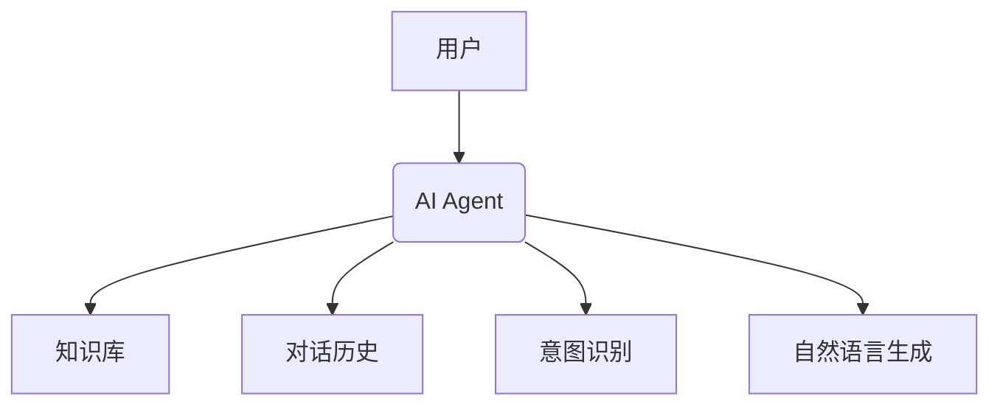
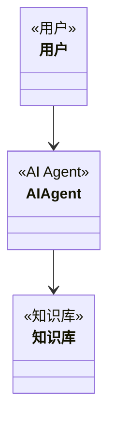
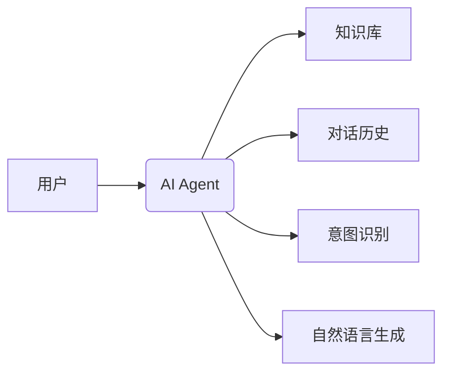
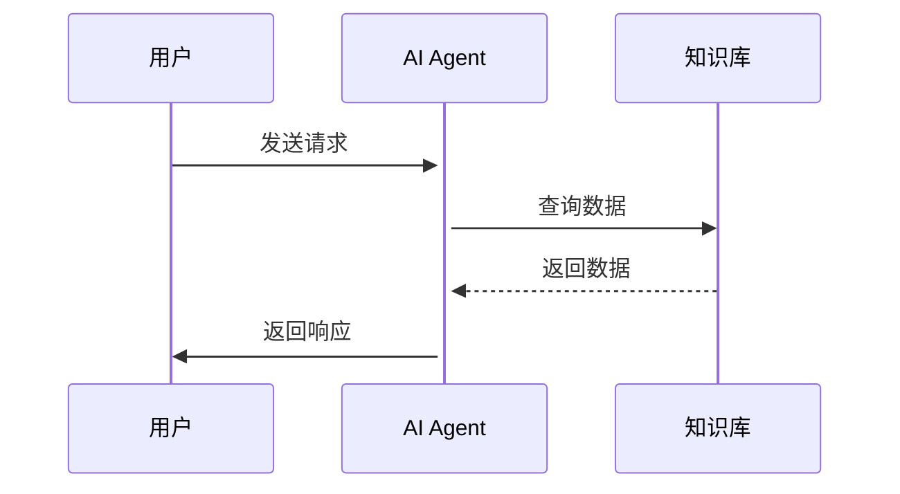

                 


# AI Agent的应用场景：从客服到创意助手

## 关键词：AI Agent, 应用场景, 客服系统, 创意助手, 大语言模型, 智能决策, 自然语言处理

## 摘要：本文深入探讨了AI Agent在客服到创意助手等领域的应用场景，分析了其背后的技术原理和算法模型，结合实际案例，详细讲解了AI Agent的优势、挑战及解决方案，并展望了其未来的发展方向。

---

## 第一部分：AI Agent的基础

### 第1章：AI Agent的基本概念

#### 1.1 AI Agent的定义与特点

- **1.1.1 什么是AI Agent**
  AI Agent（人工智能代理）是指能够感知环境、自主决策并执行任务的智能实体。它通过算法和大数据分析，模拟人类的思考和行为，以实现特定目标。

- **1.1.2 AI Agent的核心特点**
  - **自主性**：无需外部干预，自主完成任务。
  - **反应性**：能够实时感知环境并做出反应。
  - **学习能力**：通过数据训练不断优化性能。
  - **适应性**：能够适应不同环境和任务需求。

- **1.1.3 AI Agent与传统程序的区别**
  AI Agent具备自主决策和学习能力，而传统程序通常遵循固定的规则，不具备自主性和学习能力。

#### 1.2 AI Agent的技术背景

- **1.2.1 大语言模型的发展历程**
  大语言模型（如GPT系列）是AI Agent的核心技术之一。从最初的GPT到GPT-3，模型规模和能力不断提升，为AI Agent的发展奠定了基础。

- **1.2.2 AI Agent的兴起与应用趋势**
  随着计算能力的提升和大数据的普及，AI Agent在各领域的应用逐渐增多，尤其是在客服和创意助手领域。

- **1.2.3 当前AI Agent的主要技术支撑**
  - 大语言模型：如GPT-3、PaLM。
  - 自然语言处理技术：如BERT。
  - 知识图谱：结构化知识的存储与应用。

#### 1.3 主流AI Agent模型简介

- **1.3.1 GPT系列模型**
  GPT系列模型通过自注意力机制和Transformer架构，具备强大的自然语言生成能力，广泛应用于对话系统和内容生成。

- **1.3.2 BERT及其变体**
  BERT模型在自然语言理解方面表现出色，适用于问答系统和文本分类任务。

- **1.3.3 其他知名AI Agent模型介绍**
  - T5：文本到文本的预训练模型，支持多种任务。
  - PaLM：适用于多种任务的通用模型。

#### 1.4 AI Agent的应用场景概述

- **1.4.1 AI Agent在客服领域的应用**
  AI Agent可以作为智能客服，处理常见问题，提供24/7服务，提升客户满意度。

- **1.4.2 AI Agent在创意助手领域的应用**
  AI Agent可以辅助创意人员生成文案、设计建议，激发创作灵感。

- **1.4.3 AI Agent的其他潜在应用场景**
  医疗诊断、金融分析、教育辅助等领域。

### 第2章：AI Agent的核心概念与联系

#### 2.1 AI Agent的核心概念原理

- **2.1.1 智能决策机制**
  AI Agent通过分析上下文信息，结合知识图谱和自然语言处理能力，做出最优决策。

- **2.1.2 自然语言处理能力**
  AI Agent能够理解并生成人类语言，支持多语言交流和复杂对话。

- **2.1.3 知识图谱与推理能力**
  通过知识图谱，AI Agent可以进行推理和关联分析，提供更准确的信息。

#### 2.2 核心概念属性特征对比表

| 概念       | 属性特征                       |
|------------|----------------------------|
| 智能决策   | 基于上下文的推理能力           |
| 自然语言处理 | 理解与生成人类语言的能力       |
| 知识图谱     | 结构化知识的存储与应用能力     |

#### 2.3 ER实体关系图架构



---

## 第二部分：AI Agent的核心算法

### 第3章：AI Agent的算法原理

#### 3.1 大语言模型的训练原理

- **3.1.1 基于Transformer的模型结构**
  Transformer由编码器和解码器组成，通过自注意力机制捕捉文本中的长距离依赖关系。

- **3.1.2 自注意力机制的数学模型**
  自注意力机制的公式如下：

  $$\text{Attention}(Q, K, V) = \text{softmax}\left(\frac{QK^T}{\sqrt{d_k}}\right)V$$

  其中，$Q$、$K$、$V$分别为查询、键和值向量，$d_k$为向量维度。

- **3.1.3 梯度下降优化算法**
  使用Adam优化器，通过反向传播更新模型参数，最小化损失函数。

#### 3.2 强化学习的应用

- **3.2.1 强化学**（见后续章节）

---

## 第四部分：AI Agent的应用场景

### 第5章：AI Agent在客服系统中的应用

#### 5.1 AI Agent作为智能客服的优势

- **7×24小时服务**：无需人工轮班，随时响应客户需求。
- **高效处理**：快速理解并解决问题，提升客户满意度。
- **数据分析**：通过收集和分析对话数据，优化服务流程。

#### 5.2 智能客服系统的实现

- **用户需求分析**：识别用户意图，如咨询、投诉等。
- **对话流程设计**：基于意图树，设计对话流程。
- **系统优化建议**：根据用户反馈，优化对话策略。

#### 5.3 智能客服系统的挑战与解决方案

- **理解误差**：通过多轮对话和上下文理解，减少误解。
- **知识覆盖**：建立完善的知识库，涵盖常见问题。

### 第6章：AI Agent在创意助手中的应用

#### 6.1 创意助手的核心功能

- **文案生成**：根据输入主题，生成创意文案。
- **设计建议**：提供视觉设计建议，如配色方案、排版等。
- **灵感激发**：通过分析成功案例，激发创意灵感。

#### 6.2 创意助手的实现

- **输入解析**：解析用户输入的创作主题和要求。
- **内容生成**：结合知识库和自然语言生成能力，生成创意内容。
- **反馈优化**：根据用户反馈，优化生成内容。

#### 6.3 创意助手的挑战与解决方案

- **创意独特性**：通过学习大量优秀案例，提升生成内容的创新性。
- **用户体验**：设计友好的交互界面，提升用户体验。

---

## 第五部分：系统架构设计

### 第7章：系统设计要点

#### 7.1 领域模型设计



#### 7.2 系统架构设计



#### 7.3 接口设计

- **API接口**：提供RESTful API，供其他系统调用。
- **数据接口**：与知识库和对话历史数据库对接。

### 第8章：系统接口与交互设计

#### 8.1 API调用流程



#### 8.2 对话交互设计

- **多轮对话**：支持复杂问题的多轮对话。
- **上下文记忆**：记录对话历史，保持上下文连贯。

---

## 第六部分：项目实战

### 第9章：环境安装与代码实现

#### 9.1 环境安装

```bash
pip install transformers
pip install torch
pip install numpy
```

#### 9.2 核心代码实现

```python
from transformers import AutoModelForCausalLM, AutoTokenizer

model_name = "gpt2"
tokenizer = AutoTokenizer.from_pretrained(model_name)
model = AutoModelForCausalLM.from_pretrained(model_name)

def generate_response(prompt):
    inputs = tokenizer.encode(prompt, return_tensors="pt")
    outputs = model.generate(inputs, max_length=50, do_sample=True)
    response = tokenizer.decode(outputs[0], skip_special_tokens=True)
    return response
```

#### 9.3 代码应用解读

- **模型加载**：加载预训练的GPT-2模型和分词器。
- **生成函数**：输入提示，生成相应长度的响应文本。

### 第10章：案例分析与经验总结

#### 10.1 案例分析

- **客服案例**：处理用户投诉，生成回复邮件。
- **创意助手案例**：根据主题生成营销文案。

#### 10.2 项目经验总结

- **数据质量**：高质量的训练数据是关键。
- **模型优化**：根据实际需求，微调模型以提升性能。
- **用户体验**：设计友好的交互界面，提升用户满意度。

---

## 第七部分：总结与展望

### 7.1 内容总结

本文详细探讨了AI Agent在客服和创意助手中的应用场景，分析了其技术原理和算法模型，结合实际案例，详细讲解了AI Agent的优势、挑战及解决方案。

### 7.2 未来展望

随着大语言模型和强化学习的不断发展，AI Agent将在更多领域发挥重要作用，如医疗诊断、金融分析等。未来的研究方向包括提升模型的可解释性、增强多模态交互能力等。

---

## 作者：AI天才研究院/AI Genius Institute & 禅与计算机程序设计艺术 /Zen And The Art of Computer Programming

