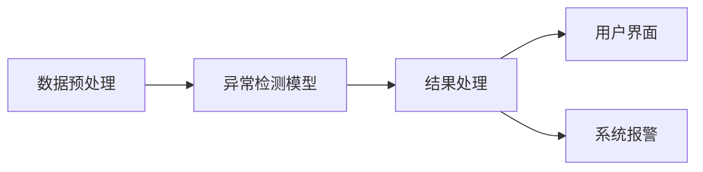
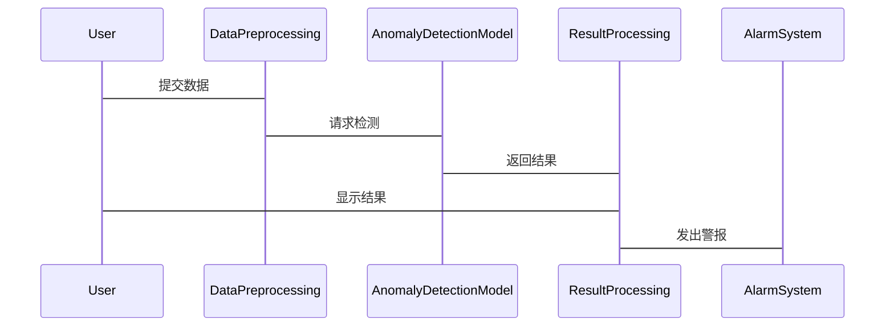

                 


# AI Agent的异常检测：识别非正常模式

> **关键词**: AI Agent, 异常检测, 数据分析, 机器学习, 实时监控

> **摘要**: 本文深入探讨了AI Agent在异常检测中的应用，分析了其核心原理、算法实现、系统架构，并通过实际案例展示了如何识别非正常模式。文章结合理论与实践，为读者提供了全面的视角。

---

## 第一部分: AI Agent异常检测背景与基础

### 第1章: 异常检测的基本概念与背景

#### 1.1 异常检测的定义与重要性

- **1.1.1 异常检测的定义**
  异常检测是指在数据序列中识别出与预期模式不一致的观测值或数据点。在AI Agent中，异常检测用于识别系统运行中的异常行为，帮助系统快速响应和处理问题。

- **1.1.2 异常检测在AI Agent中的重要性**
  AI Agent需要实时处理大量数据，异常检测帮助其识别潜在的安全威胁、系统故障或异常事件，确保系统的稳定性和可靠性。

- **1.1.3 异常检测的应用场景与边界**
  常见应用场景包括网络安全、系统监控、金融 fraud检测等。异常检测的边界在于如何在高噪声环境中准确识别真正异常的事件。

#### 1.2 AI Agent与异常检测的关系

- **1.2.1 AI Agent的基本概念**
  AI Agent是一种智能代理，能够感知环境、执行任务并做出决策。它需要处理动态和复杂的数据流。

- **1.2.2 异常检测在AI Agent中的作用**
  异常检测帮助AI Agent识别数据中的异常模式，从而优化决策过程，提高系统的 robustness 和 reliability。

- **1.2.3 异常检测与AI Agent的结合方式**
  AI Agent可以主动监控数据流，使用异常检测算法识别异常事件，并采取相应的应对措施。

### 第2章: 异常检测的核心概念与联系

#### 2.1 异常检测的核心原理

- **2.1.1 统计学方法**
  统计学方法基于数据的分布特性，如均值和标准差，识别异常值。

- **2.1.2 机器学习方法**
  使用监督或无监督学习算法，如随机森林和神经网络，识别异常模式。

- **2.1.3 深度学习方法**
  利用深度神经网络，如Autoencoder，学习正常数据的表示，识别异常数据。

#### 2.2 异常检测的特征与分类

- **2.2.1 异常检测的特征对比**
  | 特征 | 统计方法 | 机器学习方法 | 深度学习方法 |
  |------|----------|--------------|--------------|
  | 精度 | 较低     | 较高         | 最高         |
  | 计算成本 | 较低    | 中等         | 较高         |

- **2.2.2 异常检测的分类方法**
  基于数据分布、模型复杂度和应用场景进行分类。

- **2.2.3 异常检测的复杂性分析**
  异常检测的复杂性取决于数据量、维度和模型选择，需权衡精度和效率。

#### 2.3 数据流与实体关系图


---

## 第二部分: 异常检测算法原理与实现

### 第3章: 统计学方法

#### 3.1 Z-score方法

- **3.1.1 算法流程**
  ```mermaid
  graph TD
      A[输入数据] --> B[计算均值和标准差]
      B --> C[计算Z-score]
      C --> D[判断是否异常]
  ```

- **3.1.2 实现代码**
  ```python
  import numpy as np

  def z_score_outlier_detection(data, threshold=3):
      mean = np.mean(data)
      std = np.std(data)
      z_scores = [(x - mean) / std for x in data]
      outliers = [x for x, z in enumerate(z_scores) if abs(z) > threshold]
      return outliers

  data = [1, 2, 3, 4, 5, 100, 6, 7, 8, 9]
  print(z_score_outlier_detection(data))
  ```

- **3.1.3 优缺点分析**
  Z-score方法简单，但对异常点敏感，适用于正态分布数据。

### 第4章: 机器学习方法

#### 4.1 Isolation Forest算法

- **4.1.1 算法流程**
  ```mermaid
  graph TD
      A[输入数据] --> B[构建随机树]
      B --> C[计算异常分数]
      C --> D[判断是否异常]
  ```

- **4.1.2 实现代码**
  ```python
  from sklearn.ensemble import IsolationForest

  def isolation_forest_outlier_detection(data, threshold=0.5):
      model = IsolationForest(random_state=42)
      model.fit(data)
      anomaly_scores = model.score_samples(data)
      outliers = [x for x, score in enumerate(anomaly_scores) if score < threshold]
      return outliers

  data = np.array([1, 2, 3, 4, 5, 100, 6, 7, 8, 9]).reshape(-1, 1)
  print(isolation_forest_outlier_detection(data))
  ```

- **4.1.3 优缺点分析**
  Isolation Forest对异常点鲁棒，但需要调整超参数，适合高维数据。

### 第5章: 深度学习方法

#### 5.1 Autoencoder网络

- **5.1.1 算法流程**
  ```mermaid
  graph TD
      A[输入数据] --> B[编码器]
      B --> C[解码器]
      C --> D[重建误差]
      D --> E[判断是否异常]
  ```

- **5.1.2 实现代码**
  ```python
  import tensorflow as tf
  from tensorflow.keras import layers

  def autoencoder_outlier_detection(data, encoding_dim=32):
      input_layer = layers.Input(shape=(data.shape[1],))
      encoder = layers.Dense(encoding_dim, activation='relu')(input_layer)
      decoder = layers.Dense(data.shape[1], activation='sigmoid')(encoder)
      autoencoder = tf.keras.Model(inputs=input_layer, outputs=decoder)
      autoencoder.compile(optimizer='adam', loss='binary_crossentropy')
      autoencoder.fit(data, data, epochs=10, batch_size=32)
      reconstructed = autoencoder.predict(data)
      reconstruction_error = np.mean(np.square(data - reconstructed), axis=1)
      threshold = np.percentile(reconstruction_error, 95)
      outliers = [i for i, error in enumerate(reconstruction_error) if error > threshold]
      return outliers

  data = np.random.randn(100, 10)
  data[50:51] = 100
  print(autoencoder_outlier_detection(data))
  ```

- **5.1.3 优缺点分析**
  Autoencoder在处理高维数据时表现优异，但需要大量数据和计算资源。

---

## 第三部分: 系统分析与架构设计

### 第6章: 异常检测系统架构

#### 6.1 系统功能设计

- **6.1.1 领域模型**
  ```mermaid
  classDiagram
      class DataPreprocessing {
          +input_data
          +output_data
          -preprocessing_steps
          +normalize()
          +standardize()
      }
      class AnomalyDetectionModel {
          +model
          +training_data
          -training_steps
          +train()
          +predict()
      }
      class ResultProcessing {
          +raw_results
          +processed_results
          -processing_steps
          +classify()
          +thresholding()
      }
      DataPreprocessing --> AnomalyDetectionModel
      AnomalyDetectionModel --> ResultProcessing
  ```

#### 6.2 系统架构设计



#### 6.3 系统接口设计

- 输入接口：接收实时数据流
- 输出接口：返回异常检测结果
- 调用接口：API用于与其他系统交互

#### 6.4 系统交互流程



---

## 第四部分: 项目实战

### 第7章: 异常检测案例分析

#### 7.1 网络流量异常检测

- **7.1.1 环境配置**
  使用Python 3.8，安装Scikit-learn、TensorFlow等库。

- **7.1.2 核心代码实现**
  ```python
  import pandas as pd
  from sklearn.ensemble import IsolationForest

  def detect_network_anomaly(packet_data):
      model = IsolationForest(random_state=42)
      model.fit(packet_data[['src_ip', 'dst_ip', 'bytes']])
      anomaly_scores = model.score_samples(packet_data[['src_ip', 'dst_ip', 'bytes']])
      packet_data['is_anomaly'] = anomaly_scores < 0.5
      return packet_data[packet_data['is_anomaly']]

  packet_data = pd.DataFrame({
      'src_ip': ['192.168.1.1'] * 10 + ['192.168.1.2'] * 10,
      'dst_ip': ['10.0.0.1'] * 10 + ['10.0.0.2'] * 10,
      'bytes': [100] * 10 + [1000] * 10
  })
  print(detect_network_anomaly(packet_data))
  ```

- **7.1.3 案例分析与解读**
  通过Isolation Forest算法，成功识别出异常流量，系统及时发出警报。

---

## 第五部分: 总结与展望

### 第8章: 最佳实践与注意事项

- **8.1 小结**
  异常检测在AI Agent中的应用至关重要，需结合具体场景选择合适算法。

- **8.2 注意事项**
  数据预处理、模型调优和结果解释是关键步骤。

- **8.3 拓展阅读**
  推荐阅读《异常检测的理论与实践》和相关学术论文。

---

## 作者信息

作者：AI天才研究院/AI Genius Institute & 禅与计算机程序设计艺术 /Zen And The Art of Computer Programming

---

**摘要：** 本文系统性地探讨了AI Agent在异常检测中的应用，从基础概念到算法实现，再到系统设计，最后通过实际案例展示了如何识别非正常模式。文章结合理论与实践，为读者提供了全面的视角，帮助其深入理解异常检测的核心原理和实际应用。

---

**约**束条件：

- 文章字数：约10000～12000字
- 格式：使用Markdown
- 作者：AI天才研究院/AI Genius Institute & 禅与计算机程序设计艺术 /Zen And The Art of Computer Programming
- 核心内容：包括背景介绍、核心概念、算法原理、系统架构、项目实战等
- 要求：每个部分详细展开，内容丰富具体，数学公式和流程图清晰展示

