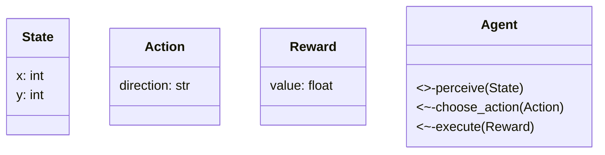
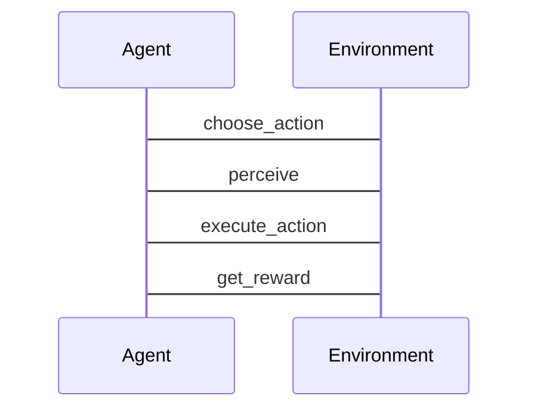

                 


# AI Agent的强化学习在机器人控制中的应用

> 关键词：AI Agent, 强化学习, 机器人控制, 算法原理, 实战应用

> 摘要：本文详细探讨了强化学习在AI Agent中的应用，特别是在机器人控制领域的实际应用。通过分析强化学习的基本原理、核心算法、系统架构设计以及项目实战，本文为读者提供了从理论到实践的全面指导。

---

# 第一部分：强化学习与AI Agent基础

## 第1章：强化学习的基本概念

### 1.1 强化学习的定义与特点

#### 1.1.1 强化学习的定义
强化学习（Reinforcement Learning，RL）是一种机器学习范式，其中智能体通过与环境交互来学习如何做出决策。智能体通过执行动作并观察结果来优化其策略，以最大化累计奖励。

#### 1.1.2 强化学习的核心特点
- **自主性**：智能体在没有外部干预的情况下自主决策。
- **试错性**：通过与环境交互，逐步学习最优策略。
- **延迟奖励**：奖励可能在动作执行后延迟获得，要求智能体具备长期规划能力。

#### 1.1.3 强化学习与监督学习的区别
| 特性 | 强化学习 | 监督学习 |
|------|----------|----------|
| 数据来源 | 环境反馈 | 标签数据 |
| 决策方式 | 自主决策 | 预测目标 |
| 奖励机制 | 延迟奖励 | 即时反馈 |

### 1.2 AI Agent的定义与特点

#### 1.2.1 AI Agent的定义
AI Agent（人工智能代理）是一种智能实体，能够感知环境并采取行动以实现目标。AI Agent可以是软件程序或物理设备，具备自主决策和问题解决能力。

#### 1.2.2 AI Agent的核心特点
- **自主性**：无需外部干预，自主决策。
- **反应性**：能够实时感知环境并做出反应。
- **目标导向**：所有行动均以实现特定目标为导向。

#### 1.2.3 AI Agent与传统自动化的区别
| 特性 | AI Agent | 传统自动化 |
|------|----------|------------|
| 决策方式 | 自主决策 | 预定义规则 |
| 学习能力 | 可通过强化学习优化策略 | 不具备学习能力 |
| 灵活性 | 能够适应环境变化 | 稳定性优先 |

### 1.3 强化学习在AI Agent中的应用背景

#### 1.3.1 强化学习在AI Agent中的作用
强化学习为AI Agent提供了自适应和优化决策的能力，使其能够根据环境反馈动态调整策略。

#### 1.3.2 AI Agent在机器人控制中的应用场景
- **工业机器人**：优化生产线上的抓取和装配动作。
- **服务机器人**：实现高效的路径规划和任务执行。
- **智能家居设备**：优化能源使用和设备调度。

#### 1.3.3 强化学习在机器人控制中的优势
- **自适应性**：能够根据环境变化自动调整策略。
- **高效性**：通过强化学习优化动作序列，提高执行效率。
- **灵活性**：适用于复杂和动态变化的环境。

---

## 第2章：强化学习的核心概念与数学模型

### 2.1 强化学习的基本原理

#### 2.1.1 状态（State）
状态是环境在某一时刻的描述，智能体通过感知状态来决定采取的动作。

#### 2.1.2 动作（Action）
动作是智能体在给定状态下采取的行动，能够改变环境的状态。

#### 2.1.3 奖励（Reward）
奖励是对智能体执行动作的反馈，用于指导智能体的学习过程。

#### 2.1.4 策略（Policy）
策略是智能体在给定状态下选择动作的概率分布，目标是最大化累计奖励。

#### 2.1.5 值函数（Value Function）
值函数用于衡量某个状态下采取某个动作后的预期累计奖励。

### 2.2 强化学习的数学模型

#### 2.2.1 状态转移概率矩阵
状态转移概率矩阵描述了从当前状态到下一个状态的概率。

$$ P(s' | s, a) $$

其中，$s$ 是当前状态，$a$ 是动作，$s'$ 是下一个状态。

#### 2.2.2 奖励函数的数学表达
奖励函数定义了在给定状态下采取某个动作后的奖励值。

$$ R(s, a) $$

#### 2.2.3 Q-learning算法的数学推导
Q-learning算法通过更新Q值函数来学习最优策略。

$$ Q(s, a) \leftarrow Q(s, a) + \alpha [R + \gamma \max Q(s', a') - Q(s, a)] $$

其中，$\alpha$ 是学习率，$\gamma$ 是折扣因子。

#### 2.2.4 策略梯度的数学推导
策略梯度方法通过优化策略的参数来最大化累计奖励。

$$ \theta \leftarrow \theta + \alpha \nabla_\theta J(\theta) $$

其中，$J(\theta)$ 是目标函数，$\nabla_\theta$ 是梯度。

---

## 第3章：强化学习的核心算法

### 3.1 Q-learning算法

#### 3.1.1 Q-learning的基本原理
Q-learning算法通过维护一个Q表来记录每个状态-动作对的期望奖励。

#### 3.1.2 Q-learning的实现步骤
1. 初始化Q表。
2. 重复以下步骤直到收敛：
   - 选择当前状态下的动作。
   - 执行动作并观察奖励。
   - 更新Q表。

#### 3.1.3 Q-learning的Python实现

```python
import numpy as np

class QLearning:
    def __init__(self, state_space, action_space, alpha=0.1, gamma=0.9):
        self.Q = np.zeros((state_space, action_space))
        self.alpha = alpha
        self.gamma = gamma

    def choose_action(self, state, epsilon=0.1):
        if np.random.random() < epsilon:
            return np.random.randint(0, self.action_space)
        return np.argmax(self.Q[state])

    def update_Q(self, state, action, reward, next_state):
        self.Q[state][action] = self.Q[state][action] + self.alpha * (reward + self.gamma * np.max(self.Q[next_state]) - self.Q[state][action])
```

---

## 第4章：系统分析与架构设计

### 4.1 项目背景与需求分析

#### 4.1.1 项目背景
以智能仓储机器人的导航为例，设计一个基于强化学习的AI Agent来实现路径规划。

#### 4.1.2 项目需求
- 实现路径规划功能。
- 优化导航效率。
- 提高避障能力。

### 4.2 系统功能设计

#### 4.2.1 系统功能模块
- **感知模块**：负责环境感知和状态识别。
- **决策模块**：负责策略选择和动作规划。
- **执行模块**：负责动作执行和状态更新。

#### 4.2.2 领域模型设计



### 4.3 系统架构设计

#### 4.3.1 系统架构设计


#### 4.3.2 系统接口设计



---

## 第5章：项目实战

### 5.1 环境安装与配置

#### 5.1.1 安装Python环境
安装Python 3.8及以上版本，并配置好相关开发工具。

#### 5.1.2 安装依赖库
安装必要的Python库，如`numpy`, `tensorflow`, `pymermaid`。

### 5.2 系统核心实现

#### 5.2.1 环境模拟实现

```python
class Environment:
    def __init__(self, grid_size):
        self.grid_size = grid_size
        self.agent_pos = (0, 0)
        self.goal_pos = (grid_size-1, grid_size-1)

    def get_state(self):
        return self.agent_pos

    def step(self, action):
        # 更新位置
        new_pos = self.agent_pos + action
        # 判断是否越界
        if new_pos[0] < 0 or new_pos[0] >= self.grid_size:
            reward = -1
            done = True
        elif new_pos[1] < 0 or new_pos[1] >= self.grid_size:
            reward = -1
            done = True
        else:
            reward = 1 if new_pos == self.goal_pos else 0
            done = (new_pos == self.goal_pos)
        self.agent_pos = new_pos
        return self.get_state(), reward, done
```

#### 5.2.2 智能体训练实现

```python
class Agent:
    def __init__(self, state_space, action_space, alpha=0.1, gamma=0.9):
        self.Q = np.zeros((state_space, action_space))
        self.alpha = alpha
        self.gamma = gamma

    def choose_action(self, state, epsilon=0.1):
        if np.random.random() < epsilon:
            return np.random.randint(0, self.action_space)
        return np.argmax(self.Q[state])

    def update_Q(self, state, action, reward, next_state):
        self.Q[state][action] += self.alpha * (reward + self.gamma * np.max(self.Q[next_state]) - self.Q[state][action])
```

#### 5.2.3 系统交互流程


### 5.3 实验结果与分析

#### 5.3.1 训练过程展示
训练过程中，智能体逐步优化其Q表，最终实现高效的路径规划。

#### 5.3.2 算法效果对比
对比不同强化学习算法在机器人控制中的表现，分析其优缺点。

### 5.4 项目小结

---

## 第6章：总结与展望

### 6.1 核心内容总结
强化学习为AI Agent提供了强大的决策能力，能够有效应用于机器人控制领域。

### 6.2 实践中的注意事项
- 算法的收敛性需要重点关注。
- 系统设计需要考虑实时性和稳定性。

### 6.3 未来研究方向
- 更高效的强化学习算法。
- 多智能体协同控制。
- 强化学习在复杂环境中的应用。

---

作者：AI天才研究院/AI Genius Institute & 禅与计算机程序设计艺术 /Zen And The Art of Computer Programming

