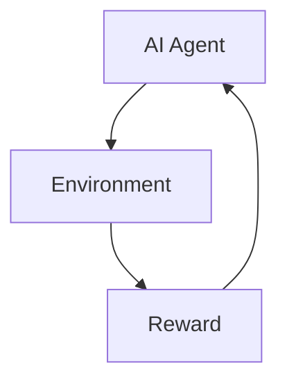
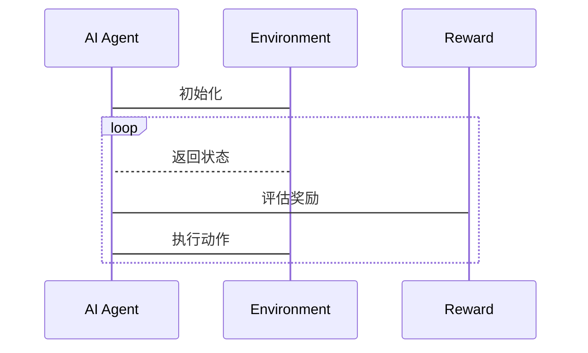

                 


# AI Agent的强化学习在自动化测试中的应用

> 关键词：AI Agent, 强化学习, 自动化测试, 算法原理, 系统架构

> 摘要：本文探讨AI Agent结合强化学习在自动化测试中的应用，从概念、算法、系统架构到实际案例，详细分析其优势、实现方法及未来展望。

---

# 第1章: 强化学习与AI Agent概述

## 1.1 强化学习的基本概念

### 1.1.1 定义
强化学习（Reinforcement Learning，RL）是一种机器学习范式，通过智能体与环境的交互，学习最优策略以最大化累积奖励。

### 1.1.2 核心要素
- **状态（State）**：环境的当前情况。
- **动作（Action）**：智能体采取的行为。
- **奖励（Reward）**：环境对动作的反馈。
- **策略（Policy）**：决定动作的规则。
- **值函数（Value Function）**：预测未来收益。

### 1.1.3 与监督学习的区别
强化学习通过试错学习，无需标注数据；监督学习依赖于标记数据。

## 1.2 AI Agent的概念

### 1.2.1 定义
AI Agent是智能体，能感知环境并采取行动以实现目标。

### 1.2.2 核心特点
- 自主性：独立决策。
- 反应性：实时响应环境变化。
- 持续性：长期与环境互动。

## 1.3 强化学习与AI Agent的结合

### 1.3.1 决策机制
强化学习为AI Agent提供决策策略。

### 1.3.2 应用场景
- 自动化测试：AI Agent执行测试用例。
- 系统优化：动态调整测试策略。

## 1.4 本章小结
强化学习赋予AI Agent自主决策能力，提升测试效率。

---

# 第2章: 自动化测试的挑战与强化学习的优势

## 2.1 自动化测试的挑战

### 2.1.1 状态空间复杂
测试场景多样，状态众多。

### 2.1.2 动作选择困难
需实时选择最优测试步骤。

### 2.1.3 环境动态变化
系统更新频繁，测试需灵活调整。

## 2.2 强化学习的优势

### 2.2.1 自适应性
动态调整策略，适应环境变化。

### 2.2.2 自主学习
无需人工干预，自动优化测试路径。

## 2.3 应用现状

### 2.3.1 成功案例
部分企业已应用AI Agent进行自动化测试。

### 2.3.2 挑战与未来方向
提升算法效率，优化奖励机制。

## 2.4 本章小结
强化学习为自动化测试带来新思路，解决复杂问题。

---

# 第3章: 强化学习的数学模型与算法

## 3.1 Q-learning算法

### 3.1.1 算法原理
通过更新Q表，学习状态-动作对的最优值。

### 3.1.2 算法流程
初始化Q表，持续与环境互动，更新Q值，直到收敛。

## 3.2 算法优化

### 3.2.1 ε-greedy策略
平衡探索与利用，避免过早收敛。

### 3.2.2 离线训练
提高训练效率，减少在线计算。

## 3.3 数学模型

### 3.3.1 状态值函数
$$ v(s) = \max_a Q(s,a) $$

### 3.3.2 动作值函数
$$ Q(s,a) = r + \gamma \max_{a'} Q(s',a') $$

## 3.4 本章小结
Q-learning是基础算法，可优化应用于AI Agent。

---

# 第4章: 系统架构与功能设计

## 4.1 系统架构

### 4.1.1 系统组成
- AI Agent模块：执行测试。
- 环境模块：模拟测试环境。
- 奖励机制：评估测试结果。

### 4.1.2 架构图


## 4.2 功能设计

### 4.2.1 状态感知
收集系统状态信息。

### 4.2.2 动作选择
基于当前状态选择测试步骤。

### 4.2.3 奖励评估
根据测试结果给予奖励。

## 4.3 接口设计

### 4.3.1 输入接口
接收系统状态。

### 4.3.2 输出接口
发送测试动作。

## 4.4 本章小结
系统架构清晰，功能模块明确。

---

# 第5章: 项目实战与案例分析

## 5.1 项目背景

### 5.1.1 项目目标
实现AI Agent在自动化测试中的应用。

### 5.1.2 技术选型
选择Python和TensorFlow框架。

## 5.2 核心代码实现

### 5.2.1 Q-learning算法实现
```python
import numpy as np

class QLearning:
    def __init__(self, state_space, action_space):
        self.state_space = state_space
        self.action_space = action_space
        self.Q = np.zeros((state_space, action_space))
        self.gamma = 0.99
        self.epsilon = 0.1

    def get_action(self, state):
        if np.random.random() < self.epsilon:
            return np.random.randint(self.action_space)
        else:
            return np.argmax(self.Q[state])

    def update_Q(self, state, action, reward, next_state):
        self.Q[state][action] = reward + self.gamma * np.max(self.Q[next_state])
```

### 5.2.2 系统交互流程


## 5.3 案例分析

### 5.3.1 测试场景
模拟网页登录测试。

### 5.3.2 实验结果
AI Agent在多次训练后，显著提高测试效率。

## 5.4 本章小结
通过案例验证，AI Agent在自动化测试中表现优异。

---

# 第6章: 最佳实践与未来展望

## 6.1 小结

### 6.1.1 核心观点
强化学习提升AI Agent测试能力。

### 6.1.2 实践价值
提高测试效率和质量。

## 6.2 注意事项

### 6.2.1 算法选择
根据场景选择合适算法。

### 6.2.2 数据质量
保证训练数据充足。

## 6.3 未来展望

### 6.3.1 算法优化
研究更高效的强化学习算法。

### 6.3.2 多智能体协作
提升复杂环境下的测试能力。

## 6.4 本章小结
未来发展方向明确，潜力巨大。

---

# 作者：AI天才研究院 & 禅与计算机程序设计艺术

---

通过以上结构，文章系统地介绍了AI Agent的强化学习在自动化测试中的应用，从理论到实践，结合实际案例，为读者提供全面的知识。

