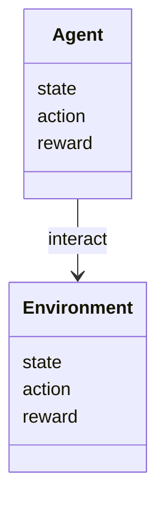
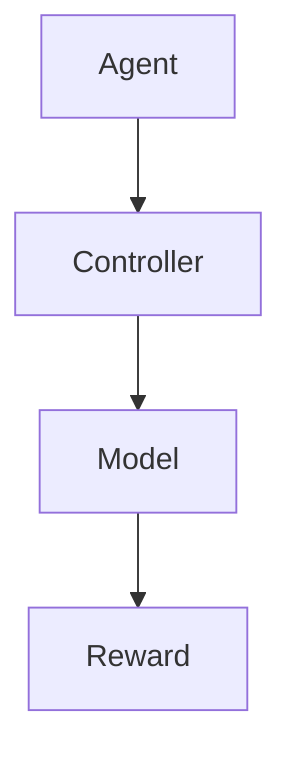

                 


# AI Agent的强化学习应用

**关键词**：AI Agent、强化学习、Q-learning、Deep Q-Networks、系统架构、项目实战

**摘要**：本文详细探讨了AI Agent在强化学习中的应用，从基本概念到核心算法，再到系统架构和项目实战，全面解析强化学习在AI Agent中的原理和实现。文章通过实际案例分析，帮助读者理解如何在实际场景中应用强化学习算法，同时结合数学模型和代码示例，深入浅出地讲解了强化学习的核心原理。

---

## 第1章: AI Agent与强化学习概述

### 1.1 AI Agent的基本概念

#### 1.1.1 AI Agent的定义与特点

AI Agent（人工智能代理）是指在计算机系统中，能够感知环境并采取行动以实现目标的实体。AI Agent的核心特点包括：

- **自主性**：能够在没有外部干预的情况下独立运行。
- **反应性**：能够根据环境的变化调整自己的行为。
- **目标导向性**：所有行动都是为了实现特定的目标。
- **社会性**：能够与其他AI Agent或人类进行交互和协作。

#### 1.1.2 强化学习的基本概念

强化学习（Reinforcement Learning, RL）是一种机器学习范式，其中智能体通过与环境交互来学习如何采取最优行动以最大化累积奖励。强化学习的核心要素包括：

- **状态（State）**：智能体所处环境的当前情况。
- **动作（Action）**：智能体在某一状态下采取的行为。
- **奖励（Reward）**：智能体采取动作后获得的反馈，用于评估该动作的好坏。
- **策略（Policy）**：智能体在某一状态下选择动作的概率分布。
- **价值函数（Value Function）**：衡量某一状态下采取特定行动后的预期回报。

#### 1.1.3 AI Agent与强化学习的结合

AI Agent通过强化学习算法，能够根据环境反馈不断优化自己的行为策略。例如，在游戏中，AI Agent可以通过强化学习学会如何选择最优动作，以达到得分最大化的目标。

---

### 1.2 强化学习的核心概念

#### 1.2.1 状态、动作、奖励的定义

- **状态（State）**：环境中的当前情况，例如在迷宫中，AI Agent的位置可以作为状态。
- **动作（Action）**：AI Agent在某一状态下可以执行的行为，例如“左转”、“右转”、“前进”。
- **奖励（Reward）**：AI Agent采取动作后获得的反馈，例如到达终点获得+1奖励，碰撞墙壁获得-1奖励。

#### 1.2.2 Q-learning算法的基本原理

Q-learning是一种基于价值函数的强化学习算法，通过更新Q值表（Q-table）来学习最优策略。Q值表记录了在某一状态下采取某一动作后的预期回报。

#### 1.2.3 策略与价值函数的对比

- **策略（Policy）**：直接定义在给定状态下采取某一动作的概率。
- **价值函数（Value Function）**：衡量某一状态下采取特定行动后的预期回报。

---

### 1.3 AI Agent在强化学习中的应用场景

#### 1.3.1 游戏AI的应用

在游戏AI中，强化学习可以帮助AI Agent学习如何在游戏中做出最优决策，例如在《英雄联盟》中，AI Agent可以学习如何选择英雄和制定战术。

#### 1.3.2 机器人控制的实现

在机器人控制领域，强化学习可以用于训练机器人在复杂环境中完成任务，例如在工业生产线上完成精确的组装任务。

#### 1.3.3 自动交易系统的构建

在金融领域，强化学习可以用于训练自动交易系统，帮助AI Agent在股票市场中做出最优的买卖决策。

---

### 1.4 强化学习与传统机器学习的对比

#### 1.4.1 监督学习、无监督学习与强化学习的区别

- **监督学习（Supervised Learning）**：基于标记的训练数据进行学习，目标是预测新的数据点。
- **无监督学习（Unsupervised Learning）**：基于未标记的数据进行学习，目标是发现数据中的结构。
- **强化学习（Reinforcement Learning）**：通过与环境交互学习，目标是最大化累积奖励。

#### 1.4.2 强化学习的独特优势

强化学习的核心优势在于其通过与环境交互来学习，能够在动态变化的环境中自适应地调整策略。

---

### 1.5 本章小结

本章介绍了AI Agent和强化学习的基本概念，探讨了AI Agent在强化学习中的应用场景，并对比了强化学习与其他机器学习范式的区别。通过这些内容，读者可以初步了解强化学习的基本原理和其在AI Agent中的重要性。

---

## 第2章: Q-learning算法详解

### 2.1 Q-learning的基本原理

Q-learning是一种基于价值函数的强化学习算法，通过不断更新Q值表来逼近最优策略。Q值表记录了在某一状态下采取某一动作后的预期回报。

---

### 2.2 Q-learning的实现步骤

#### 2.2.1 状态空间的定义

- **状态空间**：所有可能状态的集合，例如在迷宫中，AI Agent的位置可以作为状态。

#### 2.2.2 动作空间的确定

- **动作空间**：所有可能动作的集合，例如“左转”、“右转”、“前进”。

#### 2.2.3 奖励函数的设计

- **奖励函数**：定义在不同状态下采取不同动作后获得的奖励。

---

### 2.3 Q-learning的优缺点分析

#### 2.3.1 优点

- 简单易实现。
- 适用于离散状态和动作空间。

#### 2.3.2 缺点

- 对连续状态和动作空间的处理能力有限。
- 需要较大的状态空间覆盖，计算开销较高。

---

## 第3章: Deep Q-Networks (DQN)算法

### 3.1 DQN算法的基本原理

Deep Q-Networks（DQN）是一种结合了深度学习和强化学习的算法，通过神经网络来近似Q值函数。DQN的核心思想是使用神经网络来预测Q值，而不是使用Q值表。

---

### 3.2 DQN算法的数学模型

#### 3.2.1 神经网络的输入输出

- **输入**：当前状态。
- **输出**：在当前状态下，每个动作的Q值。

#### 3.2.2 损失函数的计算

- 损失函数：均方误差（Mean Squared Error，MSE）。
- 公式：$$L = \frac{1}{2} \sum_{i=1}^{n} (y_i - Q(s,a))^2$$

---

### 3.3 DQN算法的实现步骤

#### 3.3.1 神经网络模型的设计

- 使用卷积神经网络（CNN）或全连接神经网络（FCN）。

#### 3.3.2 经验回放的实现

- **经验回放**：将历次交互的经验存储在记忆库中，训练时随机抽取小批量经验进行更新。

#### 3.3.3 网络更新的策略

- **目标网络**：每隔一定步数更新目标网络的权重。
- **策略网络**：根据当前网络权重计算动作。

---

## 第4章: 强化学习中的数学模型与公式

### 4.1 状态转移模型

#### 4.1.1 Markov决策过程（MDP）的定义

- **MDP**：马尔可夫决策过程，描述了强化学习问题的数学模型。

#### 4.1.2 转移概率矩阵的表示

- **转移概率矩阵**：表示从一个状态转移到另一个状态的概率。

---

### 4.2 Q值更新的数学推导

#### 4.2.1 Bellman方程的建立

- **Bellman方程**：描述了Q值的最优解。
- 公式：$$Q^*(s,a) = \max_{a'} [r(s,a,a') + \gamma \sum_{s'} P(s'|s,a) Q^*(s',a')]$$

#### 4.2.2 Q值更新

- **Q值更新公式**：$$Q(s,a) = Q(s,a) + \alpha [r + \gamma \max Q(s',a') - Q(s,a)]$$

---

## 第5章: 系统分析与架构设计

### 5.1 系统功能设计

#### 5.1.1 领域模型（Domain Model）

- **领域模型**：描述系统中各个实体及其关系。
- **Mermaid类图**：展示领域模型中的类及其关系。



---

### 5.2 系统架构设计

#### 5.2.1 系统架构图

- **Mermaid架构图**：展示系统的主要组件及其交互。



---

## 第6章: 项目实战

### 6.1 环境配置

- **安装依赖**：安装Python、TensorFlow、OpenAI Gym等。

### 6.2 系统核心实现源代码

```python
import gym
import numpy as np

class Agent:
    def __init__(self, env):
        self.env = env
        self.q_table = np.zeros([env.observation_space.n, env.action_space.n])
    
    def take_action(self, state):
        return np.argmax(self.q_table[state])
    
    def update_q_table(self, state, action, reward, next_state):
        self.q_table[state][action] += 0.1 * (reward + 0.95 * np.max(self.q_table[next_state]) - self.q_table[state][action])

def main():
    env = gym.make('FrozenLake-v1')
    agent = Agent(env)
    for _ in range(1000):
        state = env.reset()
        while True:
            action = agent.take_action(state)
            next_state, reward, done, _ = env.step(action)
            agent.update_q_table(state, action, reward, next_state)
            if done:
                break
            state = next_state
    print("Q-table:")
    print(agent.q_table)

if __name__ == "__main__":
    main()
```

---

## 第7章: 最佳实践和小结

### 7.1 最佳实践

- **算法选择**：根据具体场景选择合适的强化学习算法。
- **训练策略**：合理设置奖励机制，平衡探索与利用。
- **模型调优**：通过超参数调优提升性能。

### 7.2 小结

本文详细介绍了AI Agent在强化学习中的应用，从基本概念到核心算法，再到系统架构和项目实战，全面解析了强化学习在AI Agent中的原理和实现。通过实际案例分析，帮助读者理解如何在实际场景中应用强化学习算法。

---

**作者：AI天才研究院/AI Genius Institute & 禅与计算机程序设计艺术 /Zen And The Art of Computer Programming**

