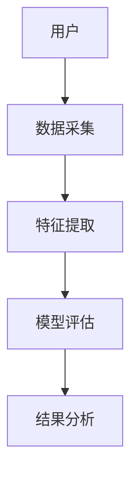

                 


# AI Agent的性能评估指标与方法

> 关键词：AI Agent, 性能评估, 评估指标, 评估方法, 算法原理

> 摘要：本文系统地探讨了AI Agent的性能评估指标与方法，从背景、核心概念、算法原理、系统架构到项目实战，全面分析了AI Agent性能评估的各个方面。通过丰富的图表和代码示例，本文为读者提供了理论与实践相结合的深度解析。

---

# 第1章: AI Agent的概述与性能评估的重要性

## 1.1 AI Agent的基本概念

### 1.1.1 什么是AI Agent
AI Agent（人工智能代理）是指在特定环境中能够感知并自主行动以实现目标的智能体。它能够通过传感器获取环境信息，利用推理能力做出决策，并通过执行器与环境交互。

$$\text{AI Agent} = \text{感知} + \text{推理} + \text{行动}$$

### 1.1.2 AI Agent的核心特征
1. **自主性**：能够在没有外部干预的情况下运行。
2. **反应性**：能够实时感知环境并做出反应。
3. **目标导向性**：所有行为都以实现特定目标为导向。
4. **学习能力**：通过经验或数据优化自身性能。

### 1.1.3 AI Agent的应用场景
- **推荐系统**：如电商推荐、个性化内容推荐。
- **智能助手**：如Siri、Alexa等。
- **自动驾驶**：如自动驾驶汽车中的决策系统。
- **机器人控制**：如工业机器人和家庭服务机器人。

## 1.2 性能评估的重要性

### 1.2.1 为什么需要评估AI Agent的性能
AI Agent的目标是通过优化性能来提高用户体验和效率。性能评估是验证AI Agent是否达到预期目标的关键步骤。

$$\text{性能评估} = \text{输入} + \text{模型} + \text{输出}$$

### 1.2.2 性能评估对AI Agent开发的意义
- **验证设计目标**：确保AI Agent的设计符合预期。
- **优化性能表现**：通过评估结果优化模型和算法。
- **提升用户体验**：通过评估发现问题并改进用户体验。

### 1.2.3 性能评估的常见挑战
- **数据多样性**：需要处理不同类型和规模的数据。
- **指标选择**：如何选择合适的评估指标。
- **环境动态性**：AI Agent运行的环境通常是动态变化的。

## 1.3 本书的目标与结构

### 1.3.1 本书的核心目标
通过系统化的分析和方法，帮助读者全面理解AI Agent的性能评估指标与方法。

### 1.3.2 本书的章节安排
- **背景与核心概念**：了解AI Agent的基本概念和性能评估的重要性。
- **核心概念与联系**：分析性能评估的核心概念和它们之间的联系。
- **算法原理**：详细讲解评估算法的原理和实现。
- **系统架构设计**：从系统角度分析性能评估的实现。
- **项目实战**：通过具体案例展示性能评估的过程。
- **最佳实践与总结**：总结经验和提供未来发展方向。

### 1.3.3 如何有效阅读本书
建议读者按照章节顺序阅读，结合实际项目或问题，逐步理解和应用所学内容。

---

# 第2章: AI Agent性能评估的背景与问题描述

## 2.1 AI Agent的性能评估问题背景

### 2.1.1 当前AI Agent技术的发展现状
AI Agent技术正在快速发展，应用场景日益广泛，但性能评估的标准化和系统化仍需进一步完善。

### 2.1.2 性能评估在AI Agent中的关键作用
性能评估是衡量AI Agent优劣的核心标准，也是优化AI Agent性能的重要手段。

### 2.1.3 常见的性能评估误区
- **忽视数据质量**：数据偏差可能导致评估结果不准确。
- **单一指标误导**：仅关注某一个指标可能忽略其他重要方面。
- **忽略动态变化**：AI Agent的性能可能在不同环境下表现不一。

## 2.2 性能评估的核心问题

### 2.2.1 评估目标的多样性
AI Agent的性能评估需要考虑多个目标，如准确性、响应时间、资源消耗等。

### 2.2.2 评估指标的选择与权重
不同的评估指标适用于不同的场景，选择合适的指标并赋予合理的权重至关重要。

### 2.2.3 评估方法的可操作性
评估方法需要具备可操作性，能够在实际应用中方便地实施。

## 2.3 问题的边界与外延

### 2.3.1 性能评估的边界条件
- **数据范围**：评估数据的来源和范围。
- **时间限制**：评估的时间窗口和周期。
- **环境条件**：评估时的环境状态。

### 2.3.2 与其他评估方法的对比
性能评估与传统软件评估的对比，突出AI Agent的特殊性和复杂性。

### 2.3.3 未来发展的潜在方向
随着AI技术的进步，性能评估的方法和指标将更加多样化和智能化。

---

# 第3章: AI Agent性能评估的核心概念与联系

## 3.1 核心概念的原理

### 3.1.1 性能评估的基本原理
通过输入数据，运行AI Agent模型，分析输出结果，得出性能指标。

$$\text{性能评估} = \text{输入} \rightarrow \text{模型} \rightarrow \text{输出}$$

### 3.1.2 评估指标的分类与特点
评估指标可以分为准确性、效率、鲁棒性、可解释性等类别。

### 3.1.3 评估方法的优劣势对比
- **准确性评估**：优点是直观，缺点是可能忽略效率因素。
- **效率评估**：优点是快速响应，缺点是可能影响准确性。
- **鲁棒性评估**：优点是稳定，缺点是难以量化。

## 3.2 核心概念的属性特征对比

| 评估指标 | 属性 | 描述 |
|----------|------|------|
| 准确率   | 数值范围 | 0-100% |
| 响应时间 | 时间单位 | 毫秒/秒 |
| 鲁棒性   | 稳定性 | 高/中/低 |
| 可解释性 | 明确性 | 高/中/低 |

### 3.2.2 方法适用场景分析
- 准确率适用于需要高精度的场景。
- 响应时间适用于需要快速响应的场景。
- 鲁棒性适用于需要稳定性的场景。

## 3.3 ER实体关系图架构

```mermaid
erDiagram
    actor 用户
    actor 系统
    actor 环境
    user 中间人
    (用户) o-|> (系统) : 请求
    (系统) o-|> (环境) : 感知
    (环境) o-|> (系统) : 反馈
    (系统) o-|> (用户) : 响应
```

---

# 第4章: AI Agent性能评估的算法原理

## 4.1 算法原理概述

### 4.1.1 常见的评估算法
- **准确率（Accuracy）**：正确预测的比例。
- **F1分数（F1 Score）**：精确率和召回率的调和平均。
- **AUC曲线（Area Under Curve）**：评估分类器性能的综合指标。

### 4.1.2 算法的基本思想
以分类问题为例，准确率衡量整体正确性，F1分数平衡精确率和召回率，AUC曲线适用于概率评估。

### 4.1.3 算法的优缺点分析
- **准确率**：优点是简单直观，缺点是可能掩盖分类不平衡的问题。
- **F1分数**：优点是平衡精确率和召回率，缺点是不考虑概率信息。
- **AUC曲线**：优点是综合能力强，缺点是难以直接解释。

## 4.2 算法原理的数学模型

### 4.2.1 准确率的数学公式
$$\text{准确率} = \frac{\text{正确预测的数量}}{\text{总预测数量}}$$

### 4.2.2 F1分数的数学公式
$$\text{F1分数} = \frac{2 \times \text{精确率} \times \text{召回率}}{\text{精确率} + \text{召回率}}$$

### 4.2.3 AUC曲线的计算
AUC曲线是将分类器的输出概率排序后，计算每个点的曲线下面积。

---

# 第5章: AI Agent性能评估的系统架构设计

## 5.1 问题场景介绍
以电商推荐系统为例，分析AI Agent的性能评估需求。

## 5.2 系统功能设计

### 5.2.1 数据采集模块
- 负责收集用户行为数据和商品信息。

### 5.2.2 特征提取模块
- 对数据进行特征提取和预处理。

### 5.2.3 模型评估模块
- 使用准确率、F1分数等指标评估模型性能。

## 5.3 系统架构图



---

# 第6章: AI Agent性能评估的项目实战

## 6.1 环境安装
安装必要的Python库，如scikit-learn、pandas等。

## 6.2 核心代码实现

```python
from sklearn.metrics import accuracy_score, f1_score, roc_auc_score
import pandas as pd

# 示例数据
y_true = [0, 1, 0, 1]
y_pred = [0, 1, 1, 1]

# 计算准确率
accuracy = accuracy_score(y_true, y_pred)

# 计算F1分数
f1 = f1_score(y_true, y_pred)

# 计算AUC
roc_auc = roc_auc_score(y_true, y_pred)
```

## 6.3 代码解读与分析
- 准确率：计算正确预测的比例。
- F1分数：平衡精确率和召回率。
- AUC：评估分类器的综合性能。

## 6.4 实际案例分析
通过电商推荐系统的案例，详细分析评估结果，优化模型参数。

## 6.5 项目小结
总结项目经验，提出改进建议。

---

# 第7章: 最佳实践与总结

## 7.1 最佳实践 tips

### 7.1.1 数据质量的重要性
确保数据的多样性和代表性。

### 7.1.2 指标选择的合理性
根据具体场景选择合适的评估指标。

### 7.1.3 结果解读的准确性
避免单一指标误导，综合分析多个指标。

## 7.2 小结
通过系统化的分析和实践，我们掌握了AI Agent性能评估的核心方法和技巧。

## 7.3 注意事项
- 定期更新评估指标，适应环境变化。
- 注重模型的可解释性，便于优化和改进。
- 避免过度依赖单一指标，保持全面视角。

## 7.4 拓展阅读
推荐相关书籍和论文，深入学习AI Agent和性能评估的知识。

---

# 作者：AI天才研究院 & 禅与计算机程序设计艺术

---

通过以上内容，我们系统地探讨了AI Agent的性能评估指标与方法，从理论到实践，帮助读者全面理解和应用这些知识。

