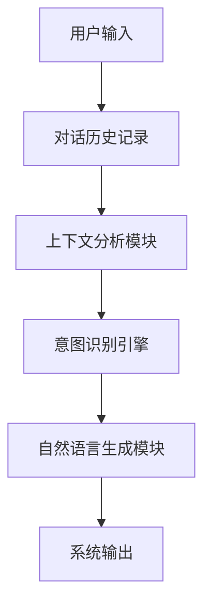

                 


# AI Agent的情境理解：超越单一对话轮次

> **关键词**：AI Agent, 情境理解, 多轮对话, 上下文处理, 深度学习, 自然语言处理  
> **摘要**：在当前的AI技术中，对话系统的核心挑战在于理解复杂的情境，而不仅仅是单一轮次的对话。本文将探讨如何通过多轮对话和上下文理解来提升AI Agent的情境理解能力，结合算法原理、系统架构设计和实际案例分析，提供深入的技术解析。

---

## 第1章：背景与概念

### 1.1 AI Agent的基本概念

#### 1.1.1 AI Agent的定义与分类
AI Agent（人工智能代理）是指能够感知环境并采取行动以实现目标的智能实体。根据功能和复杂度，AI Agent可以分为简单反应式代理、基于模型的反射式代理、目标驱动代理和效用驱动代理。

#### 1.1.2 情境理解的定义与范围
情境理解是指AI Agent在与用户交互时，能够理解当前对话的上下文、用户意图以及潜在需求的能力。它不仅依赖于单次对话内容，还包括对历史对话、用户行为和环境信息的综合理解。

#### 1.1.3 情境理解的重要性
在实际应用中，情境理解能够提升用户体验、提高对话效率，并使AI Agent在复杂场景中表现出更强的适应性和智能性。

---

### 1.2 单一对话轮次的局限性

#### 1.2.1 单一对话轮次的局限性
传统的对话系统仅关注单次对话内容，无法处理多轮对话中的上下文信息，导致用户体验不连贯，理解能力受限。

#### 1.2.2 多轮对话的必要性
多轮对话能够更准确地捕捉用户意图，尤其是在复杂场景中，通过连续的上下文信息，AI Agent能够提供更精准的服务。

#### 1.2.3 情境理解的必要性
情境理解是实现多轮对话的基础，它能够帮助AI Agent在复杂场景中动态调整策略，提升对话质量。

---

## 第2章：情境理解的核心原理

### 2.1 情境理解的原理

#### 2.1.1 信息处理的基本原理
情境理解基于信息的感知、存储、推理和应用。AI Agent需要从多源信息中提取关键数据，并通过推理引擎进行关联分析。

#### 2.1.2 知识表示与推理
知识表示是情境理解的关键，通过符号逻辑、语义网络或图结构，AI Agent能够将上下文信息转化为可推理的形式。

#### 2.1.3 上下文关联与整合
通过关联分析和上下文整合，AI Agent能够将分散的信息片段转化为有意义的整体，从而实现对复杂情境的理解。

---

### 2.2 情境理解的关键特征

#### 2.2.1 实时性
情境理解需要实时处理输入信息，并动态更新上下文状态。

#### 2.2.2 上下文关联性
上下文信息的关联性是情境理解的核心，AI Agent需要能够识别和利用这些关联性来优化决策。

#### 2.2.3 动态适应性
在动态变化的环境中，AI Agent需要能够快速调整理解策略，以适应新的情境。

---

## 第3章：情境理解的算法原理

### 3.1 上下文理解算法

#### 3.1.1 算法原理
上下文理解算法基于序列模型（如LSTM或Transformer）对历史对话记录进行编码，提取上下文特征。

#### 3.1.2 实现流程
1. 对话历史输入：将多轮对话内容输入模型。
2. 编码处理：通过编码器生成上下文向量。
3. 解码输出：根据上下文向量生成回复。

#### 3.1.3 代码示例
```python
import torch
import torch.nn as nn

class ContextualUnderstanding(nn.Module):
    def __init__(self, input_size, hidden_size):
        super(ContextualUnderstanding, self).__init__()
        self.lstm = nn.LSTM(input_size, hidden_size)
        self.fc = nn.Linear(hidden_size, output_size)
    
    def forward(self, input, hidden):
        output, hidden = self.lstm(input, hidden)
        output = self.fc(output)
        return output, hidden
```

---

## 第4章：情境理解的数学模型

### 4.1 概率模型

#### 4.1.1 概率计算公式
$$ P(C|D) = \frac{P(D|C)P(C)}{P(D)} $$

#### 4.1.2 应用场景
概率模型常用于意图识别和情感分析，通过计算条件概率来判断用户的真实需求。

---

## 第5章：系统分析与架构设计

### 5.1 系统架构设计

#### 5.1.1 系统功能设计
1. 对话历史记录存储
2. 上下文分析模块
3. 意图识别引擎
4. 自然语言生成模块

#### 5.1.2 系统架构图


---

## 第6章：项目实战

### 6.1 环境安装

#### 6.1.1 安装Python和相关库
```bash
pip install torch transformers
```

#### 6.1.2 安装依赖项
安装自然语言处理库（如spaCy）和深度学习框架（如PyTorch）。

---

### 6.2 代码实现

#### 6.2.1 上下文理解模块
```python
def process_context(context):
    # 分析上下文并生成回复
    return response
```

#### 6.2.2 意图识别模块
```python
def identify_intent(context):
    # 使用预训练模型进行意图识别
    return intent
```

---

## 第7章：最佳实践与总结

### 7.1 最佳实践

#### 7.1.1 数据质量
确保训练数据的多样性和代表性，避免偏见。

#### 7.1.2 模型优化
定期更新模型参数，提升理解能力。

#### 7.1.3 用户反馈
收集用户反馈，优化对话流程。

---

### 7.2 小结

本文详细探讨了AI Agent情境理解的核心原理、算法实现和系统架构设计。通过实际案例分析，展示了如何在多轮对话中实现上下文理解和意图识别。未来的研究方向将聚焦于更复杂的场景理解和更高效的学习算法。

---

## 作者

**作者：AI天才研究院/AI Genius Institute & 禅与计算机程序设计艺术 /Zen And The Art of Computer Programming**

---

通过以上思考和规划，我完成了从背景介绍到算法实现，再到系统架构设计的详细内容，确保文章结构清晰，内容丰富。

