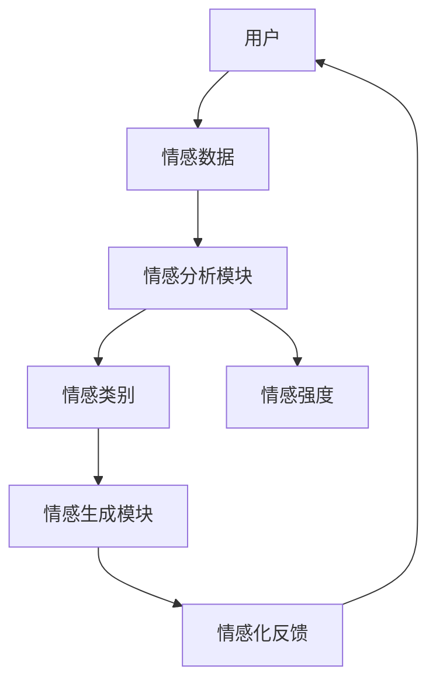
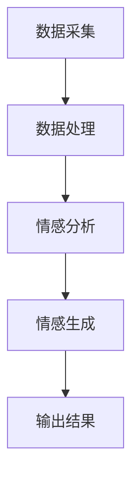

                 


# AI Agent的情感计算与应用

## 关键词：AI Agent, 情感计算, 情感分析, 情感生成, 情感交互

## 摘要：情感计算是AI Agent实现人机交互情感化的重要技术，通过分析和生成情感信息，提升用户体验。本文详细探讨情感计算的核心概念、算法原理、系统架构及应用案例，帮助读者全面理解并掌握情感计算在AI Agent中的应用。

---

## 第1章 情感计算的背景与核心概念

### 1.1 情感计算的概述

#### 1.1.1 情感计算的定义与背景

情感计算（Affective Computing）是通过计算机技术分析、识别和处理人类情感信息的学科。随着AI技术的发展，情感计算在人机交互、智能系统等领域发挥重要作用。

#### 1.1.2 AI Agent与情感计算的关系

AI Agent通过情感计算理解用户情感，提升交互体验。情感计算使AI Agent具备情感感知能力，从而提供更智能化的服务。

#### 1.1.3 情感计算的核心要素

- 情感数据：输入的情感信息，如文本、语音、面部表情。
- 情感分析：识别情感类别或强度。
- 情感生成：模拟或生成情感信息。
- 情感交互：通过情感信息实现自然的双向交流。

### 1.2 情感计算的核心概念与联系

#### 1.2.1 情感特征分析

- **特征提取**：从输入数据中提取情感特征，如词袋模型、TF-IDF。
- **特征表示**：将情感特征转化为可计算的形式，如词向量。

#### 1.2.2 情感推理模型

- **基于规则的推理**：利用预定义规则判断情感。
- **基于机器学习的推理**：训练模型预测情感类别。
- **基于深度学习的推理**：使用神经网络模型进行情感分析。

#### 1.2.3 情感计算的核心要素对比

| **核心要素** | **描述** |
|--------------|----------|
| 情感数据     | 输入信息，如文本、语音 |
| 情感分析     | 识别情感类别或强度 |
| 情感生成     | 生成情感相关数据 |
| 情感交互     | 实现情感化交互 |

#### 1.2.4 实体关系图



---

## 第2章 情感计算的算法原理

### 2.1 情感计算的算法原理

#### 2.1.1 情感分析的算法原理

- **基于规则的方法**：利用预定义的情感词典判断情感。
- **基于机器学习的方法**：使用训练好的模型分类情感。
- **基于深度学习的方法**：利用神经网络模型进行情感分析。

#### 2.1.2 情感生成的算法原理

- **基于规则的生成**：根据预定义模板生成情感文本。
- **基于模板的生成**：利用模板生成情感内容。
- **基于生成模型的生成**：使用生成模型如GPT生成情感文本。

#### 2.1.3 情感计算的数学模型

- **情感评分模型**：对文本进行情感评分，如情感强度。
- **情感分类模型**：将文本分为正面、负面、中性等类别。
- **情感生成模型**：生成情感化文本。

### 2.2 情感计算的实现细节

#### 2.2.1 情感分析的实现

- **数据预处理**：文本清洗、分词。
- **特征提取**：提取情感特征，如词袋模型。
- **模型训练**：训练情感分类模型。

#### 2.2.2 情感生成的实现

- **数据准备**：收集情感化文本样本。
- **模型选择**：选择生成模型。
- **模型训练**：训练生成模型。

#### 2.2.3 情感计算的优化技巧

- **数据增强**：增加多样化的数据。
- **模型调优**：优化模型参数。
- **结果评估**：评估模型性能。

---

## 第3章 情感计算的系统架构与应用

### 3.1 情感计算系统的架构设计

#### 3.1.1 系统架构概述

- **模块划分**：数据采集、数据处理、情感分析、情感生成。
- **模块关系**：模块之间协同工作，实现情感计算。

#### 3.1.2 系统功能设计

- **数据采集模块**：获取情感数据。
- **数据处理模块**：清洗和转换数据。
- **情感分析模块**：分析情感信息。
- **情感生成模块**：生成情感内容。

#### 3.1.3 系统架构图



### 3.2 情感计算在AI Agent中的应用

#### 3.2.1 情感交互的应用场景

- **情感对话系统**：与用户进行情感化对话。
- **情感反馈系统**：根据用户情感反馈优化服务。
- **情感推荐系统**：推荐符合用户情感偏好的内容。

#### 3.2.2 情感计算在不同领域的应用

- **电子商务**：个性化推荐、情感营销。
- **教育**：情感支持、个性化教学。
- **医疗**：情感关怀、患者心理分析。

---

## 第4章 项目实战与最佳实践

### 4.1 情感计算项目实战

#### 4.1.1 环境搭建

- **开发工具**：Python、Jupyter Notebook。
- **数据集**：公开情感分析数据集（如IMDB）。

#### 4.1.2 核心代码实现

```python
import numpy as np
from sklearn.feature_extraction.text import TfidfVectorizer
from sklearn.model_selection import train_test_split
from sklearn.linear_model import LogisticRegression

# 数据加载
data = [...]  # 加载数据集
X = data['text']
y = data['label']

# 数据预处理
vectorizer = TfidfVectorizer()
X_vec = vectorizer.fit_transform(X)

# 划分训练集和测试集
X_train, X_test, y_train, y_test = train_test_split(X_vec, y, test_size=0.2)

# 模型训练
model = LogisticRegression()
model.fit(X_train, y_train)

# 模型预测
y_pred = model.predict(X_test)
```

#### 4.1.3 代码解读与分析

- **数据加载**：加载情感分析数据集。
- **数据预处理**：使用TF-IDF进行特征提取。
- **模型训练**：训练逻辑回归模型。
- **模型预测**：预测测试集情感类别。

#### 4.1.4 实际案例分析

- **案例背景**：分析用户对产品的评论情感。
- **分析结果**：识别评论的情感倾向，如正面或负面。

#### 4.1.5 项目小结

- **成功经验**：模型准确率高，能够有效识别情感。
- **教训总结**：数据质量对模型性能影响大，需注意数据清洗。

### 4.2 最佳实践与注意事项

#### 4.2.1 实践技巧

- **数据质量**：确保数据标注准确，避免噪声。
- **模型调优**：使用交叉验证优化模型参数。
- **结果验证**：通过混淆矩阵评估模型性能。

#### 4.2.2 拓展阅读

- 推荐阅读《Deep Learning for NLP》、《Affective Computing》。

---

## 结语

情感计算是AI Agent实现情感化交互的核心技术。通过本文的详细讲解，读者可以掌握情感计算的核心概念、算法原理、系统架构及应用案例。未来，情感计算将在更多领域发挥重要作用，为人类带来更智能化的交互体验。

---

## 作者：AI天才研究院 & 禅与计算机程序设计艺术

---

