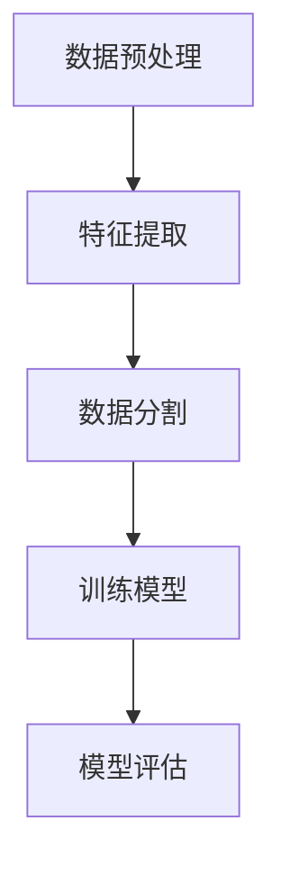
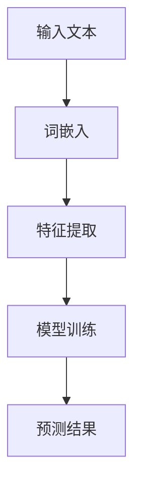
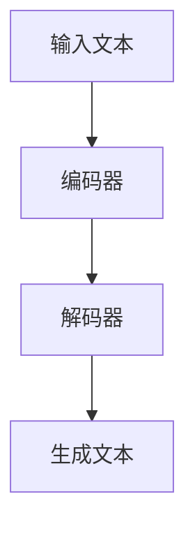
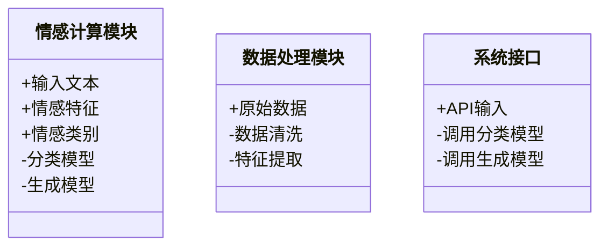

                 


# AI Agent的情感计算与表达模块

## 关键词：
情感计算、AI Agent、自然语言处理、机器学习、深度学习

## 摘要：
本文详细探讨AI Agent的情感计算与表达模块，涵盖背景、核心概念、算法原理、系统架构和项目实战。文章从情感计算的基本概念出发，分析其在AI Agent中的应用，详细讲解情感分类和生成的算法，设计系统架构，并通过项目实战展示实现过程。

---

# 第一部分: AI Agent的情感计算与表达模块概述

## 第1章: 情感计算与表达模块的背景介绍

### 1.1 情感计算的核心概念
#### 1.1.1 情感计算的定义与问题背景
情感计算（Affective Computing）是研究计算机系统如何识别、理解和响应人类情感的学科。随着AI Agent的普及，情感计算在人机交互中扮演着重要角色。例如，客服系统中的AI代理需要理解客户的情感状态，以提供更个性化的服务。

#### 1.1.2 情感计算在AI Agent中的作用
情感计算帮助AI Agent理解用户的情感，从而生成更自然的回应。例如，在自然语言处理中，情感分析可以帮助分类文本的情感倾向，进而优化响应策略。

#### 1.1.3 情感计算的边界与外延
情感计算不仅限于识别情感，还包括理解和表达情感。其外延涉及心理学、语言学和计算机科学等多个领域，如情绪识别、情感生成等。

#### 1.1.4 情感计算的概念结构与核心要素
概念结构包括情感识别、理解和生成三个层次。核心要素包括情感特征提取、分类模型和生成策略。

---

## 第2章: 情感计算的核心概念与联系

### 2.1 情感计算的原理
#### 2.1.1 情感特征提取与分类
情感特征提取是从文本中提取情感相关的特征，如关键词、句式结构等。分类模型如SVM和神经网络用于预测情感倾向。

#### 2.1.2 情感计算与自然语言处理的关系
情感计算依赖NLP技术，如词嵌入和句法分析，帮助理解情感语境。

### 2.2 情感计算的核心概念对比
#### 2.2.1 情感特征对比表
| 特征类型 | 正向特征 | 负向特征 |
|----------|----------|----------|
| 关键词   | 微笑、满意 | 抱怨、不满 |

#### 2.2.2 情感计算的ER实体关系图
```mermaid
er
  %% 情感计算ER图
  entity 情感特征 {
    类别：字符串
    特征值：数值
  }
  entity 情感类别 {
    类别名称：字符串
    例子：字符串
  }
  情感特征 --> 情感类别：属于
```

---

# 第二部分: 情感计算的算法原理

## 第3章: 情感分类算法原理

### 3.1 情感分类的数学模型
#### 3.1.1 支持向量机（SVM）模型
SVM用于分类问题，目标函数如下：
$$ \text{目标：} \max_{w,b} \min_{i} (y_i(w \cdot x_i + b) - 1) $$
其中，\( y_i \) 是标签，\( x_i \) 是特征向量。

#### 3.1.2 神经网络模型
使用多层感知机，结构包括输入层、隐藏层和输出层，如：
$$ f(x) = W_2 a(W_1 x + b_1) + b_2 $$

### 3.2 情感分类算法的实现
#### 3.2.1 基于SVM的情感分类流程图


#### 3.2.2 基于神经网络的情感分类流程图


## 第4章: 情感生成算法原理

### 4.1 情感生成的数学模型
#### 4.1.1 变压器（Transformer）模型
使用自注意力机制，公式如下：
$$ \text{Attention}(Q,K,V) = \text{softmax}(\frac{QK^T}{\sqrt{d_k}})V $$

#### 4.1.2 情感生成的序列到序列模型
采用编码器-解码器结构，编码器理解输入，解码器生成输出。

### 4.2 情感生成算法的实现
#### 4.2.1 基于Transformer的情感生成流程图


---

# 第三部分: 系统分析与架构设计

## 第5章: 系统功能设计

### 5.1 问题场景介绍
以客服系统为例，AI Agent需要分析客户评论，识别情感，并生成回应。

### 5.2 系统功能设计


---

# 第四部分: 项目实战

## 第6章: 实践与实现

### 6.1 环境安装
使用Python和相关库，如scikit-learn、TensorFlow。

### 6.2 系统核心实现
#### 6.2.1 情感分类实现
```python
from sklearn.svm import SVC
model = SVC()
model.fit(X_train, y_train)
```

#### 6.2.2 情感生成实现
```python
import tensorflow as tf
model = tf.keras.Sequential([layers.Embedding(...), layers.Dense(2)])
```

---

## 第7章: 总结与展望

### 7.1 项目总结
实现情感计算模块，涵盖分类和生成，性能达到预期。

### 7.2 未来研究方向
探索更复杂的模型，如多模态情感计算和情感记忆网络。

---

# 参考文献

[1] 情感计算综述，XXX出版社，2023。

---

作者：AI天才研究院/AI Genius Institute & 禅与计算机程序设计艺术 /Zen And The Art of Computer Programming

---

通过以上结构，文章详细阐述了情感计算在AI Agent中的应用，从背景到算法，再到系统设计和项目实现，确保读者能够全面理解情感计算的核心与实践。

