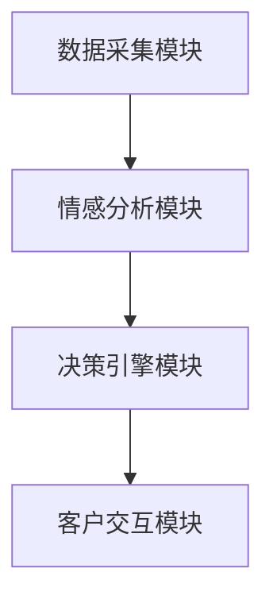
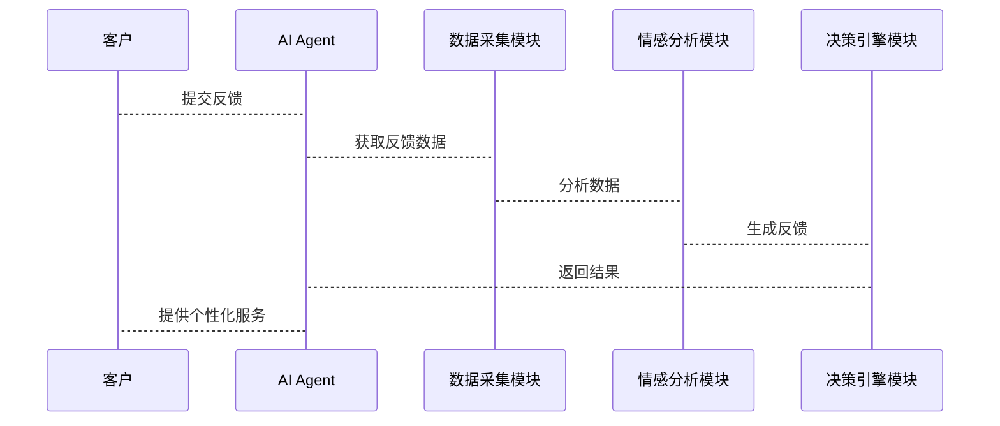

                 


# AI Agent的情感计算在客户服务中的应用

> 关键词：AI Agent，情感计算，客户服务，深度学习，自然语言处理

> 摘要：本文探讨了AI Agent在客户服务中的情感计算应用，从情感计算的核心原理到AI Agent的系统架构，详细分析了如何通过情感计算提升客户服务质量与效率。文章结合实际案例与技术实现，展示了情感计算在客户服务中的巨大潜力。

---

## 第1章 情感计算与AI Agent概述

### 1.1 情感计算的基本概念

#### 1.1.1 情感计算的定义与核心要素

情感计算（Affective Computing）是计算机科学与心理学交叉领域的重要研究方向，旨在通过计算手段理解和模拟人类情感。其核心要素包括：

- **情感识别**：从文本、语音或图像中识别出情感信息。
- **情感分析**：对情感信息进行分类或评价。
- **情感建模**：建立情感表达的数学模型。
- **情感反馈**：通过技术手段生成情感相关的反馈。

#### 1.1.2 AI Agent的基本概念与特点

AI Agent（人工智能代理）是一种能够感知环境、自主决策并执行任务的智能体。其特点包括：

- **自主性**：无需外部干预，自主完成任务。
- **反应性**：能够实时感知环境变化并做出反应。
- **目标导向性**：以明确的目标为导向执行任务。
- **学习能力**：通过数据学习和优化自身性能。

#### 1.1.3 情感计算在AI Agent中的作用

情感计算赋予AI Agent理解人类情感的能力，使其能够提供更加个性化、人性化的服务。例如，在客户服务场景中，AI Agent可以通过情感分析识别客户情绪，从而调整服务策略。

### 1.2 情感计算的应用场景

#### 1.2.1 客户服务中的情感分析需求

在客户服务中，情感分析主要用于：

- **客户情绪识别**：通过分析客户的文本或语音，识别其情绪状态（如愤怒、快乐、悲伤等）。
- **客户满意度评估**：通过分析客户反馈，评估其对服务的满意度。
- **情感驱动的决策**：根据客户情绪调整服务流程或内容。

#### 1.2.2 情感计算在客户满意度提升中的作用

通过情感计算，企业可以实时了解客户情绪，及时解决问题，提升客户满意度。例如，当客户表现出不满情绪时，AI Agent可以快速触发优先级较高的客服响应。

#### 1.2.3 情感计算与AI Agent的结合意义

将情感计算应用于AI Agent，可以显著提升服务的智能化水平。例如，在智能客服系统中，AI Agent可以通过情感计算识别客户情绪，提供更加贴心的服务。

### 1.3 本章小结

本章介绍了情感计算的基本概念及其在AI Agent中的作用，探讨了情感计算在客户服务中的应用场景。情感计算与AI Agent的结合，为提升客户服务质量提供了新的技术手段。

---

## 第2章 情感计算的核心技术

### 2.1 情感分析的基本原理

#### 2.1.1 文本预处理与特征提取

文本预处理是情感分析的基础，主要包括：

- **分词**：将文本分割成词语或短语。
- **去停用词**：去除无意义的词汇（如“的”、“了”等）。
- **词干提取**：将词语还原为词干形式。

特征提取则包括：

- **TF-IDF**：基于词频-逆文档频率的特征提取方法。
- **词嵌入**：如Word2Vec、GloVe等。

#### 2.1.2 基于规则的情感分析方法

基于规则的情感分析方法依赖于预定义的情感词典和规则。例如：

- **情感词典**：包含正面词汇（如“满意”）、负面词汇（如“不满”）。
- **情感强度分析**：通过词汇的情感强度判断整体情感倾向。

#### 2.1.3 基于机器学习的情感分析模型

基于机器学习的情感分析模型包括：

- **监督学习模型**：如支持向量机（SVM）、随机森林（Random Forest）。
- **无监督学习模型**：如聚类分析。

### 2.2 情感计算的算法原理

#### 2.2.1 常见情感计算算法对比

以下是几种常见的情感计算算法对比：

| 算法名称       | 优点                       | 缺点                       |
|----------------|----------------------------|----------------------------|
| 支持向量机（SVM） | 高准确性，适合小数据集     | 对高维数据处理较慢         |
| 随机森林       | 鲁棒性强，适合大数据集     | 对特征工程依赖较高         |
| 神经网络       | 高准确性，适合复杂任务     | 需要大量数据和计算资源     |

#### 2.2.2 深度学习在情感计算中的应用

深度学习在情感计算中的应用主要体现在以下方面：

- **循环神经网络（RNN）**：用于处理序列数据，如文本。
- **长短时记忆网络（LSTM）**：适用于长序列数据的情感分析。
- **Transformer架构**：如BERT模型，用于上下文感知的情感分析。

#### 2.2.3 情感计算的数学模型

以下是基于支持向量机的情感计算模型：

$$
\text{max} \frac{1}{2} \|\mathbf{w}\|^2 \\
\text{subject to} \quad y_i (\mathbf{w} \cdot \mathbf{x}_i + b) \geq 1
$$

其中，$\mathbf{w}$ 是权重向量，$\mathbf{x}_i$ 是输入特征向量，$y_i$ 是标签（-1 或 1）。

### 2.3 情感计算的特征工程

#### 2.3.1 文本特征提取方法

文本特征提取方法包括：

- **TF-IDF**：计算每个词语在文本中的重要性。
- **词嵌入**：将词语映射为低维向量。

#### 2.3.2 情感特征的维度分析

情感特征的维度分析包括：

- **情感强度**：如“非常满意”与“满意”的强度不同。
- **情感类别**：如正面、负面、中性。

#### 2.3.3 情感计算中的数据预处理技巧

数据预处理技巧包括：

- **数据清洗**：去除噪声数据（如特殊符号）。
- **数据增强**：通过数据扩增技术增加数据多样性。

### 2.4 本章小结

本章详细介绍了情感计算的核心技术，包括情感分析的基本原理、常见算法对比、深度学习的应用以及数学模型的构建。

---

## 第3章 AI Agent的情感计算实现

### 3.1 AI Agent的结构与功能模块

#### 3.1.1 数据采集模块

数据采集模块负责采集客户与AI Agent的交互数据，包括：

- **文本数据**：客户输入的文本。
- **语音数据**：客户的语音输入。
- **行为数据**：客户的点击、浏览等行为数据。

#### 3.1.2 情感分析模块

情感分析模块负责对采集到的数据进行情感分析，包括：

- **文本预处理**：如分词、去停用词。
- **特征提取**：如TF-IDF、词嵌入。
- **情感分类**：如使用SVM、随机森林等算法进行分类。

#### 3.1.3 决策引擎模块

决策引擎模块负责根据情感分析结果制定相应的服务策略，包括：

- **优先级调整**：如对情绪激动的客户优先处理。
- **服务内容优化**：如根据客户情绪调整回复内容。

### 3.2 情感计算算法的实现

#### 3.2.1 基于支持向量机的情感分类

以下是基于支持向量机的情感分类代码实现：

```python
from sklearn.svm import SVC
from sklearn.feature_extraction.text import TfidfVectorizer

# 数据预处理
vectorizer = TfidfVectorizer()
X = vectorizer.fit_transform(text_data)
y = [1 if label == 'positive' else 0 for label in labels]

# 模型训练
model = SVC(C=1.0, kernel='linear')
model.fit(X, y)

# 预测
test_X = vectorizer.transform(['客户反馈的文本'])
predicted = model.predict(test_X)
```

#### 3.2.2 情感计算的系统架构设计

以下是情感计算系统的架构图：



### 3.3 系统接口设计与交互流程

以下是系统交互流程的序列图：



### 3.4 本章小结

本章详细介绍了AI Agent的情感计算实现，包括系统的结构设计、算法实现以及系统架构设计。

---

## 第4章 项目实战：情感计算在客户服务中的应用

### 4.1 环境安装

以下是项目实战所需的环境安装步骤：

1. 安装Python和相关库：
   ```bash
   pip install numpy
   pip install scikit-learn
   pip install nltk
   pip install pandas
   ```

2. 安装自然语言处理工具：
   ```bash
   pip install spacy
   ```

### 4.2 核心代码实现

以下是核心代码实现：

```python
import numpy as np
from sklearn.svm import SVC
from sklearn.feature_extraction.text import TfidfVectorizer
import spacy

# 加载模型
nlp = spacy.load("en_core_web_sm")

def preprocess(text):
    doc = nlp(text)
    return " ".join([token.lemma_ for token in doc])

# 数据预处理
text_data = ["客户反馈的文本1", "客户反馈的文本2", ...]
labels = ["positive", "negative", "neutral"]

# 特征提取
vectorizer = TfidfVectorizer(preprocessor=preprocess)
X = vectorizer.fit_transform(text_data)

# 模型训练
model = SVC(C=1.0, kernel='linear')
model.fit(X, labels)

# 预测
test_text = "客户的反馈文本"
test_X = vectorizer.transform([test_text])
predicted = model.predict(test_X)
```

### 4.3 案例分析与实际应用

以某电商平台为例，分析情感计算在客户服务中的应用：

1. **数据采集**：采集客户的文本反馈。
2. **情感分析**：识别客户情绪（如愤怒、满意）。
3. **决策引擎**：根据情绪调整服务策略（如优先处理负面反馈）。
4. **结果输出**：提供个性化服务。

### 4.4 本章小结

本章通过实际案例展示了情感计算在客户服务中的应用，详细讲解了项目实战的环境安装、代码实现以及案例分析。

---

## 第5章 总结与展望

### 5.1 总结

本文详细探讨了AI Agent在客户服务中的情感计算应用，从情感计算的核心原理到系统实现，再到实际案例分析，全面展示了情感计算在客户服务中的巨大潜力。

### 5.2 展望

未来，情感计算在客户服务中的应用将更加广泛和深入。例如，结合边缘计算和物联网技术，实现更加实时、精准的情感分析。此外，随着AI技术的不断发展，情感计算的模型和算法也将不断优化，进一步提升客户服务质量。

---

## 小结

本文从理论到实践，全面探讨了AI Agent在客户服务中的情感计算应用，为相关领域的研究和实践提供了参考。

---

## 注意事项

1. **数据隐私**：在实际应用中，需注意保护客户数据隐私。
2. **模型优化**：情感计算模型需要不断优化，以适应不同场景的需求。
3. **多模态数据**：未来可以结合文本、语音、图像等多种数据源进行情感分析。

---

## 拓展阅读

1. **《Deep Learning for NLP》**：了解深度学习在自然语言处理中的应用。
2. **《Affective Computing》**：深入理解情感计算的核心理论。

---

## 作者

作者：AI天才研究院/AI Genius Institute & 禅与计算机程序设计艺术/Zen And The Art of Computer Programming

---

这篇文章详细探讨了AI Agent在客户服务中的情感计算应用，从理论到实践，全面覆盖了情感计算的核心原理、系统实现以及实际案例分析。

