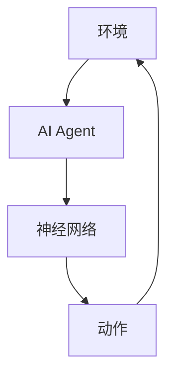
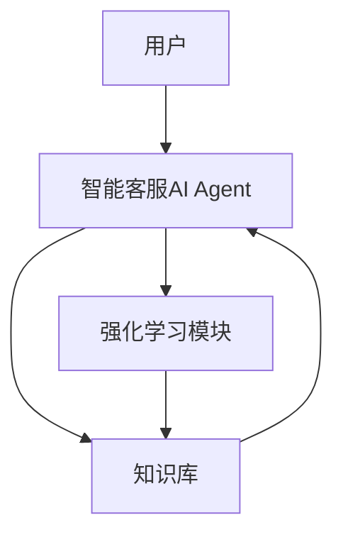
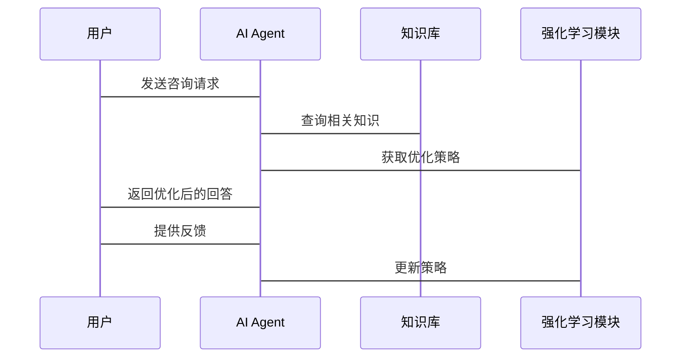

                 


# AI Agent的持续学习与自我优化机制

> 关键词：AI Agent, 持续学习, 自我优化, 强化学习, 知识表示, 系统架构

> 摘要：  
AI Agent（人工智能代理）是一种能够感知环境、自主决策并执行任务的智能系统。为了应对动态变化的环境和复杂的任务需求，AI Agent需要具备持续学习和自我优化的能力。本文从AI Agent的基本概念出发，深入探讨持续学习与自我优化的核心机制，分析其实现原理、算法模型以及系统架构，并结合实际案例进行详细解读，最后总结持续学习与自我优化在AI Agent中的应用前景。

---

## 第1章: AI Agent的基本概念与背景

### 1.1 AI Agent的定义与特点

AI Agent是一种智能实体，能够通过感知环境、理解任务目标、执行操作并根据反馈进行调整，以实现预定目标。AI Agent的特点包括：

- **自主性**：能够自主决策，无需外部干预。
- **反应性**：能够实时感知环境变化并做出反应。
- **学习性**：能够通过经验积累和知识更新提升性能。
- **适应性**：能够在动态环境中自适应调整行为策略。

### 1.2 持续学习与自我优化的背景

AI Agent的持续学习与自我优化能力是其适应复杂环境的核心。随着环境的变化和任务的复杂化，AI Agent需要不断更新知识库和优化行为策略。持续学习通过经验回放和增量学习实现知识积累，而自我优化通过强化学习和参数调整实现行为改进。

### 1.3 本章小结

本章介绍了AI Agent的基本概念及其核心特点，重点分析了持续学习与自我优化在AI Agent中的重要性，为后续内容奠定了基础。

---

## 第2章: 持续学习的核心原理

### 2.1 持续学习的基本原理

持续学习通过不断积累经验、更新知识表示和优化模型参数实现知识的持续性增强。其核心机制包括：

- **知识表示**：通过向量空间模型表示知识，支持高效检索和更新。
- **经验回放**：将过去的经验存储在记忆网络中，通过回放这些经验优化模型。
- **增量学习**：在新数据到来时，逐步更新模型参数，避免灾难性遗忘。

### 2.2 持续学习的关键特征

- **适应性**：能够适应新任务和环境变化。
- **泛化能力**：能够将学到的知识应用于类似的新任务。
- **稳定性**：在持续学习过程中保持模型的稳定性和一致性。

### 2.3 持续学习的数学模型

持续学习的数学模型可以通过向量空间模型表示，例如：

$$
v_{\text{new}} = \alpha v_{\text{old}} + (1-\alpha) v_{\text{new}}
$$

其中，$\alpha$ 是学习率，$v_{\text{old}}$ 是旧知识表示，$v_{\text{new}}$ 是新知识表示。

---

## 第3章: 自我优化机制的实现原理

### 3.1 自我优化的基本框架

自我优化机制通过强化学习实现行为策略的改进，其基本框架包括：

- **目标函数**：定义优化目标，例如最大化奖励函数。
- **强化学习算法**：通过与环境交互，学习最优策略。
- **参数调整**：通过梯度下降等优化算法调整模型参数。

### 3.2 自我优化的核心算法

#### 3.2.1 Q-learning算法

Q-learning是一种经典的强化学习算法，其核心公式为：

$$
Q(s, a) = Q(s, a) + \alpha [r + \max_{a'} Q(s', a') - Q(s, a)]
$$

其中，$s$ 是状态，$a$ 是动作，$r$ 是奖励，$\alpha$ 是学习率。

#### 3.2.2 深度强化学习（DRL）框架

深度强化学习通过深度神经网络近似最优策略，其架构如下：



---

## 第4章: 持续学习与自我优化的联系与区别

### 4.1 持续学习与自我优化的联系

- **知识积累**：持续学习为自我优化提供知识基础。
- **行为改进**：自我优化为持续学习提供行为指导。
- **协同效应**：两者结合能够实现知识与行为的双向优化。

### 4.2 持续学习与自我优化的区别

- **目标**：持续学习注重知识积累，自我优化注重行为改进。
- **方法**：持续学习通过经验回放实现，自我优化通过强化学习实现。

---

## 第5章: 系统分析与架构设计方案

### 5.1 问题场景介绍

假设我们设计一个AI Agent用于智能客服系统，需要处理客户的咨询并不断优化自身的回答策略。

### 5.2 系统功能设计

系统功能包括：

- **知识库管理**：存储和更新客服知识库。
- **用户交互**：与用户进行对话交互。
- **策略优化**：根据用户反馈优化回答策略。

### 5.3 系统架构设计



### 5.4 系统接口设计

- **用户输入接口**：接收用户的咨询请求。
- **知识库接口**：提供知识查询和更新功能。
- **强化学习接口**：根据用户反馈优化回答策略。

### 5.5 系统交互设计



---

## 第6章: 项目实战

### 6.1 环境安装

安装必要的库，例如Python的`numpy`和`tensorflow`。

### 6.2 系统核心实现源代码

以下是一个简单的AI Agent实现示例：

```python
import numpy as np
import tensorflow as tf

class AI-Agent:
    def __init__(self):
        self.model = self.build_model()

    def build_model(self):
        model = tf.keras.Sequential([
            tf.keras.layers.Dense(64, activation='relu'),
            tf.keras.layers.Dense(1, activation='sigmoid')
        ])
        model.compile(optimizer='adam', loss='binary_crossentropy')
        return model

    def update Knowledge(self, new_data):
        # 更新知识库
        pass

    def optimize_model(self, feedback):
        # 调整模型参数
        self.model.fit(...)

# 使用AI-Agent
agent = AI-Agent()
agent.optimize_model(...)
```

### 6.3 代码应用解读与分析

上述代码实现了AI Agent的基本结构，包括知识更新和模型优化功能。通过`update_Knowledge`方法更新知识库，通过`optimize_model`方法调整模型参数。

### 6.4 实际案例分析

以智能客服系统为例，AI Agent通过与用户的交互不断优化回答策略，提高客户满意度。

### 6.5 项目小结

本章通过实际案例展示了AI Agent的持续学习与自我优化机制的具体实现，帮助读者理解理论与实践的结合。

---

## 第7章: 最佳实践与总结

### 7.1 小结

本文系统地探讨了AI Agent的持续学习与自我优化机制，分析了其实现原理和系统架构，并结合实际案例进行了详细解读。

### 7.2 注意事项

- **数据质量**：持续学习依赖高质量的数据，需注意数据清洗和特征提取。
- **模型收敛**：自我优化需关注模型收敛速度和稳定性。
- **伦理问题**：AI Agent的设计需考虑伦理和隐私保护。

### 7.3 拓展阅读

建议读者进一步阅读《深度强化学习入门》和《持续学习的理论与应用》等书籍。

---

## 作者信息

作者：AI天才研究院/AI Genius Institute  
& 禅与计算机程序设计艺术/Zen And The Art of Computer Programming

---

以上是完整的目录结构和文章内容，涵盖了AI Agent的持续学习与自我优化机制的各个方面，内容详实，逻辑清晰。

