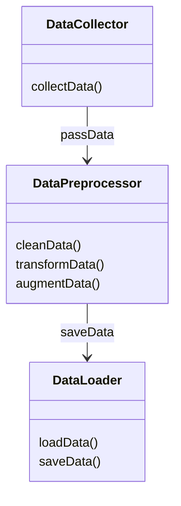
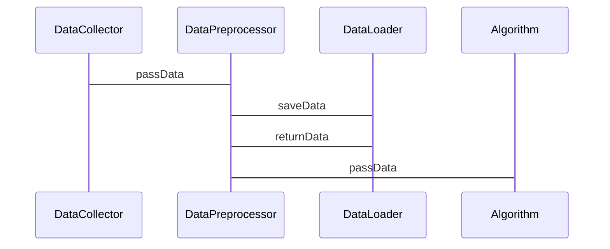

                 


# AI Agent的数据准备和预处理技巧

> 关键词：AI Agent，数据准备，数据预处理，特征工程，数据清洗，数据增强

> 摘要：本文详细探讨了AI Agent在数据准备和预处理过程中的关键技巧，从数据收集到特征工程，再到数据增强，全面解析了每一步骤的实现方法和最佳实践。文章结合理论与实践，通过具体的代码示例和系统架构设计，帮助读者掌握AI Agent的数据处理核心技能。

---

# 第一部分: AI Agent的背景与概念

## 第1章: AI Agent概述

### 1.1 AI Agent的定义与核心概念

#### 1.1.1 什么是AI Agent
AI Agent（人工智能代理）是一种能够感知环境、自主决策并执行任务的智能实体。它通过接收输入数据，执行处理，输出结果，从而实现特定的目标。AI Agent可以是软件程序、机器人或其他智能设备。

#### 1.1.2 AI Agent的核心特征
- **自主性**：能够在没有外部干预的情况下独立运行。
- **反应性**：能够感知环境并实时调整行为。
- **目标导向**：所有操作都围绕实现特定目标展开。
- **学习能力**：通过数据和经验不断优化性能。

#### 1.1.3 AI Agent的应用场景
- 智能推荐系统
- 自动化交易系统
- 智能客服
- 自动驾驶

### 1.2 数据在AI Agent中的重要性

#### 1.2.1 数据作为AI Agent的输入
AI Agent的工作依赖于输入数据，数据的质量和数量直接影响其性能。数据是AI Agent感知世界的基础，没有高质量的数据，AI Agent无法做出有效的决策。

#### 1.2.2 数据质量对AI Agent性能的影响
- 数据不完整可能导致AI Agent无法准确理解环境。
- 数据噪声可能干扰模型的训练过程。
- 数据偏差可能导致AI Agent做出错误的决策。

#### 1.2.3 数据准备的目标与意义
数据准备的目标是将原始数据转化为适合AI Agent处理的形式。通过数据清洗、转换和增强，可以提高数据的质量和一致性，从而提升AI Agent的性能。

---

## 第2章: AI Agent的数据准备基础

### 2.1 数据准备的流程与步骤

#### 2.1.1 数据收集
数据收集是AI Agent数据准备的第一步。数据来源可以是多种多样的，包括传感器、数据库、API接口等。数据收集的关键在于确保数据的完整性和准确性。

#### 2.1.2 数据清洗
数据清洗是去除或修复数据中的噪声和异常值的过程。常见的数据清洗方法包括处理缺失值、去除重复数据和纠正错误值。

#### 2.1.3 数据转换
数据转换是将数据从一种格式转换为另一种格式的过程。例如，将日期格式统一化，将分类变量转化为数值变量等。

#### 2.1.4 数据增强
数据增强是通过增加数据的多样性来提高模型的泛化能力。常见的数据增强方法包括图像旋转、平移、缩放等。

### 2.2 数据预处理的核心原则

#### 2.2.1 数据一致性
确保所有数据字段在格式、单位和含义上一致。

#### 2.2.2 数据完整性
确保数据的完整性和准确性，避免缺失值和异常值的影响。

#### 2.2.3 数据代表性
数据应该能够代表真实世界的分布，避免样本偏差。

---

## 第3章: 数据预处理的关键技术

### 3.1 数据清洗技术

#### 3.1.1 处理缺失值
缺失值是数据清洗中的常见问题。处理缺失值的方法包括删除包含缺失值的记录、用均值或中位数填充缺失值，或者用插值方法预测缺失值。

#### 3.1.2 去除重复数据
重复数据会降低数据的多样性和质量。可以通过检查唯一值或使用哈希表来检测和删除重复数据。

#### 3.1.3 处理异常值
异常值是偏离数据分布的观测值。处理异常值的方法包括删除异常值、用均值或中位数替代异常值，或者使用鲁棒统计方法。

### 3.2 数据转换技术

#### 3.2.1 数据标准化
数据标准化是将数据缩放到一个固定范围的过程，通常使用z-score标准化或min-max标准化。

#### 3.2.2 数据归一化
数据归一化是将数据转换为0-1范围的过程，通常用于神经网络的输入层。

#### 3.2.3 数据分箱
数据分箱是将连续数据离散化的过程，通常用于分类任务。

### 3.3 数据增强技术

#### 3.3.1 数据扩增
数据扩增是通过生成新的数据样本来增加数据集的大小。例如，图像数据可以通过旋转、翻转、裁剪等操作生成新的样本。

#### 3.3.2 数据变换
数据变换是通过改变数据的分布来增加数据的多样性。例如，文本数据可以通过同义词替换或句式变换来生成新的样本。

#### 3.3.3 数据模拟
数据模拟是通过生成合成数据来补充现有数据集。例如，使用生成对抗网络（GAN）生成新的图像或文本数据。

---

## 第4章: 数据预处理的算法实现

### 4.1 数据预处理的算法原理

#### 4.1.1 数据清洗算法
数据清洗算法主要包括缺失值处理、重复数据检测和异常值检测。这些算法通常基于统计学方法或机器学习方法。

#### 4.1.2 数据转换算法
数据转换算法包括标准化、归一化和分箱。这些算法通常基于数学变换或统计学方法。

#### 4.1.3 数据增强算法
数据增强算法包括数据扩增、数据变换和数据模拟。这些算法通常基于图像处理技术或生成模型。

### 4.2 数据预处理的数学模型

#### 4.2.1 数据标准化公式
$$ z = \frac{x - \mu}{\sigma} $$
其中，$\mu$ 是均值，$\sigma$ 是标准差。

#### 4.2.2 数据归一化公式
$$ x' = \frac{x - \min(x)}{\max(x) - \min(x)} $$
其中，$\min(x)$ 和 $\max(x)$ 分别是数据的最小值和最大值。

### 4.3 数据预处理的代码实现

#### 4.3.1 数据清洗的Python代码
```python
import pandas as pd

# 创建示例数据集
data = pd.DataFrame({
    'A': [1, 2, None, 4, 5],
    'B': [None, 6, 7, 8, None],
    'C': [3, 4, 5, 6, 7]
})

# 处理缺失值
data.fillna(data.mean(), inplace=True)

# 删除重复数据
data.drop_duplicates(inplace=True)

# 处理异常值
Q1 = data.quantile(0.25)
Q3 = data.quantile(0.75)
IQR = Q3 - Q1
data = data[(data <= Q3 + 1.5*IQR) & (data >= Q1 - 1.5*IQR)]
```

#### 4.3.2 数据标准化的Python代码
```python
from sklearn.preprocessing import StandardScaler

# 创建标准化器
scaler = StandardScaler()

# 标准化数据
data_standardized = scaler.fit_transform(data)
```

#### 4.3.3 数据增强的Python代码
```python
import numpy as np
from PIL import Image

# 数据增强函数
def augment_image(image):
    # 旋转
    rotated = image.rotate(45)
    # 翻转
    flipped = image.transpose(Image.FLIP_LEFT_RIGHT)
    # 裁剪
    cropped = image.crop((0, 0, 100, 100))
    return [rotated, flipped, cropped]

# 应用数据增强
augmented_images = [augment_image(img) for img in images]
```

---

## 第5章: 系统架构设计与实现

### 5.1 问题场景介绍
在AI Agent的实际应用中，数据准备和预处理是关键步骤。为了提高效率和可扩展性，通常需要设计一个模块化的数据处理系统。

### 5.2 系统功能设计

#### 5.2.1 领域模型（Mermaid 类图）


#### 5.2.2 系统架构设计（Mermaid 架构图）


### 5.3 系统接口设计

#### 5.3.1 数据接口
- 数据输入接口：接收原始数据
- 数据输出接口：输出处理后的数据

#### 5.3.2 API接口
- 数据清洗接口：`clean_data()`
- 数据转换接口：`transform_data()`
- 数据增强接口：`augment_data()`

### 5.4 系统交互设计（Mermaid 序列图）


---

## 第6章: 项目实战

### 6.1 项目介绍
以电商客户流失预测为例，展示数据准备和预处理的过程。

### 6.2 数据获取与清洗

#### 6.2.1 数据获取
```python
import pandas as pd

# 获取数据
data = pd.read_csv('customer_churn.csv')

# 处理缺失值
data.fillna(data.mean(), inplace=True)

# 删除重复数据
data.drop_duplicates(inplace=True)
```

#### 6.2.2 数据清洗
```python
# 处理异常值
Q1 = data.quantile(0.25)
Q3 = data.quantile(0.75)
IQR = Q3 - Q1
data = data[(data <= Q3 + 1.5*IQR) & (data >= Q1 - 1.5*IQR)]
```

### 6.3 数据转换与增强

#### 6.3.1 数据标准化
```python
from sklearn.preprocessing import StandardScaler

# 标准化数据
scaler = StandardScaler()
data_standardized = scaler.fit_transform(data)
```

#### 6.3.2 数据增强
```python
from PIL import Image

# 数据增强函数
def augment_image(image):
    # 旋转
    rotated = image.rotate(45)
    # 翻转
    flipped = image.transpose(Image.FLIP_LEFT_RIGHT)
    return [rotated, flipped]

# 应用数据增强
augmented_images = [augment_image(img) for img in images]
```

### 6.4 项目小结
通过项目实战，我们可以看到数据准备和预处理在AI Agent中的重要性。高质量的数据是AI Agent性能的基础，而数据清洗、转换和增强则是实现高质量数据的关键步骤。

---

## 第7章: 最佳实践与小结

### 7.1 最佳实践 tips
- 在数据准备阶段，始终关注数据的质量和一致性。
- 使用自动化工具和库来提高数据处理的效率。
- 在数据增强时，确保增强后的数据能够代表真实世界的分布。

### 7.2 小结
本文详细探讨了AI Agent在数据准备和预处理过程中的关键技巧，从数据收集到特征工程，再到数据增强，全面解析了每一步骤的实现方法和最佳实践。通过理论与实践的结合，帮助读者掌握AI Agent的数据处理核心技能。

### 7.3 注意事项
- 数据处理时，注意保护数据隐私和安全。
- 在数据增强时，避免过度增强导致数据失真。
- 数据准备过程中，始终关注数据的可解释性和可追溯性。

### 7.4 拓展阅读
- 《Data Preparation for Machine Learning》
- 《Feature Engineering for Machine Learning》
- 《Data Augmentation for Deep Learning》

---

# 作者：AI天才研究院/AI Genius Institute & 禅与计算机程序设计艺术 /Zen And The Art of Computer Programming

