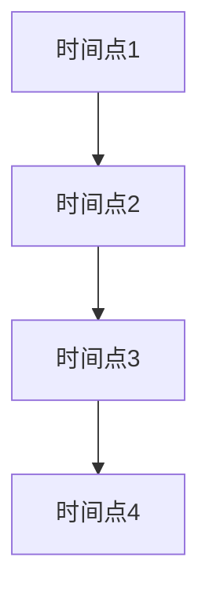
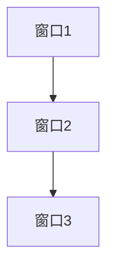
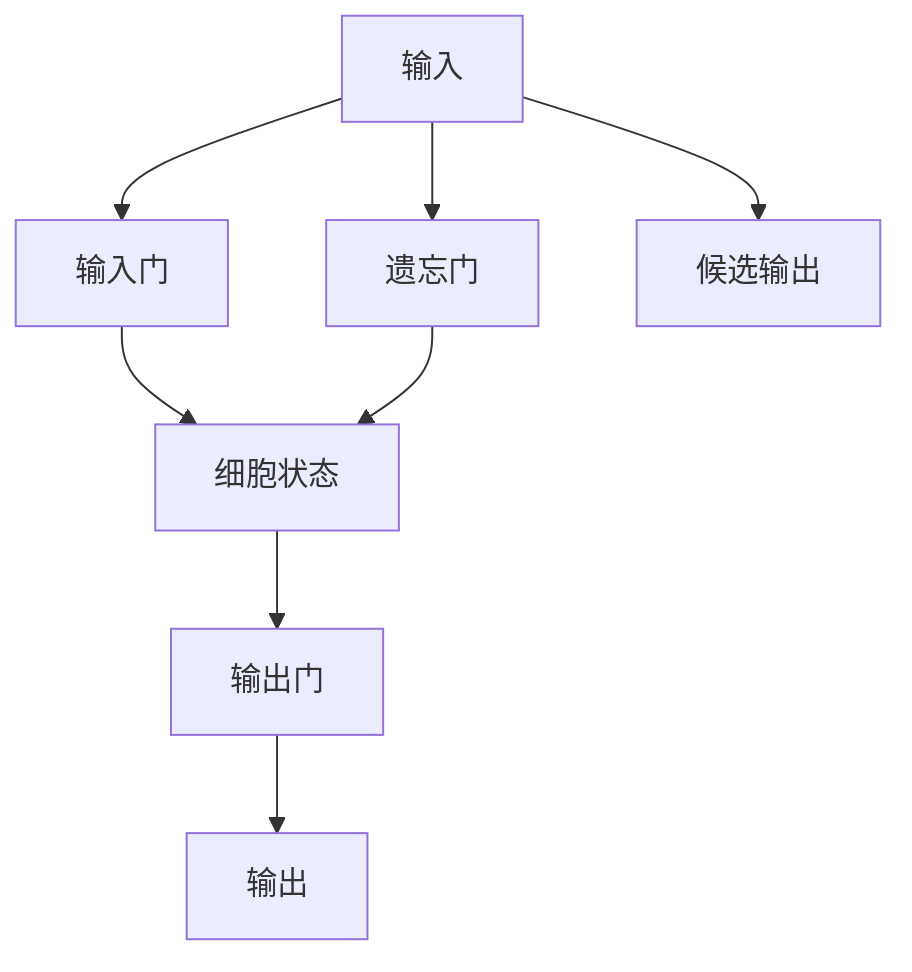
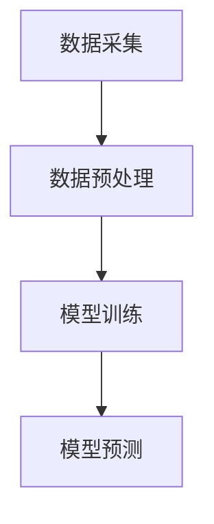
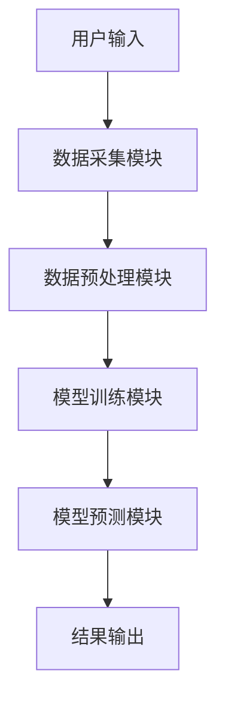

                 


# AI Agent的时序数据处理与预测

---

## 关键词：AI Agent, 时序数据, 预测模型, LSTM, Transformer, 时间序列分析

---

## 摘要：  
本文详细探讨了AI Agent在时序数据处理与预测中的应用。从基础概念到高级算法，结合实际案例，系统性地分析了时序数据的特征、处理流程、算法原理以及系统架构设计。文章通过ARIMA、LSTM和Transformer等模型的对比，深入探讨了AI Agent如何利用时序数据进行高效预测和决策。同时，通过股票价格预测的实战案例，展示了从数据预处理到模型部署的完整流程，并总结了最佳实践和未来发展方向。

---

# 第一部分: AI Agent与时序数据处理基础

## # 第1章: AI Agent与时序数据概述

### ## 1.1 AI Agent的基本概念

#### ### 1.1.1 AI Agent的定义与分类  
AI Agent（人工智能代理）是指能够感知环境、自主决策并执行任务的智能实体。根据功能和应用场景的不同，AI Agent可以分为**简单反射型代理**、**基于模型的反射型代理**、**目标驱动型代理**和**效用驱动型代理**。  

#### ### 1.1.2 时序数据的基本概念  
时序数据是指按照时间顺序记录的数据，例如股票价格、气象数据、用户行为数据等。时序数据的核心特征包括**时间依赖性**、**趋势性**和**周期性**。  

#### ### 1.1.3 AI Agent与时序数据的关系  
AI Agent需要处理时序数据来实现预测、监控和决策功能。时序数据为AI Agent提供了动态变化的信息，使其能够适应复杂环境并做出实时响应。

---

### ## 1.2 时序数据处理的背景与挑战

#### ### 1.2.1 时序数据的特点与难点  
时序数据的特点包括：  
- **时间依赖性**：数据点之间存在时间相关性。  
- **趋势性**：数据可能呈现长期上升或下降的趋势。  
- **周期性**：数据可能在固定的时间周期内重复某种模式。  
- **不规则性**：数据可能受到随机干扰。  

#### ### 1.2.2 AI Agent在时序数据处理中的作用  
AI Agent通过分析时序数据，能够实现：  
- **预测**：基于历史数据预测未来趋势。  
- **监控**：实时监控数据变化，发现异常。  
- **决策**：根据预测结果做出最优决策。  

#### ### 1.2.3 时序数据处理的典型应用场景  
典型的时序数据处理场景包括：  
- 股票价格预测。  
- 气象预测。  
- 设备状态监测。  
- 用户行为分析。  

---

### ## 1.3 时序数据处理的核心问题

#### ### 1.3.1 数据的时序特性  
时序数据的特性决定了处理方法的选择。例如，LSTM网络适合处理长序列数据，而ARIMA模型适合处理具有明确趋势和周期性的数据。

#### ### 1.3.2 数据的依赖关系  
时序数据的依赖关系可以通过自相关函数（ACF）和偏自相关函数（PACF）进行分析，这有助于选择合适的模型。

#### ### 1.3.3 数据的预测与决策  
时序数据的预测目标是生成未来的数值，而决策目标是基于预测结果做出最优选择。两者的结合使得AI Agent能够实现端到端的任务。

---

### ## 1.4 本章小结  
本章介绍了AI Agent和时序数据的基本概念，分析了时序数据的特点和处理的背景与挑战，明确了AI Agent在时序数据处理中的作用和核心问题。

---

# 第二部分: 时序数据处理的核心概念与联系

## # 第2章: 时序数据处理的核心概念

### ## 2.1 时序数据的特征分析

#### ### 2.1.1 时间依赖性  
时间依赖性可以通过自相关函数（ACF）和偏自相关函数（PACF）进行量化分析。

#### ### 2.1.2 趋势性与周期性  
趋势性可以通过线性回归或指数平滑法进行建模，周期性可以通过傅里叶变换或季节性分解进行分析。

#### ### 2.1.3 不规则性  
不规则性是数据中无法用趋势或周期性解释的部分，通常需要通过统计模型（如ARIMA）进行建模。

---

### ## 2.2 AI Agent中的时序数据处理流程

#### ### 2.2.1 数据采集与预处理  
数据预处理包括数据清洗、归一化和特征提取。例如，归一化可以通过以下公式实现：  
$$ x' = \frac{x - \min(x)}{\max(x) - \min(x)} $$  

#### ### 2.2.2 数据建模与分析  
数据建模的目标是选择合适的模型（如ARIMA、LSTM或Transformer）来拟合数据。

#### ### 2.2.3 数据预测与决策  
基于模型的预测结果，AI Agent可以做出决策。例如，如果预测股票价格将上涨，AI Agent可以触发买入信号。

---

### ## 2.3 时序数据处理的核心要素

#### ### 2.3.1 数据流的时序关系  
数据流的时序关系可以通过时序图（如下图所示）进行表示。



#### ### 2.3.2 数据的特征提取  
特征提取可以通过滑动窗口方法（如下图所示）进行实现。



#### ### 2.3.3 数据的预测模型  
预测模型的选择取决于数据的特性。例如，对于具有明确趋势和周期性的数据，ARIMA模型可能更适合；对于复杂的长序列数据，LSTM或Transformer模型可能更适合。

---

### ## 2.4 本章小结  
本章详细分析了时序数据的特征，介绍了AI Agent中的时序数据处理流程，并讨论了时序数据处理的核心要素。

---

# 第三部分: 时序数据处理的算法原理

## # 第3章: 常见时序数据处理算法

### ## 3.1 ARIMA模型

#### ### 3.1.1 ARIMA模型的基本原理  
ARIMA（自回归积分滑动平均模型）由三部分组成：自回归（AR）、差分（I）和滑动平均（MA）。其数学公式为：  
$$ y_t = \phi_1 y_{t-1} + \phi_2 y_{t-2} + \dots + \phi_p y_{t-p} + \theta_1 \epsilon_{t-1} + \theta_2 \epsilon_{t-2} + \dots + \theta_q \epsilon_{t-q} + \epsilon_t $$  

#### ### 3.1.2 ARIMA模型的数学公式  
ARIMA模型的参数选择可以通过ACF和PACF图进行确定。

#### ### 3.1.3 ARIMA模型的实现流程  
ARIMA模型的实现流程如下：  
1. 数据预处理：检查数据是否平稳，如果不平稳，进行差分处理。  
2. 参数选择：通过ACF和PACF图确定AR和MA的阶数。  
3. 模型训练：使用训练数据拟合ARIMA模型。  
4. 模型预测：基于训练好的模型进行预测。

---

### ## 3.2 LSTM网络

#### ### 3.2.1 LSTM的基本结构  
LSTM（长短期记忆网络）由输入门、遗忘门和输出门组成。其结构如下图所示：



#### ### 3.2.2 LSTM模型的数学公式  
LSTM的细胞状态更新公式为：  
$$ c_t = \sigma(f_t) \cdot c_{t-1} + \sigma(i_t) \cdot g(x_t, h_{t-1}) $$  
其中，$\sigma$表示sigmoid函数，$f_t$是遗忘门，$i_t$是输入门，$g$是候选输出函数。

#### ### 3.2.3 LSTM模型的实现流程  
LSTM模型的实现流程如下：  
1. 数据预处理：将时序数据转换为适合LSTM输入的格式（如多步滞后）。  
2. 模型训练：使用训练数据训练LSTM网络。  
3. 模型预测：基于训练好的模型进行预测。

---

### ## 3.3 Transformer模型

#### ### 3.3.1 Transformer的基本结构  
Transformer模型由编码器和解码器组成。编码器用于将输入序列转换为表示向量，解码器用于生成输出序列。

#### ### 3.3.2 Transformer模型的数学公式  
Transformer的注意力机制公式为：  
$$ \text{Attention}(Q, K, V) = \text{softmax}\left(\frac{QK^T}{\sqrt{d_k}}\right)V $$  

#### ### 3.3.3 Transformer模型与LSTM的对比  
Transformer模型在处理长序列数据时具有并行计算的优势，而LSTM模型在处理复杂依赖关系时更具优势。

---

### ## 3.4 本章小结  
本章介绍了ARIMA、LSTM和Transformer三种时序数据处理算法，分析了它们的原理和实现流程，并讨论了它们的优缺点。

---

# 第四部分: 系统分析与架构设计

## # 第4章: 系统分析与架构设计

### ## 4.1 问题场景介绍  
假设我们正在开发一个股票价格预测系统，目标是通过历史股价数据预测未来的股价走势。

### ## 4.2 系统功能设计

#### ### 4.2.1 领域模型设计  
领域模型包括数据采集模块、数据预处理模块、模型训练模块和模型预测模块。

#### ### 4.2.2 系统架构设计  
系统架构如下图所示：



### ## 4.3 系统接口设计  
系统接口包括数据输入接口、模型训练接口和预测结果输出接口。

### ## 4.4 系统交互设计  
系统交互流程如下图所示：



---

### ## 4.5 本章小结  
本章从问题场景出发，设计了系统的功能模块和架构，明确了系统的接口和交互流程。

---

# 第五部分: 项目实战

## # 第5章: 项目实战

### ## 5.1 环境安装  
需要安装的环境包括Python、TensorFlow和Keras。

### ## 5.2 系统核心实现

#### ### 5.2.1 数据预处理  
股票数据预处理代码如下：  
```python
import pandas as pd
import numpy as np

# 读取数据
data = pd.read_csv('stock_price.csv')

# 数据归一化
min_price = data['Close'].min()
max_price = data['Close'].max()
data['Normalized_Close'] = (data['Close'] - min_price) / (max_price - min_price)
```

#### ### 5.2.2 模型训练  
LSTM模型训练代码如下：  
```python
from tensorflow.keras.models import Sequential
from tensorflow.keras.layers import LSTM, Dense

# 模型定义
model = Sequential()
model.add(LSTM(50, input_shape=(timesteps, features)))
model.add(Dense(1))

# 模型编译
model.compile(optimizer='adam', loss='mean_squared_error')

# 模型训练
model.fit(x_train, y_train, epochs=50, batch_size=32)
```

#### ### 5.2.3 模型预测  
股票价格预测代码如下：  
```python
# 模型预测
predictions = model.predict(x_test)
```

---

### ## 5.3 项目小结  
本章通过股票价格预测的案例，展示了从数据预处理到模型部署的完整流程。

---

# 第六部分: 总结与展望

## # 第6章: 总结与展望

### ## 6.1 本章总结  
本文系统性地探讨了AI Agent的时序数据处理与预测，介绍了多种算法和系统设计方法，并通过实战案例展示了如何将理论应用于实践。

### ## 6.2 未来研究方向  
未来的研究方向包括：  
1. 更高效的时间序列模型（如更深的Transformer架构）。  
2. 多模态时间序列数据的处理与预测。  
3. 时间序列数据的实时处理与边缘计算结合。

### ## 6.3 实践中的注意事项  
在实际应用中，需要注意数据的时序特性、模型的可解释性和计算资源的限制。

---

## 作者：AI天才研究院/AI Genius Institute & 禅与计算机程序设计艺术 /Zen And The Art of Computer Programming

