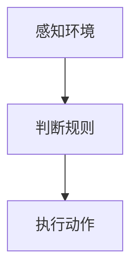
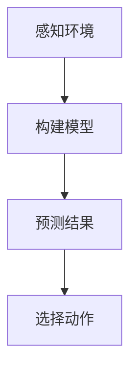
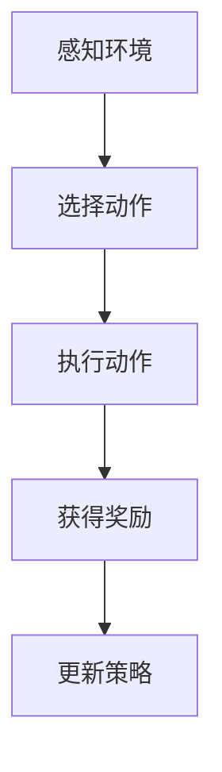
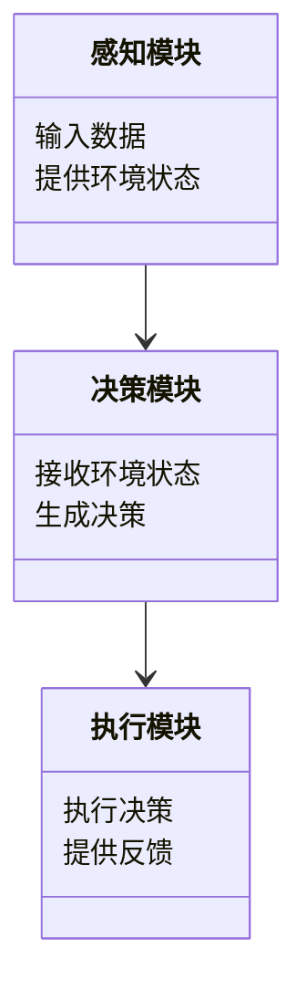
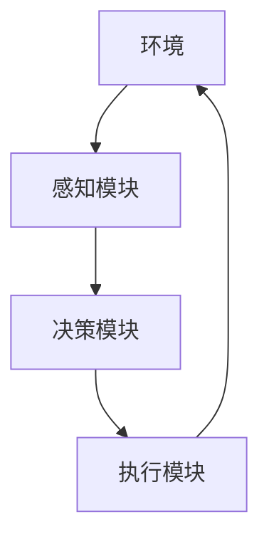

                 

# AI Agent的未来：趋势预测与展望

## 关键词：AI Agent、趋势预测、人工智能、未来展望、技术趋势、应用场景

## 摘要：本文深入探讨了AI Agent的核心概念、技术原理及其在各领域的应用，分析了当前技术发展面临的挑战与机遇，并对未来趋势进行了预测。文章结构清晰，内容详实，结合实际案例和理论分析，为读者呈现一幅AI Agent技术发展的全景图。

---

## 第1章: AI Agent的背景与概念

### 1.1 AI Agent的基本概念与背景

#### 1.1.1 什么是AI Agent？
AI Agent（人工智能代理）是指能够感知环境、自主决策并采取行动以实现目标的智能实体。它可以是一个软件程序、机器人或其他智能系统，具备以下核心特征：
- **自主性**：能够在没有外部干预的情况下独立运行。
- **反应性**：能够实时感知环境并做出响应。
- **目标导向**：所有行为都以实现特定目标为导向。
- **学习能力**：能够通过经验改进自身性能。

#### 1.1.2 AI Agent的发展背景
AI Agent的概念最早可以追溯到20世纪60年代，随着人工智能技术的快速发展，AI Agent逐渐从理论研究走向实际应用。近年来，随着大数据、云计算和深度学习技术的成熟，AI Agent的技术水平和应用范围都得到了显著提升。

#### 1.1.3 AI Agent的应用场景
AI Agent广泛应用于多个领域，包括：
- **智能家居**：如智能音箱、智能家电等。
- **自动驾驶**：如自动驾驶汽车中的路径规划和决策系统。
- **智能客服**：如自动响应客户查询的聊天机器人。
- **机器人助手**：如工业机器人和医疗机器人。

### 1.2 AI Agent与相关技术的关系

#### 1.2.1 AI Agent与机器学习
机器学习是AI Agent的核心技术之一。通过监督学习、无监督学习和强化学习，AI Agent能够从数据中学习知识并做出决策。

#### 1.2.2 AI Agent与大数据
大数据为AI Agent提供了丰富的数据来源，使得AI Agent能够通过分析海量数据来优化决策过程。

#### 1.2.3 AI Agent与云计算
云计算为AI Agent提供了强大的计算能力和存储资源，使得复杂的AI Agent系统能够高效运行。

---

## 第2章: AI Agent的核心概念与技术基础

### 2.1 AI Agent的核心概念

#### 2.1.1 AI Agent的分类
AI Agent可以根据不同的标准进行分类，常见的分类方式包括：
- **基于智能水平**：分为简单反应式Agent、基于模型的反应式Agent、目标驱动的Agent和实用驱动的Agent。
- **基于应用领域**：分为通用AI Agent和专用AI Agent。

#### 2.1.2 AI Agent的设计原则
AI Agent的设计需要遵循以下原则：
- **目标明确**：明确AI Agent的目标和任务。
- **环境感知**：能够准确感知环境状态。
- **自主决策**：能够在复杂环境中做出合理决策。
- **动态适应**：能够根据环境变化动态调整策略。

#### 2.1.3 AI Agent的技术架构
AI Agent的技术架构通常包括以下部分：
- **感知层**：负责感知环境状态。
- **决策层**：负责基于感知信息做出决策。
- **执行层**：负责执行决策并输出结果。

### 2.2 AI Agent与智能体（Agent）的区别

| 属性       | AI Agent                          | 智能体（Agent）                  |
|------------|-----------------------------------|----------------------------------|
| 定义       | 一种基于人工智能技术的智能实体   | 一种能够感知环境并采取行动的实体 |
| 核心技术   | 机器学习、深度学习               | 规则引擎、逻辑推理                |
| 应用场景   | 智能家居、自动驾驶、智能客服       | 电子商务、物流、金融               |

---

## 第3章: AI Agent的算法原理与实现

### 3.1 AI Agent的决策算法

#### 3.1.1 基于规则的决策算法
基于规则的决策算法通过预定义的规则来做出决策，适用于简单且规则明确的任务。

#### 3.1.2 基于模型的决策算法
基于模型的决策算法通过构建环境模型来做出决策，适用于复杂且动态变化的任务。

#### 3.1.3 基于强化学习的决策算法
基于强化学习的决策算法通过与环境的交互来学习最优策略，适用于高度动态和不确定的环境。

### 3.2 AI Agent的数学模型

#### 3.2.1 状态空间与动作空间
状态空间（State Space）是所有可能环境状态的集合，动作空间（Action Space）是AI Agent在某一状态下可以执行的所有动作的集合。

$$ S = \{ s_1, s_2, ..., s_n \} $$
$$ A = \{ a_1, a_2, ..., a_m \} $$

#### 3.2.2 奖励函数与价值函数
奖励函数（Reward Function）定义了AI Agent在某一状态下执行某一动作后获得的奖励值，价值函数（Value Function）定义了AI Agent在某一状态下的期望奖励值。

$$ R(s, a) = r $$
$$ V(s) = \mathbb{E}[R(s, a)] $$

---

## 第4章: AI Agent的系统分析与架构设计

### 4.1 系统构成与功能模块

#### 4.1.1 系统构成
AI Agent系统通常由感知模块、决策模块和执行模块构成。

#### 4.1.2 功能模块
- **感知模块**：负责收集环境数据并提供环境状态。
- **决策模块**：基于环境状态做出决策。
- **执行模块**：根据决策执行动作并提供反馈。

### 4.2 系统架构设计

---

## 第5章: AI Agent的未来趋势与挑战

### 5.1 未来趋势

#### 5.1.1 多模态交互
未来的AI Agent将支持多模态交互，能够同时处理文本、语音、图像等多种输入形式。

#### 5.1.2 边缘计算
随着边缘计算技术的发展，AI Agent将更加注重在边缘设备上的实时性和响应速度。

#### 5.1.3 人机协作
未来的AI Agent将更加注重与人类的协作，能够理解人类意图并提供个性化的服务。

### 5.2 技术挑战

#### 5.2.1 技术瓶颈
- **计算能力**：AI Agent的运行需要强大的计算能力支持。
- **数据隐私**：AI Agent的运行涉及到大量的数据处理，如何保护数据隐私是一个重要问题。

#### 5.2.2 伦理问题
- **决策透明性**：AI Agent的决策过程需要透明化，以便人类能够理解其行为。
- **责任归属**：当AI Agent出现问题时，如何确定责任归属是一个重要问题。

---

## 第6章: 结语

AI Agent作为人工智能技术的重要组成部分，将在未来的智能化社会中发挥越来越重要的作用。随着技术的不断进步，AI Agent将变得更加智能、更加自主，并能够更好地服务于人类社会。

---

**作者：AI天才研究院 & 禅与计算机程序设计艺术**

