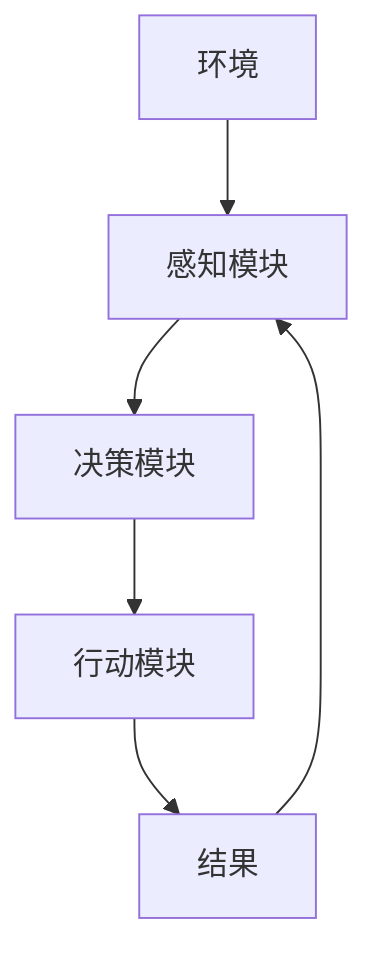
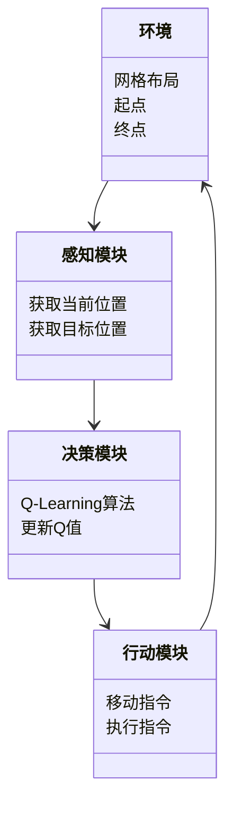

                 


# AI Agent的架构设计：从概念到实现

## 关键词：AI Agent、架构设计、强化学习、系统架构、项目实战

## 摘要：  
本文深入探讨了AI Agent的架构设计，从基础概念到实现细节，全面分析了AI Agent的核心原理、算法、系统架构及实际应用。通过详细的技术分析和实战案例，帮助读者理解如何构建高效、智能的AI Agent系统。

---

# 第一部分: AI Agent 的基础概念与背景

## 第1章: AI Agent 的基本概念

### 1.1 AI Agent 的定义与分类

#### 1.1.1 什么是 AI Agent  
AI Agent（人工智能代理）是指能够感知环境、自主决策并执行任务的智能实体。它通过与环境交互，实现预定目标，广泛应用于智能助手、自动驾驶、机器人等领域。

#### 1.1.2 AI Agent 的分类  
AI Agent可以根据智能水平、决策方式和应用场景进行分类：

- **按智能水平**：  
  - 单智能体（Single-Agent）：独立完成任务。  
  - 多智能体（Multi-Agent）：多个智能体协同工作。  
- **按决策方式**：  
  - 基于规则的Agent：通过预定义规则进行决策。  
  - 基于模型的Agent：利用模型进行推理和规划。  
  - 基于学习的Agent：通过机器学习算法进行决策。  

- **按应用场景**：  
  - 服务型Agent：提供信息服务（如智能助手）。  
  - 控制型Agent：用于设备控制（如自动驾驶）。  

#### 1.1.3 AI Agent 的核心功能  
AI Agent的核心功能包括感知、决策、执行和反馈。  
- **感知**：通过传感器或数据输入获取环境信息。  
- **决策**：基于感知信息，选择最优动作。  
- **执行**：通过执行器或API实现动作。  
- **反馈**：根据执行结果调整策略。  

### 1.2 AI Agent 的应用场景  

#### 1.2.1 智能助手与个人代理  
AI Agent在智能助手（如Siri、Alexa）和个性化推荐系统中广泛应用。  
- **案例**：通过自然语言处理（NLP）技术，AI Agent可以理解用户的意图并执行相应的操作。  

#### 1.2.2 企业级 AI Agent  
企业级AI Agent用于流程自动化、风险管理等领域。  
- **案例**：企业AI Agent可以监控生产流程，实时调整参数以优化效率。  

#### 1.2.3 AI Agent 在不同领域的应用  
AI Agent技术在医疗、金融、交通等多个领域都有应用。  
- **医疗**：辅助医生进行诊断和治疗方案推荐。  
- **金融**：用于股票交易和风险管理。  
- **交通**：实现自动驾驶和智能交通管理。  

### 1.3 AI Agent 的发展历史  

#### 1.3.1 AI Agent 的起源  
AI Agent的概念可以追溯到20世纪60年代，早期的专家系统是其雏形。  

#### 1.3.2 从专家系统到现代 AI Agent  
随着机器学习和深度学习技术的发展，AI Agent逐渐从基于规则的系统转向数据驱动的智能体。  

#### 1.3.3 当前 AI Agent 的技术趋势  
当前，AI Agent技术主要朝着多智能体协同、强化学习和人机协作方向发展。  

---

## 第2章: AI Agent 的核心概念与原理  

### 2.1 AI Agent 的核心概念  

#### 2.1.1 智能体的定义与属性  
智能体（Agent）是一个能够感知环境、自主决策并执行任务的实体。其主要属性包括：  
- **自主性**：无需外部干预，自主决策。  
- **反应性**：能够实时感知并响应环境变化。  
- **目标导向**：基于目标驱动行为。  
- **社会能力**：能够与其他智能体或人类进行交互和协作。  

#### 2.1.2 状态、动作与目标的关系  
- **状态**：环境的当前情况，如位置、资源等。  
- **动作**：智能体执行的动作，如移动、购买等。  
- **目标**：智能体希望达到的状态，如将物品送到指定位置。  

#### 2.1.3 AI Agent 的决策机制  
AI Agent的决策机制基于感知信息、内部状态和目标。决策过程通常包括以下步骤：  
1. **感知环境**：获取当前状态信息。  
2. **分析目标**：明确任务目标。  
3. **生成候选动作**：基于当前状态和目标，生成可能的动作。  
4. **选择最优动作**：通过算法选择最优动作。  
5. **执行动作**：将选择的动作执行。  

---

## 第3章: AI Agent 的算法与数学模型  

### 3.1 强化学习算法  

#### 3.1.1 Q-Learning 算法  
Q-Learning是一种经典的强化学习算法，适用于离散状态和动作空间。  
- **公式**：  
  $$ Q(s, a) = Q(s, a) + \alpha (r + \gamma \max Q(s', a') - Q(s, a)) $$  
  其中，$\alpha$是学习率，$\gamma$是折扣因子。  

#### 3.1.2 DQN 算法  
DQN（Deep Q-Network）通过深度神经网络近似Q值函数，适用于连续动作空间。  
- **网络结构**：DQN包含两个网络，一个用于当前状态，一个用于目标状态。  

#### 3.1.3 算法的数学推导  
以Q-Learning为例，假设当前状态为$s$，执行动作$a$，得到奖励$r$，进入状态$s'$。  
更新Q值：  
$$ Q(s, a) = (1-\alpha) Q(s, a) + \alpha (r + \gamma \max Q(s', a')) $$  

---

## 第4章: AI Agent 的系统架构设计  

### 4.1 系统架构的模块化设计  

#### 4.1.1 感知模块的设计  
- **输入接口**：接收环境数据。  
- **数据处理**：对数据进行清洗和特征提取。  

#### 4.1.2 决策模块的设计  
- **算法选择**：根据任务选择合适的算法。  
- **模型训练**：使用训练数据优化模型参数。  

#### 4.1.3 行动模块的设计  
- **输出接口**：向环境发送动作指令。  
- **执行反馈**：接收执行结果并更新状态。  

### 4.2 系统架构图  



---

## 第5章: AI Agent 的项目实战  

### 5.1 项目介绍  

#### 5.1.1 项目背景  
本项目旨在设计一个简单的AI Agent，用于解决迷宫导航问题。  

#### 5.1.2 系统功能设计  
- **迷宫环境**：迷宫由网格构成，包含起点、终点和障碍物。  
- **AI Agent**：通过强化学习算法导航迷宫。  

#### 5.1.3 项目架构设计  


### 5.2 核心代码实现  

#### 5.2.1 环境定义  
```python
class MazeEnvironment:
    def __init__(self, grid):
        self.grid = grid
        self.start = (0, 0)
        self.end = (len(grid)-1, len(grid[0])-1)
```

#### 5.2.2 Q-Learning算法实现  
```python
class QLearningAgent:
    def __init__(self, state_space, action_space, alpha=0.1, gamma=0.9):
        self.state_space = state_space
        self.action_space = action_space
        self.alpha = alpha
        self.gamma = gamma
        self.q_table = defaultdict(lambda: 0)
```

---

## 第6章: 总结与展望  

### 6.1 总结  
本文从AI Agent的基本概念到实现细节进行了全面分析，涵盖了算法、架构设计和项目实战等内容。  

### 6.2 未来展望  
随着技术的发展，AI Agent将在多智能体协同、人机协作等领域发挥更大作用。  

---

## 注意事项和最佳实践  

- **算法选择**：根据任务需求选择合适的算法，如强化学习适用于动态环境，监督学习适用于有标签数据的场景。  
- **系统设计**：模块化设计有助于系统的可扩展性和可维护性。  
- **数据处理**：确保数据的高质量，避免噪声干扰模型性能。  
- **安全性**：在设计AI Agent时，需考虑安全性和伦理问题。  

---

## 作者信息  

作者：AI天才研究院/AI Genius Institute & 禅与计算机程序设计艺术 /Zen And The Art of Computer Programming

