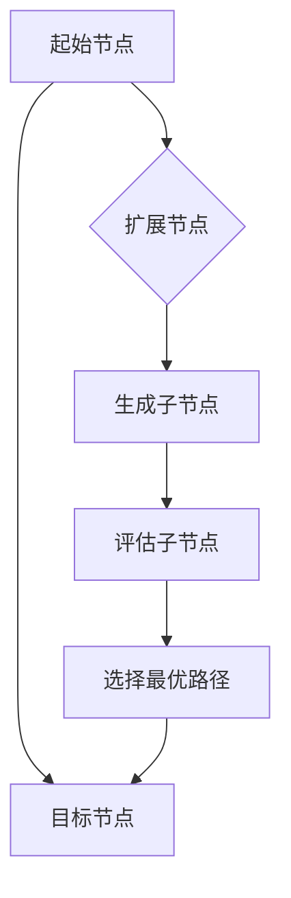
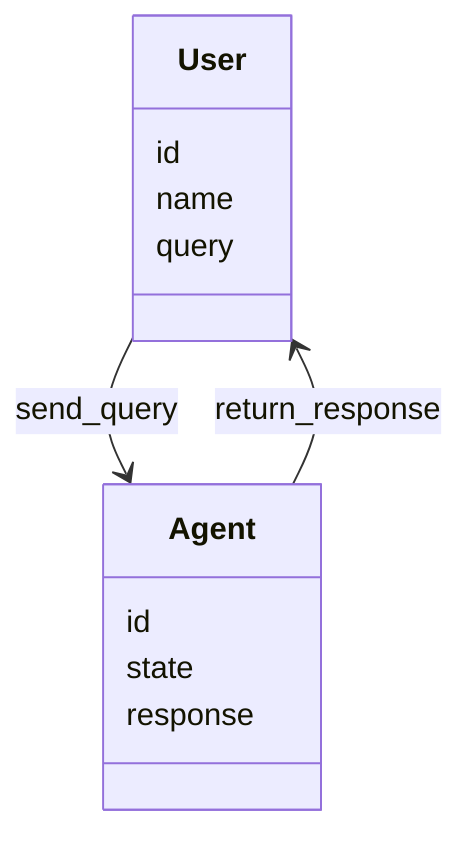

                 


# AI Agent的架构设计：从需求分析到系统规划

> 关键词：AI Agent，架构设计，需求分析，系统规划，多智能体协作，智能系统开发

> 摘要：本文详细探讨了AI Agent的架构设计，从需求分析到系统规划，涵盖核心概念、体系结构、交互设计、算法原理、系统实现和最佳实践。通过实际案例分析，帮助读者掌握AI Agent的设计方法和实现技巧。

---

## 第一部分：AI Agent的基本概念与背景

### 第1章：AI Agent的定义与特点

#### 1.1 AI Agent的定义
AI Agent（人工智能代理）是指能够感知环境、自主决策并执行任务的智能实体。它可以是一个软件程序、机器人或任何具备智能行为的实体。

#### 1.2 AI Agent的核心特点
- **自主性**：无需外部干预，自主完成任务。
- **反应性**：能够实时感知环境并做出反应。
- **目标导向性**：基于目标驱动行为。
- **学习能力**：通过数据和经验不断优化自身。

#### 1.3 AI Agent与传统软件的区别
- AI Agent具备智能性和自主性，而传统软件通常是被动执行指令。
- AI Agent能够处理不确定性，而传统软件依赖确定性输入。

### 第2章：AI Agent的应用场景

#### 2.1 智能助手
AI Agent在智能助手中的应用广泛，如Siri、Alexa等，能够通过语音交互完成任务。

#### 2.2 自动化系统
在工业自动化、智能家居等领域，AI Agent能够实现设备的自动控制和优化。

#### 2.3 多智能体协作
在多智能体协作场景中，AI Agent需要与其他智能体协同工作，共同完成复杂任务。

---

## 第二部分：AI Agent的设计原则与核心要素

### 第3章：AI Agent的设计原则

#### 3.1 目标导向性
AI Agent的设计应以目标为导向，确保所有行为都围绕目标展开。

#### 3.2 环境适应性
AI Agent需要能够适应不同的环境和变化，具备灵活性和鲁棒性。

#### 3.3 智能性与自主性
AI Agent应具备强大的智能性和自主性，能够独立完成任务。

### 第4章：AI Agent的核心要素

#### 4.1 任务目标
任务目标是AI Agent行动的核心驱动力，需要明确目标的优先级和约束条件。

#### 4.2 知识表示
知识表示是AI Agent理解环境和决策的基础，通常采用符号逻辑、概率推理等方式。

#### 4.3 行为规划
行为规划涉及制定行动方案，通常采用搜索算法或强化学习等方法。

#### 4.4 交互能力
交互能力是AI Agent与用户或其他系统进行有效沟通的关键，支持多种交互方式。

---

## 第三部分：AI Agent的体系结构

### 第5章：AI Agent的基础架构

#### 5.1 行为层
行为层负责处理AI Agent的实时行为，如感知和反应。

#### 5.2 知识层
知识层负责存储和管理AI Agent的知识，包括规则、数据和经验。

#### 5.3 交互层
交互层负责与用户或其他系统的交互，支持文本、语音和视觉等多种交互方式。

### 第6章：常见体系结构

#### 6.1 反应式架构
反应式架构基于当前感知做出实时反应，适用于动态环境。

#### 6.2 规划式架构
规划式架构通过预先定义的目标和规则进行行为规划，适用于静态环境。

#### 6.3 学习式架构
学习式架构通过机器学习算法不断优化行为，适用于需要自适应的场景。

### 第7章：体系结构的选择与优化

#### 7.1 场景分析
根据具体场景选择合适的架构，考虑环境的动态性、任务的复杂性和资源的限制。

#### 7.2 架构评估
评估不同架构的优缺点，选择最适合当前需求的架构。

#### 7.3 优化策略
通过模块化设计、分布式架构和动态调整等方式优化系统性能。

---

## 第四部分：AI Agent的交互设计

### 第8章：人机交互基础

#### 8.1 用户需求分析
通过用户调研和需求分析，明确AI Agent的功能和交互方式。

#### 8.2 交互设计原则
设计交互界面时，需遵循简洁性、直观性和用户友好的原则。

#### 8.3 常见交互模式
包括文本交互、语音交互和视觉交互，需根据场景选择合适的模式。

### 第9章：多模态交互

#### 9.1 文本交互
通过自然语言处理技术实现文本交互，支持理解和生成自然语言。

#### 9.2 语音交互
通过语音识别和语音合成技术实现语音交互，适用于移动场景。

#### 9.3 视觉交互
通过计算机视觉技术实现视觉交互，支持图像和视频的处理。

---

## 第五部分：AI Agent的算法原理

### 第10章：AI Agent的核心算法

#### 10.1 搜索算法
搜索算法用于行为规划，A*算法是一个典型例子。



#### 10.2 强化学习
强化学习用于优化AI Agent的行为策略，Q-learning是一种常用算法。

```python
class QLearning:
    def __init__(self, state_space, action_space):
        self.q_table = np.zeros((state_space, action_space))
    
    def choose_action(self, state):
        if np.random.random() < 0.1:
            return np.random.randint(action_space)
        else:
            return np.argmax(self.q_table[state])
    
    def update_q(self, state, action, reward, next_state):
        self.q_table[state, action] = self.q_table[state, action] * 0.9 + reward + 0.1 * np.max(self.q_table[next_state])
```

#### 10.3 自然语言处理
自然语言处理用于实现AI Agent的文本交互能力，支持意图识别和情感分析。

---

## 第六部分：AI Agent的系统分析与架构设计

### 第11章：问题场景介绍

#### 11.1 项目介绍
假设我们正在开发一个智能客服AI Agent，用于处理用户的咨询和问题。

### 第12章：系统功能设计

#### 12.1 领域模型


#### 12.2 系统架构


### 第13章：系统接口设计

#### 13.1 API设计
```mermaid
sequenceDiagram
    User ->+> Agent: send_query
    Agent ->+> NLPProcessor: process_query
    NLPProcessor ->+> KnowledgeBase: retrieve_info
    KnowledgeBase --> NLPProcessor: return_info
    NLPProcessor --> Agent: generate_response
    Agent --> User: return_response
```

---

## 第七部分：AI Agent的项目实战

### 第14章：环境安装与配置

#### 14.1 环境要求
- Python 3.8+
- 安装必要的库：numpy、pandas、scikit-learn

### 第15章：核心代码实现

#### 15.1 Agent类实现
```python
class Agent:
    def __init__(self, knowledge_base):
        self.knowledge_base = knowledge_base
        self.state = 'idle'
    
    def receive_query(self, query):
        # 处理查询
        response = self.knowledge_base.query(query)
        return response
```

#### 15.2 知识库实现
```python
class KnowledgeBase:
    def __init__(self, data):
        self.data = data
    
    def query(self, question):
        # 简单的基于关键词匹配
        result = [entry for entry in self.data if question in entry]
        return result
```

### 第16章：案例分析与解读

#### 16.1 案例分析
通过实际案例展示AI Agent的实现过程，分析可能遇到的问题和解决方案。

#### 16.2 代码解读
详细解读核心代码，解释每个部分的功能和实现方式。

---

## 第八部分：AI Agent的最佳实践

### 第17章：设计原则与开发流程

#### 17.1 设计原则
- **模块化**：确保系统的可维护性和扩展性。
- **可扩展性**：预留接口，方便未来功能扩展。
- **可测试性**：设计易于测试的架构，确保代码质量。

### 第18章：测试与优化

#### 18.1 测试策略
- 单元测试：测试各个模块的功能。
- 集成测试：测试系统整体的协同工作。
- 性能测试：优化系统性能。

### 第19章：部署与监控

#### 19.1 部署策略
- 使用容器化技术（如Docker）部署AI Agent。
- 配置监控工具（如Prometheus）实时监控系统状态。

### 第20章：未来趋势与拓展阅读

#### 20.1 未来趋势
- **强化学习**：进一步提升AI Agent的自主决策能力。
- **多模态交互**：支持更丰富的交互方式。
- **边缘计算**：在边缘设备上部署AI Agent，减少延迟。

---

## 作者：AI天才研究院/AI Genius Institute & 禅与计算机程序设计艺术 /Zen And The Art of Computer Programming

---

以上是《AI Agent的架构设计：从需求分析到系统规划》的完整目录和部分章节内容，涵盖了从理论到实践的各个方面，适合希望深入了解AI Agent架构设计的读者阅读和参考。

