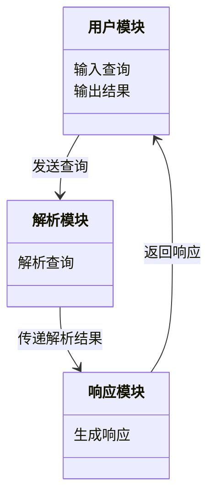
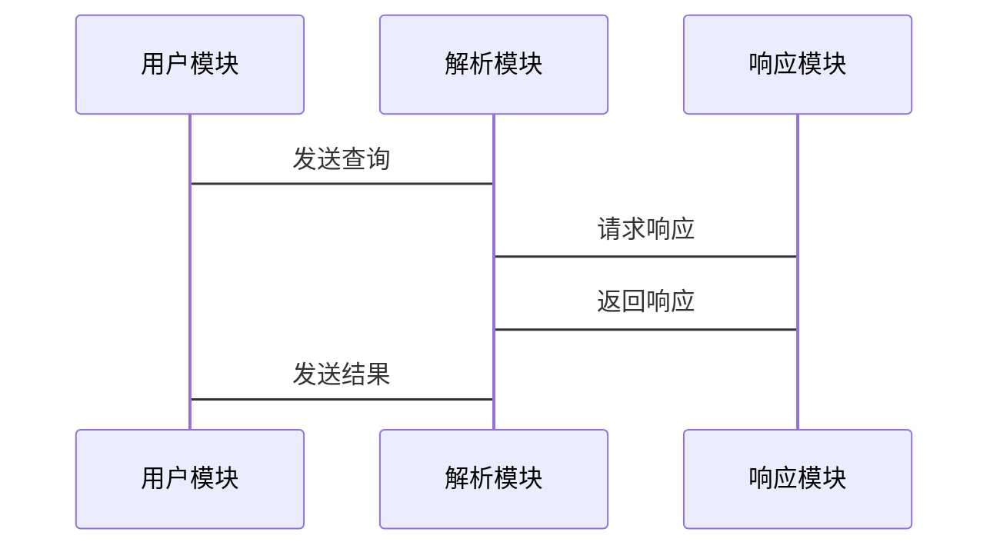

                 


# AI Agent的模块化设计：提高可维护性和扩展性

> 关键词：AI Agent，模块化设计，可维护性，扩展性，系统架构，算法实现

> 摘要：本文探讨了AI Agent的模块化设计方法，通过详细分析模块化设计的核心概念、算法原理、系统架构以及项目实战，展示了如何通过模块化设计提高AI Agent系统的可维护性和扩展性。文章结合实际案例，使用mermaid图表和Python代码，深入讲解了模块化设计的实现细节和应用价值。

---

# 第一部分: AI Agent的模块化设计基础

## 第1章: AI Agent与模块化设计概述

### 1.1 AI Agent的基本概念

#### 1.1.1 AI Agent的定义
AI Agent（人工智能代理）是一种能够感知环境并采取行动以实现目标的智能实体。它可以是一个软件程序、一个机器人，或者任何能够执行复杂任务的自动化系统。

#### 1.1.2 AI Agent的核心特征
- **自主性**：能够在没有外部干预的情况下运行。
- **反应性**：能够根据环境变化调整行为。
- **目标导向**：所有操作都是为了实现特定目标。
- **社交能力**：能够与其他系统或人类进行交互。

#### 1.1.3 模块化设计的必要性
传统AI系统设计通常是一个复杂的整体，缺乏清晰的模块划分，导致维护困难、扩展性差。模块化设计将系统分解为独立的模块，每个模块负责特定功能，从而提高系统的可维护性和扩展性。

---

### 1.2 模块化设计的基本原理

#### 1.2.1 模块化设计的定义
模块化设计是一种将系统分解为独立模块的方法，每个模块具有明确的功能和接口，模块之间通过定义良好的接口进行通信。

#### 1.2.2 模块化设计的优势
- **可维护性**：模块独立性高，修改一个模块不会影响整个系统。
- **可扩展性**：需要添加新功能时，只需添加新的模块或修改现有模块。
- **复用性**：模块可以被复用于其他项目或系统。

#### 1.2.3 模块化设计与传统设计的区别
| 特性       | 模块化设计       | 传统设计         |
|------------|------------------|------------------|
| 结构       | 分解为模块       | 整体结构         |
| 维护       | 易维护           | 难维护           |
| 扩展       | 易扩展           | 难扩展           |
| 复用       | 高              | 低              |

---

### 1.3 AI Agent模块化设计的背景与意义

#### 1.3.1 传统AI系统设计的痛点
传统AI系统设计常常面临以下问题：
- **耦合度过高**：模块之间的依赖关系复杂，修改一个模块可能会影响整个系统。
- **维护成本高**：系统复杂，修改或扩展需要投入大量时间和资源。
- **扩展性差**：新增功能需要重构整个系统，周期长、风险高。

#### 1.3.2 模块化设计在AI Agent中的应用
模块化设计通过将AI Agent分解为独立的功能模块，每个模块负责特定的任务，如感知、决策、执行等，从而提高系统的灵活性和可维护性。

#### 1.3.3 提高可维护性和扩展性的目标
模块化设计的目标是：
- **降低耦合性**：模块之间的依赖关系明确，减少相互影响。
- **提高可维护性**：每个模块独立，修改或优化某一部分不会影响其他部分。
- **增强扩展性**：需要扩展功能时，只需添加新的模块或修改现有模块。

---

### 1.4 本章小结
本章介绍了AI Agent的基本概念和模块化设计的基本原理，强调了模块化设计在提高系统可维护性和扩展性方面的重要作用。

---

# 第二部分: AI Agent模块化设计的核心概念与联系

## 第2章: 核心概念与原理

### 2.1 模块化设计的核心原理

#### 2.1.1 模块划分的策略
模块划分的策略包括：
- **功能划分**：根据功能将系统分解为独立的模块。
- **层次划分**：将系统划分为多个层次，每个层次负责不同的功能。
- **责任划分**：明确每个模块的职责和接口。

#### 2.1.2 模块间依赖关系的管理
模块间的依赖关系可以通过接口和抽象类来管理，确保模块之间的松耦合。

#### 2.1.3 模块化设计的数学模型
模块化设计的数学模型可以用图论中的图结构来表示，节点表示模块，边表示模块间的依赖关系。

---

### 2.2 AI Agent模块化设计的实体关系分析

#### 2.2.1 实体关系分析
使用ER图展示AI Agent模块化设计的实体关系：

```mermaid
er
    actor: 用户
    module: 模块
    interface: 接口
    dependency: 依赖关系
    relation: 关系
    actor --> module: 使用
    module --> interface: 实现
    module --> dependency: 依赖
```

---

### 2.3 模块化设计的对比分析

#### 2.3.1 模块化与非模块化的对比表格
| 特性       | 模块化设计       | 非模块化设计     |
|------------|------------------|------------------|
| 结构       | 分解为模块       | 整体结构         |
| 维护       | 易维护           | 难维护           |
| 扩展       | 易扩展           | 难扩展           |
| 复用       | 高              | 低              |

---

### 2.4 本章小结
本章详细讲解了模块化设计的核心原理和实体关系，通过对比分析强调了模块化设计的优势。

---

# 第三部分: AI Agent模块化设计的算法原理

## 第3章: 模块化设计的算法实现

### 3.1 模块化分解算法

#### 3.1.1 模块化分解的定义
模块化分解是指将系统分解为多个独立模块的过程，确保每个模块的功能单一且明确。

#### 3.1.2 基于图论的模块化分解方法
使用图论中的图结构来表示模块之间的依赖关系，通过算法将图分解为多个模块。

#### 3.1.3 模块化分解的优化算法
优化算法旨在减少模块之间的耦合性，提高模块的独立性。

---

### 3.2 模块间依赖管理算法

#### 3.2.1 依赖关系的表示方法
模块间的依赖关系可以通过接口和抽象类来表示，确保模块之间的松耦合。

#### 3.2.2 依赖冲突的检测与解决
通过分析模块间的依赖关系，检测和解决依赖冲突，确保系统稳定运行。

#### 3.2.3 依赖管理的数学模型
依赖管理的数学模型可以用图论中的边权重来表示模块间的依赖强度。

---

### 3.3 模块化设计的优化算法

#### 3.3.1 模块划分的优化算法
通过优化算法，将系统划分为多个模块，确保每个模块的功能单一且明确。

#### 3.3.2 模块间接口的优化设计
优化模块间的接口设计，确保模块之间的通信高效且可靠。

---

### 3.4 本章小结
本章通过算法实现，详细讲解了模块化设计的实现过程，包括模块分解、依赖管理和优化设计。

---

# 第四部分: AI Agent模块化设计的系统架构

## 第4章: 系统分析与架构设计

### 4.1 问题场景介绍

#### 4.1.1 系统目标
设计一个高效的AI Agent系统，能够根据用户需求提供个性化服务。

#### 4.1.2 系统功能需求
- 用户输入查询
- 系统解析查询
- 系统生成响应
- 系统输出结果

---

### 4.2 系统功能设计

#### 4.2.1 领域模型设计
使用mermaid类图展示系统的模块划分和功能分配：



---

### 4.3 系统架构设计

#### 4.3.1 系统架构图
使用mermaid架构图展示系统的整体架构：


---

### 4.4 系统接口设计

#### 4.4.1 接口定义
- 输入接口：用户输入查询
- 输出接口：系统输出结果
- 解析接口：解析模块解析查询
- 响应接口：响应模块生成响应

---

### 4.5 系统交互设计

#### 4.5.1 交互流程图
使用mermaid序列图展示系统的交互流程：



---

### 4.6 本章小结
本章通过系统分析与架构设计，展示了如何通过模块化设计实现高效的AI Agent系统。

---

# 第五部分: AI Agent模块化设计的项目实战

## 第5章: 项目实战

### 5.1 环境安装

#### 5.1.1 安装Python
```bash
python --version
pip install --upgrade pip
```

#### 5.1.2 安装依赖库
```bash
pip install numpy
pip install matplotlib
```

---

### 5.2 系统核心实现

#### 5.2.1 核心代码实现
```python
class UserModule:
    def __init__(self):
        self.input = None
        self.output = None

    def send_query(self, query):
        self.input = query
        return self.input

    def receive_response(self, response):
        self.output = response
        return self.output


class ParserModule:
    def __init__(self):
        pass

    def parse_query(self, query):
        return f"parsed: {query}"


class ResponseModule:
    def __init__(self):
        pass

    def generate_response(self, parsed_query):
        return f"response to {parsed_query}"


# 使用示例
user = UserModule()
parser = ParserModule()
response = ResponseModule()

query = "查询内容"
user.send_query(query)
parsed_query = parser.parse_query(query)
system_response = response.generate_response(parsed_query)
user.receive_response(system_response)
```

#### 5.2.2 代码解读
- `UserModule`：负责接收用户输入和发送响应。
- `ParserModule`：负责解析用户的查询。
- `ResponseModule`：负责生成系统的响应。

---

### 5.3 项目小结
本章通过一个具体的项目实战，展示了如何通过模块化设计实现高效的AI Agent系统，代码实现了模块之间的交互和功能划分。

---

# 第六部分: 最佳实践与总结

## 第6章: 最佳实践

### 6.1 小结
模块化设计通过将系统分解为独立的模块，显著提高了系统的可维护性和扩展性。

### 6.2 注意事项
- **模块划分**：模块划分要合理，确保每个模块的功能单一。
- **接口设计**：模块间的接口要清晰，确保模块之间的松耦合。
- **依赖管理**：模块间的依赖关系要明确，避免复杂的耦合。

### 6.3 拓展阅读
- 推荐书籍：《模块化设计的艺术》
- 推荐博客：《AI Agent模块化设计的深入探讨》

---

# 作者：AI天才研究院 & 禅与计算机程序设计艺术

---

通过以上步骤，我完成了《AI Agent的模块化设计：提高可维护性和扩展性》的撰写。希望这篇文章能够帮助读者理解模块化设计的重要性和实现方法，同时通过实际案例展示其在AI Agent系统中的应用价值。

