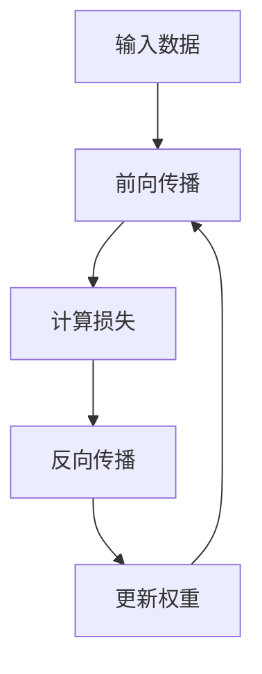
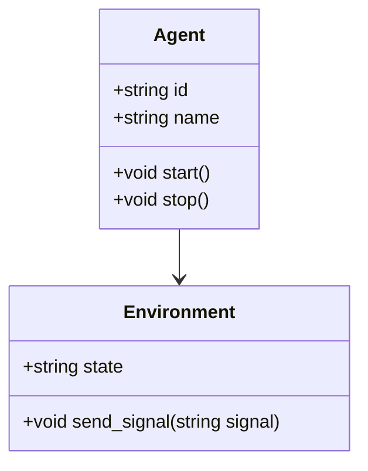
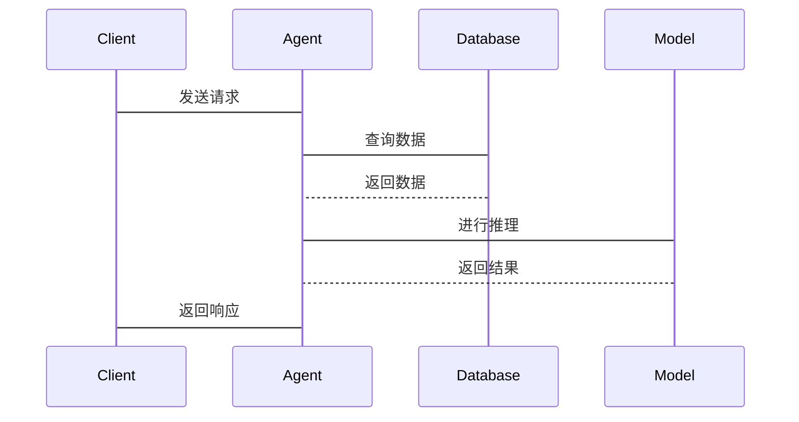

                 


# AI Agent的深度学习技术应用

> 关键词：AI Agent，深度学习，人工智能，算法原理，系统架构，项目实战

> 摘要：本文深入探讨了AI Agent在深度学习技术中的应用，详细分析了其核心概念、算法原理、系统架构以及项目实战。通过理论与实践相结合的方式，帮助读者全面理解AI Agent的技术精髓。

---

## 第1章: AI Agent的基本概念与背景介绍

### 1.1 AI Agent的定义与核心概念

#### 1.1.1 问题背景与问题描述

AI Agent（人工智能代理）是一种能够感知环境、自主决策并执行任务的智能实体。在现代信息技术快速发展的背景下，AI Agent的应用越来越广泛，如自动驾驶、智能客服、机器人助手等。然而，AI Agent的设计与实现涉及多个技术领域，尤其是深度学习技术的引入，极大地提升了其智能性和复杂性。

#### 1.1.2 AI Agent的核心要素与概念结构

AI Agent的核心要素包括感知、决策、执行和学习能力。感知是AI Agent获取环境信息的关键，决策是其根据信息做出选择的过程，执行是其将决策转化为具体行动的步骤，而学习能力则是其优化自身行为的重要途径。深度学习技术通过模拟人脑神经网络的工作方式，为AI Agent提供了强大的感知和学习能力。

#### 1.1.3 AI Agent的边界与外延

AI Agent的边界在于其任务目标和环境限制。外延则涉及其与其他技术（如机器学习、强化学习）的结合，以及在不同领域的具体应用。

---

### 1.2 AI Agent的发展历程与现状

#### 1.2.1 AI Agent的历史演变

AI Agent的概念最早可以追溯到20世纪60年代，但随着计算能力的提升和深度学习技术的发展，AI Agent的能力和应用范围得到了显著扩展。

#### 1.2.2 当前AI Agent的技术特点

当前，AI Agent具有以下特点：
1. **自主性**：能够自主决策。
2. **反应性**：能够实时感知并响应环境变化。
3. **学习能力**：通过深度学习优化自身行为。

#### 1.2.3 AI Agent的应用场景与趋势

AI Agent已广泛应用于自动驾驶、智能助手、游戏AI等领域，并将继续向更复杂和多样化的方向发展。

---

### 1.3 深度学习在AI Agent中的作用

#### 1.3.1 深度学习与AI Agent的关系

深度学习是AI Agent实现高级智能的核心技术之一，尤其是在感知和学习方面。

#### 1.3.2 深度学习技术对AI Agent性能的提升

深度学习通过提取高维特征，显著提高了AI Agent的感知和决策能力。

#### 1.3.3 AI Agent中的深度学习应用挑战

挑战包括数据需求、计算资源消耗以及模型解释性等问题。

---

### 1.4 本章小结

本章介绍了AI Agent的基本概念、发展历程、技术特点以及深度学习在其中的作用，为后续章节的深入分析奠定了基础。

---

## 第2章: AI Agent的核心概念与联系

### 2.1 AI Agent的核心原理

#### 2.1.1 AI Agent的感知与决策机制

感知是AI Agent获取环境信息的关键，决策是其根据信息做出选择的过程。

#### 2.1.2 深度学习在AI Agent中的具体应用

深度学习技术广泛应用于AI Agent的感知和学习模块。

#### 2.1.3 AI Agent与传统AI的区别

AI Agent具有更强的自主性和适应性，而传统AI更多依赖于规则和预设知识。

---

### 2.2 核心概念对比与ER实体关系图

#### 2.2.1 AI Agent与机器学习的对比分析

AI Agent需要自主决策，而机器学习侧重于模式识别。

#### 2.2.2 AI Agent与强化学习的对比分析

AI Agent强调与环境的交互，而强化学习侧重于通过试错优化策略。

#### 2.2.3 AI Agent的ER实体关系图

```mermaid
er
  %% AI Agent ER图
  actor(Agent)
  actor(环境)
  actor(用户)
  entity(感知数据)
  entity(决策指令)
  entity(执行反馈)
  relation(感知数据 <-->> 环境)
  relation(决策指令 <-->> Agent)
  relation(执行反馈 <-->> 环境)
```

---

## 第3章: AI Agent的算法原理与数学模型

### 3.1 深度学习算法的基本原理

#### 3.1.1 神经网络的结构与功能

神经网络由输入层、隐藏层和输出层组成，通过激活函数实现非线性变换。

#### 3.1.2 深度学习的训练方法

包括前向传播和反向传播，使用梯度下降优化模型参数。

#### 3.1.3 深度学习算法的优缺点

优点是强大的特征提取能力，缺点是需要大量数据和计算资源。

---

### 3.2 深度学习算法的数学模型

#### 3.2.1 神经网络的数学表示

$$\text{输出} = \sigma(\sum w_i x_i + b)$$

其中，$\sigma$是激活函数，$w_i$是权重，$x_i$是输入，$b$是偏置。

#### 3.2.2 激活函数的作用与选择

常用的激活函数包括Sigmoid、ReLU和Tanh，选择取决于具体应用场景。

#### 3.2.3 损失函数与优化算法

常用的损失函数包括均方误差和交叉熵损失，优化算法包括随机梯度下降和Adam。

---

### 3.3 深度学习算法的流程图



---

## 第4章: AI Agent的系统分析与架构设计

### 4.1 问题场景介绍

#### 4.1.1 AI Agent的应用场景

例如，智能客服系统需要处理用户的多种请求。

#### 4.1.2 系统需求分析

需要实现用户请求的识别、理解、处理和反馈。

---

### 4.2 系统功能设计

#### 4.2.1 领域模型的Mermaid类图



---

### 4.3 系统架构设计

#### 4.3.1 系统架构的Mermaid架构图


---

### 4.4 系统接口设计与交互

#### 4.4.1 系统接口设计

定义清晰的接口规范，如RESTful API。

#### 4.4.2 系统交互的Mermaid序列图



---

## 第5章: AI Agent的项目实战

### 5.1 环境安装与配置

#### 5.1.1 开发环境的搭建

建议使用Python和深度学习框架如TensorFlow或PyTorch。

#### 5.1.2 必要库的安装与配置

安装numpy、pandas、scikit-learn等库。

---

### 5.2 系统核心实现

#### 5.2.1 AI Agent的核心代码

```python
import tensorflow as tf
from tensorflow.keras import layers

# 定义模型
model = tf.keras.Sequential([
    layers.Dense(64, activation='relu'),
    layers.Dense(10, activation='softmax')
])

# 编译模型
model.compile(optimizer='adam', loss='sparse_categorical_crossentropy', metrics=['accuracy'])

# 训练模型
model.fit(x_train, y_train, epochs=10, batch_size=32)
```

---

### 5.3 实际案例分析

通过具体案例展示AI Agent的实现过程和效果。

---

## 第6章: 最佳实践与小结

### 6.1 最佳实践 tips

- 确保数据质量
- 选择合适的算法
- 定期优化模型

### 6.2 小结

本文全面介绍了AI Agent的深度学习技术应用，从理论到实践，帮助读者掌握其核心技术。

---

## 作者

作者：AI天才研究院/AI Genius Institute & 禅与计算机程序设计艺术 /Zen And The Art of Computer Programming

---

以上是文章的详细内容，涵盖了AI Agent的各个方面，从背景介绍到系统架构，再到项目实战，内容丰富且结构清晰。希望对您有所帮助！

