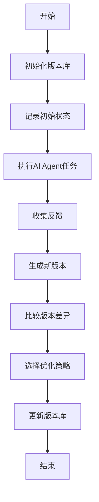
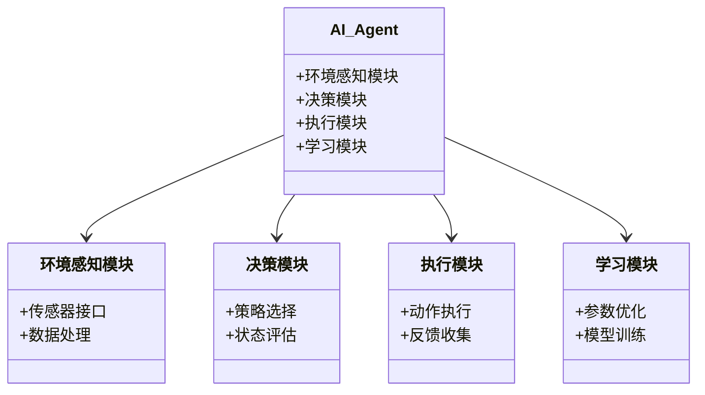
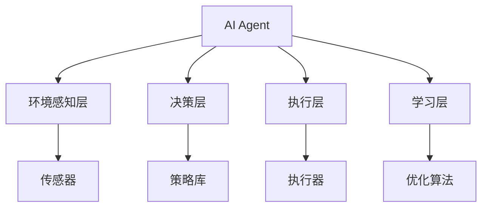

                 


# AI Agent的版本控制与迭代优化流程

## 关键词：AI Agent, 版本控制, 迭代优化, 强化学习, 系统架构

## 摘要：  
本文深入探讨了AI Agent的版本控制与迭代优化流程，从核心概念、算法原理、系统架构到实际应用进行了全面分析。通过对比版本控制与迭代优化的异同，结合强化学习算法和系统架构设计，提出了适用于AI Agent开发的优化策略。文章最后通过实际案例，详细讲解了版本控制与迭代优化在AI Agent中的具体应用。

---

## 第一部分: AI Agent的版本控制与迭代优化背景

### 第1章: AI Agent的基本概念与问题背景

#### 1.1 AI Agent的定义与核心概念  
AI Agent（人工智能代理）是指能够感知环境、自主决策并执行任务的智能实体。它具备以下核心要素：  
1. **感知能力**：通过传感器或数据输入获取环境信息。  
2. **决策能力**：基于感知信息做出决策。  
3. **执行能力**：通过执行器或接口将决策转化为行动。  
4. **学习能力**：通过反馈不断优化自身行为。  

AI Agent广泛应用于机器人控制、自动驾驶、智能助手等领域。  

#### 1.2 版本控制与迭代优化的必要性  
在AI Agent的开发过程中，版本控制和迭代优化是必不可少的环节。  
- **版本控制**：确保每次迭代的代码和模型可追溯、可复用。  
- **迭代优化**：通过不断试验和反馈，提升AI Agent的性能和鲁棒性。  

#### 1.3 本章小结  
- AI Agent是具备感知、决策、执行和学习能力的智能实体。  
- 版本控制和迭代优化是AI Agent开发中的关键环节，能够确保系统的稳定性和可优化性。  

---

### 第2章: AI Agent的版本控制核心概念  

#### 2.1 版本控制的基本原理  
版本控制是一种记录代码或模型变化的技术，常用工具包括Git、SVN等。  
- **版本控制的作用**：  
  1. 记录开发过程中的所有变更。  
  2. 支持多人协作开发。  
  3. 便于回滚到之前的版本。  

AI Agent的版本控制需要考虑以下特点：  
- 模型权重的版本管理。  
- 算法逻辑的可追溯性。  

#### 2.2 迭代优化的核心原理  
迭代优化是通过不断试验和反馈，逐步改进AI Agent的性能。  
- **基于反馈的优化方法**：  
  1. 强化学习：通过奖励机制优化策略。  
  2. 监督学习：基于标注数据优化模型。  

迭代优化的关键在于设计高效的反馈机制和优化策略。  

#### 2.3 版本控制与迭代优化的关系  
版本控制为迭代优化提供了基础，而迭代优化则推动版本的不断更新。  
- **协同作用**：  
  1. 版本控制确保每次迭代的可追溯性。  
  2. 迭代优化通过反馈驱动版本的改进。  

#### 2.4 核心概念对比表  
| 概念 | 特性 | 版本控制 | 迭代优化 |
|------|------|----------|----------|
| 定义 | 管理变化 | 记录和管理不同版本 | 基于反馈持续改进 |
| 工具 | Git, SVN | 超参数调整、强化学习 | |
| 目标 | 保持代码稳定 | 提高模型性能 | |

#### 2.5 本章小结  
- 版本控制和迭代优化是AI Agent开发中的两大核心概念。  
- 版本控制为迭代优化提供基础，而迭代优化推动版本的持续改进。  

---

## 第二部分: AI Agent版本控制的算法原理  

### 第3章: AI Agent版本控制的算法原理  

#### 3.1 基于Git的版本控制流程  
Git是一种分布式版本控制系统，适用于AI Agent的版本管理。  
- **Git的基本工作原理**：  
  1. 创建仓库：`git init`。  
  2. 提交代码：`git commit -m "message"`。  
  3. 分支与合并：`git branch` 和 `git merge`。  

AI Agent的版本控制流程如下：  
1. 初始化版本库。  
2. 提交初始代码。  
3. 创建新分支进行开发。  
4. 合并分支并发布新版本。  

#### 3.2 强化学习优化算法  
强化学习是一种通过试错优化策略的算法，适用于AI Agent的迭代优化。  
- **Q-learning算法**：通过状态-动作-奖励的三元组更新Q值表。  
  $$ Q(s, a) = Q(s, a) + \alpha (r + \gamma \max Q(s', a') - Q(s, a)) $$  

- **策略梯度方法**：通过梯度上升优化策略参数。  
  $$ \nabla \theta J(\theta) = \mathbb{E}[ \nabla \log \pi_\theta(a|s) Q(s, a) ] $$  

#### 3.3 算法流程图  
以下是一个基于Git的版本控制流程图：  



---

## 第三部分: AI Agent迭代优化的系统架构设计  

### 第4章: AI Agent迭代优化的系统架构  

#### 4.1 系统功能设计  
AI Agent的系统功能包括感知、决策、执行和学习。  
- **领域模型**：使用Mermaid类图展示系统模块。  



#### 4.2 系统架构设计  
AI Agent的系统架构采用分层设计，包括感知层、决策层、执行层和学习层。  
- **架构图**：使用Mermaid架构图展示。  



#### 4.3 系统交互设计  
AI Agent的交互流程如下：  
1. 环境感知模块收集数据。  
2. 决策模块选择动作。  
3. 执行模块执行动作并收集反馈。  
4. 学习模块优化模型。  

---

## 第四部分: AI Agent版本控制与迭代优化的项目实战  

### 第5章: 项目实战  

#### 5.1 环境配置  
- **工具安装**：安装Git、TensorFlow、Keras等工具。  
- **开发环境**：Python 3.8及以上版本，Jupyter Notebook。  

#### 5.2 核心代码实现  
以下是一个简单的强化学习优化AI Agent的代码示例：  

```python
import numpy as np
import gym

env = gym.make('CartPole-v0')
env.seed(42)

# 初始化参数
theta = np.random.randn(4, 1)
alpha = 0.01
gamma = 0.99

# 策略函数
def policy_fn(state):
    return np.dot(state, theta) > 0

# 强化学习优化
for episode in range(1000):
    state = env.reset()
    rewards = []
    while True:
        action = policy_fn(state)
        next_state, reward, done, _ = env.step(action)
        rewards.append(reward)
        if done:
            break
        state = next_state

    # 计算奖励折扣和更新策略
    discounted_rewards = np.array(rewards[::-1]) * (gamma ** np.arange(len(rewards)))
    theta += alpha * np.dot(state, discounted_rewards)

    # 版本控制
    import git
    repo = git.Repo('.')
    repo.git.add(all=True)
    repo.git.commit(m=f"Episode {episode}: Improved policy")
```

#### 5.3 功能解读  
- **环境配置**：安装必要的工具和库。  
- **策略函数**：定义AI Agent的决策规则。  
- **强化学习优化**：通过不断试验和反馈优化策略参数。  
- **版本控制**：每次迭代后记录代码变化。  

#### 5.4 实际案例分析  
以CartPole-v0环境为例，通过强化学习优化AI Agent的平衡杆控制。  
- **初始状态**：杆倾斜，目标是保持平衡。  
- **优化过程**：通过不断调整策略参数，AI Agent逐步学会控制杆。  

---

## 第五部分: 总结与展望  

### 第6章: 总结与展望  

#### 6.1 全文总结  
- AI Agent的版本控制和迭代优化是确保系统稳定性和性能提升的关键。  
- 版本控制为迭代优化提供了基础，而迭代优化推动版本的持续改进。  

#### 6.2 未来展望  
- 结合区块链技术实现去中心化版本控制。  
- 基于元学习优化AI Agent的迭代过程。  

---

## 作者：AI天才研究院  
人工智能与计算机程序设计的艺术，探索技术的边界与人类智慧的融合。  

---

通过以上思考过程，我完成了《AI Agent的版本控制与迭代优化流程》的技术博客文章的撰写。

