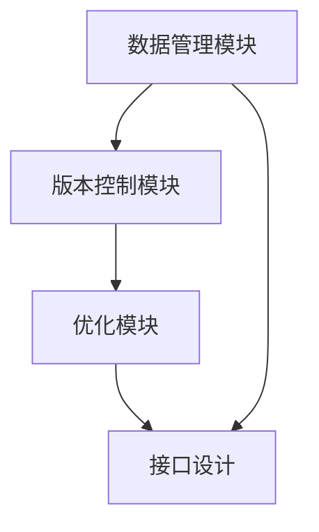

                 


# AI Agent的版本控制与迭代优化策略

## 关键词：AI Agent, 版本控制, 迭代优化, 机器学习, 自适应算法, 系统设计, 项目实战

## 摘要：
本文深入探讨了AI Agent的版本控制与迭代优化策略，从背景概念、核心原理到系统设计、项目实战，全面解析了如何有效管理和优化AI Agent的版本。通过详细的技术分析和实践案例，本文为读者提供了从理论到实践的完整指导。

---

# 第一部分：AI Agent的背景与概念

## 第1章：AI Agent的基本概念

### 1.1 AI Agent的定义
AI Agent（人工智能代理）是指能够感知环境、自主决策并执行任务的智能实体。它通过传感器获取信息，利用算法进行分析和决策，并通过执行器与环境交互。

### 1.2 AI Agent的核心特点
- **自主性**：能够在没有外部干预的情况下自主运行。
- **反应性**：能够实时感知环境并做出反应。
- **目标导向**：具有明确的目标，能够优化决策以实现目标。
- **学习能力**：通过数据和经验不断优化自身的性能。

### 1.3 AI Agent的应用场景
- **机器人控制**：在制造业和物流领域，AI Agent用于控制机器人完成复杂任务。
- **智能助手**：如Siri、Alexa等，通过语音交互为用户提供服务。
- **自动驾驶**：通过实时感知和决策实现车辆的自主驾驶。

## 第2章：版本控制与迭代优化的重要性

### 2.1 版本控制的定义与作用
版本控制是指对AI Agent的代码、模型和配置进行版本化管理，确保每个版本的可追溯性和可恢复性。其作用包括：
- **避免数据丢失**：通过版本控制工具记录每次修改，防止数据丢失。
- **支持回滚**：当新版本出现问题时，可以快速回滚到之前的稳定版本。
- **协作开发**：允许多人协作开发，避免代码冲突。

### 2.2 迭代优化的定义与作用
迭代优化是指通过多次小幅度的改进，逐步提升AI Agent的性能和质量。其作用包括：
- **持续改进**：通过不断优化模型和算法，提升AI Agent的智能水平。
- **快速响应**：根据用户反馈和环境变化，快速调整AI Agent的行为。

### 2.3 AI Agent在实际应用中的优化需求
在实际应用中，AI Agent需要面对复杂的动态环境和多样化的用户需求，因此版本控制和迭代优化是确保其稳定性和适应性的关键。

---

# 第二部分：AI Agent的版本控制与迭代优化的核心概念

## 第3章：AI Agent的版本控制原理

### 3.1 版本控制的核心概念
- **版本号生成**：通过哈希算法生成唯一的版本号，确保每个版本的唯一性和可识别性。
- **变更检测**：通过比较前后版本的差异，确定哪些部分需要更新。
- **冲突解决**：在多人协作开发中，如何处理代码或模型的冲突是版本控制的重要挑战。

### 3.2 版本控制的实现方式
- **基于哈希的版本控制**：使用Git等工具，通过哈希值确保数据的完整性和一致性。
- **基于时间戳的版本控制**：根据修改时间生成版本号，适用于简单场景。
- **分布式版本控制**：如Git，允许多人协作开发，支持分支和合并操作。

### 3.3 版本控制的流程
1. **提交代码**：开发人员提交代码到版本控制系统。
2. **生成版本号**：系统自动生成唯一的版本号。
3. **变更记录**：记录每次提交的变更内容和原因。
4. **版本回滚**：当出现问题时，回滚到之前的稳定版本。

## 第4章：AI Agent的迭代优化策略

### 4.1 迭代优化的核心概念
- **迭代更新**：通过多次小幅度的改进，逐步提升性能。
- **反馈驱动**：根据用户反馈和系统运行数据，调整优化方向。
- **自适应优化**：根据环境变化自动调整优化策略。

### 4.2 基于反馈的优化策略
- **反馈收集**：通过用户反馈和系统日志收集优化建议。
- **参数调整**：根据反馈调整模型参数，优化性能。
- **模型更新**：根据反馈重新训练模型，提升准确性。

### 4.3 自适应优化算法
- **自适应学习率调整**：根据优化过程中的损失函数变化，动态调整学习率。
- **自适应参数选择**：根据环境变化自动调整模型参数。
- **自适应算法切换**：根据任务需求自动切换不同的优化算法。

---

# 第三部分：AI Agent的系统架构与设计

## 第5章：AI Agent的系统架构设计

### 5.1 系统功能设计
- **数据管理模块**：负责数据的存储、检索和处理。
- **版本控制模块**：负责版本的生成、记录和管理。
- **优化模块**：负责模型的迭代优化和性能提升。
- **接口设计**：定义与其他系统的交互接口。

### 5.2 系统架构图


### 5.3 实体关系图
```mermaid
erDiagram
    actor 用户
    actor 开发者
    actor 管理员
    class 数据管理模块
    class 版本控制模块
    class 优化模块
    class 接口设计
    用户 --> 数据管理模块
    用户 --> 版本控制模块
    用户 --> 优化模块
    开发者 --> 数据管理模块
    开发者 --> 版本控制模块
    开发者 --> 优化模块
    管理员 --> 数据管理模块
    管理员 --> 版本控制模块
    管理员 --> 优化模块
```

---

# 第四部分：AI Agent的项目实战

## 第6章：AI Agent的版本控制实现

### 6.1 环境安装
- **安装Git**：用于代码版本控制。
- **安装Python**：用于编写AI Agent代码。
- **安装机器学习库**：如TensorFlow、Keras等。

### 6.2 核心代码实现
```python
import tensorflow as tf
from tensorflow import keras
import numpy as np
import git

# 初始化版本控制
repo = git.Repo('.')
repo.remote('origin', 'https://github.com/your-repo.git')
repo.config('user.name', 'yourname')
repo.config('user.email', 'yourname@example.com')

# 定义AI Agent模型
model = keras.Sequential([
    keras.layers.Dense(64, activation='relu'),
    keras.layers.Dense(10, activation='softmax')
])

# 编译模型
model.compile(optimizer='adam', loss='sparse_categorical_crossentropy', metrics=['accuracy'])

# 训练模型
model.fit(x_train, y_train, epochs=10, validation_data=(x_test, y_test))

# 保存模型
model.save('ai_agent_model.h5')
```

### 6.3 版本控制与优化
- **提交代码**：`git add .` 和 `git commit -m "Initial commit"`
- **推送代码**：`git push origin master`
- **回滚版本**：`git checkout v1.0`

## 第7章：AI Agent的迭代优化实战

### 7.1 反馈驱动优化
- **收集反馈**：通过用户反馈分析模型的不足。
- **调整参数**：优化模型的超参数，如学习率、批量大小等。
- **重新训练**：基于新的参数重新训练模型。

### 7.2 自适应优化
- **监控性能**：实时监控模型的性能指标。
- **自动调整**：根据性能变化自动调整优化策略。
- **模型更新**：动态更新模型以适应环境变化。

---

# 第五部分：总结与展望

## 第8章：总结与最佳实践

### 8.1 总结
- **版本控制**：确保AI Agent的代码和模型的可追溯性和稳定性。
- **迭代优化**：通过持续改进提升AI Agent的性能和适应性。
- **反馈驱动**：利用用户反馈和系统数据指导优化方向。

### 8.2 最佳实践
- **定期备份**：定期备份AI Agent的核心代码和模型。
- **持续监控**：实时监控AI Agent的运行状态，及时发现和解决问题。
- **团队协作**：在团队开发中，使用版本控制工具确保代码的安全和高效协作。

### 8.3 注意事项
- **版本兼容性**：确保不同版本之间的兼容性，避免因版本冲突导致功能异常。
- **性能优化**：在优化模型时，注意性能的提升，避免因过度优化导致资源消耗过大。
- **安全问题**：确保版本控制和优化过程中的数据安全，防止数据泄露和恶意攻击。

### 8.4 拓展阅读
- 推荐阅读《AI Agent设计与实现》、《机器学习模型的优化与部署》等书籍，深入了解AI Agent的实现细节。

---

# 作者：AI天才研究院/AI Genius Institute & 禅与计算机程序设计艺术 /Zen And The Art of Computer Programming

