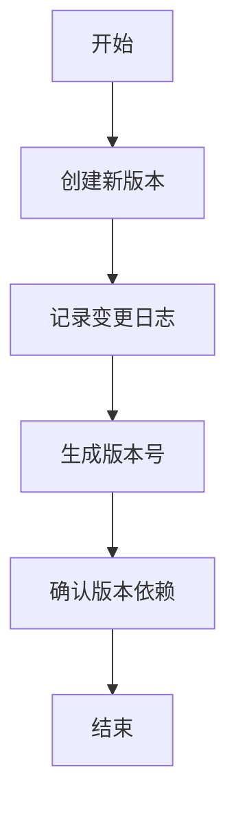
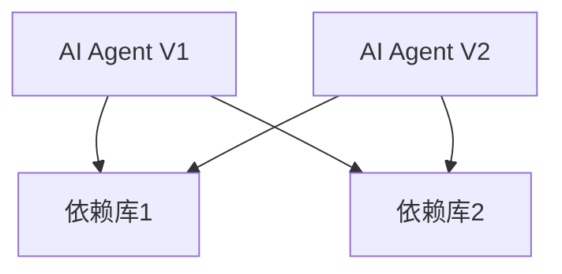
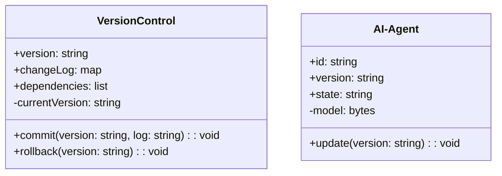

                 


# AI Agent的版本控制与迭代管理

## 关键词：AI Agent、版本控制、迭代管理、系统架构、算法原理

## 摘要：AI Agent作为人工智能领域的核心组件，其版本控制与迭代管理是确保其稳定性和高效性的重要环节。本文从AI Agent的基本概念出发，详细探讨版本控制与迭代管理的核心原理、算法实现、系统架构设计以及项目实战，帮助读者全面掌握AI Agent的版本控制与迭代管理方法。

---

# 第一部分: AI Agent的背景与核心概念

## 第1章: AI Agent的背景与核心概念

### 1.1 什么是AI Agent
#### 1.1.1 AI Agent的定义
AI Agent（人工智能代理）是指能够感知环境并采取行动以实现目标的智能实体。AI Agent可以是软件程序、机器人或其他智能系统，其核心目标是通过与环境交互来完成特定任务。

#### 1.1.2 AI Agent的核心特征
- **自主性**：AI Agent能够自主决策，无需外部干预。
- **反应性**：能够实时感知环境并做出反应。
- **目标导向**：所有行动都以实现特定目标为导向。
- **可扩展性**：能够根据需求进行功能扩展和性能提升。

#### 1.1.3 AI Agent的分类与应用场景
- **简单反射型Agent**：基于当前感知做出反应，适用于简单的任务。
- **基于模型的反射型Agent**：结合内部状态和外部环境进行决策，适用于复杂任务。
- **目标驱动型Agent**：以目标为导向，动态调整行动策略。
- **实用驱动型Agent**：以效用最大化为目标，适用于复杂的优化任务。

### 1.2 版本控制与迭代管理的背景
#### 1.2.1 软件开发中的版本控制
版本控制是软件开发中的基本工具，用于跟踪代码的变更历史，确保开发过程的可追溯性和可管理性。

#### 1.2.2 AI Agent的迭代管理需求
AI Agent的开发同样需要版本控制，但由于其智能化特性，版本控制的需求更加复杂。例如，AI模型的迭代更新、算法优化、功能扩展等都需要严格的版本控制策略。

#### 1.2.3 问题背景与目标
AI Agent的迭代管理需要解决以下问题：
- 如何跟踪AI Agent的变更历史？
- 如何管理不同版本之间的依赖关系？
- 如何确保迭代更新的稳定性和可追溯性？

### 1.3 本章小结
本章从AI Agent的基本概念出发，分析了其核心特征和应用场景，并探讨了版本控制与迭代管理的背景和目标，为后续内容奠定了基础。

---

# 第二部分: AI Agent版本控制的核心概念与原理

## 第2章: 版本控制的基本原理

### 2.1 版本控制的核心概念
#### 2.1.1 版本号与变更日志
版本号是标识AI Agent不同版本的唯一编号，通常采用语义化版本控制（如MAJOR.MINOR.PATCH）。变更日志记录了每个版本的修改内容、作者和修改原因。

#### 2.1.2 版本依赖与兼容性
AI Agent的版本控制需要考虑不同版本之间的依赖关系，确保新版本与旧版本的兼容性。例如，升级AI Agent时，需要确保新版本能够与旧版本的接口兼容。

#### 2.1.3 版本控制的边界与外延
版本控制的边界是指AI Agent的核心功能和接口，而外延则包括与AI Agent交互的环境、数据和用户。

### 2.2 迭代管理的流程与方法
#### 2.2.1 迭代开发的定义与特点
迭代开发是一种软件开发方法，通过多次小规模的迭代完成最终产品。AI Agent的迭代管理需要结合这种开发模式，逐步优化AI Agent的功能和性能。

#### 2.2.2 版本控制的流程图
以下是一个简化的版本控制流程图（使用Mermaid）：



### 2.3 核心概念对比表
以下是版本控制与迭代管理的核心概念对比表：

| 比较项 | 版本控制 | 迭代管理 |
|-------|---------|---------|
| 核心目标 | �跟踪变更历史 | 管理迭代过程 |
| 关键要素 | 版本号、变更日志 | 迭代目标、任务分解 |
| 适用范围 | 代码和配置文件 | 功能开发和优化 |

### 2.4 本章小结
本章详细探讨了版本控制的核心概念和迭代管理的流程方法，并通过对比分析明确了两者之间的差异与联系。

---

# 第三部分: AI Agent版本控制的算法与数学模型

## 第3章: 版本控制的算法原理

### 3.1 哈希算法在版本控制中的应用
#### 3.1.1 哈希函数的定义与作用
哈希函数是一种将任意长度的输入数据映射为固定长度的哈希值的函数，常用于数据完整性校验和版本控制。

#### 3.1.2 常见哈希函数的实现（如SHA-256）
以下是SHA-256哈希函数的Python实现示例：

```python
import hashlib

def compute_sha256(input_str):
    return hashlib.sha256(input_str.encode()).hexdigest()

print(compute_sha256("hello"))  # 输出: 2cf24adf23776397ab730726d63c004f
```

#### 3.1.3 哈希冲突的处理方法
哈希冲突是两个不同的输入生成相同的哈希值，可以通过增加哈希值的长度或使用双重哈希方法来减少冲突概率。

### 3.2 迭代管理的算法实现
#### 3.2.1 版本号生成算法
版本号生成算法需要结合AI Agent的功能需求和性能指标，确保版本号的唯一性和可读性。

#### 3.2.2 依赖管理的图模型（Mermaid）
以下是依赖管理的图模型：



### 3.3 数学模型与公式
#### 3.3.1 哈希函数的数学表达式
$$H(m) = \sum_{i=0}^{n-1} m_i \times 256^{n-1-i}$$

#### 3.3.2 版本号生成的数学模型
$$V = (R, M, L)$$
其中，R为版本号，M为修改标记，L为依赖列表。

### 3.4 本章小结
本章从算法原理的角度分析了哈希函数在版本控制中的应用，并探讨了版本号生成算法和依赖管理的图模型。

---

# 第四部分: AI Agent版本控制的系统架构与设计

## 第4章: 系统架构设计方案

### 4.1 系统功能设计
#### 4.1.1 领域模型设计（Mermaid类图）
以下是AI Agent版本控制系统的核心领域模型：



### 4.2 系统架构设计
#### 4.2.1 系统架构图（Mermaid）
以下是AI Agent版本控制系统的架构图：

```mermaid
container VersionControlSystem {
    VersionControlManager
    DependencyResolver
    ChangeLogDB
}
VersionControlManager --> DependencyResolver
VersionControlManager --> ChangeLogDB
```

### 4.3 系统接口设计
AI Agent版本控制系统的接口设计需要考虑以下几个方面：
- **版本号生成接口**：生成唯一的版本号。
- **依赖管理接口**：管理不同版本之间的依赖关系。
- **变更日志接口**：记录每个版本的变更日志。

### 4.4 本章小结
本章从系统架构设计的角度，分析了AI Agent版本控制系统的功能模块和接口设计，为后续的项目实现提供了理论基础。

---

# 第五部分: AI Agent版本控制的项目实战

## 第5章: 项目实战

### 5.1 环境安装
以下是AI Agent版本控制系统所需的环境和工具：
- **Python 3.8+**
- **Git**
- **Docker**
- **依赖管理工具（如pipenv）**

### 5.2 系统核心实现
以下是版本控制的核心实现代码：

```python
class VersionControl:
    def __init__(self):
        self.change_log = {}

    def commit(self, version, log):
        self.change_log[version] = log

    def rollback(self, version):
        if version in self.change_log:
            del self.change_log[version]
            return True
        return False

# 示例用法
vc = VersionControl()
vc.commit("v1.0.0", "Initial version")
vc.commit("v1.0.1", "Bug fix in core module")
print(vc.change_log)  # 输出: {'v1.0.0': 'Initial version', 'v1.0.1': 'Bug fix in core module'}
```

### 5.3 代码应用解读与分析
上述代码实现了版本控制的基本功能，包括提交变更和回滚版本。通过change_log字典记录每个版本的变更日志，确保版本控制的可追溯性。

### 5.4 实际案例分析
假设我们有一个AI Agent需要进行版本迭代，以下是具体步骤：
1. 提交初始版本（v1.0.0）。
2. 修复核心模块的Bug，提交新版本（v1.0.1）。
3. 添加新功能，提交新版本（v2.0.0）。

### 5.5 项目小结
本章通过实际案例展示了AI Agent版本控制系统的实现过程，帮助读者理解理论知识在实践中的应用。

---

# 第六部分: AI Agent版本控制的最佳实践与总结

## 第6章: 最佳实践

### 6.1 版本控制的注意事项
- **明确版本号的命名规则**：采用语义化版本控制，确保版本号的唯一性和可读性。
- **定期同步变更日志**：确保变更日志的完整性和准确性。
- **严格管理依赖关系**：确保不同版本之间的依赖关系清晰明确。

### 6.2 迭代管理的注意事项
- **制定清晰的迭代目标**：确保每次迭代都有明确的目标和范围。
- **控制迭代周期**：避免迭代周期过长，影响开发效率。
- **及时总结与优化**：每次迭代结束后，及时总结经验教训，优化后续迭代。

### 6.3 小结与展望
AI Agent的版本控制与迭代管理是确保其稳定性和高效性的关键环节。通过本文的探讨，读者可以全面掌握AI Agent的版本控制与迭代管理方法，并将其应用于实际项目中。

---

# 附录

## 附录A: 术语表
- **AI Agent**：人工智能代理，能够感知环境并采取行动以实现目标的智能实体。
- **版本控制**：跟踪代码或系统的变更历史，确保开发过程的可追溯性和可管理性。
- **迭代管理**：通过多次小规模的迭代完成最终产品，确保开发过程的灵活性和高效性。

## 附录B: 工具与资源
- **Git**：版本控制工具。
- **Docker**：容器化工具，用于AI Agent的部署与管理。
- **Pipenv**：Python依赖管理工具。

---

# 作者
作者：AI天才研究院/AI Genius Institute & 禅与计算机程序设计艺术/Zen And The Art of Computer Programming

---

通过本文的系统阐述，读者可以全面了解AI Agent的版本控制与迭代管理的核心原理、算法实现和系统架构，并能够将其应用于实际项目中，确保AI Agent的稳定性和高效性。

