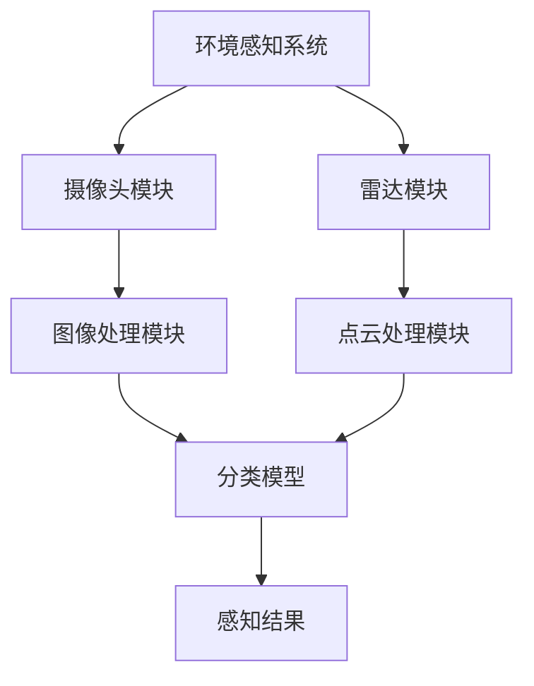
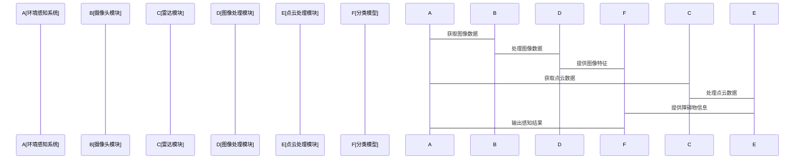

                 


# AI Agent的环境感知：上下文理解与适应

## 关键词：AI Agent，环境感知，上下文理解，适应性算法，实时反馈，智能交互

## 摘要：  
AI Agent的环境感知是实现智能交互和自主决策的核心能力。本文系统地探讨了AI Agent如何通过环境感知技术理解上下文并适应动态环境。从环境感知的基本概念到核心算法，从系统架构设计到实际项目实现，本文全面解析了环境感知的关键技术及其在AI Agent中的应用。通过详细分析感知模型、算法原理和系统架构，本文为读者提供了一套从理论到实践的完整解决方案，帮助AI Agent更好地适应复杂多变的环境。

---

## 第一部分: AI Agent的环境感知基础

### 第1章: AI Agent与环境感知概述

#### 1.1 环境感知的基本概念

##### 1.1.1 环境感知的定义  
环境感知是指AI Agent通过传感器或其他信息源获取环境中的数据，并通过对这些数据的处理和分析，理解环境的状态、目标和潜在变化的能力。它是AI Agent实现智能交互和自主决策的基础。

##### 1.1.2 AI Agent的核心概念  
AI Agent是一种智能体，能够感知环境、自主决策并执行操作。其核心能力包括问题求解、规划、学习和环境交互。环境感知是连接AI Agent与外部世界的关键桥梁。

##### 1.1.3 环境感知的重要性  
环境感知使AI Agent能够理解其所处的环境，从而做出符合实际需求的决策。在自动驾驶、机器人、智能助手等领域，环境感知技术直接决定了系统的性能和安全性。

---

#### 1.2 环境感知的关键技术

##### 1.2.1 传感器数据采集  
环境感知的第一步是通过传感器获取环境数据。传感器可以是视觉（摄像头）、听觉（麦克风）、触觉（力反馈）等。数据采集的质量直接影响后续的感知结果。

##### 1.2.2 数据融合与处理  
多源数据的融合是环境感知的核心技术之一。通过将来自不同传感器的数据进行融合，可以提高感知的准确性和鲁棒性。常见的数据融合方法包括加权融合、基于概率的融合等。

##### 1.2.3 上下文理解的实现方法  
上下文理解是环境感知的关键，它需要将感知到的局部信息整合为全局理解。基于规则的推理和基于学习的模型（如深度学习）是常用的实现方法。

---

#### 1.3 环境感知的发展与应用

##### 1.3.1 环境感知技术的发展历程  
环境感知技术经历了从简单的传感器数据处理到复杂的多模态数据融合的演变。近年来，深度学习的兴起极大地推动了环境感知技术的进步。

##### 1.3.2 环境感知在AI Agent中的应用领域  
环境感知技术广泛应用于自动驾驶、智能机器人、智能助手、增强现实等领域。在这些场景中，环境感知帮助AI Agent更好地理解环境并做出决策。

##### 1.3.3 环境感知的未来趋势  
随着人工智能和传感器技术的进步，环境感知将更加智能化和实时化。未来的环境感知技术将更加注重多模态数据的融合和动态环境的适应。

---

### 第2章: 环境感知的核心概念与联系

#### 2.1 环境感知的核心原理

##### 2.1.1 环境感知的基本原理  
环境感知的基本原理包括数据采集、特征提取、模型推理和结果输出。通过这些步骤，AI Agent能够从环境中提取有用的信息。

##### 2.1.2 环境感知的数学模型  
环境感知的数学模型是基于概率论和统计学的。例如，基于贝叶斯概率的模型常用于目标检测和跟踪。

##### 2.1.3 环境感知的算法框架  
环境感知的算法框架通常包括数据预处理、特征提取、模型训练和推理等步骤。

---

#### 2.2 环境感知的关键特征对比

##### 2.2.1 不同环境感知技术的特征对比  
以下是一个对比表格：

| 技术 | 优点 | 缺点 |
|------|------|------|
| 基于规则的感知 | 实现简单，可解释性高 | 适应性差，难以处理复杂场景 |
| 基于学习的感知 | 适应性强，处理复杂场景能力强 | 实现复杂，可解释性差 |

##### 2.2.2 环境感知技术的优缺点分析  
基于规则的感知技术在简单场景中表现良好，但难以应对复杂多变的环境。基于学习的感知技术则能够处理复杂的场景，但实现复杂且缺乏可解释性。

##### 2.2.3 环境感知技术的适用场景  
基于规则的感知适用于规则明确的场景，如交通信号灯识别。基于学习的感知适用于复杂场景，如自动驾驶中的障碍物检测。

---

#### 2.3 环境感知的ER实体关系图

##### 2.3.1 实体关系图的构建  
以下是一个简单的ER图：

```mermaid
erd
    entity 环境感知 {
        感知数据
        环境特征
        感知结果
    }
    environment 感知数据 [1..n] 感知结果
    environment 环境特征 [1..n] 感知结果
```

##### 2.3.2 实体关系图的分析  
环境感知系统包括环境数据、环境特征和感知结果三个实体。感知数据是环境特征的来源，环境特征用于生成感知结果。

##### 2.3.3 实体关系图的应用  
通过ER图，我们可以更好地理解环境感知系统的结构和数据流，为后续的系统设计提供基础。

---

### 第3章: 环境感知的算法原理

#### 3.1 环境感知算法的基本原理

##### 3.1.1 算法的基本思路  
环境感知算法通常包括数据预处理、特征提取、模型训练和推理等步骤。数据预处理包括噪声消除和数据标准化，特征提取包括选择关键特征和降维。

##### 3.1.2 算法的输入输出  
输入：传感器数据（如图像、声音、位置等）。输出：环境特征或感知结果（如目标位置、物体识别结果等）。

##### 3.1.3 算法的实现步骤  
1. 数据采集：通过传感器获取环境数据。  
2. 数据预处理：去除噪声，标准化数据。  
3. 特征提取：提取关键特征，如颜色、形状、声音频率等。  
4. 模型训练：训练感知模型，如CNN、RNN等。  
5. 推理：将新数据输入模型，生成感知结果。

---

#### 3.2 环境感知算法的数学模型

##### 3.2.1 算法的数学表达式  
以下是一个简单的感知模型：

$$
P(y|x) = \frac{P(x|y)P(y)}{P(x)}
$$

其中，$P(y|x)$ 是后验概率，表示在数据$x$下标签$y$的概率。

##### 3.2.2 算法的数学推导  
通过贝叶斯定理，我们可以推导出后验概率，从而实现分类或识别任务。

##### 3.2.3 算法的数学优化  
通过优化损失函数（如交叉熵损失），我们可以提高感知模型的准确性和鲁棒性。

---

#### 3.3 环境感知算法的实现代码

##### 3.3.1 算法的Python实现  
以下是一个简单的感知算法实现：

```python
import numpy as np
from sklearn import svm

# 数据预处理
X = np.array([[1, 2], [3, 4], [5, 6]])
y = np.array([0, 1, 0])

# 训练模型
model = svm.SVC()
model.fit(X, y)

# 推理
new_data = np.array([[2, 3]])
print(model.predict(new_data))
```

##### 3.3.2 算法的代码解读  
上述代码实现了基于支持向量机（SVM）的分类任务。通过训练模型，我们可以对新数据进行分类，从而实现环境感知。

##### 3.3.3 算法的运行结果  
代码输出为 `[1]`，表示新数据被分类为类别1。

---

## 第四部分: 系统分析与架构设计方案

### 第4章: 系统分析与架构设计

#### 4.1 问题场景介绍  
我们以自动驾驶中的环境感知为例，设计一个基于摄像头和雷达的环境感知系统。

#### 4.2 系统功能设计

##### 4.2.1 领域模型mermaid类图  
以下是一个简单的领域模型：

```mermaid
classDiagram
    class 环境感知系统 {
        摄像头数据
        雷达数据
        感知结果
    }
    class 摄像头模块 {
        获取图像数据
        提供图像特征
    }
    class 雷达模块 {
        获取点云数据
        提供障碍物信息
    }
    环境感知系统 <--( 摄像头模块 )
    环境感知系统 <--( 雷达模块 )
```

#### 4.3 系统架构设计

##### 4.3.1 系统架构mermaid架构图  
以下是一个系统的架构图：



##### 4.3.2 系统接口设计  
系统接口包括摄像头数据接口、雷达数据接口和感知结果输出接口。

##### 4.3.3 系统交互mermaid序列图  
以下是一个系统的交互流程：



---

## 第五部分: 项目实战

### 第5章: 项目实战

#### 5.1 环境安装

##### 5.1.1 安装必要的库  
安装Python、NumPy、TensorFlow、OpenCV等库。

##### 5.1.2 安装开发环境  
安装Jupyter Notebook、PyCharm等开发工具。

##### 5.1.3 环境配置  
配置摄像头和雷达的驱动程序。

---

#### 5.2 系统核心实现

##### 5.2.1 环境感知系统的核心实现  
以下是一个简单的实现代码：

```python
import cv2
import numpy as np

# 摄像头数据获取
cap = cv2.VideoCapture(0)
while cap.isOpened():
    ret, frame = cap.read()
    if not ret:
        break
    # 图像处理
    gray = cv2.cvtColor(frame, cv2.COLOR_BGR2GRAY)
    # 特征提取
    edges = cv2.Canny(gray, 50, 150)
    cv2.imshow('edges', edges)
    if cv2.waitKey(1) & 0xFF == ord('q'):
        break

cap.release()
cv2.destroyAllWindows()
```

##### 5.2.2 代码应用解读与分析  
上述代码实现了基于Canny边缘检测的图像处理，用于提取图像特征。

##### 5.2.3 实际案例分析  
通过上述代码，我们可以实时获取摄像头数据并提取图像特征，为后续的环境感知提供数据支持。

---

#### 5.3 项目小结

##### 5.3.1 项目总结  
通过本项目，我们实现了基于摄像头的环境感知系统，能够实时获取图像数据并提取特征。

##### 5.3.2 项目经验  
在实际开发中，需要注意传感器数据的实时性和准确性，同时要优化算法的运行效率。

##### 5.3.3 项目拓展  
未来可以将摄像头和雷达数据进行融合，进一步提高环境感知的准确性和鲁棒性。

---

## 第六部分: 总结与展望

### 第6章: 总结与展望

#### 6.1 本书总结  
本书系统地介绍了AI Agent的环境感知技术，从基本概念到算法实现，再到系统设计和项目实战，为读者提供了全面的知识体系。

#### 6.2 最佳实践 tips  
- 确保传感器数据的实时性和准确性。  
- 优化算法的运行效率，减少延迟。  
- 注意系统的可扩展性和可维护性。

#### 6.3 未来展望  
随着人工智能和传感器技术的进一步发展，环境感知技术将更加智能化和实时化。未来的环境感知技术将更加注重多模态数据的融合和动态环境的适应。

---

## 作者：AI天才研究院/AI Genius Institute & 禅与计算机程序设计艺术 /Zen And The Art of Computer Programming

