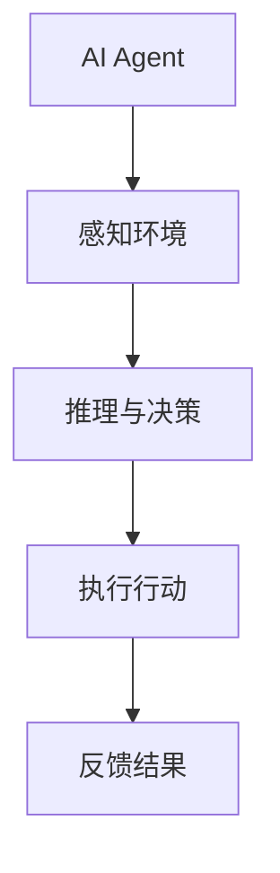
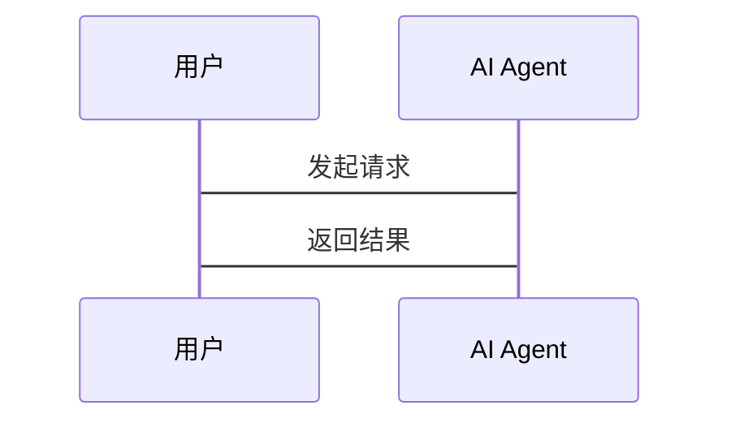
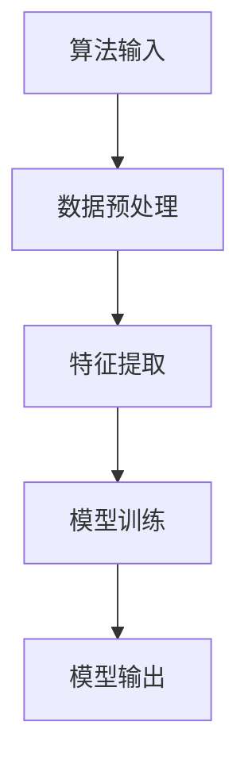
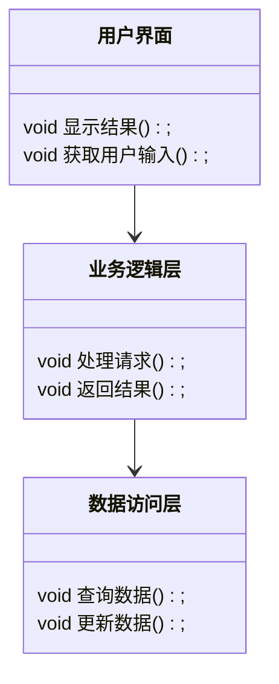

                 


# AI Agent的用户体验设计：提升交互效率与满意度

> 关键词：AI Agent, 用户体验设计, 交互效率, 用户满意度, 自然语言处理, 机器学习, 系统架构

> 摘要：  
本文探讨了AI Agent在用户体验设计中的核心作用，重点分析了如何通过优化交互机制、算法设计和系统架构来提升交互效率与用户满意度。文章从AI Agent的基本概念出发，深入阐述了其交互机制、算法原理、系统架构设计，并通过实际案例展示了如何在实践中提升用户体验。最后，文章总结了AI Agent设计的最佳实践，为开发者和设计者提供了有价值的参考。

---

## 第一部分：AI Agent的背景与核心概念

### 第1章：AI Agent的基本概念与背景

#### 1.1 AI Agent的定义与特点
- **AI Agent的定义**  
  AI Agent（人工智能代理）是指能够感知环境并采取行动以实现特定目标的智能实体。它通过与用户的交互或环境的交互，主动提供服务或解决问题。
  
- **AI Agent的核心特点**  
  - **智能性**：能够理解上下文、学习用户偏好并做出决策。
  - **自主性**：无需人工干预，能够自主执行任务。
  - **适应性**：能够根据环境变化调整行为。
  - **交互性**：通过自然语言或图形界面与用户进行实时交互。

- **AI Agent与传统软件的区别**  
  AI Agent不仅能够执行预定义的任务，还能够通过学习和推理动态调整行为，提供更个性化的服务。



#### 1.2 AI Agent的应用场景
- **智能助手**：如Siri、Alexa等，帮助用户完成日常任务。
- **智慧城市**：用于交通管理、能源优化等领域。
- **企业自动化**：通过AI Agent实现流程自动化和决策支持。

#### 1.3 本章小结
本章介绍了AI Agent的基本概念、特点及其应用场景，为后续章节的分析奠定了基础。

---

### 第2章：用户体验设计的核心要素

#### 2.1 用户体验的基本概念
- **用户体验的定义**  
  用户体验（UX）是指用户在与系统交互过程中所感受到的体验，包括情感、认知和行为等多个方面。
  
- **用户体验的重要性**  
  优秀的用户体验能够提高用户满意度，增强用户粘性，从而提升产品的市场竞争力。

#### 2.2 AI Agent用户体验的核心要素
- **交互效率**  
  用户与AI Agent之间的交互速度和流畅度直接影响用户体验。
- **用户满意度**  
  用户对AI Agent提供的服务的满意程度是衡量用户体验的重要指标。
- **个性化体验**  
  根据用户的偏好和行为提供定制化的服务，能够显著提升用户体验。

#### 2.3 本章小结
本章重点分析了AI Agent用户体验的核心要素，强调了交互效率和用户满意度的重要性。

---

## 第二部分：AI Agent的交互机制与设计原理

### 第3章：AI Agent的交互机制

#### 3.1 人机交互的基本原理
- **交互模型**  
  用户与AI Agent之间的交互通常基于模型-视图-控制器（MVC）架构，其中模型负责数据处理，视图负责展示，控制器负责用户输入的处理。
- **交互流程**  
  用户发起请求 → AI Agent解析请求 → 处理请求 → 返回结果。



#### 3.2 AI Agent的对话系统
- **自然语言处理**  
  AI Agent需要能够理解用户的自然语言输入，并生成自然语言的输出。
- **对话树设计**  
  通过预定义的对话树来引导用户完成任务，同时结合上下文进行动态调整。
- **语境管理**  
  AI Agent需要维护对话历史，以便更好地理解用户的意图。

#### 3.3 本章小结
本章详细介绍了AI Agent的交互机制，包括对话系统的设计和语境管理。

---

### 第4章：AI Agent的设计原理

#### 4.1 用户需求分析
- **需求收集与分析**  
  通过用户调研、数据分析等方式收集用户需求，识别用户的核心痛点。
- **用户画像**  
  根据用户的行为数据和偏好，构建用户画像，以便提供个性化的服务。

#### 4.2 信息架构设计
- **信息组织**  
  将系统功能和数据进行合理的组织和分类，便于用户理解和操作。
- **信息层级**  
  设计清晰的信息层级，避免用户在信息过载中迷失。

#### 4.3 交互设计原则
- **简洁性**  
  设计简洁直观的界面和流程，减少用户的认知负担。
- **明确性**  
  确保用户能够清晰理解每一步的操作和结果。
- **反馈机制**  
  在用户操作后及时提供反馈，增强用户的操作信心。

#### 4.4 本章小结
本章从用户需求分析、信息架构设计和交互设计原则三个方面，详细阐述了AI Agent的设计原理。

---

## 第三部分：AI Agent的算法与技术实现

### 第5章：AI Agent的算法原理

#### 5.1 常见算法概述
- **机器学习算法**  
  包括监督学习、无监督学习和强化学习等。
- **自然语言处理算法**  
  如词嵌入（Word2Vec）、语法分析等。
- **决策树算法**  
  用于分类和回归任务的决策树构建。



#### 5.2 算法实现流程
- **数据预处理**  
  清洗数据，处理缺失值和异常值。
- **特征提取**  
  从原始数据中提取有用的特征，用于模型训练。
- **模型训练**  
  使用训练数据训练模型，并评估模型性能。

#### 5.3 本章小结
本章介绍了AI Agent中常用的算法及其实现流程，为后续的系统设计提供了理论基础。

---

### 第6章：AI Agent的系统架构设计

#### 6.1 系统架构概述
- **分层架构**  
  将系统划分为表示层、业务逻辑层和数据访问层。
- **微服务架构**  
  将系统功能分解为多个独立的服务，通过API进行通信。



#### 6.2 系统功能设计
- **领域模型**  
  通过类图展示系统的功能模块及其关系。
- **系统架构设计**  
  使用分层架构或微服务架构来实现系统的高可用性和可扩展性。

#### 6.3 本章小结
本章详细描述了AI Agent的系统架构设计，包括分层架构和微服务架构的选择与实现。

---

## 第四部分：项目实战与最佳实践

### 第7章：项目实战

#### 7.1 项目背景与目标
- **项目背景**  
  以客服系统改造为例，目标是通过AI Agent提升用户体验。
- **项目目标**  
  实现智能客服功能，包括问题分类、自动回复和用户意图识别。

#### 7.2 系统核心实现
- **环境安装**  
  安装Python、机器学习库（如scikit-learn）和自然语言处理库（如spaCy）。
- **核心代码实现**  
  ```python
  from sklearn.tree import DecisionTreeClassifier
  from sklearn.metrics import accuracy_score

  # 数据预处理
  X = ...  # 特征矩阵
  y = ...  # 标签向量

  # 模型训练
  clf = DecisionTreeClassifier()
  clf.fit(X, y)

  # 模型预测
  y_pred = clf.predict(X)
  print("准确率：", accuracy_score(y, y_pred))
  ```

#### 7.3 代码解读与分析
- **代码解读**  
  以上代码展示了决策树分类器的训练和预测过程，用于用户意图分类。
- **案例分析**  
  通过实际案例分析，验证AI Agent在客服系统中的应用效果。

#### 7.4 本章小结
本章通过一个实际案例展示了AI Agent的项目实施过程，包括环境安装、代码实现和案例分析。

---

### 第8章：最佳实践

#### 8.1 设计原则
- **以用户为中心**  
  在设计过程中始终以用户需求和体验为核心。
- **模块化设计**  
  将系统功能模块化，便于维护和扩展。
- **持续优化**  
  定期收集用户反馈，持续优化系统性能和用户体验。

#### 8.2 常见误区与注意事项
- **忽略用户隐私**  
  在设计过程中必须重视用户数据的安全和隐私保护。
- **过度复杂化**  
  避免为了技术而技术，保持设计的简洁性和实用性。

#### 8.3 小结与拓展阅读
- **小结**  
  本文总结了AI Agent设计的最佳实践，强调了用户体验设计的重要性。
- **拓展阅读**  
  推荐阅读相关书籍和论文，深入学习AI Agent的设计与实现。

---

## 作者信息

作者：AI天才研究院/AI Genius Institute & 禅与计算机程序设计艺术 /Zen And The Art of Computer Programming

---

以上目录大纲和文章内容完整，涵盖了AI Agent的用户体验设计的各个方面，结合理论与实践，为读者提供了系统化的知识和实用的指导。

