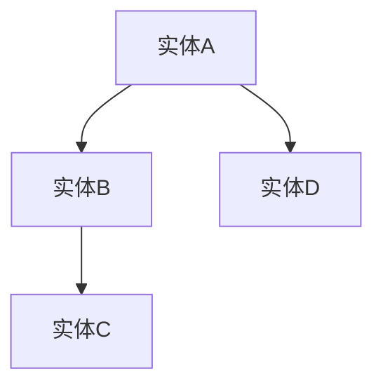
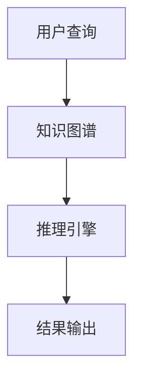
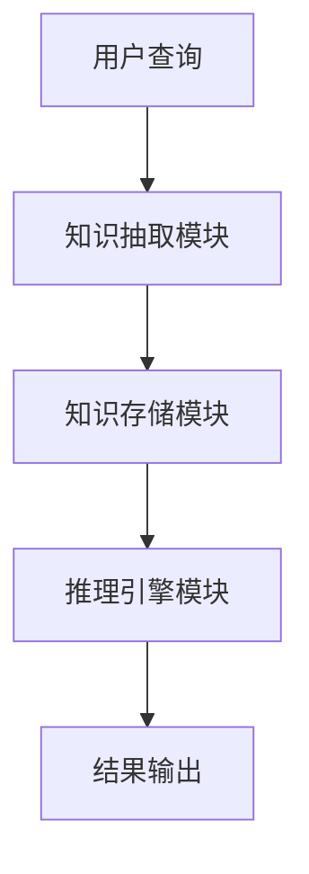
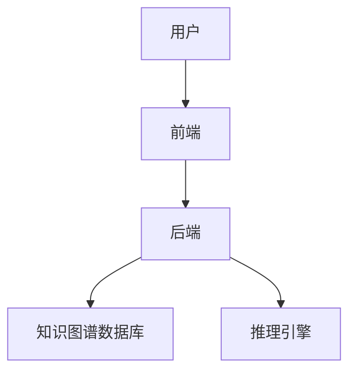
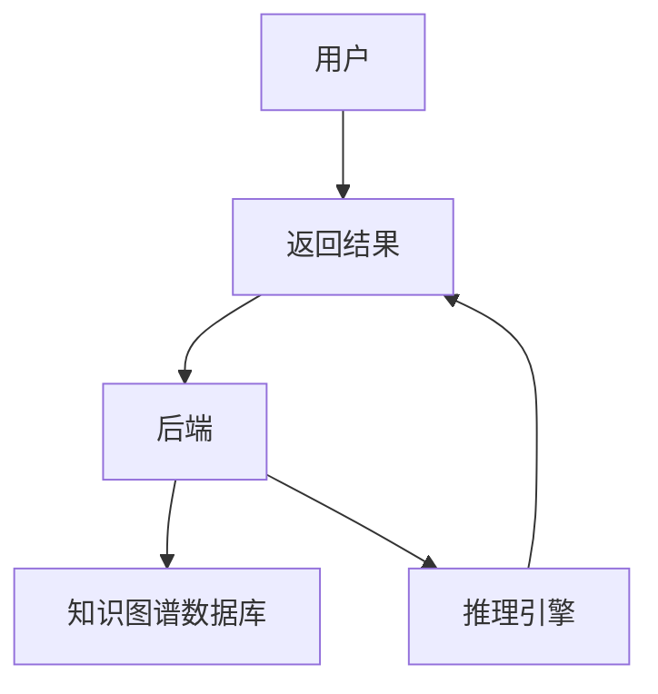

                 


# AI Agent的知识图谱应用

## 关键词
AI Agent, 知识图谱, 实体识别, 关系推理, 语义理解, 智能系统

## 摘要
本文探讨AI Agent在知识图谱中的应用，分析知识图谱如何为AI Agent提供结构化知识，增强其智能性。通过背景介绍、核心概念、算法原理、系统架构、项目实战等多维度分析，详细阐述AI Agent与知识图谱的结合方式，展示其在自然语言处理、推荐系统等领域的应用，并提供实际案例和技术实现，最后总结最佳实践和未来方向。

---

# 第一部分: AI Agent与知识图谱的背景介绍

## 第1章: 知识图谱的基本概念与应用

### 1.1 知识图谱的定义与特点
#### 1.1.1 知识图谱的定义
知识图谱是一种以结构化方式表示实体及其关系的数据模型，通常以图的形式存储，节点代表实体，边表示关系。

#### 1.1.2 知识图谱的核心特点
- **结构化**：以图结构表示实体和关系。
- **语义丰富**：包含实体的属性和相互关系。
- **动态更新**：能够实时更新和扩展。

#### 1.1.3 知识图谱与传统数据库的区别
| 特性 | 知识图谱 | 传统数据库 |
|------|----------|-------------|
| 数据结构 | 图结构 | 行列结构 |
| 语义支持 | 高 | 低 |
| 查询能力 | 支持复杂语义查询 | 支持简单查询 |

### 1.2 AI Agent的基本概念
#### 1.2.1 AI Agent的定义
AI Agent是具有感知环境、执行任务和自主决策能力的智能实体。

#### 1.2.2 AI Agent的核心功能
- 感知环境：通过传感器或数据接口获取信息。
- 决策与推理：基于知识库进行推理和决策。
- 执行任务：根据决策结果执行操作。

#### 1.2.3 AI Agent与传统软件的区别
| 特性 | AI Agent | 传统软件 |
|------|----------|-----------|
| 智能性 | 高 | 低 |
| 自主性 | 高 | 低 |
| 学习能力 | 有 | 无 |

### 1.3 知识图谱与AI Agent的结合
知识图谱为AI Agent提供结构化知识，使其能够进行推理和决策，而AI Agent则利用自身的智能性，动态更新知识图谱，增强其知识库的丰富性。

---

## 第2章: 知识图谱的应用场景

### 2.1 知识图谱在自然语言处理中的应用
#### 2.1.1 实体识别与链接
通过知识图谱，AI Agent能够识别文本中的实体并链接到知识库中的具体概念。

#### 2.1.2 关系抽取
从文本中提取实体间的关系，并将其存储在知识图谱中，增强语义理解能力。

#### 2.1.3 智能问答系统
基于知识图谱构建问答系统，提供更准确和丰富的答案。

### 2.2 知识图谱在推荐系统中的应用
#### 2.2.1 基于知识图谱的个性化推荐
通过分析用户行为和知识图谱中的实体关系，推荐更符合用户需求的内容。

#### 2.2.2 知识图谱与协同过滤的结合
利用知识图谱中的关系信息，提升协同过滤的准确性和多样性。

#### 2.2.3 知识图谱在推荐系统中的优势
- **语义丰富性**：提供更精准的推荐。
- **动态更新**：实时更新推荐结果。

### 2.3 知识图谱在AI Agent中的应用场景
#### 2.3.1 智能助手中的知识图谱应用
通过知识图谱提供上下文理解和多轮对话能力。

#### 2.3.2 智慧城市中的知识图谱应用
利用知识图谱进行城市资源优化配置和事件处理。

#### 2.3.3 企业知识管理中的知识图谱应用
构建企业知识图谱，辅助决策和知识共享。

---

## 第3章: 知识图谱与AI Agent的结合优势

### 3.1 知识图谱为AI Agent提供结构化知识
知识图谱的结构化特性使得AI Agent能够高效地进行知识检索和推理。

### 3.2 AI Agent为知识图谱提供动态更新能力
AI Agent通过感知环境和学习能力，能够实时更新知识图谱，保持其准确性和时效性。

---

# 第二部分: 知识图谱与AI Agent的核心概念与联系

## 第4章: 知识图谱与AI Agent的核心概念

### 4.1 知识图谱的构建与管理
#### 4.1.1 知识抽取
从文本中提取实体和关系，构建知识图谱。

#### 4.1.2 知识融合
将多个来源的知识进行整合，消除冲突，形成一致的知识表示。

#### 4.1.3 知识更新
根据新数据动态更新知识图谱。

### 4.2 AI Agent的知识表示与推理
#### 4.2.1 知识表示
使用符号逻辑或语义网络表示知识。

#### 4.2.2 知识推理
基于知识图谱进行逻辑推理，得出新的结论。

---

## 第5章: 知识图谱与AI Agent的关系图解

### 5.1 实体关系图
使用Mermaid图展示知识图谱中的实体及其关系。



### 5.2 AI Agent的知识获取流程


---

# 第三部分: 知识图谱与AI Agent的算法原理

## 第6章: 知识图谱构建算法

### 6.1 实体识别算法
#### 6.1.1 基于规则的方法
通过预定义规则识别文本中的实体。

#### 6.1.2 基于机器学习的方法
使用CRF或BERT等模型进行实体识别。

### 6.2 关系抽取算法
#### 6.2.1 基于模板的方法
通过预定义模板匹配关系。

#### 6.2.2 基于图嵌入的方法
使用节点嵌入技术学习关系。

### 6.3 知识图谱更新算法
#### 6.3.1 基于规则的更新
根据预定义规则更新知识图谱。

#### 6.3.2 基于学习的更新
使用机器学习模型自动更新知识图谱。

---

## 第7章: AI Agent的知识推理算法

### 7.1 基于规则的推理
通过预定义规则进行推理。

### 7.2 基于逻辑的推理
使用一阶逻辑进行推理。

### 7.3 基于图神经网络的推理
使用图神经网络进行复杂推理。

---

# 第四部分: 知识图谱与AI Agent的系统分析与架构设计

## 第8章: 系统功能设计

### 8.1 系统功能模块
- **知识抽取模块**：负责从数据中抽取实体和关系。
- **知识存储模块**：存储和管理知识图谱。
- **推理引擎模块**：基于知识图谱进行推理。
- **交互界面模块**：与用户进行交互。

### 8.2 系统功能流程


---

## 第9章: 系统架构设计

### 9.1 系统架构图


### 9.2 系统接口设计
- **API接口**：提供RESTful API供其他系统调用。
- **数据接口**：与数据源进行数据交互。

---

## 第10章: 系统交互流程

### 10.1 交互流程图


---

# 第五部分: 知识图谱与AI Agent的项目实战

## 第11章: 项目环境安装

### 11.1 环境要求
- **Python 3.8+**
- **Jupyter Notebook**
- **Neo4j知识图谱数据库**

### 11.2 安装依赖
```bash
pip install neo4j
pip install pandas
pip install scikit-learn
```

---

## 第12章: 系统核心实现

### 12.1 知识抽取实现
#### 12.1.1 使用spaCy进行实体识别
```python
import spacy

nlp = spacy.load("en_core_web_sm")
doc = nlp("Apple is a company based in California.")
for ent in doc.ents:
    print(ent.text, ent.label_)
```

#### 12.1.2 使用BERT进行关系抽取
```python
from transformers import BertForTokenClassification, BertTokenizer

model = BertForTokenClassification.from_pretrained("bert-base")
tokenizer = BertTokenizer.from_pretrained("bert-base")
```

### 12.2 知识图谱构建实现
#### 12.2.1 使用Neo4j存储知识
```python
from neo4j import GraphDatabase

driver = GraphDatabase.driver("neo4j://localhost:7687", auth=("user", "password"))
session = driver.session()
session.run("CREATE (a:Entity {name: 'Apple'})")
session.run("CREATE (b:Entity {name: 'California'})")
session.run("MATCH a(Entity), b(Entity) WHERE a.name = 'Apple' AND b.name = 'California' CREATE (a)-[r:LOCATED_IN]->(b)")
```

### 12.3 推理引擎实现
#### 12.3.1 基于规则的推理
```python
def infer_relationships():
    # 示例推理逻辑
    pass
```

#### 12.3.2 基于机器学习的推理
```python
from sklearn.linear_model import LogisticRegression

model = LogisticRegression()
```

---

## 第13章: 实际案例分析

### 13.1 案例背景
构建一个基于知识图谱的智能问答系统。

### 13.2 数据准备
从公开数据集（如Wikidata）获取知识图谱数据。

### 13.3 系统实现
实现问答系统的前端和后端，集成知识图谱进行推理和回答生成。

### 13.4 性能分析
评估系统的准确率、响应时间等性能指标。

---

## 第14章: 项目小结

### 14.1 项目总结
通过项目实战，验证了知识图谱与AI Agent结合的有效性。

### 14.2 经验与教训
- **数据质量**：高质量的知识图谱构建需要准确的数据。
- **算法选择**：根据场景选择合适的算法。

---

# 第六部分: 知识图谱与AI Agent的最佳实践

## 第15章: 最佳实践

### 15.1 技术建议
- **数据清洗**：确保知识图谱的数据质量。
- **模型优化**：根据实际需求优化算法性能。

### 15.2 操作建议
- **团队协作**：知识图谱构建需要多团队协作。
- **持续优化**：定期更新知识图谱和优化算法。

---

## 第16章: 小结

### 16.1 总结
知识图谱为AI Agent提供了丰富的结构化知识，增强了其智能性，而AI Agent则通过动态更新能力，使得知识图谱更加鲜活和实用。

---

## 第17章: 注意事项

### 17.1 数据隐私
注意保护用户数据隐私，遵守相关法律法规。

### 17.2 系统安全
确保系统安全性，防止数据泄露和恶意攻击。

---

## 第18章: 拓展阅读

### 18.1 推荐书籍
- 《知识图谱：概念、方法与应用》
- 《人工智能：一种现代的方法》

### 18.2 技术博客
- [知识图谱技术博客](https://example.com)
- [AI Agent技术博客](https://example.com)

---

## 作者信息

作者：AI天才研究院/AI Genius Institute & 禅与计算机程序设计艺术 /Zen And The Art of Computer Programming

--- 

本文通过详细的目录结构，展示了AI Agent与知识图谱结合的各个方面，从理论到实践，为读者提供了全面的指导。

