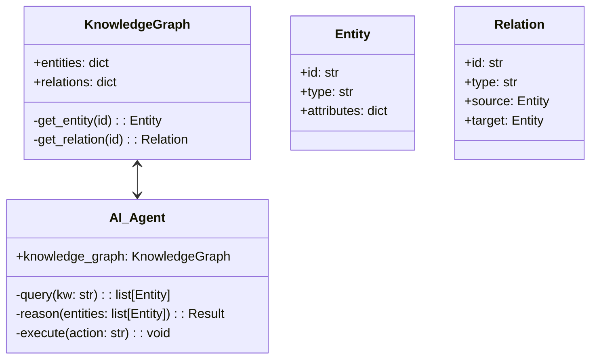
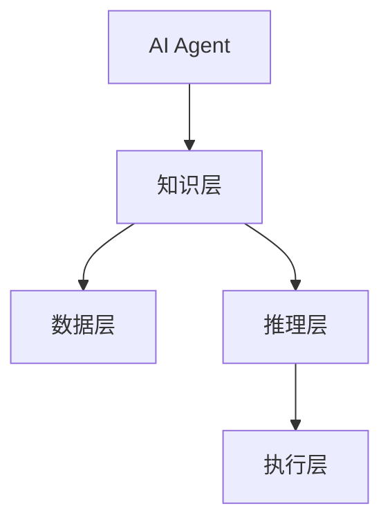
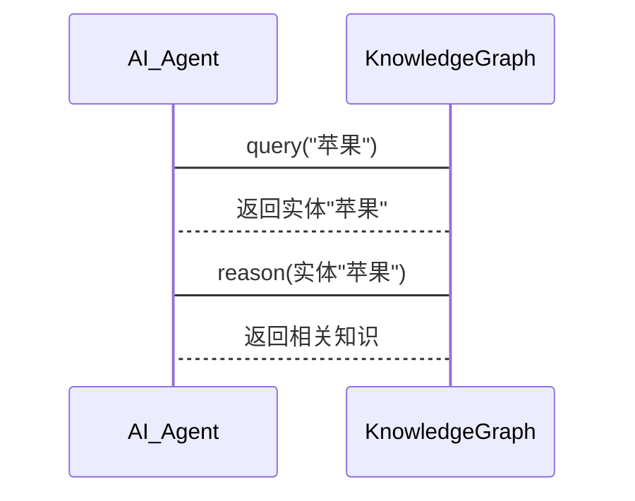

                 


# AI Agent的知识图谱集成方案

---

## 关键词：AI Agent, 知识图谱, 集成方案, 算法原理, 系统架构, 项目实战

---

## 摘要：  
本文系统性地探讨了AI Agent与知识图谱的集成方案，从背景介绍、核心概念、算法原理、系统架构到项目实战，全面解析了如何将知识图谱赋能AI Agent。通过详细阐述知识图谱的构建、AI Agent的核心功能模块以及两者的结合方式，本文为读者提供了一套完整的集成方案，并通过实际案例展示了如何将理论应用于实践。

---

## 第一部分：AI Agent与知识图谱的背景介绍

### 第1章：AI Agent与知识图谱的概述

#### 1.1 问题背景与问题描述  
- **1.1.1 当前AI Agent的发展趋势**  
  AI Agent（人工智能代理）正在从单一任务执行向多任务协同方向发展，需要更强大的知识表示和推理能力。  
- **1.1.2 知识图谱的核心作用与价值**  
  知识图谱通过结构化的知识表示，为AI Agent提供了丰富的语义信息，帮助其更好地理解和执行任务。  
- **1.1.3 AI Agent与知识图谱结合的必要性**  
  知识图谱为AI Agent提供了知识基础，而AI Agent则为知识图谱提供了动态更新和应用的可能。

#### 1.2 问题解决与边界外延  
- **1.2.1 知识图谱如何赋能AI Agent**  
  知识图谱为AI Agent提供知识表示、推理和学习的能力。  
- **1.2.2 AI Agent在知识图谱中的应用场景**  
  包括智能问答、推荐系统、语义搜索等。  
- **1.2.3 知识图谱集成的边界与限制**  
  知识图谱的规模、实时性和可扩展性是集成中的主要挑战。

#### 1.3 概念结构与核心要素  
- **1.3.1 知识图谱的基本结构**  
  知识图谱由实体（node）和关系（edge）组成，形成有向图结构。  
- **1.3.2 AI Agent的核心功能模块**  
  包括感知模块、推理模块和执行模块。  
- **1.3.3 两者的结合方式与逻辑关系**  
  知识图谱作为知识库，AI Agent作为知识的消费者和执行者，两者通过接口进行交互。

---

## 第二部分：核心概念与联系

### 第2章：知识图谱与AI Agent的核心概念

#### 2.1 知识图谱的核心概念  
- **2.1.1 知识图谱的构建过程**  
  包括数据获取、实体识别、关系抽取和知识融合。  
- **2.1.2 知识图谱的存储与表示**  
  使用图数据库（如Neo4j）存储，并通过RDF或OWL进行语义表示。

#### 2.2 AI Agent的核心概念  
- **2.2.1 AI Agent的分类**  
  包括基于规则的Agent和基于学习的Agent。  
- **2.2.2 AI Agent的知识表示**  
  使用符号逻辑或概率推理进行知识表示。

#### 2.3 知识图谱与AI Agent的关系与联系  
- **2.3.1 知识图谱为AI Agent提供知识基础**  
  通过知识图谱，AI Agent可以进行语义理解、关联推理和上下文感知。  
- **2.3.2 AI Agent为知识图谱提供动态应用能力**  
  AI Agent可以根据实时需求，动态更新和扩展知识图谱。

#### 2.4 知识图谱与AI Agent的核心属性特征对比  
以下是知识图谱与AI Agent的核心属性特征对比：

| 属性 | 知识图谱 | AI Agent |
|------|---------|----------|
| 核心目标 | 表示知识 | 执行任务 |
| 数据结构 | 图结构 | 多模态数据 |
| 主要功能 | 知识存储与查询 | 任务执行与推理 |
| 技术特点 | 结构化、语义化 | 动态性、实时性 |

---

## 第三部分：算法原理讲解

### 第3章：知识图谱的构建与AI Agent的推理算法

#### 3.1 知识图谱的构建算法  
- **3.1.1 实体识别与关系抽取**  
  使用自然语言处理技术（如NER和RE）提取实体和关系。  
- **3.1.2 知识融合与冲突消解**  
  通过合并同义词和消除冗余信息来优化知识图谱。

#### 3.2 AI Agent的推理算法  
- **3.2.1 基于符号逻辑的推理**  
  使用一阶逻辑（FOL）进行推理。  
- **3.2.2 基于概率的推理**  
  使用贝叶斯网络进行概率推理。

#### 3.3 知识图谱与AI Agent的联合算法  
- **3.3.1 知识图谱嵌入（Knowledge Graph Embedding）**  
  使用TransE、TransH等算法将知识图谱中的实体和关系嵌入到低维空间。  
- **3.3.2 基于嵌入的推理**  
  将知识图谱嵌入与AI Agent的推理模块结合，进行端到端的推理。

##### 3.3.2.1 TransE算法原理  
TransE算法通过将实体和关系嵌入到向量空间中，计算头实体和尾实体之间的距离，判断关系的存在性。  
数学公式如下：  
$$ \text{score}(h, r, t) = \|h + r - t\|^2 $$  
其中，$h$ 是头实体的向量，$r$ 是关系的向量，$t$ 是尾实体的向量。

---

## 第四部分：系统分析与架构设计方案

### 第4章：系统分析与架构设计方案

#### 4.1 项目背景与目标  
本项目旨在构建一个基于知识图谱的AI Agent系统，实现智能问答和推荐功能。

#### 4.2 系统功能设计  
- **领域模型设计**  
  使用Mermaid类图描述系统中的实体和关系。  



- **系统架构设计**  
  使用分层架构，包括数据层、知识层、推理层和执行层。

#### 4.3 系统架构设计  
使用Mermaid绘制系统架构图：



#### 4.4 系统接口设计  
- **知识图谱接口**  
  提供`get_entity`和`get_relation`接口。  
- **推理接口**  
  提供`query`和`reason`接口。

#### 4.5 系统交互设计  
使用Mermaid绘制交互序列图：



---

## 第五部分：项目实战

### 第5章：基于知识图谱的AI Agent实战

#### 5.1 环境安装与配置  
- **安装依赖**  
  使用Python和以下库：`networkx`, `neo4j`, `spacy`.  
  安装命令：  
  ```bash
  pip install networkx neo4j spacy
  ```

#### 5.2 知识图谱构建与AI Agent实现  

##### 5.2.1 知识图谱构建代码  
```python
from neo4j import GraphDatabase
from spacy.lang.en import English

nlp = English()
def extract_entities(text):
    doc = nlp(text)
    entities = [ent.text for ent in doc.ents]
    return entities

def build_kg(neo4j_uri, entities):
    driver = GraphDatabase.driver(neo4j_uri)
    session = driver.session()
    for ent in entities:
        session.run("CREATE (n:Entity {name: $ent})", ent=ent)
    session.close()

if __name__ == "__main__":
    text = "Apple is a technology company."
    entities = extract_entities(text)
    build_kg("bolt://localhost:7687", entities)
```

##### 5.2.2 AI Agent实现代码  
```python
from networkx import Graph

class KnowledgeGraph:
    def __init__(self):
        self.graph = Graph()

    def add_entity(self, entity):
        self.graph.add_node(entity)

class AIAgent:
    def __init__(self, kg):
        self.kg = kg

    def query(self, keyword):
        nodes = [n for n in self.kg.graph.nodes() if keyword in n]
        return nodes

    def reason(self, entities):
        relations = []
        for e in entities:
            for n in self.kg.graph.neighbors(e):
                relations.append((e, n))
        return relations

    def execute(self, action):
        # 示例：打印结果
        print(f"执行操作：{action}")

if __name__ == "__main__":
    kg = KnowledgeGraph()
    kg.add_entity("Apple")
    kg.add_entity("Technology")
    kg.add_entity("Company")
    kg.graph.add_edge("Apple", "Technology")
    kg.graph.add_edge("Apple", "Company")

    agent = AIAgent(kg)
    result = agent.query("Apple")
    print("查询结果：", result)
    relations = agent.reason(result)
    print("推理结果：", relations)
    agent.execute("完成推理")
```

#### 5.3 项目小结  
通过本项目，我们实现了基于知识图谱的AI Agent系统，展示了如何将理论应用于实践。代码实现了一个简单的知识图谱构建和AI Agent推理功能。

---

## 第六部分：最佳实践与总结

### 第6章：最佳实践与总结

#### 6.1 最佳实践  
- **数据质量**：确保知识图谱的数据准确性和完整性。  
- **模型优化**：根据具体任务优化AI Agent的推理算法。  
- **可扩展性**：设计灵活的架构，方便知识图谱的动态扩展。

#### 6.2 小结  
本文从背景、概念、算法、系统架构到项目实战，全面探讨了AI Agent与知识图谱的集成方案，为读者提供了一套完整的解决方案。

#### 6.3 注意事项  
- 知识图谱的构建需要考虑数据的多样性和实时性。  
- AI Agent的推理能力依赖于知识图谱的质量和算法的优化。

#### 6.4 拓展阅读  
- 《知识图谱构建与应用》  
- 《人工智能代理设计与实现》  
- 《图嵌入算法研究与应用》  

---

## 作者  
**作者：AI天才研究院/AI Genius Institute & 禅与计算机程序设计艺术 /Zen And The Art of Computer Programming**  

---

希望这篇技术博客文章能够为读者提供清晰的思路和实用的解决方案，帮助他们在AI Agent与知识图谱的集成中取得更好的成果！

