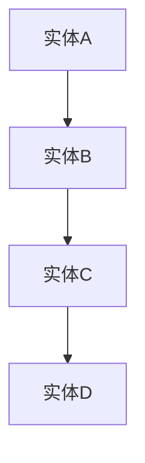
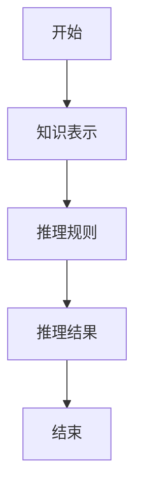
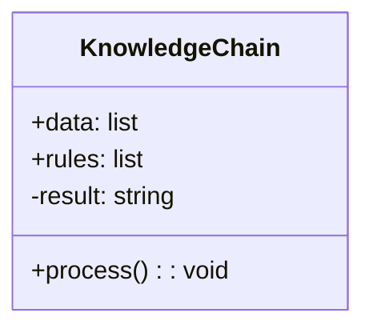

                 


# AI Agent的知识推理链：逐步解决复杂问题

> **关键词**：AI Agent, 知识推理链, 复杂问题解决, 算法原理, 系统架构  
> **摘要**：本文深入探讨AI Agent的知识推理链，从核心概念、算法原理到系统架构，逐步分析如何通过知识推理链解决复杂问题。通过实际案例和系统设计，展示AI Agent在知识推理中的应用及其优势。

---

# 第一部分: AI Agent的知识推理链基础

## 第1章: 问题背景与核心概念

### 1.1 问题背景与应用场景

#### 1.1.1 知识推理链的定义
知识推理链（Knowledge Reasoning Chain）是一种通过逻辑推理和知识表示，将复杂问题分解为简单步骤，逐步解决的方法。它利用AI Agent的能力，结合领域知识和推理规则，形成一条从输入到输出的完整推理链。

#### 1.1.2 复杂问题的特征与挑战
复杂问题通常具有多维度、非线性和不确定性等特点。例如，在医疗诊断中，需要综合患者的症状、病史、检查结果等多种信息进行推理。AI Agent的知识推理链能够帮助处理这些复杂性，提供高效的解决方案。

#### 1.1.3 AI Agent在知识推理中的作用
AI Agent通过知识推理链，能够自动化地处理信息，从大量数据中提取关键信息，并根据推理规则得出结论。这使得AI Agent在智能客服、医疗诊断、金融分析等领域具有广泛的应用。

### 1.2 核心概念与问题描述

#### 1.2.1 知识推理链的构成要素
知识推理链主要由以下要素构成：
1. **知识库**：包含领域相关的知识和数据。
2. **推理规则**：定义推理的逻辑和规则。
3. **推理引擎**：执行推理操作的核心模块。
4. **结果解释**：将推理结果转化为可理解的形式。

#### 1.2.2 问题解决的边界与外延
知识推理链的应用范围有限，通常适用于结构化和半结构化的数据。对于完全非结构化的数据（如自然语言文本），需要结合自然语言处理技术进行预处理。

#### 1.2.3 核心概念的结构与关系
知识推理链的结构由输入、处理步骤和输出组成。输入为问题和相关数据，处理步骤包括知识表示、推理规则应用和结果生成，输出为最终的解决方案。

---

## 第2章: 知识推理链的核心概念与联系

### 2.1 知识推理链的原理

#### 2.1.1 知识表示与推理的基本原理
知识表示是将知识以计算机可理解的形式存储的过程。常用的知识表示方法包括语义网、知识图谱和规则表示。推理则是根据知识和规则，推导出新的结论。

#### 2.1.2 知识图谱与推理链的关系
知识图谱为推理链提供了丰富的背景知识。推理链利用知识图谱中的实体关系和属性，进行逻辑推理，从而得出更准确的结论。

#### 2.1.3 知识推理链的逻辑结构
知识推理链的逻辑结构包括以下步骤：
1. **问题理解**：明确问题的目标和输入数据。
2. **知识检索**：从知识库中检索相关知识。
3. **推理规则应用**：根据推理规则进行推理。
4. **结果验证**：验证推理结果的正确性。
5. **结果解释**：将推理结果转化为可理解的形式。

### 2.2 核心概念属性对比表

#### 2.2.1 知识推理链与传统推理方法的对比
| 对比维度       | 知识推理链                     | 传统推理方法                 |
|----------------|-------------------------------|-----------------------------|
| 数据依赖       | 高度依赖知识库                 | 依赖推理规则                 |
| 复杂性         | 更复杂，涉及知识表示和检索     | 较简单，仅涉及逻辑推理       |
| 应用场景       | 适用于领域知识丰富的场景       | 适用于通用逻辑推理问题       |

#### 2.2.2 不同知识推理链的特征分析
以下是几种常见的知识推理链及其特点：
1. **基于规则的推理链**：依赖明确的推理规则，适用于规则清晰的场景。
2. **基于知识图谱的推理链**：利用知识图谱的语义信息，适用于复杂关联的场景。
3. **基于机器学习的推理链**：结合机器学习模型，适用于数据驱动的场景。

#### 2.2.3 ER实体关系图的构建与展示



---

## 第3章: 知识推理链的算法原理

### 3.1 算法流程与实现

#### 3.1.1 知识推理链的算法流程图



#### 3.1.2 算法实现的步骤分解
1. **知识表示**：将知识以结构化形式存储，例如使用JSON或知识图谱。
2. **推理规则定义**：定义推理规则，例如IF-ELSE条件。
3. **推理引擎实现**：根据推理规则，执行推理操作。
4. **结果验证**：验证推理结果的正确性。
5. **结果解释**：将推理结果转化为可理解的形式。

### 3.2 数学模型与公式

#### 3.2.1 知识推理链的数学模型

$$ P(A|B) = \frac{P(B|A)P(A)}{P(B)} $$

#### 3.2.2 推理规则的数学表达

$$ R = \sum_{i=1}^{n} w_i x_i $$

---

## 第4章: 系统分析与架构设计

### 4.1 项目背景与目标

#### 4.1.1 项目介绍
本项目旨在开发一个基于知识推理链的AI Agent系统，能够解决复杂问题。

#### 4.1.2 项目目标与范围
项目目标包括：
1. 实现知识表示与推理功能。
2. 开发推理引擎。
3. 提供结果解释功能。

### 4.2 系统功能设计

#### 4.2.1 领域模型设计



---

## 第5章: 项目实战

### 5.1 环境安装

#### 5.1.1 安装依赖
需要安装以下依赖：
- Python 3.8+
- Mermaid工具
- Jupyter Notebook

### 5.2 系统核心实现源代码

```python
class KnowledgeChain:
    def __init__(self, data, rules):
        self.data = data
        self.rules = rules
        self.result = None

    def process(self):
        # 知识表示
        knowledge = self.data
        # 推理规则应用
        for rule in self.rules:
            if rule.apply(knowledge):
                knowledge = rule.update(knowledge)
        self.result = knowledge
        return self.result
```

### 5.3 案例分析

#### 5.3.1 案例介绍
以医疗诊断为例，构建一个简单的知识推理链。

#### 5.3.2 实施步骤
1. **知识表示**：将患者的症状、病史等信息表示为结构化数据。
2. **推理规则定义**：定义诊断规则，例如“如果患者有发热和咳嗽，考虑肺炎”。
3. **推理引擎实现**：根据规则进行推理，得出诊断结果。
4. **结果解释**：将诊断结果解释为自然语言。

---

## 第6章: 最佳实践与总结

### 6.1 注意事项

1. 知识推理链的应用需要结合具体领域知识。
2. 推理规则的设计需要充分考虑边界条件。
3. 系统的可扩展性需要在设计阶段充分考虑。

### 6.2 经验总结

知识推理链是一种强大的工具，能够帮助AI Agent解决复杂问题。在实际应用中，需要结合具体场景进行优化和调整。

### 6.3 未来展望

未来，知识推理链将更加智能化，结合机器学习和深度学习技术，进一步提升推理的准确性和效率。

---

**作者**：AI天才研究院/AI Genius Institute & 禅与计算机程序设计艺术 /Zen And The Art of Computer Programming

