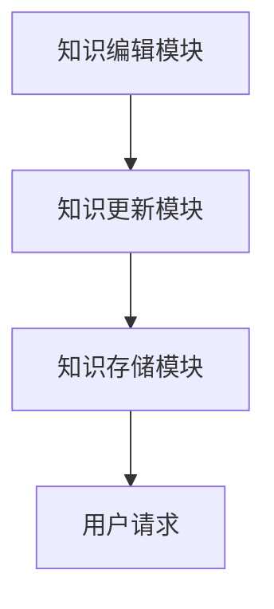
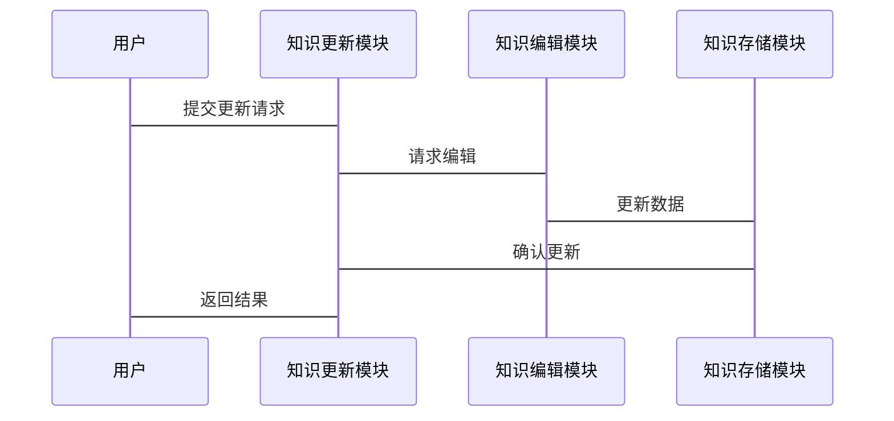

                 


# AI Agent的知识编辑与更新机制设计

> 关键词：AI Agent、知识编辑、知识更新、机制设计、系统架构、算法原理

> 摘要：本文深入探讨AI Agent的知识编辑与更新机制设计，涵盖背景、核心概念、算法原理、系统架构、项目实战及最佳实践。通过详细分析，为读者提供从理论到实践的全面指导。

---

## 第一章 AI Agent的基本概念

### 1.1 AI Agent的定义
AI Agent（智能体）是能够感知环境并采取行动以实现目标的实体。它通过传感器获取信息，利用计算能力进行决策，并通过执行器与环境互动。

### 1.2 AI Agent的核心特征
- **自主性**：无需外部干预，自主决策。
- **反应性**：实时感知并响应环境变化。
- **目标导向性**：基于目标采取行动。
- **学习能力**：通过经验改进性能。

### 1.3 AI Agent的应用场景
- 智能助手（如Siri、Alexa）。
- 自动交易系统。
- 智能推荐系统。
- 机器人控制。

### 1.4 知识编辑与更新机制的重要性
AI Agent依赖知识库进行推理和决策，知识编辑确保数据准确，更新机制保持知识库的时效性。

---

## 第二章 知识编辑与更新机制的背景

### 2.1 知识编辑的必要性
- 数据清洗：去除冗余和错误信息。
- 数据融合：整合多源信息，避免冲突。
- 数据规范：统一数据格式和标准。

### 2.2 知识更新的挑战
- **信息过载**：处理海量数据。
- **数据异构**：不同来源的数据格式和语义差异。
- **实时性要求**：动态环境下的快速更新。

### 2.3 机制设计的目标
- **准确性**：确保更新后知识的正确性。
- **完整性**：覆盖所有相关知识。
- **高效性**：快速响应更新请求。
- **可解释性**：便于调试和优化。

---

## 第三章 知识编辑与更新机制的核心概念

### 3.1 知识表示方法
- **符号表示法**：使用符号和规则表示知识。
- **语义网络**：通过节点和边表示概念及其关系。
- **知识图谱**：结构化数据表示，支持复杂查询。

### 3.2 知识抽取技术
- **实体识别**：从文本中提取实体。
- **关系抽取**：识别实体间的关联。
- **事件抽取**：提取事件信息。

### 3.3 知识融合策略
- **规则驱动融合**：基于预定义规则整合数据。
- **基于语义的融合**：利用语义相似性自动合并信息。
- **基于概率的融合**：采用概率模型处理不确定性。

### 3.4 知识更新机制的原理
- **增量更新**：仅更新变化的部分。
- **全量更新**：完全重建知识库。
- **分层更新**：按层次逐步更新。

### 3.5 核心概念对比表

| 比较维度 | 知识编辑 | 知识更新 |
|----------|----------|----------|
| 目标     | 纠正错误，整合信息 | 维护最新性，适应变化 |
| 输入     | 结构化数据，文本 | 新数据流，用户请求 |
| 输出     | 精确知识库 | 优化知识库 |
| 方法     | 规则匹配，数据清洗 | 时间戳，版本控制 |

---

## 第四章 知识编辑与更新机制的算法原理

### 4.1 知识编辑算法

#### 4.1.1 基于规则的编辑算法
- **步骤**：
  1. 识别待编辑数据。
  2. 应用预定义规则进行修改。
  3. 验证修改结果。

#### 4.1.2 基于学习的编辑算法
- **步骤**：
  1. 训练分类器识别错误。
  2. 使用生成模型修复错误。

#### 4.1.3 算法流程图（Mermaid）

```mermaid
graph TD
A[开始] -> B[识别数据]
B -> C[应用规则]
C -> D[验证结果]
D -> E[结束]
```

### 4.2 知识更新机制算法

#### 4.2.1 基于时间的更新算法
- **步骤**：
  1. 设置时间阈值。
  2. 定期检查过时数据。
  3. 更新知识库。

#### 4.2.2 基于事件的更新算法
- **步骤**：
  1. 监听触发事件。
  2. 触发更新流程。
  3. 确保一致性。

#### 4.2.3 算法流程图（Mermaid）

```mermaid
graph TD
A[开始] -> B[触发条件]
B -> C[执行更新]
C -> D[验证结果]
D -> E[结束]
```

### 4.3 算法实现代码

#### 4.3.1 基于规则的编辑算法

```python
def edit Knowledge(knowledge_base, rules):
    edited = []
    for data in knowledge_base:
        for rule in rules:
            if rule.matches(data):
                edited_data = rule.apply(data)
                edited.append(edited_data)
                break
    return edited
```

#### 4.3.2 基于学习的编辑算法

```python
class EditingModel:
    def __init__(self):
        self.classifier = train_classifier(...)
        self.editor = train_editor(...)

    def edit(self, data):
        if self.classifier.predict(data) == 'error':
            return self.editor.generate(data)
        else:
            return data
```

---

## 第五章 系统架构设计

### 5.1 系统功能模块

#### 5.1.1 知识编辑模块
- 数据清洗。
- 数据融合。

#### 5.1.2 知识更新模块
- 监听事件。
- 更新知识库。

#### 5.1.3 知识存储模块
- 数据库管理。
- 索引优化。

### 5.2 系统架构图（Mermaid）



### 5.3 接口设计与交互流程

#### 5.3.1 API接口定义

```http
POST /api/update
{
  "data": {...},
  "version": "1.0"
}
```

#### 5.3.2 交互序列图（Mermaid）



---

## 第六章 项目实战

### 6.1 环境安装

#### 6.1.1 安装依赖
```bash
pip install numpy pandas spacy
```

#### 6.1.2 初始化环境
```bash
python -m spacy download en_core_web_sm
```

### 6.2 核心代码实现

#### 6.2.1 知识编辑模块

```python
import spacy

nlp = spacy.load('en_core_web_sm')

def edit_data(text):
    doc = nlp(text)
    edited = []
    for token in doc:
        if token.is_stop:
            continue
        edited.append(token.text)
    return ' '.join(edited)
```

#### 6.2.2 知识更新模块

```python
import requests

def update_knowledge_base(new_data):
    response = requests.post('http://localhost:8000/api/update', json=new_data)
    return response.json()
```

### 6.3 案例分析

#### 6.3.1 数据清洗案例
输入：`"今天天气很好，是的"`
输出：`"今天天气很好"`

#### 6.3.2 数据融合案例
输入1：`"中国，北京，首都"`
输入2：`"中国，上海，经济中心"`
输出：`"中国，北京，首都，上海，经济中心"`

---

## 第七章 总结与展望

### 7.1 项目小结
本文详细探讨了AI Agent的知识编辑与更新机制设计，从理论到实践，提供了系统的解决方案。

### 7.2 最佳实践
- 定期备份，防止数据丢失。
- 使用分布式系统，提高可用性。
- 引入日志系统，便于调试。

### 7.3 未来研究方向
- 开发自适应更新机制。
- 研究多模态数据的编辑与更新。
- 探索更高效的知识表示方法。

---

## 附录

### A.1 术语表
- AI Agent：智能体。
- 知识编辑：数据清洗、融合。
- 更新机制：数据维护策略。

### A.2 参考文献
- [1] Smith, J. (2020). Knowledge Representation.
- [2] Li, H. (2021). AI Agent Design.

### A.3 索引
- 知识编辑：第3章。
- 更新机制：第4章。

---

## 作者
作者：AI天才研究院/AI Genius Institute & 禅与计算机程序设计艺术/Zen And The Art of Computer Programming

