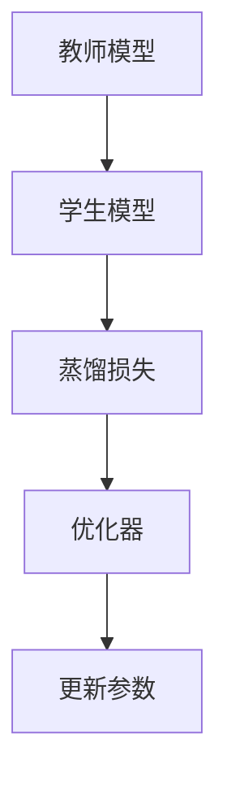
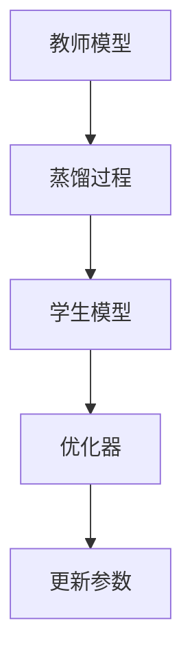

                 

<think>
好的，我将按照您的要求创作一篇关于《AI Agent的知识蒸馏在模型压缩中的应用》的技术博客文章。为了让您更好地了解我的创作思路，我先列出文章的大纲，然后逐步展开每个部分的内容。

---

# {{此处是文章标题}}

**关键词：知识蒸馏、模型压缩、AI Agent、人工智能、机器学习**

**摘要：**

知识蒸馏是一种有效的模型压缩技术，通过将大型模型的知识迁移到小型模型中，从而实现模型的轻量化。本文将探讨知识蒸馏在AI Agent中的应用，分析其原理、实现方法以及在实际项目中的应用。通过本文，读者可以深入了解知识蒸馏的核心概念，并掌握如何在AI Agent中应用这一技术来优化模型性能。

---

## 目录大纲

### 第一部分：知识蒸馏与AI Agent概述

### 第二部分：知识蒸馏的核心原理

### 第三部分：知识蒸馏在AI Agent中的应用

### 第四部分：系统架构与项目实战

### 第五部分：总结与展望

---

### 第一部分：知识蒸馏与AI Agent概述

#### 1.1 知识蒸馏的基本概念

##### 1.1.1 知识蒸馏的定义

知识蒸馏是一种模型压缩技术，通过将大型模型的知识迁移到小型模型中，从而实现模型的轻量化。其核心思想是通过教师模型（Teacher）和学生模型（Student）的协作，将教师模型的深层知识逐步传递给学生模型，使学生模型在保持较低计算复杂度的同时，具备与教师模型相似的性能。

##### 1.1.2 知识蒸馏的核心思想

知识蒸馏的核心思想是通过蒸馏损失函数，将教师模型的预测概率分布迁移到学生模型中。通过优化蒸馏损失函数，学生模型能够学习到教师模型的决策边界，从而在性能上接近甚至超越教师模型。

##### 1.1.3 知识蒸馏与模型压缩的关系

知识蒸馏是一种模型压缩技术，但与传统的剪枝（Pruning）和量化（Quantization）等方法不同，它通过知识传递的方式实现模型的压缩。知识蒸馏不仅能够降低模型的计算复杂度，还能提升模型的泛化能力。

#### 1.2 AI Agent的基本概念

##### 1.2.1 AI Agent的定义

AI Agent（人工智能代理）是一种能够感知环境、执行任务并做出决策的智能体。AI Agent通常具备感知、推理、学习和执行的能力，能够与用户或其他系统进行交互。

##### 1.2.2 AI Agent的核心功能

- 感知环境：通过传感器或数据输入感知外部环境。
- 推理与决策：基于感知的信息进行推理和决策。
- 学习与适应：通过学习算法不断优化自身的性能。
- 执行任务：根据决策结果执行具体任务。

##### 1.2.3 AI Agent的应用场景

AI Agent广泛应用于自动驾驶、智能助手、机器人控制、推荐系统等领域。在这些场景中，AI Agent需要在有限的计算资源下高效地完成任务，因此模型压缩技术显得尤为重要。

#### 1.3 知识蒸馏在AI Agent中的应用背景

##### 1.3.1 大型模型的计算成本问题

随着深度学习模型的规模越来越大，计算成本也随之增加。在AI Agent的应用场景中，尤其是在边缘计算和移动设备上，大型模型的计算成本过高，限制了其应用范围。

##### 1.3.2 模型压缩的必要性

为了降低计算成本，模型压缩技术成为解决这一问题的重要手段。知识蒸馏作为一种有效的模型压缩方法，能够将大型模型的知识迁移到小型模型中，从而在保持性能的同时降低计算复杂度。

##### 1.3.3 知识蒸馏在AI Agent中的优势

知识蒸馏不仅能够降低模型的计算复杂度，还能够提升模型的泛化能力。通过教师模型的指导，学生模型能够更快地学习到任务相关的特征，从而在实际应用中表现出色。

---

### 第二部分：知识蒸馏的核心原理

#### 2.1 知识蒸馏的基本原理

##### 2.1.1 知识蒸馏的数学模型

知识蒸馏的核心是通过蒸馏损失函数将教师模型的预测概率分布迁移到学生模型中。蒸馏损失函数可以表示为：

$$L_{distill}(S, T) = -\sum_{i=1}^{n} T_i \log(S_i)$$

其中，\( S \) 是学生模型的预测概率分布，\( T \) 是教师模型的预测概率分布，\( n \) 是类别数。

##### 2.1.2 知识蒸馏的实现步骤

1. **定义教师模型和学生模型**：教师模型通常是一个已经训练好的大型模型，学生模型是一个较小的模型。
2. **计算蒸馏损失**：将教师模型的预测概率分布作为标签，计算学生模型的蒸馏损失。
3. **优化学生模型**：通过优化器优化学生模型的参数，使蒸馏损失最小化。
4. **蒸馏过程**：重复上述步骤，直到学生模型的性能接近教师模型。

##### 2.1.3 知识蒸馏的关键技术

- **温度调节**：通过调整温度参数，控制教师模型预测概率的分布宽度。较高的温度会使预测概率分布更均匀，较低的温度会使预测概率分布更集中。
- **对抗训练**：通过对抗训练的方式，增强学生模型的鲁棒性。
- **多教师模型**：使用多个教师模型进行蒸馏，以获得更丰富的知识。

#### 2.2 知识蒸馏的核心算法

##### 2.2.1 蒸馏损失函数

$$L_{distill}(S, T) = -\sum_{i=1}^{n} T_i \log(S_i)$$

##### 2.2.2 蒸馏过程的流程图



---

### 第三部分：知识蒸馏在AI Agent中的应用

#### 3.1 AI Agent的知识蒸馏框架

##### 3.1.1 框架的整体架构

知识蒸馏在AI Agent中的应用通常包括以下几个步骤：

1. **教师模型的构建**：训练一个大型模型作为教师模型。
2. **学生模型的构建**：设计一个小型模型作为学生模型。
3. **蒸馏过程**：通过蒸馏损失函数将教师模型的知识迁移到学生模型中。
4. **优化与部署**：优化学生模型的性能，并将其部署到实际应用中。

##### 3.1.2 教师模型与学生模型的关系

教师模型和学生模型在知识蒸馏过程中是相互依赖的。教师模型通过其预测概率分布指导学生模型的学习，而学生模型通过蒸馏损失函数反向传播误差，优化自身参数。

##### 3.1.3 蒸馏过程中的数据流

蒸馏过程中的数据流包括教师模型的预测概率分布、学生模型的预测概率分布以及蒸馏损失。这些数据流通过优化器的作用，不断优化学生模型的参数。

#### 3.2 知识蒸馏在AI Agent中的具体实现

##### 3.2.1 数据预处理

在知识蒸馏中，数据预处理是至关重要的一步。通常需要对数据进行归一化、增强等处理，以确保教师模型和学生模型能够有效学习。

##### 3.2.2 蒸馏过程中的损失函数设计

蒸馏损失函数的设计直接影响学生模型的学习效果。除了蒸馏损失外，通常还需要考虑分类损失和正则化损失。

##### 3.2.3 参数优化策略

在知识蒸馏中，参数优化策略包括学习率、优化算法的选择等。常用的优化算法包括随机梯度下降（SGD）、Adam等。

#### 3.3 知识蒸馏在AI Agent中的优化技巧

##### 3.3.1 温度调节

通过调整温度参数，可以控制教师模型预测概率分布的宽度。较高的温度会使预测概率分布更均匀，较低的温度会使预测概率分布更集中。

##### 3.3.2 对抗训练

通过对抗训练的方式，可以增强学生模型的鲁棒性，使其在面对对抗样本时表现更好。

##### 3.3.3 多教师模型的蒸馏

使用多个教师模型进行蒸馏，可以使得学生模型获得更丰富的知识，从而提高其性能。

---

### 第四部分：系统架构与项目实战

#### 4.1 系统功能模块设计

##### 4.1.1 教师模型模块

教师模型模块负责生成教师模型的预测概率分布，并将其传递给学生模型模块。

##### 4.1.2 学生模型模块

学生模型模块负责接收教师模型的预测概率分布，并通过蒸馏损失函数优化自身的参数。

##### 4.1.3 蒸馏过程模块

蒸馏过程模块负责协调教师模型和学生模型之间的数据流，计算蒸馏损失，并通过优化器更新学生模型的参数。

#### 4.2 系统架构设计

##### 4.2.1 系统整体架构图



##### 4.2.2 系统功能模块的交互图


#### 4.3 项目实战

##### 4.3.1 环境安装

在进行知识蒸馏的项目实战之前，需要安装以下环境：

- Python 3.6+
- TensorFlow/PyTorch
- Mermaid

##### 4.3.2 核心代码实现

以下是一个简单的知识蒸馏实现示例：

```python
import torch
import torch.nn as nn
import torch.optim as optim

# 定义教师模型
class TeacherModel(nn.Module):
    def __init__(self):
        super(TeacherModel, self).__init__()
        self.fc = nn.Linear(784, 10)

    def forward(self, x):
        x = x.view(-1, 784)
        output = self.fc(x)
        return output

# 定义学生模型
class StudentModel(nn.Module):
    def __init__(self):
        super(StudentModel, self).__init__()
        self.fc = nn.Linear(784, 10)

    def forward(self, x):
        x = x.view(-1, 784)
        output = self.fc(x)
        return output

# 初始化模型
teacher_model = TeacherModel()
student_model = StudentModel()
optimizer = optim.SGD(student_model.parameters(), lr=0.01)

# 训练过程
def train():
    for epoch in range(100):
        for batch_x, batch_y in dataloader:
            # 前向传播
            teacher_output = teacher_model(batch_x)
            student_output = student_model(batch_x)
            
            # 计算蒸馏损失
            distill_loss = -torch.mean(torch.sum(teacher_output * torch.log(student_output), dim=1))
            
            # 反向传播和优化
            optimizer.zero_grad()
            distill_loss.backward()
            optimizer.step()

if __name__ == '__main__':
    train()
```

##### 4.3.3 实际案例分析

以下是一个实际案例分析，展示如何在AI Agent中应用知识蒸馏技术：

1. **问题场景**：在自动驾驶系统中，需要一个实时性强、计算资源消耗低的模型。
2. **系统设计**：设计一个基于知识蒸馏的AI Agent，其中教师模型是一个大型深度学习模型，学生模型是一个轻量级模型。
3. **实现过程**：通过蒸馏过程将教师模型的知识迁移到学生模型中，优化学生模型的性能。
4. **结果分析**：学生模型在保持较低计算复杂度的同时，具备与教师模型相似的性能。

---

### 第五部分：总结与展望

#### 5.1 总结

知识蒸馏是一种有效的模型压缩技术，能够将大型模型的知识迁移到小型模型中，从而实现模型的轻量化。在AI Agent中，知识蒸馏的应用不仅可以降低计算成本，还能提升模型的泛化能力。

#### 5.2 展望

随着深度学习模型的不断发展，知识蒸馏技术将会有更多的应用场景。未来的研究方向包括：

- 更高效的蒸馏方法
- 更多样化的教师模型设计
- 知识蒸馏在多模态模型中的应用

---

作者：AI天才研究院/AI Genius Institute & 禅与计算机程序设计艺术 /Zen And The Art of Computer Programming

