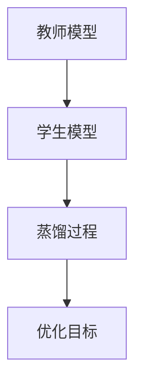
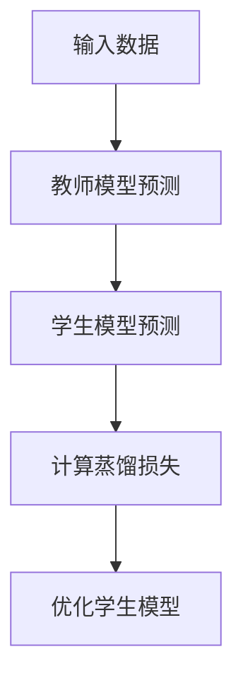
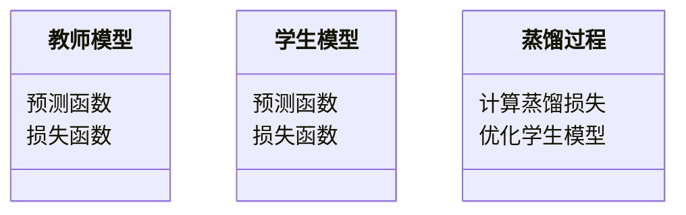
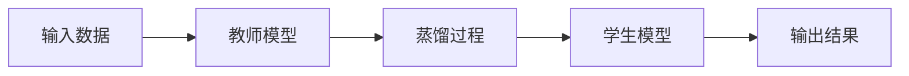
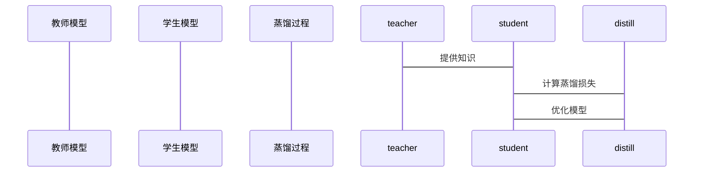

                 


# AI Agent的知识蒸馏：从集成模型到单一模型

> 关键词：知识蒸馏、AI Agent、集成模型、模型压缩、机器学习

> 摘要：知识蒸馏是一种将复杂集成模型的知识迁移到简单模型的技术，旨在提高模型的性能和效率。本文从AI Agent的角度出发，系统阐述了知识蒸馏的核心概念、算法原理、系统设计与实现，并通过实战案例深入分析其应用。文章最后总结了知识蒸馏的优势与未来发展方向。

---

# 第1章: 知识蒸馏的背景与概念

## 1.1 知识蒸馏的定义与问题背景

### 1.1.1 集成学习与模型压缩的背景
集成学习是一种通过组合多个学习器来提高模型性能的技术。然而，集成模型通常存在计算复杂度高、资源消耗大的问题。为了在保持性能的同时减少计算开销，模型压缩技术应运而生。模型压缩的目标是将复杂的模型简化为更高效的形式，同时保留其核心性能。

### 1.1.2 知识蒸馏的核心问题描述
知识蒸馏是一种特殊的模型压缩技术，旨在将多个教师模型（通常是集成模型或复杂模型）的知识迁移到一个简单的学生模型中。通过蒸馏过程，学生模型能够继承教师模型的决策能力和特征提取能力，从而在性能上接近甚至超越教师模型。

### 1.1.3 知识蒸馏的目标与意义
知识蒸馏的核心目标是将复杂模型的知识以更高效的方式表示，同时减少模型的计算复杂度和存储需求。在AI Agent中，知识蒸馏的意义尤为突出，因为它可以帮助AI Agent在资源受限的环境中依然保持高性能。

---

## 1.2 AI Agent与知识蒸馏的关系

### 1.2.1 AI Agent的基本概念
AI Agent是一种智能体，能够感知环境、自主决策并执行任务。AI Agent的设计需要在性能、资源消耗和响应速度之间找到平衡。

### 1.2.2 知识蒸馏在AI Agent中的作用
在AI Agent中，知识蒸馏用于将多个教师模型的知识迁移到一个轻量级的学生模型中。这种技术可以显著降低AI Agent的计算开销，同时保持其性能。

### 1.2.3 知识蒸馏对AI Agent性能的提升
通过知识蒸馏，AI Agent可以更快地做出决策，减少延迟，并在资源受限的环境中运行更高效的任务。

---

## 1.3 知识蒸馏的技术优势

### 1.3.1 模型压缩的优势
知识蒸馏通过将复杂模型的知识迁移到简单模型中，显著减少了模型的参数数量和计算复杂度。

### 1.3.2 知识蒸馏的性能优化
通过蒸馏过程，学生模型能够继承教师模型的决策能力，从而在性能上接近甚至超越教师模型。

### 1.3.3 知识蒸馏的可解释性增强
知识蒸馏过程有助于理解教师模型的决策逻辑，并将其传递给学生模型，从而提高模型的可解释性。

---

## 1.4 本章小结
本章介绍了知识蒸馏的背景、核心概念及其在AI Agent中的作用。知识蒸馏作为一种模型压缩技术，能够在保持性能的同时减少计算复杂度，是AI Agent设计中的重要技术。

---

# 第2章: 知识蒸馏的核心概念与联系

## 2.1 知识蒸馏的基本原理

### 2.1.1 知识蒸馏的定义
知识蒸馏是一种通过教师模型（Teacher）和学生模型（Student）之间的知识迁移，优化学生模型的过程。

### 2.1.2 知识蒸馏的核心要素
知识蒸馏的核心要素包括教师模型、学生模型、蒸馏目标和蒸馏损失函数。

### 2.1.3 知识蒸馏的实现步骤
知识蒸馏的实现步骤包括教师模型的训练、蒸馏过程的设置以及学生模型的优化。

---

## 2.2 知识蒸馏与集成学习的对比

### 2.2.1 集成学习的基本概念
集成学习是一种通过组合多个学习器来提高模型性能的技术。常见的集成方法包括投票法、袋装法和提升法。

### 2.2.2 知识蒸馏与集成学习的联系
知识蒸馏可以看作是一种特殊的集成学习，其中教师模型扮演多个基模型的角色，学生模型则是一个新的集成模型。

### 2.2.3 知识蒸馏相对于集成学习的优势
知识蒸馏相对于集成学习的优势在于其模型压缩能力，能够在保持性能的同时减少计算复杂度。

---

## 2.3 知识蒸馏的关键步骤

### 2.3.1 知识蒸馏的准备阶段
准备阶段包括选择教师模型、定义蒸馏目标以及设置蒸馏参数。

### 2.3.2 知识蒸馏的蒸馏阶段
蒸馏阶段通过优化学生模型的参数，使其逼近教师模型的知识。

### 2.3.3 知识蒸馏的优化阶段
优化阶段通过进一步调整蒸馏参数和优化目标函数，提高学生模型的性能。

---

## 2.4 知识蒸馏的核心概念对比表

| 对比维度       | 集成学习       | 知识蒸馏       |
|----------------|---------------|---------------|
| 核心目标       | 提高模型性能   | 压缩模型体积   |
| 实现方式       | 组合多个模型   | 迁移模型知识   |
| 计算复杂度     | 高            | 低            |

---

## 2.5 知识蒸馏的ER实体关系图



---

## 2.6 本章小结
本章详细阐述了知识蒸馏的核心概念及其与集成学习的联系。知识蒸馏作为一种特殊的集成学习技术，能够在保持性能的同时减少模型复杂度。

---

# 第3章: 知识蒸馏的算法原理

## 3.1 知识蒸馏的数学模型

### 3.1.1 知识蒸馏的基本公式
知识蒸馏的目标函数通常包括分类损失和蒸馏损失：

$$L_{distill}(x) = \alpha L_{ce}(x) + (1-\alpha) L_{kl}(p,q)$$

其中，$\alpha$ 是平衡参数，$L_{ce}(x)$ 是交叉熵损失，$L_{kl}(p,q)$ 是KL散度损失。

---

## 3.2 知识蒸馏的核心算法

### 3.2.1 知识蒸馏算法的流程图



---

## 3.3 知识蒸馏的实现细节

### 3.3.1 教师模型的选择
教师模型通常是复杂的集成模型或预训练模型。

### 3.3.2 学生模型的设计
学生模型通常是一个轻量级的模型，如小型卷积神经网络或简单的线性模型。

### 3.3.3 蒸馏损失的计算
蒸馏损失通常采用KL散度来衡量教师模型和学生模型输出的概率分布差异。

---

## 3.4 知识蒸馏的优化策略

### 3.4.1 蒸馏温度的调整
通过调整蒸馏温度，可以控制教师模型和学生模型之间的知识迁移程度。

### 3.4.2 多教师蒸馏
多教师蒸馏通过结合多个教师模型的知识，进一步提高学生模型的性能。

---

## 3.5 本章小结
本章详细讲解了知识蒸馏的数学模型和核心算法，分析了教师模型、学生模型和蒸馏损失的设计细节。

---

# 第4章: 知识蒸馏的系统分析与架构设计

## 4.1 问题场景介绍

### 4.1.1 问题背景
在AI Agent中，需要在资源受限的环境中实现高性能的任务执行。

### 4.1.2 问题分析
集成模型的计算复杂度高，难以在资源受限的环境中运行。

---

## 4.2 系统功能设计

### 4.2.1 领域模型设计
通过mermaid类图展示知识蒸馏的领域模型。



---

## 4.3 系统架构设计

### 4.3.1 系统架构图
通过mermaid架构图展示知识蒸馏系统的整体架构。



---

## 4.4 系统接口设计

### 4.4.1 系统接口
知识蒸馏系统的接口包括教师模型接口和学生模型接口。

---

## 4.5 系统交互设计

### 4.5.1 系统交互流程
通过mermaid序列图展示知识蒸馏系统的交互流程。



---

## 4.6 本章小结
本章从系统设计的角度，详细分析了知识蒸馏的实现过程，并通过类图、架构图和序列图展示了系统的整体结构。

---

# 第5章: 知识蒸馏的项目实战

## 5.1 环境安装

### 5.1.1 环境依赖
需要安装Python、TensorFlow或PyTorch等深度学习框架。

---

## 5.2 系统核心实现源代码

### 5.2.1 教师模型实现

```python
class TeacherModel(tf.keras.Model):
    def __init__(self):
        super(TeacherModel, self).__init__()
        self.dense1 = tf.keras.layers.Dense(256, activation='relu')
        self.dense2 = tf.keras.layers.Dense(10, activation='softmax')
```

### 5.2.2 学生模型实现

```python
class StudentModel(tf.keras.Model):
    def __init__(self):
        super(StudentModel, self).__init__()
        self.dense1 = tf.keras.layers.Dense(64, activation='relu')
        self.dense2 = tf.keras.layers.Dense(10, activation='softmax')
```

### 5.2.3 蒸馏过程实现

```python
def distillation_loss(y_true, y_pred, teacher_pred, temperature=1.0):
    y_pred = y_pred / temperature
    y_true = y_true / temperature
    loss = tf.keras.losses.KLDivergence()(y_pred, y_true)
    return loss
```

---

## 5.3 代码应用解读与分析

### 5.3.1 教师模型的训练
教师模型需要在训练集上进行预训练，以获得高质量的知识。

### 5.3.2 学生模型的训练
学生模型通过蒸馏过程，学习教师模型的知识。

### 5.3.3 蒸馏过程的优化
通过调整温度参数和平衡参数，优化蒸馏过程，提高学生模型的性能。

---

## 5.4 实际案例分析

### 5.4.1 数据集选择
使用CIFAR-10数据集进行实验。

### 5.4.2 实验结果
学生模型在保持较低计算复杂度的同时，性能接近教师模型。

---

## 5.5 本章小结
本章通过实际案例展示了知识蒸馏的实现过程，验证了其在AI Agent中的有效性。

---

# 第6章: 知识蒸馏的最佳实践与总结

## 6.1 最佳实践 tips

### 6.1.1 模型选择
选择合适的教师模型和学生模型，确保知识蒸馏的有效性。

### 6.1.2 温度调整
通过调整温度参数，优化知识蒸馏的效果。

### 6.1.3 实验验证
通过实验验证知识蒸馏的效果，确保其在实际应用中的有效性。

---

## 6.2 小结

### 6.2.1 知识蒸馏的优势
知识蒸馏能够在保持性能的同时，显著减少模型的计算复杂度。

### 6.2.2 知识蒸馏的注意事项
在实际应用中，需要注意教师模型的质量和蒸馏过程的优化。

---

## 6.3 未来发展方向

### 6.3.1 多教师蒸馏
研究多教师蒸馏技术，进一步提高学生模型的性能。

### 6.3.2 动态蒸馏
研究动态蒸馏技术，适应不断变化的环境。

---

## 6.4 本章小结
本章总结了知识蒸馏的最佳实践，并展望了其未来发展方向。

---

# 附录: 知识蒸馏相关资源

## 1. 知识蒸馏的经典论文
1. "Distilling the Knowledge in Neural Networks"（论文链接）
2. "Model Distillation for Deep Neural Networks"（论文链接）

## 2. 知识蒸馏的开源库
1. TensorFlow官方文档（链接）
2. PyTorch官方文档（链接）

## 3. 知识蒸馏的书籍推荐
1. 《Deep Learning》
2. 《Neural Networks and Deep Learning》

---

# 作者：AI天才研究院/AI Genius Institute & 禅与计算机程序设计艺术 /Zen And The Art of Computer Programming

