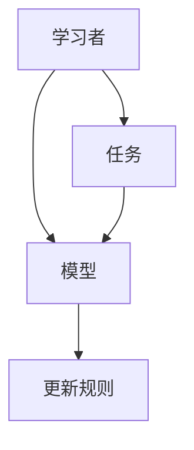
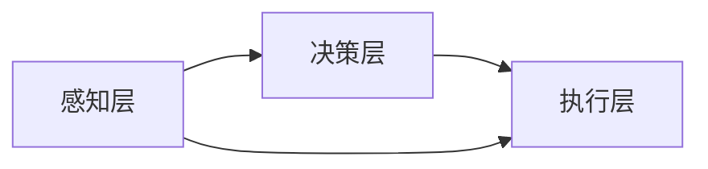

                 


# AI Agent的终身学习系统实现

## 关键词
AI Agent, 终身学习, 元学习, 在线学习, 多任务学习

## 摘要
本文探讨AI Agent的终身学习系统实现，涵盖其背景、核心概念、算法原理、系统架构、项目实战及最佳实践。通过详细讲解和实例分析，揭示终身学习系统在动态环境中的适应性和持续优化能力。

---

## 第1章: AI Agent与终身学习系统概述

### 1.1 AI Agent的基本概念
#### 1.1.1 AI Agent的定义与分类
AI Agent是具备感知、决策和执行能力的智能体，分为简单反射Agent、基于模型的规划Agent和学习增强型Agent。学习增强型Agent能够通过经验改进性能，适应动态环境。

#### 1.1.2 终身学习的基本概念
终身学习指AI Agent在不断变化的环境中持续学习和优化的能力，强调实时更新和适应新任务。

#### 1.1.3 终身学习系统的核心特征
实时性、连续性、自适应性和自主性，能够处理流数据和在线任务。

### 1.2 终身学习系统的问题背景
#### 1.2.1 AI Agent面临的动态环境挑战
传统机器学习模型在环境变化时表现下降，需通过终身学习保持性能。

#### 1.2.2 传统机器学习的局限性
固定训练数据无法适应新变化，模型更新成本高。

#### 1.2.3 终身学习系统的必要性
动态环境中保持竞争力，提升适应性和效率。

### 1.3 终身学习系统的应用前景
#### 1.3.1 在AI Agent中的应用领域
智能助手、自动驾驶、智能机器人和推荐系统。

#### 1.3.2 终身学习系统的潜在价值
提高适应性、效率和准确性，增强用户体验。

#### 1.3.3 当前研究与实践的现状
学术界研究深入，工业界应用逐步展开，但面临技术挑战。

### 1.4 本章小结
总结AI Agent和终身学习系统的背景、重要性及应用潜力。

---

## 第2章: 终身学习系统的理论基础

### 2.1 终身学习的核心概念与原理
#### 2.1.1 元学习（Meta-Learning）的概念
元学习通过训练模型快速适应新任务，核心是元学习者和任务嵌入。

#### 2.1.2 在线学习（Online Learning）的机制
在线学习逐个样本更新模型，适用于流数据环境。

#### 2.1.3 多任务学习（Multi-Task Learning）的原理
同时学习多个任务，共享参数以提升性能。

### 2.2 终身学习的核心算法
#### 2.2.1 模型无关的终身学习算法
模型无关方法通过任务嵌入更新策略，如MAML和Reptile。

#### 2.2.2 模型相关的终身学习算法
模型相关方法直接优化参数，如LSTM和SGD结合。

#### 2.2.3 组合式终身学习方法
通过任务权重组合多个任务的学习结果，优化整体性能。

### 2.3 终身学习的数学模型
#### 2.3.1 元学习的优化目标
目标函数：$$ \min_{\theta} \sum_{i=1}^N \mathcal{L}(f_\theta, T_i) $$
优化：$$ \theta = \theta - \eta \nabla_\theta \mathcal{L} $$

#### 2.3.2 在线学习的更新公式
更新规则：$$ w_{t+1} = w_t - \eta \nabla L(w_t) $$

#### 2.3.3 组合式学习的权重分配
权重分配：$$ \alpha_i = \frac{1}{1 + \exp(-w_i)} $$

### 2.4 终身学习的特征对比表
| 特征维度 | 元学习 | 在线学习 | 组合学习 |
|----------|--------|----------|----------|
| 学习目标 | 新任务快速适应 | 单任务持续优化 | 多任务联合优化 |
| 记忆机制 | 任务嵌入 | 现时更新 | 任务权重 |
| 适用场景 | 领域迁移 | 流数据处理 | 多任务协同 |

### 2.5 终身学习的ER实体关系图


### 2.6 本章小结
总结终身学习的核心概念、算法和数学模型。

---

## 第3章: 终身学习系统的算法实现

### 3.1 典型算法分析
#### 3.1.1 MAML算法
通过元学习快速适应新任务，适用于分类和回归任务。

#### 3.1.2 Reptile算法
简单有效的元学习方法，适用于图像分类。

### 3.2 算法实现步骤
#### 3.2.1 环境配置
安装PyTorch和必要的库。

#### 3.2.2 核心代码实现
```python
class MetaLearner:
    def __init__(self, model, optimizer):
        self.model = model
        self.optimizer = optimizer

    def update(self, task_loss):
        loss = task_loss.mean()
        self.optimizer.zero_grad()
        loss.backward()
        self.optimizer.step()
```

#### 3.2.3 案例分析
使用MAML算法实现图像分类任务，代码实现和结果分析。

### 3.3 算法性能分析
比较不同算法的训练时间、准确率和适应性，讨论优缺点。

### 3.4 本章小结
详细讲解典型算法的实现和性能分析。

---

## 第4章: 系统架构与交互流程

### 4.1 系统架构设计
#### 4.1.1 系统功能模块
感知层、决策层和执行层，分别处理数据输入、模型优化和任务执行。

#### 4.1.2 系统架构图


### 4.2 系统交互流程
#### 4.2.1 任务接收
AI Agent接收新任务，提取特征。

#### 4.2.2 模型更新
通过终身学习算法更新模型参数，适应新任务。

#### 4.2.3 任务执行
根据更新后的模型执行任务，输出结果。

### 4.3 接口设计
定义输入输出接口，确保模块间通信顺畅。

### 4.4 本章小结
总结系统架构设计和交互流程。

---

## 第5章: 项目实战与案例分析

### 5.1 项目环境配置
安装必要的库，如PyTorch和numpy。

### 5.2 核心代码实现
实现终身学习系统的各个模块，包括数据加载、模型训练和结果输出。

### 5.3 案例分析
通过具体案例展示系统在动态环境中的表现，分析其适应性和优化效果。

### 5.4 本章小结
总结项目实战的经验和教训。

---

## 第6章: 最佳实践与注意事项

### 6.1 最佳实践
选择合适的算法，优化系统架构，确保数据质量和模型更新频率。

### 6.2 注意事项
避免过拟合，确保数据多样性和模型稳定性。

### 6.3 拓展阅读
推荐相关书籍和论文，鼓励深入研究。

### 6.4 本章小结
总结最佳实践和注意事项。

---

## 结语
终身学习系统为AI Agent提供了持续优化的能力，推动智能系统的进步。未来研究需关注算法优化和实际应用。

---

## 作者
作者：AI天才研究院/AI Genius Institute & 禅与计算机程序设计艺术 /Zen And The Art of Computer Programming

