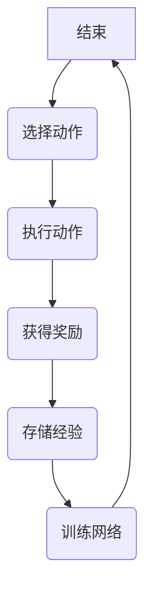

                 


# AI Agent的终身学习：持续适应新知识

> 关键词：AI Agent，终身学习，智能体，机器学习，持续适应

> 摘要：本文深入探讨AI Agent的终身学习机制，分析其在动态环境中的适应性问题，结合实际案例和系统架构设计，详细讲解AI Agent如何通过持续学习新知识来提升自身能力。

---

## 第一部分: AI Agent的背景与核心概念

### 第1章: AI Agent的基本概念与问题背景

#### 1.1 AI Agent的定义与核心特征

AI Agent（智能体）是指在环境中能够感知并自主行动以实现目标的实体。AI Agent的核心特征包括：

| 特征 | 描述 |
|------|------|
| 自主性 | 能够自主决策 |
| 反应性 | 能够感知环境并实时反应 |
| 学习性 | 能够通过经验改进性能 |
| 社会性 | 能够与环境和其他智能体交互 |

**ER实体关系图（Mermaid）：**
```mermaid
entity AI Agent {
  id
  knowledge_base
  action
}
```

#### 1.2 终身学习的背景与问题描述

AI Agent在动态环境中需要不断适应新知识，终身学习成为必要。终身学习的目标是使AI Agent能够在不同阶段优化自身能力，解决复杂问题。

#### 1.3 终身学习的应用场景

终身学习在多个领域有广泛应用，如自然语言处理、机器人控制等。AI Agent通过持续学习，提升应对复杂环境的能力。

---

## 第二部分: AI Agent的终身学习机制

### 第2章: 终身学习的核心概念与原理

#### 2.1 终身学习的核心原理

终身学习通过不断更新知识库，适应新环境。数学模型表示为：$$L(t) = f(x(t))$$，其中$L(t)$表示学习过程，$x(t)$表示输入数据。

#### 2.2 终身学习的算法原理

常用的终身学习算法包括经验重放、强化学习等。以经验重放为例，算法流程如下：

**经验重放算法流程图（Mermaid）：**


**Python实现示例代码：**
```python
import numpy as np

# 经验重放
class ExperienceReplay:
    def __init__(self, capacity):
        self.capacity = capacity
        self.memory = []
    
    def remember(self, state, action, reward, next_state):
        if len(self.memory) < self.capacity:
            self.memory.append((state, action, reward, next_state))
    
    def replay(self, batch_size):
        minibatch = np.random.choice(len(self.memory), batch_size)
        return minibatch
```

---

## 第三部分: AI Agent的系统架构与设计

### 第3章: AI Agent的系统架构设计

#### 3.1 系统架构的模块划分

AI Agent系统架构包括：

1. **知识获取模块**：收集新知识。
2. **知识处理模块**：处理并更新知识库。
3. **知识应用模块**：应用知识解决问题。

**系统架构图（Mermaid）：**


---

## 第四部分: AI Agent的项目实战

### 第4章: 终身学习AI Agent的实现

#### 4.1 项目环境安装

安装所需的Python库：
```bash
pip install numpy tensorflow
```

#### 4.2 核心算法实现

**Python代码实现：**
```python
import numpy as np
import tensorflow as tf

# 简单的神经网络模型
class SimpleModel:
    def __init__(self, input_shape):
        self.model = tf.keras.Sequential([
            tf.keras.layers.Dense(64, activation='relu', input_shape=input_shape),
            tf.keras.layers.Dense(1, activation='sigmoid')
        ])
        self.model.compile(optimizer='adam', loss='binary_crossentropy')

    def train(self, x, y, epochs=10):
        self.model.fit(x, y, epochs=epochs)
```

#### 4.3 实际案例分析

以自然语言处理为例，AI Agent通过持续学习更新语言模型，提升文本理解能力。

---

## 第五部分: 终身学习的数学模型与公式

### 第5章: 终身学习的数学模型

#### 5.1 终身学习的数学基础

**基础公式：**
$$P(y|x) = \prod_{i=1}^{n} P(y|x_i)$$

**强化学习公式：**
$$Q(s,a) = r + \gamma \max Q(s',a')$$

---

## 第六部分: 总结与展望

### 6.1 总结

AI Agent的终身学习通过不断更新知识库，适应新环境，提升能力。

### 6.2 展望

未来，AI Agent的终身学习将更加智能化和高效化，应用领域将更广泛。

---

## 附录

### 术语表

- AI Agent：智能体
- 终身学习：Continuous Learning

### 参考文献

- Russell, S., & Norvig, P. (2010). Artificial Intelligence: A Modern Approach.

---

作者：AI天才研究院/AI Genius Institute & 禅与计算机程序设计艺术 /Zen And The Art of Computer Programming

