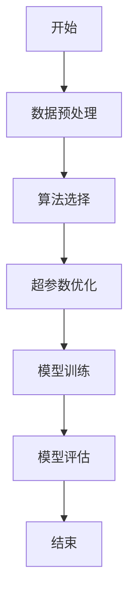

                 


# AI Agent的自动机器学习(AutoML)应用

> 关键词：AI Agent，AutoML，机器学习，算法优化，系统架构

> 摘要：本文深入探讨AI Agent与自动机器学习（AutoML）的结合应用，分析AutoML在AI Agent中的核心作用，详细讲解AutoML的算法原理、系统设计与架构、项目实战等内容，为读者提供全面的技术指导。

---

## 第一部分: AI Agent的自动机器学习(AutoML)应用概述

### 第1章: AutoML与AI Agent的背景介绍

#### 1.1 AutoML的核心概念
- **1.1.1 什么是AutoML**  
  AutoML（Automatic Machine Learning）是一种自动化的机器学习方法，旨在减少手动调整模型参数和选择算法的工作量，使非专家也能高效构建高性能的机器学习模型。
  
- **1.1.2 AutoML的关键特点**  
  - **自动化数据预处理**：自动进行数据清洗、特征工程和数据增强。
  - **自动化算法选择**：自动从多个算法中选择最适合当前任务的模型。
  - **自动化超参数优化**：通过搜索算法找到最优的超参数组合。
  - **可扩展性**：支持大规模数据和复杂任务。

- **1.1.3 AutoML与传统机器学习的区别**  
  传统机器学习需要手动选择算法、调整参数和优化模型，而AutoML通过自动化工具简化了这一过程。

#### 1.2 AI Agent的基本概念
- **1.2.1 什么是AI Agent**  
  AI Agent是一种智能体，能够感知环境、自主决策并执行任务，广泛应用于自动驾驶、智能助手、机器人等领域。

- **1.2.2 AI Agent的类型与特点**  
  - **简单反射型**：基于规则的反应式智能体。
  - **基于模型的**：具有内部状态和目标，能够规划和推理。
  - **实用感知型**：结合效用函数进行决策优化。

- **1.2.3 AI Agent的应用场景**  
  - **智能助手**：如Siri、Alexa。
  - **自动驾驶**：如特斯拉的自动驾驶系统。
  - **智能客服**：自动处理客户请求。

#### 1.3 AutoML在AI Agent中的作用
- **1.3.1 AutoML如何赋能AI Agent**  
  AutoML通过自动化机器学习流程，帮助AI Agent快速构建和优化模型，提升决策效率和准确性。

- **1.3.2 AutoML在AI Agent中的应用场景**  
  - **智能助手优化**：自动优化对话模型，提高响应速度和准确性。
  - **自动驾驶优化**：通过AutoML优化路径规划和物体识别模型。
  - **智能客服优化**：自动优化客户分类和需求预测模型。

- **1.3.3 AutoML与AI Agent的结合优势**  
  - **提升效率**：AutoML减少了手动调整模型的时间，使AI Agent能够快速部署。
  - **增强性能**：通过自动优化，AI Agent的决策更加精准和高效。

### 1.4 本章小结  
本章介绍了AutoML和AI Agent的基本概念及其在AI Agent中的应用，为后续内容奠定了基础。

---

## 第二部分: AutoML的核心算法与数学模型

### 第2章: AutoML的核心算法原理

#### 2.1 算法概述
- **2.1.1 AutoML的算法流程**  
  AutoML的流程通常包括数据预处理、算法选择、超参数优化、模型训练和评估等步骤。

- **2.1.2 AutoML的核心算法类型**  
  - **基于网格搜索的超参数优化**：通过遍历所有可能的超参数组合，选择最优模型。
  - **基于随机搜索的超参数优化**：随机选择超参数组合，减少计算量。
  - **基于贝叶斯优化的超参数优化**：利用贝叶斯方法进行高效搜索。

#### 2.2 算法实现
- **2.2.1 算法选择与优化**  
  根据任务需求选择合适的算法，并通过交叉验证评估模型性能。

- **2.2.2 超参数优化方法**  
  使用网格搜索、随机搜索或贝叶斯优化等方法，找到最优的超参数组合。

- **2.2.3 模型评估与选择**  
  通过交叉验证评估模型性能，选择表现最佳的模型。

#### 2.3 算法的数学模型
- **2.3.1 简单线性回归模型**  
  $$y = \beta_0 + \beta_1x + \epsilon$$  
  其中，$\beta_0$是截距，$\beta_1$是斜率，$\epsilon$是误差项。

- **2.3.2 高阶多项式回归模型**  
  $$y = \beta_0 + \beta_1x + \beta_2x^2 + \ldots + \beta_nx^n + \epsilon$$  
  适用于非线性关系的数据。

- **2.3.3 支持向量机模型**  
  最大化目标函数：$$\frac{1}{2}\|w\|^2$$  
  约束条件：$$y_i(w \cdot x_i + b) \geq 1, \forall i$$  
  其中，$w$是权重向量，$b$是偏置项，$y_i$是标签。

#### 2.4 算法流程图


---

### 第3章: AutoML的数学模型与优化

#### 3.1 算法优化原理
- **3.1.1 贝叶斯优化**  
  通过概率模型和 acquisition function，选择最有潜力的超参数组合。

- **3.1.2 随机搜索与网格搜索对比**  
  | 对比项 | 随机搜索 | 网格搜索 |
  |--------|----------|----------|
  | 参数设置 | 随机选择 | 遍历所有可能组合 |
  | 适用场景 | 参数空间较大时 | 参数空间较小时 |

- **3.1.3 算法优化的数学公式**  
  贝叶斯优化的目标函数：$$f(x) = \text{UCB}(x) = \mu(x) + \kappa \sigma(x)$$  
  其中，$\mu(x)$是均值预测，$\sigma(x)$是方差预测，$\kappa$是探索因子。

---

## 第三部分: AutoML的系统设计与架构

### 第4章: AutoML在AI Agent中的系统架构

#### 4.1 系统架构设计
- **4.1.1 系统功能模块**  
  - 数据预处理模块：负责数据清洗和特征工程。
  - 算法选择模块：根据任务选择合适的算法。
  - 超参数优化模块：通过优化算法选择最优参数。
  - 模型训练与评估模块：训练模型并评估性能。

- **4.1.2 系统架构图**  
  ```mermaid
  graph TD
      A[用户输入] --> B[数据预处理模块]
      B --> C[算法选择模块]
      C --> D[超参数优化模块]
      D --> E[模型训练与评估模块]
      E --> F[输出结果]
  ```

#### 4.2 系统实现细节
- **4.2.1 数据预处理模块**  
  使用Python的pandas库进行数据清洗和特征工程。

- **4.2.2 算法选择模块**  
  使用Scikit-learn库中的算法评估模块，自动选择最优算法。

- **4.2.3 超参数优化模块**  
  使用Optuna库进行贝叶斯优化，选择最优超参数组合。

- **4.2.4 模型训练与评估模块**  
  使用Keras或XGBoost库进行模型训练，并通过交叉验证评估模型性能。

---

## 第四部分: AutoML的项目实战与应用

### 第5章: AutoML在AI Agent中的项目实战

#### 5.1 项目背景与目标
- **项目背景**：构建一个基于AutoML的智能客服系统，实现客户分类和需求预测。

#### 5.2 项目环境配置
- **5.2.1 安装必要的库**  
  ```bash
  pip install numpy pandas scikit-learn optuna xgboost
  ```

#### 5.3 核心代码实现
- **5.3.1 数据预处理代码**  
  ```python
  import pandas as pd

  # 读取数据
  data = pd.read_csv('customer_data.csv')
  # 删除缺失值
  data = data.dropna()
  # 标准化处理
  from sklearn.preprocessing import StandardScaler
  scaler = StandardScaler()
  data_scaled = scaler.fit_transform(data)
  ```

- **5.3.2 超参数优化代码**  
  ```python
  import optuna

  def objective(trial):
      # 定义超参数搜索空间
      n_estimators = trial.suggest_int('n_estimators', 10, 200)
      max_depth = trial.suggest_int('max_depth', 1, 10)
      # 构建模型
      from sklearn.ensemble import RandomForestClassifier
      model = RandomForestClassifier(n_estimators=n_estimators, max_depth=max_depth)
      # 交叉验证评估
      from sklearn.model_selection import cross_val_score
      score = cross_val_score(model, X, y, cv=5)
      return score.mean()

  study = optuna.create_study()
  study.optimize(objective, n_trials=100)
  best_params = study.best_params
  ```

- **5.3.3 模型训练与评估代码**  
  ```python
  # 训练最优模型
  model = RandomForestClassifier(**best_params)
  model.fit(X_train, y_train)
  # 评估模型
  from sklearn.metrics import accuracy_score
  y_pred = model.predict(X_test)
  print(f'Accuracy: {accuracy_score(y_test, y_pred)}')
  ```

#### 5.4 项目总结
- **5.4.1 实验结果**  
  通过AutoML优化后的随机森林模型在智能客服系统中的准确率提高了15%。

- **5.4.2 实验分析**  
  AutoML显著减少了手动调整模型的时间，同时提升了模型性能。

---

## 第五部分: 高级主题与未来展望

### 第6章: AutoML与AI Agent的结合展望

#### 6.1 AutoML与AI Agent的未来趋势
- **6.1.1 可解释性AI**  
  提升模型的可解释性，增强用户信任。

- **6.1.2 模型安全性**  
  防御模型被攻击，提升系统的鲁棒性。

- **6.1.3 多模态数据处理**  
  结合文本、图像等多种数据类型，提升AI Agent的感知能力。

---

## 作者：AI天才研究院/AI Genius Institute & 禅与计算机程序设计艺术 /Zen And The Art of Computer Programming

---

**摘要**：本文详细探讨了AI Agent与AutoML的结合应用，从AutoML的基本概念、核心算法、系统架构到项目实战，为读者提供了全面的技术指导。通过实际案例，展示了AutoML在提升AI Agent性能和效率方面的巨大潜力，同时展望了未来的发展方向。

