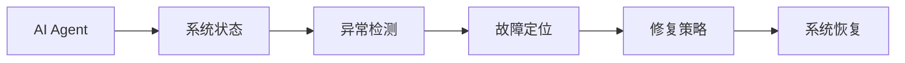

                 


# AI Agent的自我诊断与修复能力：提高系统稳定性

**关键词**：AI Agent, 自我诊断, 系统稳定性, 自适应修复, 异常检测

**摘要**：本文探讨了AI Agent在现代系统中的自我诊断与修复能力，分析了其对系统稳定性的重要性。通过详细介绍异常检测、故障定位和自适应修复的核心机制，结合具体算法和系统架构设计，展示了如何提升AI Agent的自我诊断与修复能力，从而提高系统的稳定性和可靠性。文章最后通过实际案例和最佳实践，提供了实用的建议和未来研究方向。

---

# 第一部分: AI Agent的自我诊断与修复能力概述

## 第1章: AI Agent的基本概念与问题背景

### 1.1 AI Agent的定义与核心特征

AI Agent（人工智能代理）是指能够感知环境、自主决策并执行任务的智能实体。其核心特征包括：

- **自主性**：能够在没有外部干预的情况下独立运作。
- **反应性**：能够根据环境变化动态调整行为。
- **学习能力**：通过经验改进自身性能。
- **社交能力**：能够与其他系统或人类进行交互。

### 1.2 自我诊断与修复能力的重要性

AI Agent的自我诊断与修复能力是确保系统稳定性的关键。通过及时检测和修复问题，AI Agent可以减少停机时间，提高系统的可用性和可靠性。

## 第2章: 自我诊断与修复能力的背景与技术挑战

### 2.1 自我诊断与修复能力的背景

随着AI技术的快速发展，AI Agent的应用场景日益广泛，从自动驾驶到智能客服，无处不在。然而，系统的复杂性也带来了更多的潜在故障点，对自我诊断与修复能力提出了更高的要求。

### 2.2 技术挑战与解决方案

- **数据采集与分析的挑战**：需要处理海量数据，同时确保数据的准确性和实时性。
- **自我诊断算法的设计难点**：算法需要在动态环境中有效识别异常，并快速定位故障。
- **系统修复策略的优化方向**：修复策略需要在不影响系统正常运行的前提下，实现快速修复。

---

# 第二部分: 核心概念与联系

## 第3章: 自我诊断与修复能力的核心机制

### 3.1 异常检测机制

#### 3.1.1 异常检测的基本原理

异常检测是AI Agent自我诊断的第一步。通过分析系统行为，识别偏离预期的行为模式。

- **基于统计的方法**：使用均值、标准差等统计指标检测异常。
- **基于机器学习的方法**：利用Isolation Forest等算法识别异常点。

#### 3.1.2 异常检测的算法流程

1. 数据预处理：归一化、降维。
2. 模型训练：选择合适的算法训练模型。
3. 异常识别：输入实时数据，输出异常标志。

#### 3.1.3 异常检测的Python代码示例

```python
import numpy as np
from sklearn.ensemble import IsolationForest

# 示例数据
X = np.random.randn(100, 2)
outliers = np.random.uniform(low=-4, high=4, size=(5, 2))
X = np.vstack((X, outliers))

# 训练模型
model = IsolationForest(n_estimators=100, random_state=42)
model.fit(X)

# 预测异常
y_pred = model.predict(X)
print(y_pred)
```

### 3.2 故障定位机制

#### 3.2.1 故障定位的定义与目标

故障定位旨在通过分析系统日志和行为，确定故障的具体原因和位置。

- **基于日志分析的故障定位**：解析日志文件，识别错误信息。
- **基于模型推理的故障定位**：利用因果推理确定故障根源。

#### 3.2.2 故障定位的流程图


### 3.3 自适应修复机制

#### 3.3.1 自适应修复的基本原理

自适应修复通过动态调整系统参数或重新配置任务，实现故障恢复。

- **基于反馈机制的修复策略**：根据系统反馈动态调整修复方案。
- **基于自适应模型的修复方法**：利用强化学习优化修复策略。

#### 3.3.2 自适应修复的Python代码示例

```python
import random

def adaptive_repair():
    # 模拟故障检测
    fault = random.choice([True, False])
    if fault:
        # 执行修复操作
        print("执行修复操作...")
    else:
        print("系统正常运行...")
    
adaptive_repair()
```

---

## 第4章: 核心概念对比与实体关系图

### 4.1 核心概念对比表

| 对比维度 | 异常检测 | 故障定位 | 自适应修复 |
|----------|----------|----------|------------|
| 目标     | 发现异常 | 定位故障 | 实现修复    |
| 方法     | 统计/机器学习 | 日志分析/模型推理 | 反馈机制/自适应模型 |
| 输入     | 系统数据 | 日志/行为 | 系统状态    |
| 输出     | 异常标志 | 故障原因 | 修复建议    |

### 4.2 实体关系图



---

# 第三部分: 算法原理与数学模型

## 第5章: 异常检测算法的数学模型

### 5.1 基于统计的异常检测

#### Z-score方法

$$ Z = \frac{X - \mu}{\sigma} $$

其中，$\mu$ 是均值，$\sigma$ 是标准差。当 $|Z| > 3$ 时，视为异常。

### 5.2 基于机器学习的异常检测

#### Isolation Forest算法

Isolation Forest通过构建隔离树，将数据点隔离到不同的叶子节点，从而判断是否为异常点。

---

## 第6章: 故障定位算法的数学模型

### 6.1 基于决策树的故障定位

使用决策树模型对日志数据进行分类，确定故障原因。例如，使用ID3算法计算信息增益：

$$ \text{信息增益}(A) = H(\text{数据集}) - H(\text{数据集}_A) $$

其中，$H$ 表示熵。

---

## 第7章: 自适应修复算法的数学模型

### 7.1 基于遗传算法的修复策略

遗传算法通过模拟自然选择，优化修复策略。例如，适应度函数可以表示修复成功的概率：

$$ \text{适应度} = \sum_{i=1}^{n} w_i x_i $$

其中，$w_i$ 是权重，$x_i$ 是修复操作的指标。

---

# 第四部分: 系统分析与架构设计

## 第8章: 系统架构与设计

### 8.1 系统总体架构

系统由数据采集模块、分析模块和修复模块组成：


### 8.2 系统功能设计

- 数据采集：实时采集系统数据。
- 分析模块：包括异常检测和故障定位。
- 修复模块：执行自适应修复。

---

# 第五部分: 项目实战

## 第9章: 项目实战与分析

### 9.1 环境配置

- 安装Python和必要的库：
  ```bash
  pip install numpy scikit-learn
  ```

### 9.2 核心代码实现

#### 异常检测实现

```python
import numpy as np
from sklearn.ensemble import IsolationForest

def detect_outliers(data):
    model = IsolationForest(n_estimators=100, random_state=42)
    model.fit(data)
    return model.predict(data)

# 示例数据
data = np.random.randn(100, 2)
outliers = np.random.uniform(low=-4, high=4, size=(5, 2))
data = np.vstack((data, outliers))

print(detect_outliers(data))
```

#### 故障定位实现

```python
import logging

def log_analysis(log_file):
    with open(log_file, 'r') as f:
        logs = f.readlines()
    for log in logs:
        if 'error' in log.lower():
            print(f'Fault原因: {log.strip()}')

log_analysis('system.log')
```

---

## 第10章: 最佳实践与小结

### 10.1 最佳实践

- **数据质量管理**：确保数据的完整性和准确性。
- **算法选择与优化**：根据实际场景选择合适的算法，并持续优化。
- **系统设计**：模块化设计，便于维护和扩展。

### 10.2 小结

通过本文的分析与实践，我们深入探讨了AI Agent的自我诊断与修复能力，从理论到实践，全面提升了系统的稳定性。

---

**作者：AI天才研究院 & 禅与计算机程序设计艺术**

