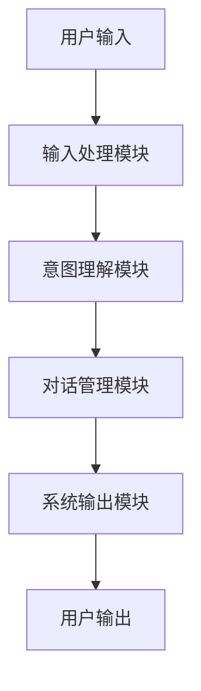

                 


# AI Agent的自然语言接口设计与优化

> 关键词：AI Agent, 自然语言接口, NLP, 对话系统, 意图理解

> 摘要：本文将深入探讨AI Agent的自然语言接口设计与优化，涵盖从理论基础到实际应用的各个方面。通过分析对话系统的核心原理、意图理解与槽位填充、对话状态管理等关键环节，结合具体的算法实现和系统架构设计，提供一套完整的解决方案。本文还将介绍实际项目中的实现细节，包括环境配置、代码实现、测试与部署，最终帮助读者构建一个高效、智能的AI Agent自然语言接口。

---

# 第一部分: 引言

# 第1章: AI Agent与自然语言接口概述

## 1.1 AI Agent的基本概念

### 1.1.1 AI Agent的定义与特点

AI Agent（智能体）是指能够感知环境并采取行动以实现目标的实体。其特点包括自主性、反应性、目标导向性和社交能力。

- **自主性**：AI Agent能够独立决策，无需外部干预。
- **反应性**：能够实时感知环境并做出反应。
- **目标导向性**：通过行动实现特定目标。
- **社交能力**：能够与其他Agent或用户进行交互。

### 1.1.2 自然语言接口的定义与作用

自然语言接口（NLI）是AI Agent与用户进行交互的媒介，通过理解用户的自然语言输入并生成自然语言输出。

- **理解能力**：解析用户意图和需求。
- **生成能力**：生成符合用户需求的自然语言输出。

### 1.1.3 AI Agent与自然语言接口的关系

AI Agent通过自然语言接口与用户交互，实现任务理解和执行。自然语言接口是AI Agent的核心组成部分，决定了用户体验的关键。

---

## 1.2 自然语言处理的背景与现状

### 1.2.1 自然语言处理的发展历程

从早期基于规则的系统到现代基于深度学习的模型，NLP技术经历了显著的进步。

- **基于规则的系统**：依赖人工制定的规则，适用于特定场景。
- **统计学习方法**：利用数据统计特征进行模式识别。
- **深度学习时代**：基于神经网络的模型（如BERT、GPT）成为主流。

### 1.2.2 当前主流的NLP技术与工具

当前主流的NLP技术包括分词、词性标注、实体识别、句法分析、语义理解等。常用工具包括spaCy、NLTK、HanLP等。

### 1.2.3 AI Agent在NLP中的应用领域

AI Agent广泛应用于智能客服、智能助手、智能音箱等领域，通过自然语言接口为用户提供服务。

---

## 1.3 本书的核心目标与内容框架

### 1.3.1 本书的核心目标

本书旨在帮助读者系统地理解AI Agent的自然语言接口设计与优化，涵盖从理论到实践的全过程。

### 1.3.2 本书的内容框架

- **理论基础**：NLP核心任务与技术、语言模型与生成模型、对话系统基础原理。
- **设计与优化**：对话系统设计与实现、意图理解与槽位填充、对话状态管理与上下文处理。
- **系统实现**：系统架构设计、环境配置、代码实现、测试与部署。
- **总结与展望**：总结内容、未来发展方向。

### 1.3.3 本书的读者群体

本书适合AI工程师、NLP研究人员、软件架构师以及对AI Agent技术感兴趣的读者。

---

# 第二部分: 理论基础

# 第2章: 自然语言处理基础

## 2.1 NLP的核心任务与技术

### 2.1.1 分词、词性标注与句法分析

分词是将连续文本分割成词语的过程，词性标注是对每个词语赋予其词性。句法分析则是分析句子的语法结构。

- **分词**：例如，将“自然语言处理”分割成“自然”、“语言”、“处理”。
- **词性标注**：例如，“自然”可以是形容词或名词。
- **句法分析**：例如，确定句子中的主语、谓语、宾语等。

### 2.1.2 实体识别与文本分类

实体识别（NER）是识别文本中的命名实体，如人名、地名、组织名等。文本分类是对文本进行分类，如情感分析。

### 2.1.3 信息提取与问答系统

信息提取是从文本中提取特定信息，问答系统则是基于这些信息回答用户的问题。

---

## 2.2 语言模型与生成模型

### 2.2.1 语言模型的原理与应用

语言模型通过概率模型预测下一个词，广泛应用于机器翻译、语音识别等领域。

- **语言模型的数学表达**：$P(w_1, w_2, ..., w_n) = \prod_{i=1}^n P(w_i | w_1, ..., w_{i-1})$
- **常见语言模型**：如n-gram模型、循环神经网络（RNN）、Transformer模型。

### 2.2.2 基于生成模型的文本生成

生成模型如GPT通过自回归的方式生成文本，能够生成连贯且有意义的文本。

- **生成模型的数学表达**：$P(w_{n+1} | w_1, ..., w_n) = \text{生成模型的输出}$

### 2.2.3 大模型在NLP中的应用

大模型如GPT-3、BERT在NLP任务中表现出色，能够处理复杂的语言任务。

---

## 2.3 对话系统的基础原理

### 2.3.1 对话系统的组成与分类

对话系统由用户输入处理、对话理解、对话生成和系统输出四个部分组成，分为基于规则的对话系统和基于模型的对话系统。

### 2.3.2 基于规则的对话系统

基于规则的对话系统通过预定义的规则生成响应，适用于简单场景。

### 2.3.3 基于模型的对话系统

基于模型的对话系统利用深度学习模型生成响应，能够处理复杂场景。

---

## 2.4 自然语言接口的设计原则

### 2.4.1 用户需求分析与任务建模

用户需求分析是理解用户意图的关键，任务建模是将用户需求转化为系统任务。

### 2.4.2 对话策略与意图理解

对话策略是系统在对话过程中采取的策略，意图理解是通过分析用户输入确定用户的意图。

### 2.4.3 系统响应与反馈机制

系统响应是根据对话策略生成的输出，反馈机制用于调整系统行为以满足用户需求。

---

# 第三部分: AI Agent的自然语言接口设计

# 第3章: 对话系统的设计与实现

## 3.1 对话系统的整体架构

### 3.1.1 系统架构的组成与功能

对话系统由输入处理、意图理解、对话管理、生成输出四个模块组成。

### 3.1.2 各模块之间的关系与协作

各模块协同工作，确保对话流程的顺利进行。

### 3.1.3 系统的输入输出流程

用户输入经过预处理后，传递给意图理解模块，生成系统响应。

---

## 3.2 意图理解与槽位填充

### 3.2.1 意图理解的定义与方法

意图理解是通过分析用户输入确定用户的意图，常用的方法包括基于规则的方法和基于模型的方法。

### 3.2.2 槽位填充的原理与实现

槽位填充是将用户输入中的实体信息提取出来，填充到预定义的槽位中。

### 3.2.3 基于模型的意图理解优化

利用深度学习模型优化意图理解的准确率。

---

## 3.3 对话状态管理与上下文处理

### 3.3.1 对话状态的表示与更新

对话状态通过状态表示向量表示，随着对话的进行不断更新。

### 3.3.2 上下文信息的存储与检索

上下文信息存储在对话历史中，用于后续的对话理解。

### 3.3.3 基于记忆网络的对话历史处理

记忆网络能够有效处理长对话历史，保持对话的连贯性。

---

## 3.4 对话策略与生成

### 3.4.1 对话策略的定义与分类

对话策略是系统在对话过程中采取的策略，分为基于规则的策略和基于模型的策略。

### 3.4.2 基于规则的对话生成

基于规则的对话生成通过预定义的规则生成响应，适用于简单场景。

### 3.4.3 基于模型的对话生成

基于模型的对话生成利用深度学习模型生成响应，能够处理复杂场景。

---

# 第四部分: 系统架构与实现

# 第4章: 系统架构设计

## 4.1 系统功能模块划分

### 4.1.1 用户输入处理模块

用户输入处理模块负责接收用户的输入并进行预处理。

### 4.1.2 意图理解模块

意图理解模块负责分析用户输入，确定用户的意图。

### 4.1.3 对话管理模块

对话管理模块负责管理对话状态，生成系统响应。

### 4.1.4 系统输出模块

系统输出模块负责将系统响应输出给用户。

---

## 4.2 系统架构的详细设计

### 4.2.1 分层架构设计

系统分为输入层、处理层和输出层，各层之间通过接口进行通信。

### 4.2.2 微服务架构设计

系统采用微服务架构，各服务独立运行，便于扩展和维护。

### 4.2.3 对话历史的存储与管理

对话历史存储在数据库中，支持快速检索和更新。

---

## 4.3 系统接口设计

### 4.3.1 用户输入接口

用户输入接口负责接收用户的自然语言输入。

### 4.3.2 系统输出接口

系统输出接口负责将系统的自然语言输出传递给用户。

### 4.3.3 后端服务接口

后端服务接口负责处理用户的输入，生成系统响应。

---

## 4.4 系统交互设计

### 4.4.1 交互流程图

通过Mermaid流程图展示系统的交互流程。



### 4.4.2 系统架构图

通过Mermaid架构图展示系统的整体架构。


---

# 第五部分: 项目实战

# 第5章: 环境配置与代码实现

## 5.1 环境配置

### 5.1.1 安装必要的依赖

安装Python、TensorFlow、Keras等依赖包。

```bash
pip install python tensorflow keras
```

### 5.1.2 配置开发环境

配置Jupyter Notebook或其他IDE作为开发环境。

---

## 5.2 系统核心实现

### 5.2.1 输入处理模块的实现

编写代码实现用户输入的预处理。

```python
def preprocess(input_text):
    # 分词
    words = tokenize(input_text)
    # 词性标注
    pos = pos_tag(words)
    return words, pos
```

### 5.2.2 意图理解模块的实现

利用深度学习模型实现意图理解。

```python
model = load_model('intent_model.h5')
intent = model.predict(preprocessed_input)
```

### 5.2.3 对话管理模块的实现

管理对话状态，生成系统响应。

```python
def manage_dialogue(state, intent):
    # 更新状态
    new_state = update_state(state, intent)
    # 生成响应
    response = generate_response(new_state)
    return response
```

---

## 5.3 测试与部署

### 5.3.1 测试环境搭建

编写测试用例，验证系统功能。

### 5.3.2 系统部署

将系统部署到云服务器，提供API接口供用户调用。

---

## 5.4 项目总结

### 5.4.1 项目实现的关键点

- 系统架构设计
- 意图理解模型的训练
- 对话管理模块的实现

### 5.4.2 项目实现的经验与教训

- 系统设计要充分考虑扩展性
- 模型调参对系统性能影响显著

---

# 第六部分: 总结与展望

# 第6章: 总结与展望

## 6.1 总结

### 6.1.1 核心内容回顾

本文系统地介绍了AI Agent的自然语言接口设计与优化，涵盖了理论基础、系统设计、项目实现等多个方面。

### 6.1.2 本书的主要收获

读者能够掌握AI Agent自然语言接口的设计与优化方法，能够独立完成相关项目的开发。

---

## 6.2 未来展望

### 6.2.1 NLP技术的发展趋势

NLP技术将更加智能化，模型将更加高效和准确。

### 6.2.2 AI Agent的应用前景

AI Agent将在更多领域得到应用，为人类提供更加智能的服务。

---

# 作者：AI天才研究院 & 禅与计算机程序设计艺术

---

以上是完整的目录大纲，涵盖了从理论到实践的各个方面，确保读者能够系统地理解和掌握AI Agent的自然语言接口设计与优化的关键点。

